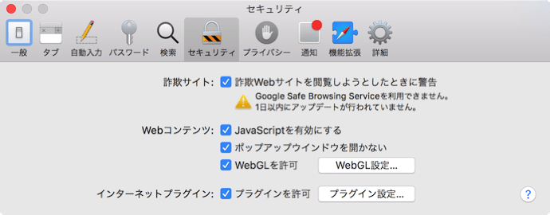
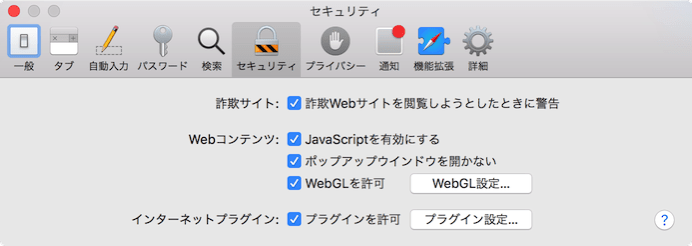

macOS El Capitanに搭載されたSafari 9からは、Google Safe Browsing Serviceを使用して、フィッシングサイト（詐欺サイト）の情報が常に更新され、疑惑のあるWebサイトを閲覧している場合に、フィッシングサイトの疑いがあります、と表示されるようになりました。iOSのSafariでも同様です。

ところが、突然のシステム終了（強制的に電源を切るなど）した場合等に、Safariやシステムのキャッシュが正常に更新されなくなる不具合等が発生した場合に、この「Google Safe Browsing Service」が利用できなくなることがあります。今回は、そのような場合の対処法をご紹介します。

## Google Safe Browsing Serviceを利用できません

「Google Safe Browsing Service」が正常に更新されているかどうかは、Safariを開いて環境設定を開くとわかります。環境設定を開くためには、⌘（command）+,を押します。

環境設定を開いたら、「セキュリティ」タブをクリックします。もし、上図のように、「Google Safe Browsing Serviceを利用できません。○日以内にアップデートが行われていません」と表示されている場合、冒頭のキャッシュの問題が発生しています。この問題は、SafariやOSを再起動しただけでは回復しません。

### Macをセーフモードで起動する

Safariだけではないのですが、このようなキャッシュに関連する問題が発生した場合は、一度、Macを「セーフモード」で起動しましょう。Macを「セーフモード」で起動した場合、システムに必要なキャッシュ等が自動的に再構築されるため、アプリケーションやOSで異常が発生している場合に、自動的に修復されます。

Macを「セーフモード」で起動するためには、まず、Macを終了します。その後、⇧（shift）を押しながら、電源を入れます。のロゴが画面に表示されたら、⇧から手を離します。ログイン画面が表示され、画面右上に「セーフブート」と表示されていれば、「セーフモード」による起動は完了です。なお、ログインする必要はありません。この画面が表示されたら、再び再起動しましょう。

「FileVault」による暗号化を行なっている場合は、「FileVault」による暗号化実施時に指定したパスワードを入力する必要があります。操作方法は上記の場合と同様です。

### Safariの環境設定を確認する

再びSafariの環境設定を開くと、警告が表示されなくなっていることがわかります。

## まとめ

「セーフモード」は、Macが備えている、いわゆる「自己治癒能力
」です。不具合に見舞われた場合には、ぜひ「セーフモード」をお試しください。
