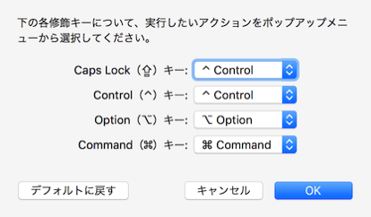

---
author:
- '@ottanxyz'
categories:
- Mac
date: 2016-11-04 00:00:00+00:00
draft: false
tags:
- ファンクションキー
- 日本語入力
- カタカナ
- 全角
- 英字
title: Macの標準の日本語入力による変換はファンクションキーよりショートカットキーの方が便利
type: post
---

先日、4年ぶりの刷新となる新型MacBook Proが発表され、従来のファンクションキーを置き換える「Touch Bar」が発表されました。「Touch Bar」搭載機が手元にないため、「Touch Bar」自体の検証はできませんし、使い勝手もわかりません。

Twitterなどを閲覧していると、「Touch Bar」が搭載されファンクションキーがなくなると、「日本語入力の変換が不便になる」というツイートをよく耳にしますが、macOSに標準搭載されている日本語入力では、ファンクションキーを使用しなくとも、日本語入力の変換は何ら変わりません。むしろ、ファンクションキーを使用するよりも便利なショートカットが存在しているのです。

## macOS標準の日本語入力における変換

「ファンクションキーがなくなるから日本語入力が不便になる」と感じている大半の方が、業務で使用するOSがWindowsであり、Microsoft IMEに備わっているファンクションキーの機能に慣れているからだと思います。しかし、よくよく考えてみてください。キーボードのホームポジションから少し離れたファンクションキーを「変換」に利用することは少々不便に感じませんか。そこで、今回は知っている人たちにとっては当たり前のことですが、macOSにおける日本語入力の変換について簡単に解説します。

### ひらがな、全角／半角カナ、全角／半角英字に変換する方法

macOSのメニューバーに常駐している、日本語入力のメニューを開いてみてください。答えはすぐそこにあります。

もうおわかりですね。ファンクションキーよりも実は便利なんです。

### ひらがなに変換する

入力中の文字列をすべて「ひらがな」に変換するためには、「変換」する代わりに⌃（control）+Jを押します。

### カタカナに変換する

入力中の文字列をすべて「カタカナ」に変換するためには、⌃+Kを押します。

### 全角英字に変換する

あまり「全角英字」を使用する機会はないかもしれませんが、入力中の文字列をすべて「全角英字」に変換するためには、⌃+Lを押します。たまに、全角文字列しか受け付けないしょうもない入力フォームが存在するため、覚えておくと便利な時があります。その前にそのような入力フォームをやめて欲しい。とくに住所欄など。

### 半角カタカナに変換する

あまり「半角カタカナ」を使用する機会はないかもしれませんが、入力中の文字列をすべて「半角カタカナ」に変換するためには、⌃+;を押します。たまに、半角カタカナしか受け付けない（ry

### 英字に変換する

入力中の文字列をすべて「半角英字」に変換するためには、⌃+:を押します。

## まとめ

というわけで、macOSで日本語入力の変換を使用する場合は、⌃+J、K、:を覚えておけば十分です。

### Controlキーの位置が分かりづらくて使いづらい

最近のMacBook Proなどに搭載されている標準のキーボードの「Controlキー」の位置に慣れない、思わず「CapsLock」を押してしまうというあなたは、「システム環境設定」から修飾キーの割り当てを変更しましょう。

「システム環境設定」→「キーボード」を開き、「キーボード」タブから「修飾キー」をタップして、「Caps Lock」キーを「Control」キーに割り当てます。これで、キーボードの左下にある、いかにも押し間違えそうな「Caps Lock」キーに代わって、「Control」キーを使用できますよ。
