
photo credit: The Logo Smith [Feedly Logo](http://www.flickr.com/photos/49734147@N00/4853880084) via [photopin](http://photopin.com) [(license)](https://creativecommons.org/licenses/by-nc-nd/2.0/)

Readability が長年にわたって愛され続けてきたサービスを終了し、Readability 組み込みの RSS リーダーアプリ「Reeder」の代替手段を求めて、さまざまな RSS リーダーを試してみました。過去に、[RSS リーダーは Feedly からのインポートが可能な「Inoreader」がオススメ！ – OTTAN.XYZ](/posts/2016/11/rss-reader-inoreader-readability-5213/)で「Inoreader」をご紹介しました。「Reeder」の優れた点は、「Readability」による構文解析（本文抽出）機能でしたので、それに代わる手段として独自の機能を提供している「Inoreader」がニーズにマッチしたのです。

「Inoreader」は上記でご紹介している通り、高機能な RSS リーダーであり文句のつけようがないのですが、唯一不満な点は、やはりその「美しさ」でした。「Reeder」のインタフェースに慣れてしまった今、どうしても他の RSS リーダーが見劣りしてしまうのです。というわけで、しばらくさまざまな RSS リーダーを渡り歩いていたのですが、この度、「Reeder」がアップデートし、遂に「Readability」を脱却し、「Readability」も推奨している、[Mercury Web Parser by Postlight](https://mercury.postlight.com/web-parser/)に移行したのです。

というわけで、おさらいも兼ねて、弊サイト一押しの RSS リーダーである「Reeder」をご紹介します。

## Reeder の使い方

「Reeder」は有料アプリです。お試しもできません。すでに他の RSS リーダーで満足されている方は、「Reeder」に投資すべき価値があるかどうかを十分に吟味した上で、ご購入ください。



### Feedly を登録する

Google Reader のサービス終了後、「Feedly」に移行した方も多いのではないでしょうか。「Reeder」は「Feedly」にも対応しています。「Inoreader」が「Feedly」からのインポートのみに対応していたのに対して、「Reeder」は「Feedly」と完全同期します。そのため、「Reeder」のお気に入りや未読、既読情報は「Feedly」に即座に反映されます。（逆に、「Feedly」のサービスが使用できない場合、「Reeder」も使用できません）

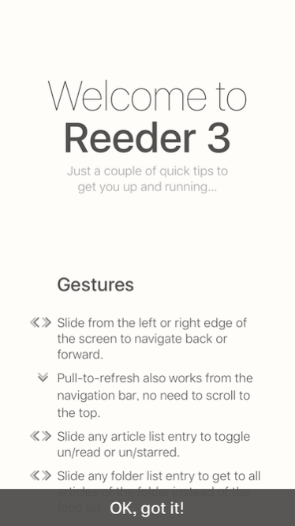

アプリを起動します。

右上の「+」をタップします。

「Feedly」をタップします。「Feedly」以外にもさまざまな RSS リーダーのサービスに対応しています。「Inoreader」を使用している方は、「Inoreader」をそのまま継続して使用することもできます。

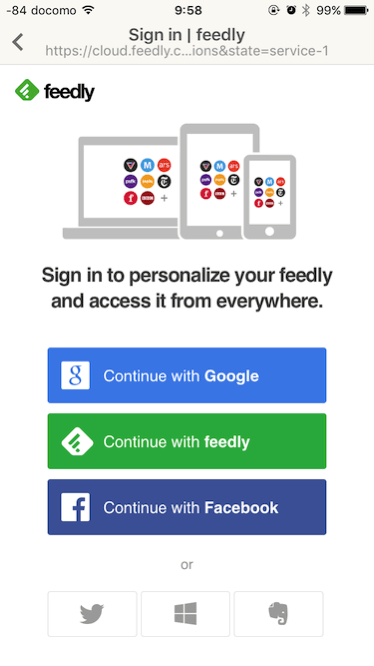

「Feedly」にサインインします。

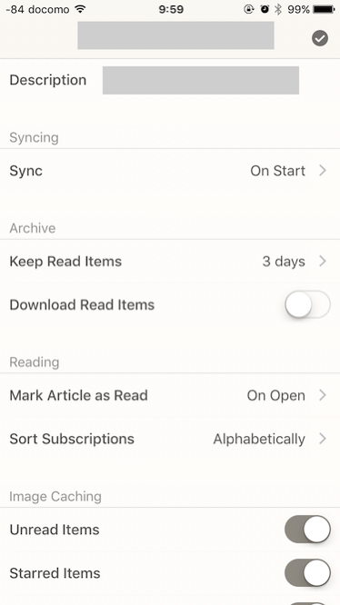

初期設定を行います。デフォルトでは、「Keep Read Items」（既読アイテムの保管期間）は「3 日間」に設定されています。3 日より前のアイテムを同期することはできません。必要に応じて期間を設定しましょう。無期限に設定することも可能です。また、既読の記事を改めてダウンロードするためには「Download Read Items」をオンにします。

同期時に画像ファイルをキャッシュし表示を早くできます。ただし、画像ファイルのフルダウンロードは通信量や帯域を逼迫する可能性があるため、Wi-Fi 接続時に限定することもできます。デフォルトで「WiFi Only」がオンになっています。また、未読記事、スター記事のみがキャッシュの対象です。また、同期する記事の最大数はデフォルトで「5,000」記事です。増やすこともできますが、パフォーマンスに影響を与える可能性があります。過去記事を読みたい場合は、Pocket や Instapaper などの後で読むサービスを併用することオススメします。

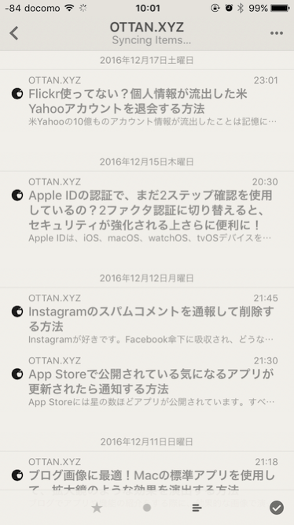

すべての記事の表示画面です。画面下部のアイコンは、左から順番に「スター」「未読」「すべて」をあらわしています。未読記事のみを順々に読みたい場合は、真ん中の「未読」のアイコンをタップします。また、右端は「すべての記事を既読にする」ボタンです。設定から左端に移動することもできます。

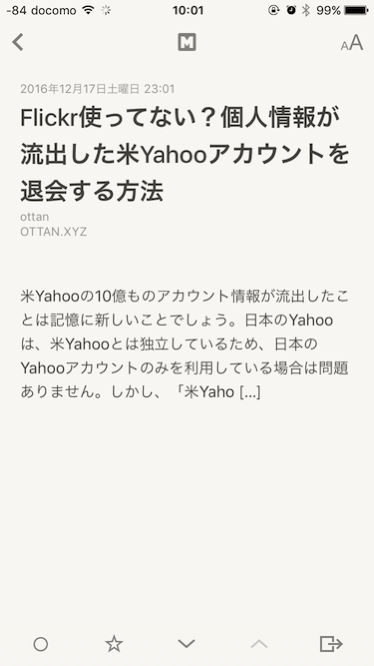

記事を表示します。RSS による全文配信を実施していない Web サイトの場合、（弊サイトも含めて）このように記事の冒頭の一部分のみ表示されます。この時に役に立つのが**Readability 改 Mercury**です。画面上部の真ん中の「M」のアイコンをタップします。

このように、Reeder の美しいユーザインタフェース（UI）を活かしたまま記事の本文のみを抽出できます。内蔵ブラウザ（SafariView）を使用して記事を表示することもできますが、「Mercury」を使用すると非常に読みやすくなります。画像ファイルも横幅最大限に表示されるため読みやすいです。

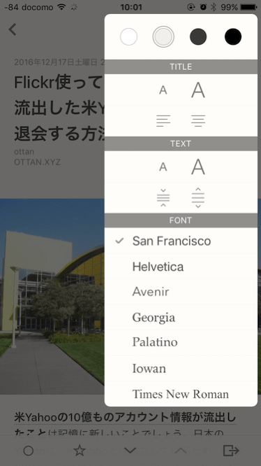

右上の「A」アイコンをタップすることで、テキストの大きさや背景、フォント、フォントサイズを変更することも可能です。個人的にはデフォルトの設定が一番読みやすいと感じました。

右下の「共有」アイコンから、さまざまな外部サービスと連携できます。ただし、デフォルトでは日常的に使用しないサービスが数多く表示されるため、設定から使用するものだけに限定しておくと便利です。こちらについては後述します。

画面下部のアイコンについて説明します。左端から「未読」「スター」「前の記事へ」「次の記事へ」「共有」を表しています。

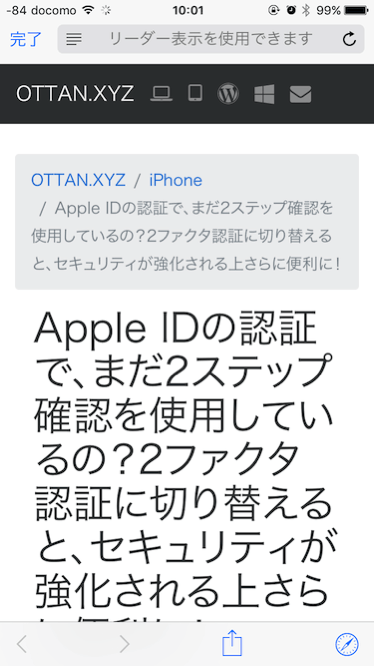

内蔵ブラウザは「SafariView」が使用されているため、Safari のコンテンツブロッカーをそのまま使用できます。広告なしのストレスフリーで記事を閲覧できます。また、Safari に保存しているパスワードなどの情報をそのまま使用することもできます。

記事一覧で右にスワイプすると「未読」「既読」を切り替えることができます。

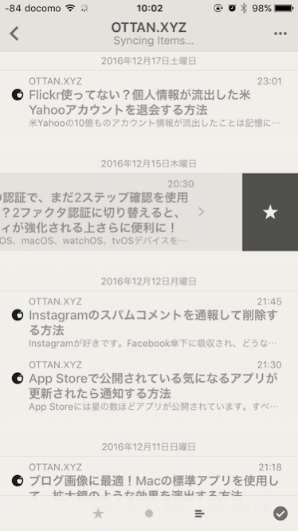

記事一覧で左にスワイプすると「スター」（お気に入り）「スター解除」をきりかえることができます。このスワイプによる動作は変更することもできます。後述します。

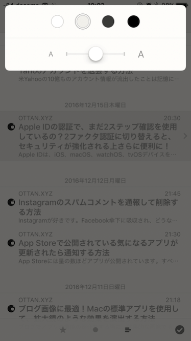

記事一覧で右上の「…」アイコンをタップすると、記事一覧のテーマ、フォントサイズを変更することもできます。デフォルトで十分に見やすいです。

設定の「General」（一般）から「Reeder」の動作をカスタマイズできます。先ほどのスワイプの動作を変更するためには、「Article List」の「Slide Right to」「Slide Left to」の動作を変更します。私の場合、「スター」（お気に入り）機能は使用しないため、左スワイプは「Instapaper」への保存に変更しています。

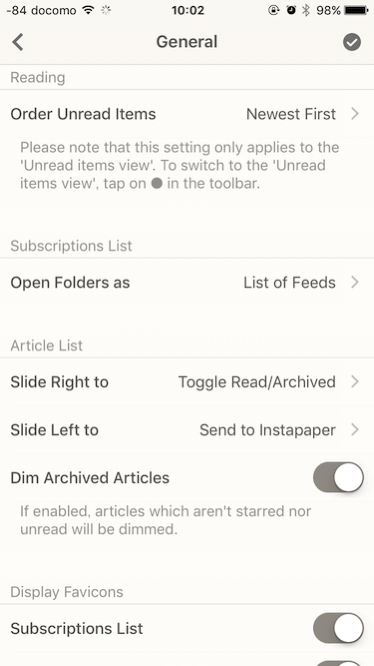

このようにスワイプによる動作を変更することが可能です。左右のスワイプの動作を入れ替えることもできます。

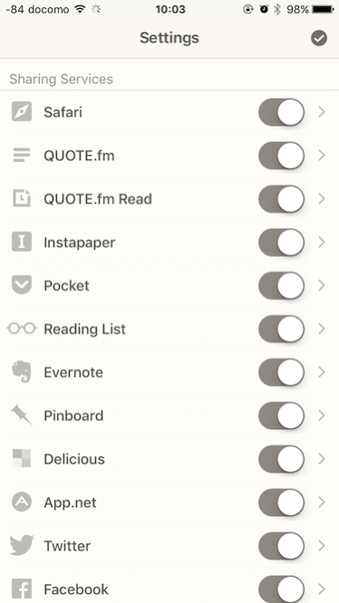

また、「Sharing Services」においては、連携したい外部サービスの要否を設定できます。デフォルトでは、日本ではほとんど使用されることのない外部サービスもオンになっているため、日常的に使用しているサービスのみに限定しておくことをオススメします。また、Pocket や Instapaper などの後で読むサービスを使用する場合は、あらかじめサインインが必要です。各サービスのアイコンをタップして、サインインしましょう。Twitter、Facebook は iOS に組み込まれているため、改めてサインインする必要はありません。

## まとめ

「Readability」のサービス終了以来、「Reeder」の使い勝手が落ちていたのですが、「Mercury」への移行に伴い、私の中でダントツの RSS リーダーアプリとして舞い戻ってきました。当面悩む必要はなさそうです。


