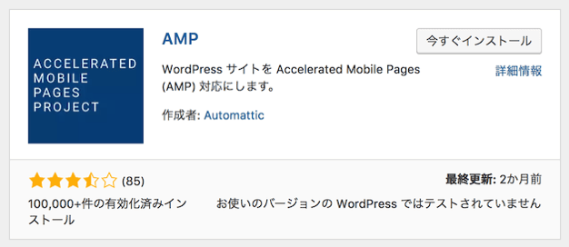
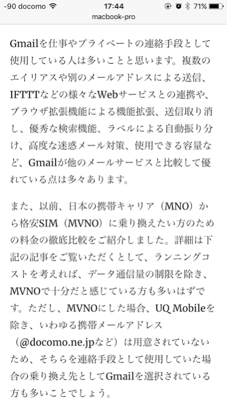
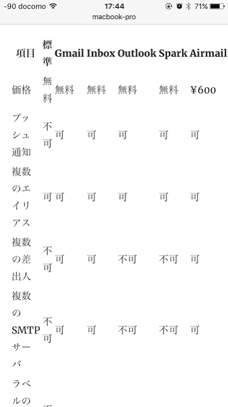
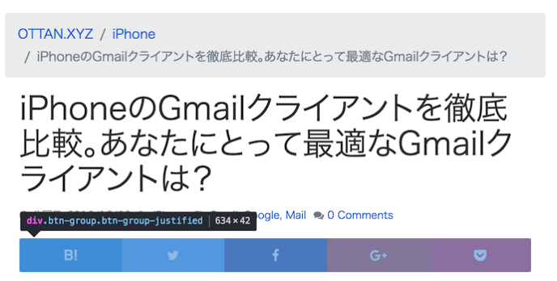
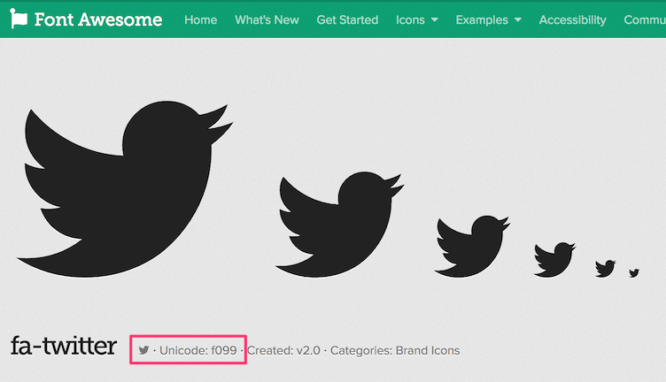
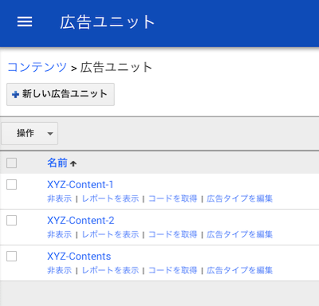
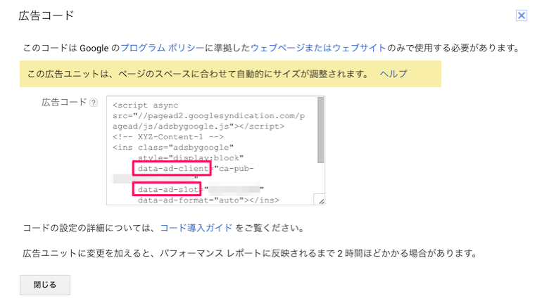
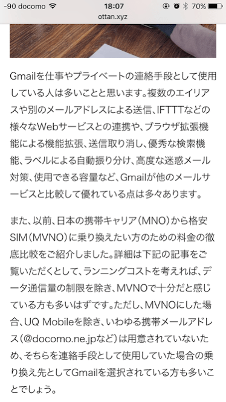
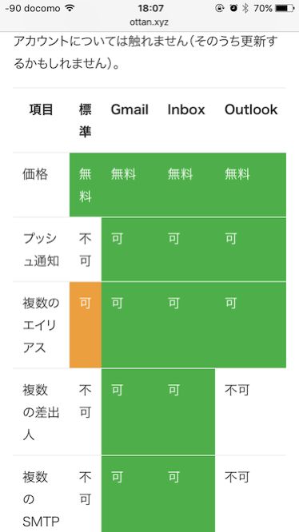

2016 年 2 月から導入された Google 検索結果に適用される AMP（Accelerated Mobile Pages）プロジェクト。スマートフォンなどのモバイルデバイスにおける検索結果表示を高速化するためのプロジェクトです。しかし、このプロジェクト開始当初は柔軟なカスタマイズが不可能であり、逆にユーザビリティの低下に繋がる可能性があるように感じられたため、弊サイトでの導入は見送ってきました。徐々にプロジェクトが成熟し始め、ある程度のカスタマイズもできるようになったため、弊サイトでも AMP を遂に導入しました。

今回は、弊サイトで AMP を導入したその方法と、Google Analytics や Google Adsense の導入、Font Awesome などの Web フォントの導入、カスタマイズ CSS の構築方法についてご紹介します。WordPress の場合、WordPress の開発元である Automattic 社が
開発するプラグインを導入するだけなので、AMP 対応するだけならとても簡単です。リソースをかけることなく対応できますよ。

## WordPress を AMP に対応しカスタマイズする

WordPress を AMP に対応させるだけなら非常に簡単です。WordPress の開発元である Automattic 社が提供する「AMP」プラグインを導入するだけだからです。ただし、そのままでは Google Analytics や Google Adsense を使用することはできませんので、ある程度のカスタマイズが必要です。

### AMP プラグインのインストール

まずは、WordPress のダッシュボードにログインし、Automattic 社の「AMP」プラグインをインストール、有効化します。

プラグインを有効化するだけで AMP への対応は完了です。URL の末尾に`amp`を付与してアクセスします。以下に例を示します。

    http://macbook-pro:8080/iphone-gmail-client-utlimate-guide-5302/amp/

ただし、プラグイン有効化直後の状態では何もカスタマイズされていないため、WordPress で構築されたすべての Web ページについて、まったく同じスタイルが適用されたページが表示されることになります。

たとえば、本文は明朝体で統一されています。

`table`タグに対するスタイルは何も適用されていないため、スマートフォンでは視認性に欠けます。

iTunes のアフィリエイトリンクについても、スタイルが何も適用されていないため、かろうじてリンクであることはわかりますが、非常に読みづらいです。

### AMP のカスタマイズ

では、AMP の表示をカスタマイズしていきましょう。カスタマイズ方法は、「AMP」プラグインの開発元である Automattic 社の GitHub に公開されています。

https://github.com/Automattic/amp-wp

「AMP」プラグインに同梱されているテンプレートを上書きすると、プラグインアップデートの都度、テンプレートを書き直さなくてはなりません。そのため、記事ページのテンプレートをコピーしておきます。「AMP」プラグインインストールディレクトリ配下の`single.php`をコピーします。

    <WordPress Install Directory>/wp-content/plugins/amp/templates/single.php

    <WordPress Install Directory>/wp-content/themes/<Your Theme>/include/amp/single.php

続いて、`functions.php`の最後に以下を追記します。`single.php`のパスは、環境に応じて適宜変更してください。今回は、上記のパスにコピーされていることを前提としています。



続いて、AMP に適用するカスタマイズ CSS を作成します。AMP では外部スタイルシートやスクリプトを読み込むことができません。すべてインラインで記述する必要がありますが、スタイルシートの記述方法にも作法があります。「AMP」プラグインを使用する場合は、`functions.php`の末尾に以下を追記します。以下の関数の中に、カスタマイズしたい CSS をそのまま追記してください。



たとえば、Bootstrap などの CSS フレームワークを使用している場合、AMP 表示に必要な CSS のみを抽出します。と言っても、どの部分を抽出すれば良いのか、すぐには分かりませんよね。必要な CSS のみを抽出するためには、Google Chrome のデベロッパーコンソールが便利です。

たとえば、Google Chrome の場合、オリジナルの Web ページを開いて、CSS を抽出したい要素を選択して、右クリックし「検証」をクリックします。

すると、デベロッパーコンソールが起動します。「Elements」タブに、現在選択している要素と、その要素に適用されているスタイルが右側に表示されます。ここに表示されているスタイルをそのままコピーして使用できます。冗長なスタイルシートはすべて省いてしまいましょう。[Web クリエイターは要チェック！CSS 作業をバツグンに効率化してくれる無料のツール&アプリ 17 選｜ SeleQt【セレキュト】](http://www.seleqt.net/design/free-css-tools-and-apps/)で紹介されている CSS のツールを使用すると、より効率的に使用するスタイルを抽出できるかもしれませんね。

#### Font Awesome を使用する

弊サイトでは、Font Awesome による Web フォントを使用しています。通常は、CDN（コンテンツ・デリバリー・ネットワーク）で配信されている CSS ファイルを読み込むだけなのですが、AMP では外部スタイルシートを読み込むことができません。そこで、前述のカスタマイズ CSS に追加する必要があります。

https://fontawesome.com//

まずは、上記リンクから Font Awesome の本体をダウンロードします。本体の中の「Fonts」フォルダーを開いて、以下のファイルのみ WordPress のテーマフォルダーにコピーしておきます。今回は、以下のフォルダーにコピーしました。

    <WordPress Install Directory>/wp-content/themes/<Your Theme>/include/fonts/fontawesome-webfont.eot
    <WordPress Install Directory>/wp-content/themes/<Your Theme>/include/fonts/fontawesome-webfont.svg
    <WordPress Install Directory>/wp-content/themes/<Your Theme>/include/fonts/fontawesome-webfont.ttf
    <WordPress Install Directory>/wp-content/themes/<Your Theme>/include/fonts/fontawesome-webfont.woff
    <WordPress Install Directory>/wp-content/themes/<Your Theme>/include/fonts/fontawesome-webfont.woff2
    <WordPress Install Directory>/wp-content/themes/<Your Theme>/include/fonts/FontAwesome.otf

続いて、以下のコードを先ほどのカスタマイズ CSS に追記します。



`fa-twitter`の`content`プロパティに設定している Unicode は、Font Awesome の Web ページで確認できます。

たとえば、Twitter のアイコンの Unicode は、上記の画像の通り、`f099`であることがわかります。

#### Google Analytics

続いて、AMP ページに Google Analytics を導入します。以下のコードを`functions.php`の末尾に追記します。



`account`に設定するトラッキング ID は、Google Analytics にログインして確認します。ログイン後、「管理」→「プロパティ」→「プロパティ設定」から「トラッキング ID」を確認できます。

### Google Adsense

最後に Google Adsense を導入します。Google Adsense は、「AMP」プラグインで標準で対応していないため、手動で設定する必要があります。コピーしたテンプレートファイル（`single.php`）の`<head>`に以下のコードを追記します。

    </script>

続いて、以下の AMP の Google Adsense 専用タグを、コピーしたテンプレートファイルに追記します。設置する Google Adsense の Google が推奨する広告枠には 2 種類あります。それは、「スクロールせずに見える範囲」と「スクロールしなければ見えない位置」の 2 種類です。

「スクロールせずに見える範囲」とは、たとえばページのヘッダー箇所に表示する広告です。スマートフォンで表示した際に、ユーザーがスクロールすることなく見える範囲に表示される広告を表示したい場合には、以下を追記します。

    <amp-ad
      layout="fixed-height"
      height=100
      type="adsense"
      data-ad-client="ca-pub-xxxx"
      data-ad-slot="yyyy">
    </amp-ad>

「スクロールしなければ見えない位置」とは、たとえば記事の末尾に表示される広告です。ユーザーが記事を読み終えた後に表示したい広告がある場合には、表示したい位置に以下を追記します。

    <amp-ad
      layout="responsive"
      width=300
      height=250
      type="adsense"
      data-ad-client="ca-pub-xxxx"
      data-ad-slot="zzzz">
    </amp-ad>

`data-ad-client`、`data-ad-slot`に設定する値は、Google Adsense で確認します。

Google Adsense にログインしたら「広告の設定」をクリックします。

設置したい広告の「コードを取得」をクリックします。AMP に表示する広告のサイズは「レスポンシブ」である必要があります。これについては後述します。

表示されるコードの中から、`data-ad-client`、`data-ad-slot`の値を取得します。`data-ad-client`の値はすべての広告で共通です。

広告サイズは「レスポンシブ」である必要があると述べましたが、広告ユニットを作成する際に、広告サイズを「レスポンシブ」としてください。作成済みの広告ユニットが「レスポンシブ」であるかどうかを確認するためには、広告ユニットのタイトルをクリックします。

### 表示を確認する

ここまでカスタマイズしたところで、実際の表示を確認してみます。通常の URL の末尾に`amp`を付与します。

    http://macbook-pro:8080/iphone-gmail-client-utlimate-guide-5302/amp/

PC やスマートフォンのブラウザから上記の URL にアクセスします。

Google Adsense が表示されました。また、各種ソーシャルボタンが表示されていることがわかります。このソーシャルボタンで使用している Web フォントには Font Awesome を使用しています。

何処と無くぎこちなかった本文のフォントについては、すべてゴシック系で統一されました。

また、テーブルも表示サイズに応じてスクロールするレスポンシブな表示に切り替わりました。

iTunes のアフィリエイトリンクについても、スタイルシートが適用され表示がわかりやすくなりました。

### Google Chrome のデベロッパーコンソールで確認する

最後に、Google が AMP ページをキャッシュするためには、AMP のフォーマットが正常であることを確認する必要があります。ここでエラーが表示された場合、Google は AMP ページをキャッシュすることができず検索結果にも表示されません。

Google Chrome を開き、AMP ページの URL（つまり、末尾に`amp`を付与したページ）の末尾に`#development=1`を付与して開きます。

    http://macbook-pro:8080/iphone-gmail-client-utlimate-guide-5302/amp/#development=1

たとえば、上記のような感じです。

Google Chrome のデベロッパーコンソールを開き、「AMP validation successful」と表示されていることを確認してください。Safari では確認できません。必ず Google Chrome で確認してください。

## まとめ

以上、駆け足で WordPress を AMP 対応させる方法と、そのカスタマイズについて簡単にご紹介しました。今後のプラグインのアップデート等で状況が変わる可能性もあるため、その際は、追ってご紹介したいと思います。AMP に関するご質問、ご指摘等ありましたら、[@ottanxyz](https://twitter.com/ottanxyz)やコメント欄で受け付けています。
