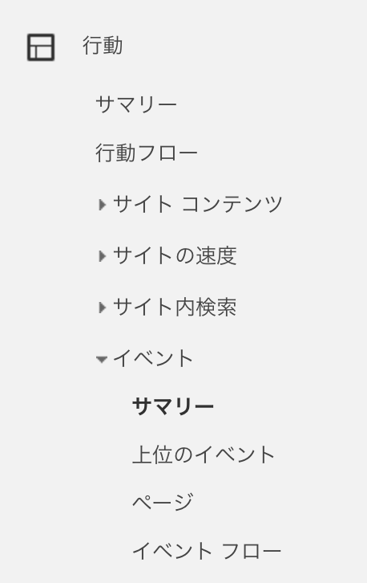

---
author:
- '@ottanxyz'
categories:
- Blog
date: 2017-01-15 00:00:00+00:00
draft: false
tags:
- adsense
- google
- analytics
- ブロック
- adblock
title: ブログを訪れたユーザーがどれだけGoogle AdSenseをブロックしているかを簡単に計測する方法
type: post
---

レンタルサーバー料金、独自ドメイン更新料など、ブログを運営していく上で欠かせないのが、その維持費です。維持費を捻出するために Google AdSense を導入されている方も多いのではないでしょうか。弊サイトでも、同様の目的で Google AdSense を導入しています。

と言いつつ、Google AdSense を積極的に推しているわけではなく、むしろ[iPhone のすべてのアプリからありとあらゆる広告を消し去る魔法のアプリ「AdBlock」の仕組み](/posts/2016/10/ios-adblock-5057/)など、広告を除去して快適にブラウジングする方法を紹介していたりします。結果的には収入は減ってしまうのですが、閲覧してくださる方も多くなり嬉しい限りです。

では、実際にどれくらいのユーザーが Safari や Google Chrome などの拡張機能や、コンテンツブロッカー等を使用して Google AdSense をブロックしているのか、計測してみたいと思ったことはありませんか。今回は、ブロックしているユーザの割合を計測したい場合に使用するスクリプトをご紹介します。

## Google AdSense をブロックするユーザを計測する JavaScript

Google AdSense をブロックするユーザを計測するために、今回は JavaScript を使用します。JavaScript 初心者の方でも簡単に設置できますのでご安心ください。

### Google Analytics を導入する

今回は、Google Analytics のイベントを使用して Google AdSense をブロックしているユーザの数を計測します。計測する方法の性質上
、正確な数は把握できませんが、目安にはなると思います。ブログを運営されている方で Google Analytics を導入されていない方は少ないと思いますが、まだの方はこれを機に Google Analytics を導入しましょう。導入の方法については割愛します。

https://analytics.google.com/

### Google AdSense をブロックするユーザを計測する JavaScript を設置する

Google AdSense は、次のようなタグで囲まれて表示されます。AdBlock Plus などのコンテンツブロッカーは、このタグを表示しないように制御することで、広告を表示することを抑止しています。

    …</ins>

Google AdSense の広告は、`<ins class="adsbygoogle"></ins>`というタグで囲まれていることがわかります。AdBlock Plus などのコンテンツブロッカーは、このタグに囲まれた HTML を表示しないように制御することで広告を表示しないようにしているのですね。

逆に言えば、このタグが正常に表示されているかどうか（≒ タグの中身が空でないかどうか）で、Google AdSense による広告が表示されているかどうかを判断できます。よって、ユーザーが Google AdSense をブロックしているかどうかは、このタグの内容を判定することで判別できそうですね。

そこで、以下の``で囲まれたスクリプトを、`</body>`タグの直前に挿入します。なお、事前に Google Analytics で使用する JavaScript が読み込まれていない場合、動作しませんので設置しておいてください。

    

このスクリプトは、Web ページのロード完了後、2 秒間待機してから、前述の Google AdSense が表示される HTML タグの内容を判別するようになっています。`<ins class="adsbygoogle"></ins>`の内容が空白の場合、Google AdSense はブロックされていると判定します。Web ページのロード完了後、一定時間（今回の場合は 2 秒間）待機する必要があるのは、まだ Google AdSense の読み込みとコンテンツブロッカーによる表示抑止が完了してからでないと、ブロックされているかどうかの判別ができないからです。

    ga('send', 'event', 'Adblock', 'Yes', {'nonInteraction': 1});

Google AdSense の広告がブロックされていると判定されれば、Google Analytics のイベントとして登録します。「Adblock」というカスタマイズイベントを Google Analytics に通知します。その性質上、即座には反映されないため、Google Analytics に表示されない場合は、しばらく置いてから見てみてください。

    _gaq.push(['_trackEvent', 'Adblock', 'Yes', undefined, undefined, true]);

まだ使用している方がいらっしゃるかどうかわかりませんが、古いタイプの Google Analytics を使用している場合は、こちらのコードを使用して Google Analytics に通知します。

### 最小化した JavaScript

[JSCompress: Minify Javascript Online / Online JavaScript Compression](https://jscompress.com/)で圧縮した JavaScript を掲載しておきます。通常の場合は、こちらのスクリプトを`</body>`タグの直前に挿入するのが良いでしょう。

    

### Google Analytics で確認する

JavaScript を設置して、しばらく時間を置いたら Google Analytics を確認してみましょう。

「イベント」は、レポートの「行動」→「イベント」から確認できます。

Google Analytics に正常にイベントが送信されていれば、このように「Adblock」と呼ばれるイベントが登録されます。ページビューに対して、「Adblock」イベントがどれくらい送信されているかによって、訪問者が広告をブロックしている割合を把握できます。
