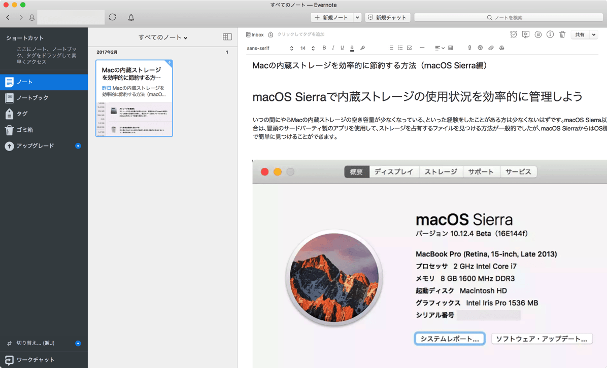
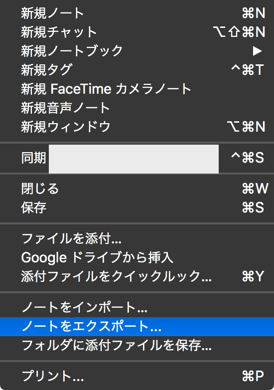
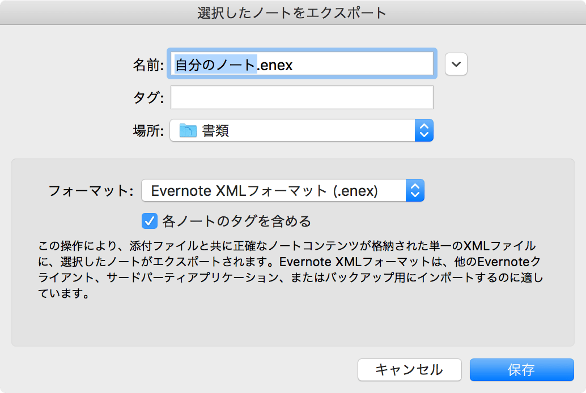
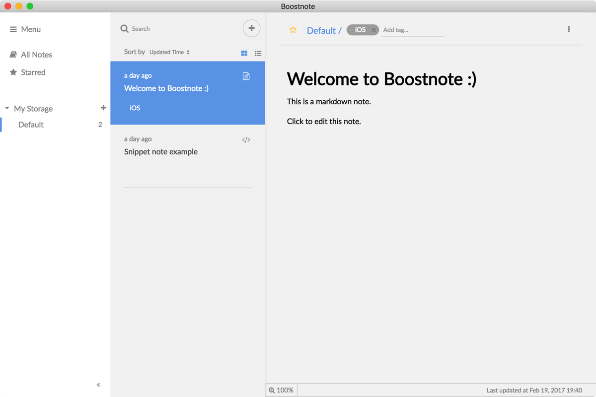
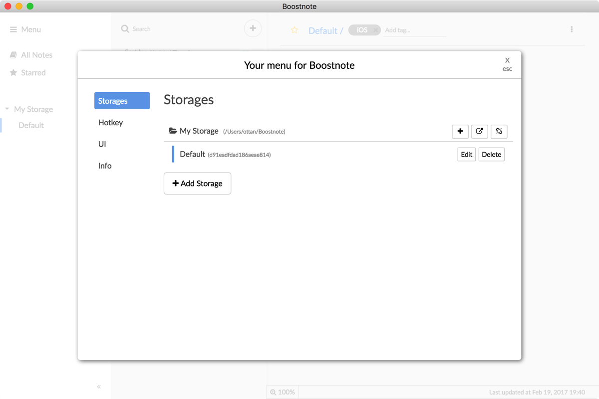
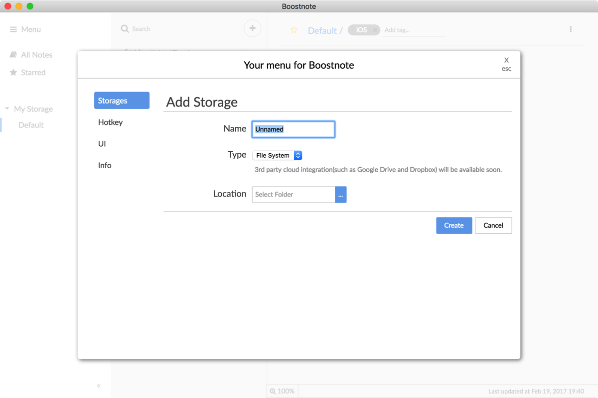
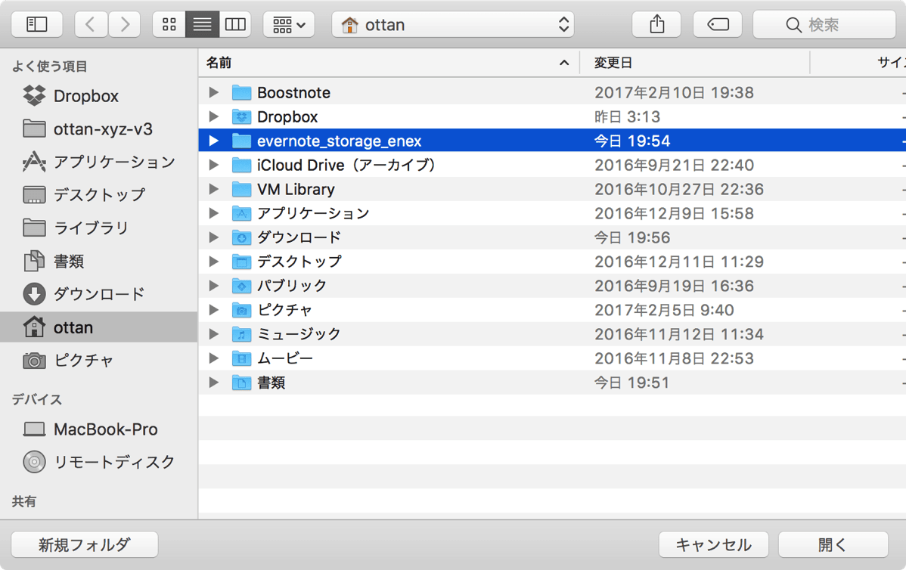
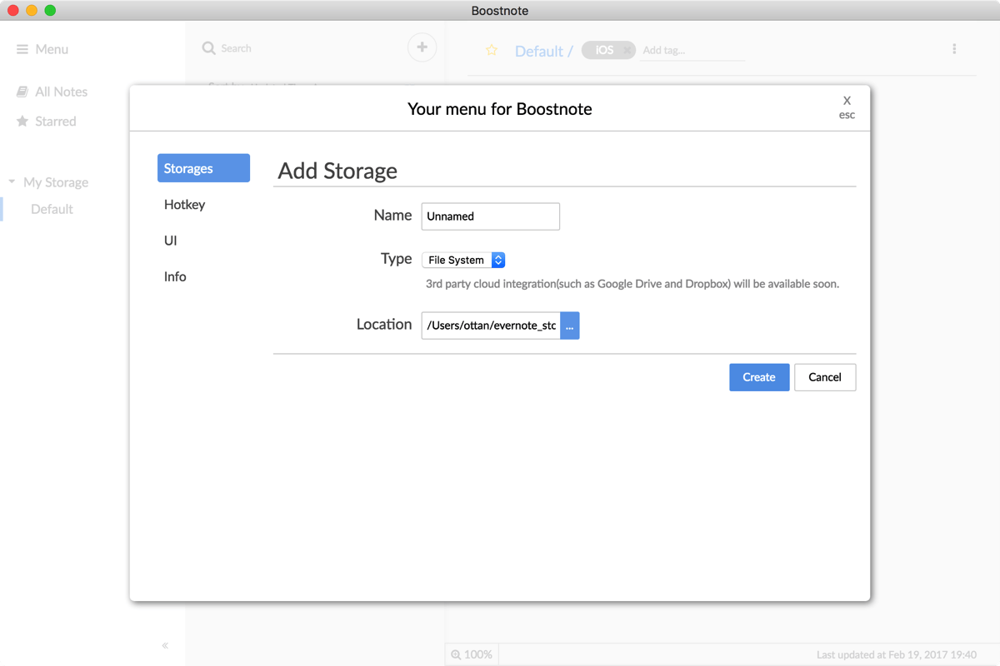
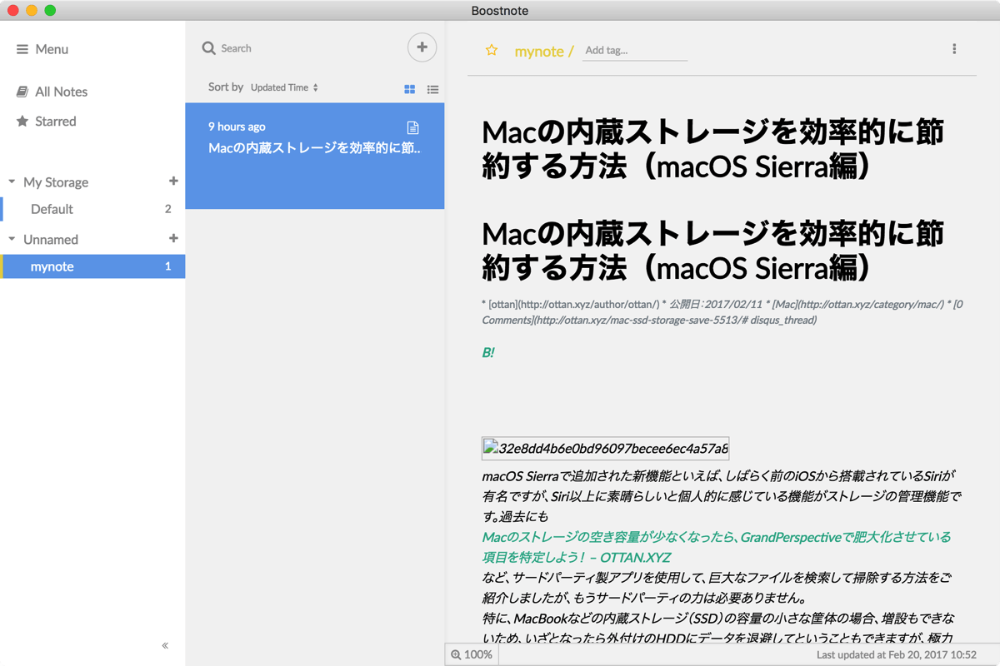

---
author:
- '@ottanxyz'
categories:
- Mac
date: 2017-02-24 00:00:00+00:00
draft: false
tags:
- ノート
- 2b
- evernote
- 形式
- ruby
title: EvernoteのノートをBoostnoteのノート形式に手軽に変換できる「ever2boost」
type: post
---

以前、[WordPress のテーマ、プラグイン開発者にオススメできる軽量なテキストエディター「Boostnote」](/posts/2017/02/wordpress-developer-plugin-theme-boostnote-5528/)で、プログラマ、デザイナーにオススメのテキストエディター「Boostnote」についてご紹介しました。今回、ご紹介するのは、プランの内容が度々変更され、その変更についていけない Evernote ユーザの皆様にお送りする、Evernote 形式のノートを「Boostnote」にインポートするためのツールについてです。Ruby が使える環境であれば簡単に使用できます。

## Evernote から Boostnote に変換するための「ever2boost」

Evernote は、使いこなせば使いこなすほど味の出る、究極のノートであることに、現在もなお変わりはないと思いますが、度重なる Evernote の仕様変更（無料プランで使用できるデバイスが制限されたり、利用料金が変更になったり）についていけなくなった方々も多いはずです。もし、Evernote をただのノートとして管理している、別にデバイス間で同期して便利に使用しているわけではない、という方にオススメなのが、今回ご紹介する「ever2boost」です。

### Evernote Web Clipper で保存したノートを「ever2boost」に移行する

今回ご紹介する「ever2boost」は、文字通り Evernote のノートを「Boostnote」に移行するための、オープンソースのコミュニティにの協力のもと開発された強力な移行ツールです。今回は、Safari や Google Chrome の拡張機能としても有名な「Evernote Web Clipper」を使用して保存したノートを実際に「Boostnote」に移行してみました。サンプルに使用した Web ページは弊サイトの[Mac の内蔵ストレージを効率的に節約する方法（macOS Sierra 編）](/posts/2017/02/mac-ssd-storage-save-5513/)です。

前述の Web ページを Google Chrome の拡張機能である「Evernote Web Clipper」を使用して、Evernote に保存した場合、上記のように保存されます。Web ページの内容が見やすく綺麗にまとまっています。熟練された拡張機能であるだけにその完成度は高いですね。では、このノートを「Boostnote」に移行してみましょう。

ノートを選択して、「ファイル」→「ノートをエクスポート」を選択します。

ノートは「Evernote XML フォーマット（.enex）」形式で保存します。名前は任意で構いませんが、CLI ツールである「ever2boost」で使いやすいように半角英数字にしておくことをオススメします。

### 「ever2boost」のインストール

macOS Sierra をご利用の場合、Ruby が標準で使用できます。「ever2boost」は Ruby で動作するプログラムとして、Ruby のライブラリである「RubyGems」として公開されているため、簡単にインストールを行うことができます。ターミナルを開いて、以下のコマンドを実行しましょう。`sudo`コマンドを使用するため、管理者グループに属するユーザで実行してください。

    sudo gem install ever2boost

たった、この 1 行だけでインストール完了です。インストールが完了したら、コマンドのパスを認識させるために、ホームディレクトリ上の`.bashrc`（zsh を使用している場合は、`.zshrc`）を読み込み直すか、ターミナルを再起動してください。

### 「ever2boost」を使用して「Evernote」を「Boostnote」に変換する

続いて、ターミナルで、さきほど保存した「.enex」形式のファイルを変換します。たとえば、「ドキュメント」フォルダー配下に「mynote.enex」というファイル名で保存した場合は、以下のコマンドを実行します。

    ever2boost convert ~/Documents/mynote.enex

コマンドの実行結果が以下のように表示されることを確認します。

    converting...
    converting Macの内蔵ストレージを効率的に節約する方法（macOS Sierra編）
    The notes are created at /Users/ottan/evernote_storage_enex

「Boostnote」のノートはフォルダー単位で管理されます。変換に成功すると、「Boostnote」形式のフォルダーがカレントディレクトリ配下に自動的に作成されます。

### 変換したノートを「Boostnote」に読み込む

では、「ever2boost」によって変換されたノートを、実際に「ever2boost」に読み込んでみましょう。

Boostnote を起動したら、左上のの「Menu」をクリックします。

続いて、「Storages」メニューから「Add Storage」をクリックします。

インポートするノートの名前を「Name」に入力します。ノートの名称は後から変更できます。

「Location」から、変換した Evernote のノートが保存されているフォルダーを選択します。パスについては、「ever2boost」の実行結果に記されています。

最後に、「Create」ボタンをクリックします。

そして、変換された結果がこの通りになります。ノートは、「Markdown」形式で保存されていることがわかります。そのため、「Markdown」形式に慣れている方にとっては、簡単にノートを編集できますね。ただし、記事執筆時点では、画像ファイルは正常に変換されないようです。「Markdown」形式のノートに画像の参照先は記されていますが、その参照先に画像ファイルが存在しない状態でした。そのため、画像を多用するノートの移行には向いていません。

## まとめ

このように画像ファイルが正常に変換されないなど、現段階ではまだまだ課題があるものの、「Boostnote」の将来性を見据えると、今から移行する用意をしておくのも 1 つの手かもしれませんね。
