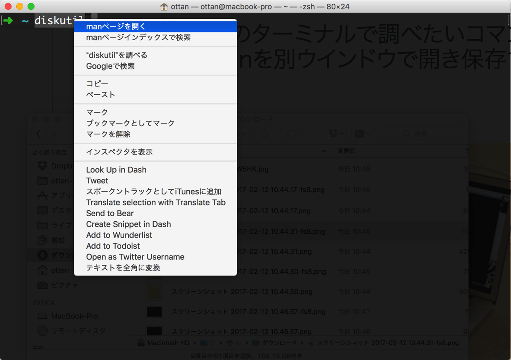
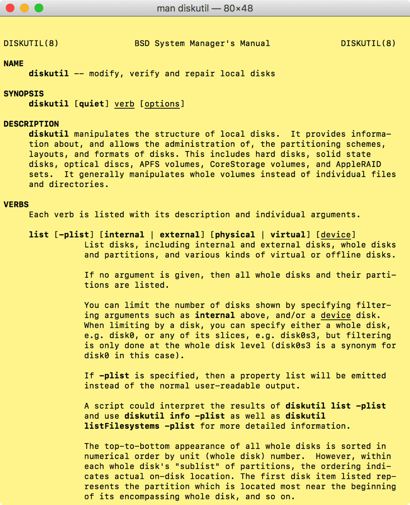
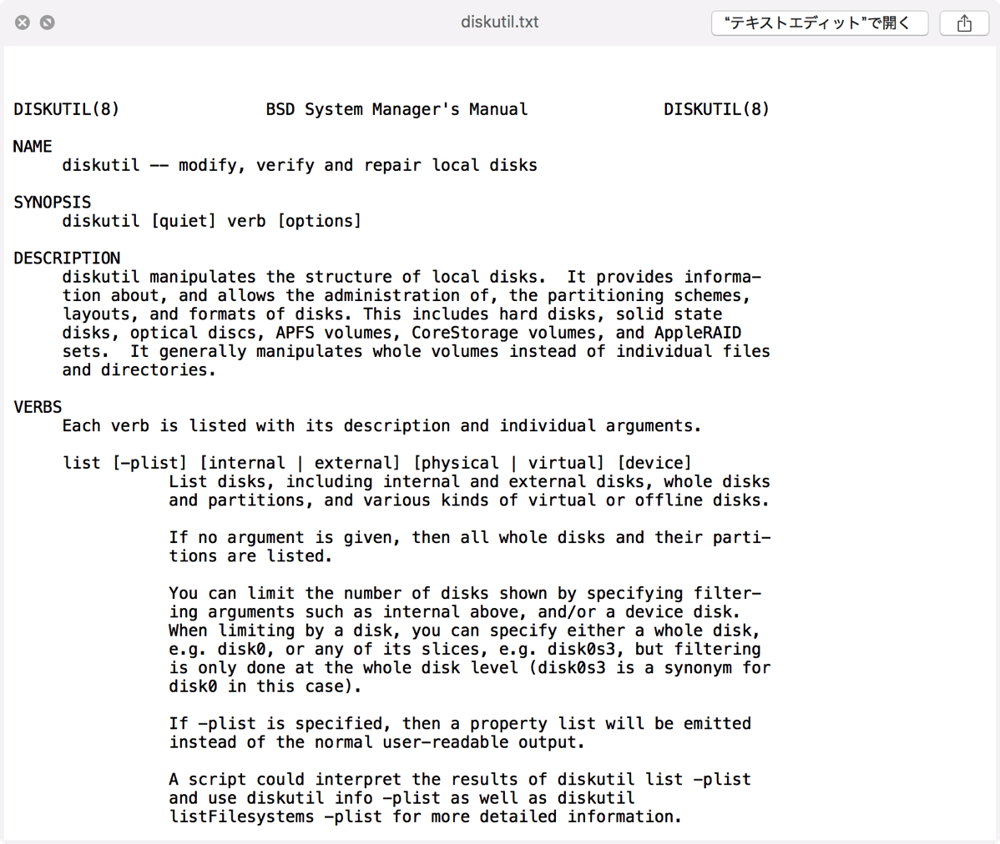
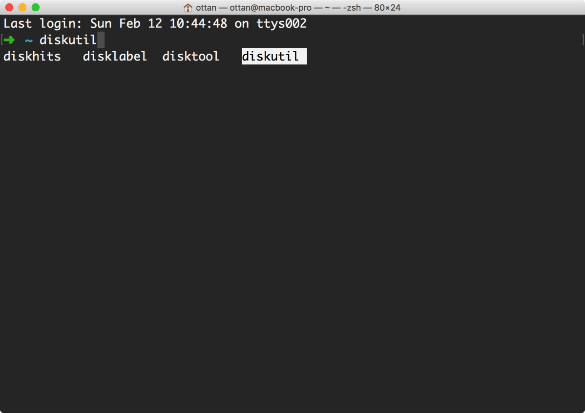

---
author:
- '@ottanxyz'
categories:
- Mac
date: 2017-02-12 00:00:00+00:00
draft: false
tags:
- コマンド
- manページ
- ターミナル
- ウインドウ
- lt
title: Macのターミナルで調べたいコマンドのmanを別ウインドウで開き保存する方法
type: post
---

Mac のターミナルを使用すれば、bash や zsh を駆使して簡単にスクリプトを組むこともできれば、各種便利なコマンドを使用することで、Automator に組み込み作業を自動化することなど、GUI のみではなかなか実現できないことを簡単に実行できます。たとえば、[Finder の右クリックメニュー、キーボードショートカットから PNG ファイルを一括して圧縮する – OTTAN.XYZ](/posts/2016/07/automator-finder-png-compress-4570/)でご紹介している方法を使用すれば、Finder から右クリックメニューで PNG ファイルを簡単に画質を（ほぼ）劣化させることなく圧縮することができるため、ブログ等で画像を大量に使用する場合にはぜひ活用したい方法です。

ターミナルでは便利なコマンドをたくさん使用することができるのですが、時にコマンドの使い方を忘れてしまうことがあります。ほとんどのコマンドについては、コマンドの後に`<command> -h`、もしくは`<command> --help`等と打つとコマンドのヘルプが表示されるのですが、より詳しく知りたい場合には、`man <command>`を使用します。

man をターミナルで参照した場合、ターミナルのウインドウ上に表示されるため、もう一度コマンドの man を参照したい場合には、再びターミナル上で`man <command>`を実行する必要があります。よく使用するコマンドの man は保存して後から参照したいところですが、そのような場合には、`man <command> > <File path>`のように標準出力をリダイレクトすることで、テキストファイルとして保存できますが、今回はより簡単に man コマンドの結果を別ファイルとして保存する方法をご紹介します。

## mac コマンドの結果を別ウインドウで開きテキストで保存する

ターミナルを開いたら、man を参照したいコマンドを表示させます。

続いて、コマンドを右クリックして、「man ページを開く」をクリックします。

すると、man が別ウインドウで開くため、⌘+S を押して簡単にテキストファイルとして保存できます。これでいつでも Quick Look やテキストエディターで man の内容を確認することができるようになりますね。

たとえば、保存した man ページを、Finder の Quick Look から開いた様子です。これで man の内容を常に表示した状態で、ターミナルでコマンドを実行できますね。

なお、コマンドの文字列がすべて思い出せない、といった場合には、bash、zsh においても補完機能を使用できます。たとえば、前述の`diskutil`コマンドの内容が思い出せない場合は、`d`と入力した上で、⇥（tab）を押すことで、`d`から始まるコマンドの一覧を表示させることができるため、先ほどと同じように候補として表示されたコマンドを右クリックして man ページを別ウインドウで開くことで、簡単に man ページの内容を保存できますよ。

よくターミナルを使用する方は、ぜひ試してみてくださいね。