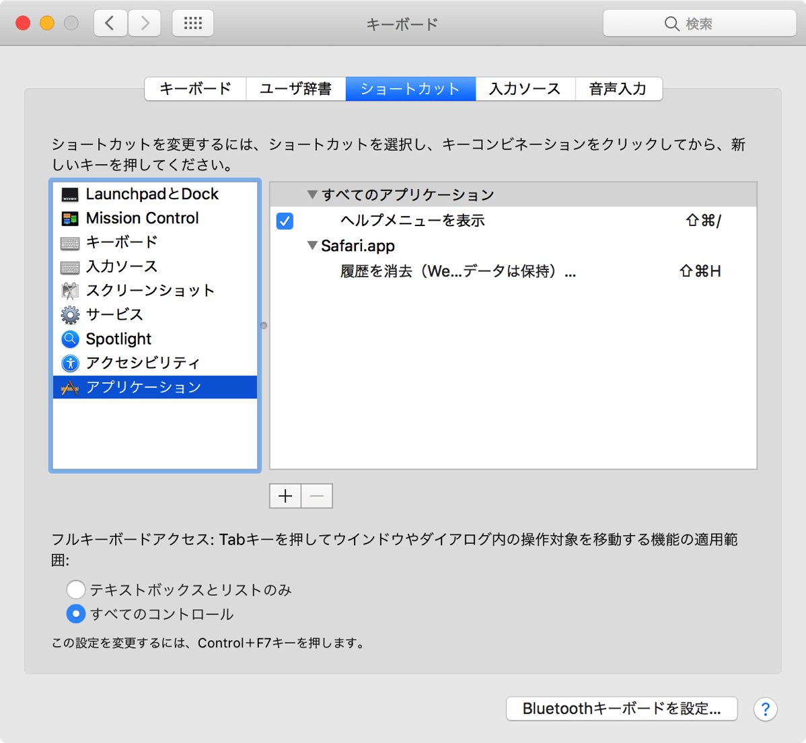
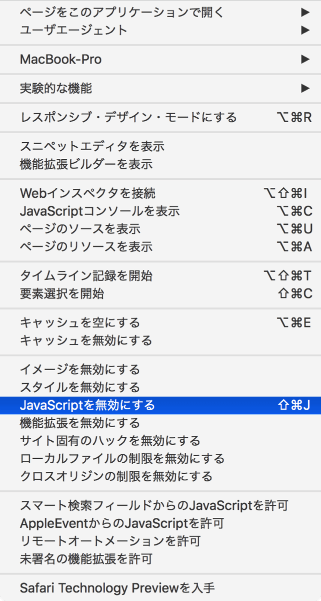

---
author:
- '@ottanxyz'
categories:
- Mac
date: 2017-05-08 00:00:00+00:00
draft: false
tags:
- javascript
- ショートカット
- メニュー
- safari
- キーボード
title: MacのSafariでショートカットキー一発でJavaScriptのオン、オフを切り替える方法
type: post
---

Webサイト制作において、JavaScript無効時の動作を確認するためにブラウザのJavaScriptを一時的に無効にしたい時があります。Safariにおいて、JavaScriptを無効にすることはできますが、通常の場合、環境設定を開き、「セキュリティ」タブからJavaScriptを無効にする必要があり、一時的に無効化したい場合にはやや不便です。そこで、今回は、MacのSafariでJavaScriptを簡単にオン、オフできるキーボードショートカットを作成する方法をご紹介します。

## MacのSafariでショートカットからJavaScriptをオン、オフする

Safariには標準で開発者向けのメニューが用意されていますが、通常使用されないため有効化しておく必要があります。この開発者向けメニューの中にJavaScriptを簡単に無効化できる項目があります。

開発者向けメニューを有効化するためには、Safariの環境設定（⌘+,）を開き、「詳細」タブから「メニューバーに"開発"メニューを表示」のチェックボックスをオンにします。

すると、Safariのメニューに「開発」という項目が現れるため、それをクリックします。すると、メニューの中に「JavaScriptを無効にする」という項目があるため、この項目をクリックすることで、JavaScriptを無効にしたり有効にしたりできます。

### よく使う項目はキーボードショートカットを設定する

「開発」メニューからJavaScriptのオン、オフを切り替えても良いのですが、頻繁に使用するようであれば、キーボードショートカットを設定しておきましょう。

「システム環境設定」を開き、「キーボード」をクリックします。

「ショートカット」タブを選択し、サイドメニューから「アプリケーション」を選択してください。続いて、「＋」ボタンでショートカットを追加します。

「アプリケーション」は「Safari.app」、メニュータイトルは「JavaScriptを無効にする」（この項目はSafariの「開発」メニューに表示されているメニューを一言一句間違えないように入力してください。今回は問題ありませんが、三点リーダー等が含まれている場合は、それも合わせて入力する必要があります）、キーボードショートカットは他と被らない任意なものにしてください。今回は、JavaScriptの頭文字をとって、⇧+⌘+Jとしました。

続いて、Safariの「開発」メニューを表示すると、先ほど設定したキーボードショートカットが表示されていると思います。もし、表示されていない場合は、メニュータイトルが一言一句正しく入力されているか再度確認してください。これで、⇧+⌘+Jを押すだけで、JavaScriptのオン、オフを切り替えられるようになりました。