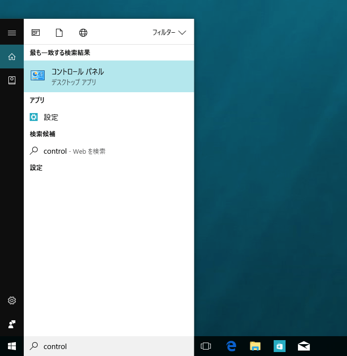
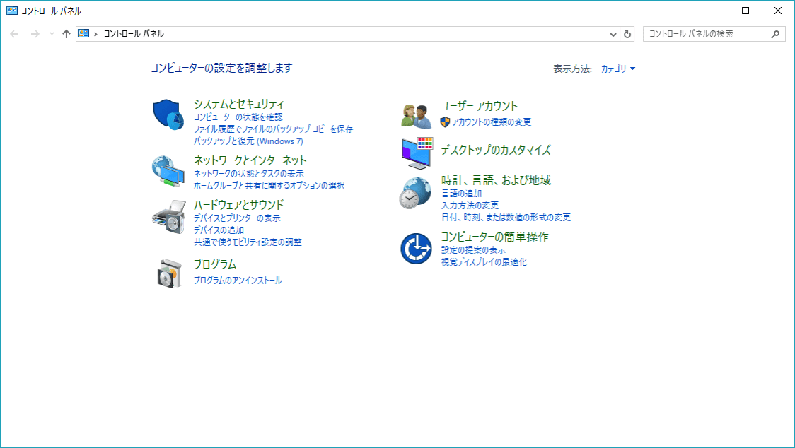
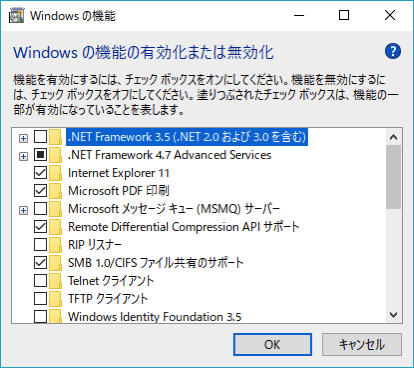
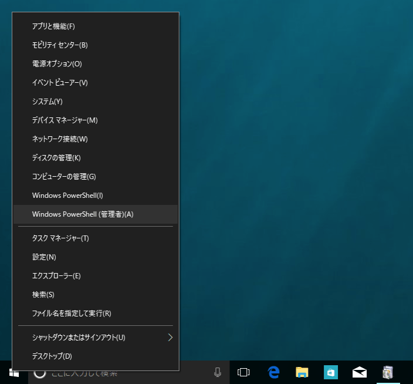
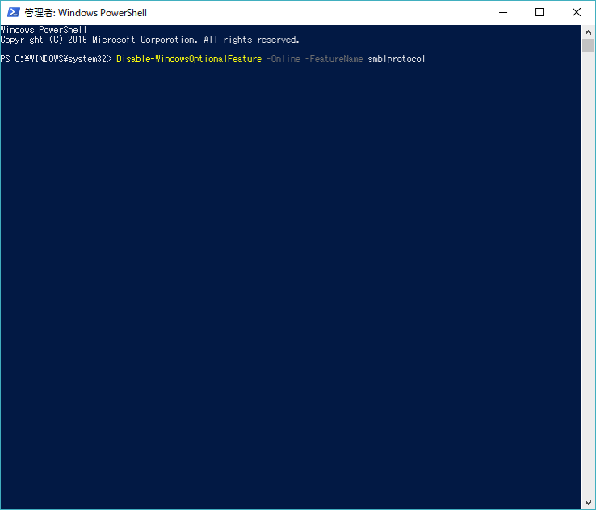
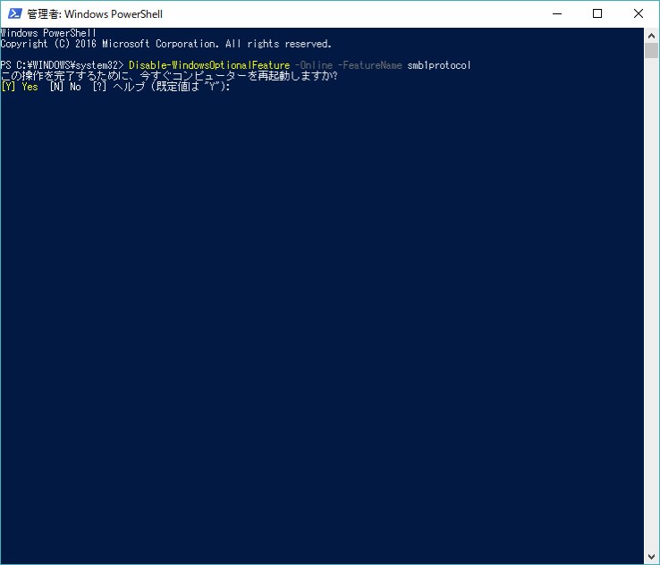

---
author:
- '@ottanxyz'
categories:
- Windows
date: 2017-05-20 00:00:00+00:00
draft: false
tags:
- sm
- b1
- powershell
- コントロールパネル
- windows
title: Windows 10（Creator Update）で、脆弱性のあるSMB1を無効化する方法
type: post
---

Windowsには、SMB（Server Message Blocks）というプロトコルを使用してファイル共有やプリンター共有を行う仕組みがあります。SMBにはバージョンがあり、もっとも古いものはバージョン1であり、これは最新のOSであるWindows 10（Creator Update）でもサポートされています。しかし、[マイクロソフト セキュリティ情報 MS17-010 - 緊急](https://technet.microsoft.com/ja-jp/library/security/ms17-010.aspx)等でも公開されているように、SMB1は古いプロトコルであり多数の脆弱性を抱えており、また上位のバージョンよりも性能面等で劣るため、SMB1を使用しない場合にはSMB1は停止しておくことをオススメします。

SMB1は、Windows XPやWindows Server 2003までは標準のプロトコルとして使用されていましたが、Windows XPについてはすでにOSのサポートが終了されていることもあり、SMB1を使用するケースはありません。そのため、セキュリティ強化のため、万が一のためにも無効化しておきましょう。将来的にはデフォルトで無効化されるのかもしれません。

## Windows 10でSMB1を無効化する方法

ここでは、Windows 10（Creator Update）でSMB1を無効化する方法をご紹介します。コントロールパネルを使用する方法は、Windows 7、Windows 8.1でも同様に利用できますが、PowerShellを使用する方法はWindows 10限定です。なお、以下の操作はすべて管理者権限を有するユーザーで実施してください。

### コントロールパネルからSMB1を無効化する

Windows 10（Anniversary Update）では、スタートボタンを右クリックすることにより、すぐにコントロールパネルを呼び出すことができました。しかし、Creator Updateによりコントロールパネル自体が項目から消えてしまいました。将来的にコントロールパネル自体を廃止するのかもしれません。

コントロールパネルを呼び出すもっとも簡単な方法は、スタートボタンに隣接する検索ボックスに`control`と入力することです。「もっとも一致する検索結果」にコントロールパネルが表示されると思いますので、そちらをクリックしてください。

続いて、コントロールパネルの中から「プログラム」という項目を見つけてください。「プログラム」をクリックします。上図の画面では左下に「プログラム」という項目があります。

続いて、「Windowsの機能の有効化または無効化」をクリックします。

「SMB 1.0/CIFS ファイル共有のサポート」のチェックボックスをオフにして「OK」をクリックします。OSの再起動を促すダイアログが表示されるため、再起動します。

### PowerShellでSMB1を無効化する

Windows 10では、同様の操作をCUI（PowerShell）を使用して実施できます。

Windows 10（Creator Update）の場合は、スタートボタンを右クリックして「Windows PowerShell（管理者）」を選択してください。以前のOSの場合は、スタートボタンに隣接する検索ボックスに「PowerShell」と入力して、「PowerShell」を見つけてください。PowerShellを見つけたら、右クリックして「管理者として実行」をクリックしてください。そのままクリックすると、UACにより管理者権限が剥奪されてしまいます。

PowerShellが起動したら以下のコマンドを実行してください。

    Disable-WindowsOptionalFeature -Online -FeatureName smb1protocol

「この操作を完了するために、今すぐコンピューターを再起動しますか」と表示されるため、`y`と入力して再起動します。以上で、無効化は完了です。コントロールパネルで同様の項目を見ると、無効化されている（チェックボックスがオフになっている）ことがわかります。