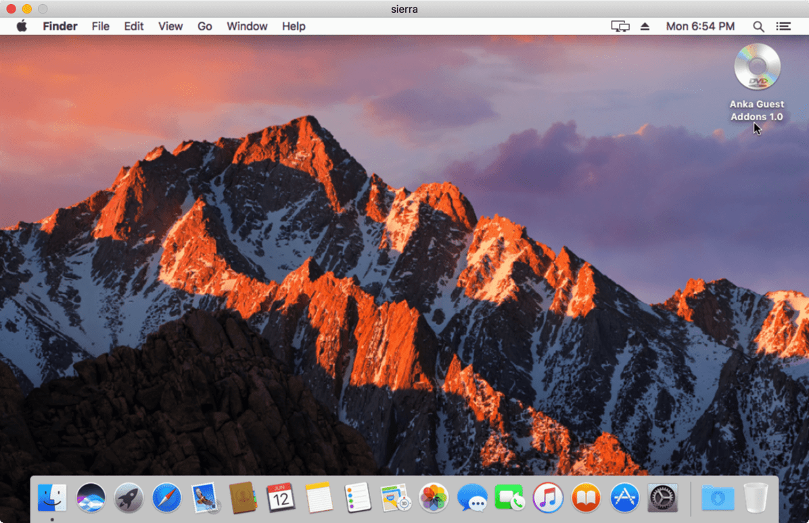

---
author:
- '@ottanxyz'
categories:
- Mac
date: 2017-06-13 00:00:00+00:00
draft: false
tags:
- anka
- 仮想マシン
- fd
- 準仮想化
- macos
title: macOSのネイティブな仮想化フレームワークを使用した軽量仮想化ソフトウェア「Anka」のβ版を使用してmacOSのテスト環境を構築する
type: post
---

以前、[macOSのネイティブなHypervisor.frameworkを使用したオープンソースソフトウェア「Veertu Desktop」 – OTTAN.XYZ](/posts/2016/10/macos-hypervisor-framework-5141/)にて、軽量な仮想化ソフトウェアである「Veertu Desktop」をご紹介しましたが、そのVeertuから、macOSの軽量な仮想開発環境を構築できる「Anka」のパブリックベータ版が公開されました。VMware FusionやParallels Desktopなどと異なりGUIによる操作を行うことはできませんが、ターミナルを使用してCUIによるコマンドによる仮想環境構築、および開発者間での共有を行うことができる超軽量なソフトウェアとなっています。

「Anka」の特徴として、以下の要素が挙げられています。（詳細は、[Anka Documentation](https://ankadoc.bitbucket.io/)を参照）

-   Easy installation
-   Native hypervisor - use macOS resource scheduling and power management for guest VMs
-   Para virtual drivers increase network and disk performance
-   anka CLI - automate management workflows or call them directly

インストールは、インストーラーパッケージをダウンロードし、ウィザードの内容に沿ってインストールするだけです。何と言っても、VMware FusionやParallels Desktopと異なり、インストールに必要な容量は10MB程度と超軽量です。また、「Veertu Desktop」と同様にmacOSネイティブのフレームワークを使用しているため、リソース、電源管理はすべてmacOSが適切に行います。さらに、専用に用意されている準仮想化ドライバー（Para-Virtual Drivers）を使用することによりネットワークおよびディスクI/Oの高パフォーマンスを引き出します。準仮想化ドライバーは、多くの同様のソフトウェアで用いられていますが、OS、仮想マシン間におけるボトルネックを解消するための技術です。「準」と呼ばれているのは、完全に仮想化（直接OSとやり取り）しないことからそう呼ばれています。

「Anka」は、macOS 10.10.x以降のホストOS（macOS）で動作します。また、ゲストOSとして、執筆時点で開発者向けのデベロッパープレビューが公開されている、macOS High Sierraをサポートしているのが特徴です。iOS、およびmacOSの開発者であれば、手軽に開発環境を構築できます。今回は、「Anka」を使用してmacOSの仮想環境を構築するまでの手順をご紹介します。

## 「Anka」によるmacOSの仮想環境の構築

[Getting Started with Anka - Build macOS private cloud for development](https://veertu.com/getting-started-with-anka/)から、「Anka Build」をダウンロードします。現在、パブリックベータ版として公開されているため、正式公開までに内容が変更される点があることについてはご留意ください。ダウンロードしたインストーラーパッケージを使用して、インストールを行ってください。`/usr/local/bin/anka`というコマンドが使用できるようになります。

### macOSのインストーラーのダウンロード

仮想環境を構築するためには、macOSのインストーラーが必要になります。今回は、macOS Sierraのインストーラーを使用します。Mac App Storeからダウンロードしておいてください。ダウンロードした際、macOSのインストールを促されますが、インストーラーを終了（⌘+Q）してください。



### 仮想環境のイメージの構築

続いて、仮想マシンを構築するためのイメージファイルを作成します。`-a`オプションには、Mac App Storeからダウンロードしたインストーラー（.app）ファイルを指定します。`anka`コマンドは、`/usr/local/bin`配下にインストールされます。`PATH`が通っていない場合は、環境変数に追記しましょう。

    anka create-disk -a /Applications/Install\ macOS\ Sierra.app

自動的にmacOSのインストールが始まります。インストールには時間を要します（通常のmacOSのインストールと同等またはそれ以上の時間がかかります）のでご注意ください。

    Ejecting previously mounted /dev/disk2...
    Disk /dev/disk2 ejected
    Creating temporary disk image 40G at /tmp/rwimg.DjKT.sparseimage...
    Attaching the InstallESD...
    Installing macOS 10.12.5...
    Copying addons... 100.%
    Volume on disk2s2 renamed to Macintosh HD
    "disk4" unmounted.
    "disk4" ejected.
    "disk2" unmounted.
    "disk2" ejected.
    Converting to ANKA format...
    40960+0 records in
    disk 8df5fd7d-4fd6-11e7-adbd-600308a18c44 created successfully at: 8df5fd7d-4fd6-11e7-adbd-600308a18c44.ank

上記のように表示されればインストール完了です。では、実際にイメージが正常に作成されていることを確認します。

    anka list-images

現在、「Anka」で作成されているイメージの一覧が表示されます。ここに表示される「image-id」は後ほど使用します。

    list of images
    +------------+-------+--------------------------------------+
    |       size | vms   | image-id                             |
    +============+=======+======================================+
    | 8718028800 |       | 8df5fd7d-4fd6-11e7-adbd-600308a18c44 |
    +------------+-------+--------------------------------------+

続いて、作成したイメージをもとに仮想マシンを作成します。仮想CPUや仮想メモリ、ディスクサイズをカスタマイズすることもできますが、デフォルトで作成する場合は以下のコマンドを実行します。デフォルトでは、仮想CPUのコア数は「2」、仮想メモリは「2G」になります。なお、最後に指定する文字列は任意です。これが仮想マシンの名称になります。以降、起動、停止等で頻繁に使用しますのでわかりやすい名前にします（今回は「sierra」としました）。

    anka create -d 8df5fd7d-4fd6-11e7-adbd-600308a18c44 sierra

`-d`オプションには、先ほど作成したイメージを指定します。イメージを指定する場合は、「image-id」を指定します。

    Creating VM, please wait...
    vm created successfully with uuid: 3073c417-4fda-11e7-b3dd-600308a18c44
    Would you like to start the new vm? [y/N]: y
    +-----------------------+--------------------------------------+
    | uuid                  | 3073c417-4fda-11e7-b3dd-600308a18c44 |
    +-----------------------+--------------------------------------+
    | name                  | sierra                               |
    +-----------------------+--------------------------------------+
    | cpu_cores             | 2                                    |
    +-----------------------+--------------------------------------+
    | ram                   | 2G                                   |
    +-----------------------+--------------------------------------+
    | image_id              | 8df5fd7d-4fd6-11e7-adbd-600308a18c44 |
    +-----------------------+--------------------------------------+
    | status                | running                              |
    +-----------------------+--------------------------------------+
    | vnc_port              | 5900                                 |
    +-----------------------+--------------------------------------+
    | vnc_connection_string | vnc://:admin@192.168.1.8:5900        |
    +-----------------------+--------------------------------------+
    | vnc_password          | admin                                |
    +-----------------------+--------------------------------------+
    | view_vm_display       | anka view sierra                     |
    +-----------------------+--------------------------------------+

仮想マシンの作成は瞬時に完了します。仮想マシン作成完了後に、仮想マシンを起動するかどうか尋ねられるため、「y」（yes）または「N」（no）を入力します。仮想マシン作成後、準仮想化ドライバーをインストールする必要があるため、作成後は停止した状態で構いません。

    anka stop sierra

仮想マシンを停止する場合には、上記のコマンドを実行します。「sierra」は作成した仮想マシンの名称ですので、以降、適宜置き換えてご覧ください。

    VM sierra is shutting down

上記のように表示されれば正常に停止しています。

### 準仮想化ドライバー（PV）のインストール

続いて、準仮想化ドライバーを仮想マシンにインストールします。準仮想化ドライバーのインストーラーはiso形式で提供されています。仮想マシンに認識させるため、仮想マシンに一時的に光学ドライブデバイスを追加して、その光学ドライブにisoファイルを認識させます。以下のコマンドを実行してください。

    anka modify sierra add optical-drive --file /Library/Application\ Support/Veertu/Anka/guestaddons/anka-addons-mac.iso

今後、アップデート等により上記のパスが変更になる可能性がありますのでご注意ください。

    successfully added optical drive

上記のように表示されればデバイスの追加は完了です。では、仮想マシンを起動します。仮想マシンには、「画面共有.app」または専用のビューワーを介してアクセスします。「画面共有.app」を使用する場合は、仮想マシン時に表示された「vnc_connection_string」の文字列を入力してください。今回は、専用のビューワーを介してアクセスします。

    anka start sierra
    anka view sierra

仮想マシンが表示されれば完了です。

なお、仮想マシンのデフォルトの特権アカウントのユーザ名は「anka」、パスワードは「admin」となっています。必要に応じて変更してください。光学ドライブが正常に認識されている場合は、上記のようにデスクトップにアイコンが表示されていますので、開いてインストーラーファイルから準仮想化ドライバーをインストールしてください。なお、インストールの際に、上記のユーザのパスワードが必要になります。インストール完了後は、仮想マシンを再起動しますが、その前に一時的に追加した光学ドライブを取り外します。

    anka stop sierra

上記のコマンドにより仮想マシンを停止します。停止した状態で、以下のコマンドを実行して、追加した光学ドライブを削除します。

    anka modify sierra delete optical-drive 0

以下のように表示されればデバイスの削除は完了です。

    successfully deleted optical drive

さらに、準仮想化ドライバーを使用するように設定を変更します。仮想マシンの変更には、`anka modify`コマンドを使用します。詳細は、`anka modify --help`を参照ください。

    anka modify sierra set hard-drive --controller ablk 0

以下のように表示されれば設定完了です。

    the following properties were set successfully:
    hard drive 0 set to controller: ablk

続いて、ネットワークドライバーについても準仮想化ドライバーを使用するように指定します。以下のコマンドを実行します。

    anka modify sierra set network-card --model anet 0

以下のように表示されれば設定完了です。

    the following properties were set successfully:
    model set to anet

最後に、仮想マシンを起動すれば仮想マシンの構築は完了です。

    anka start sierra
    anka view sierra