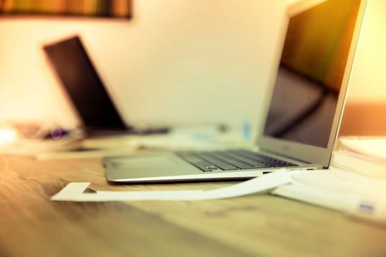
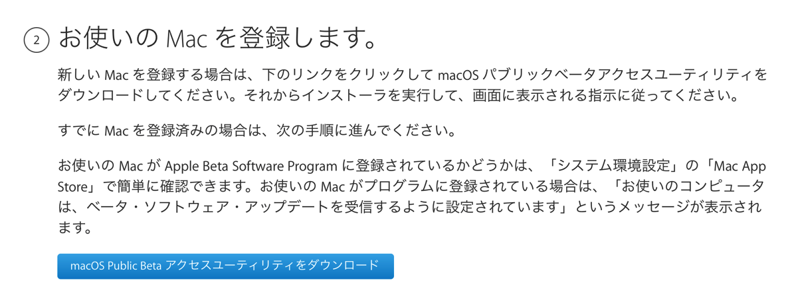
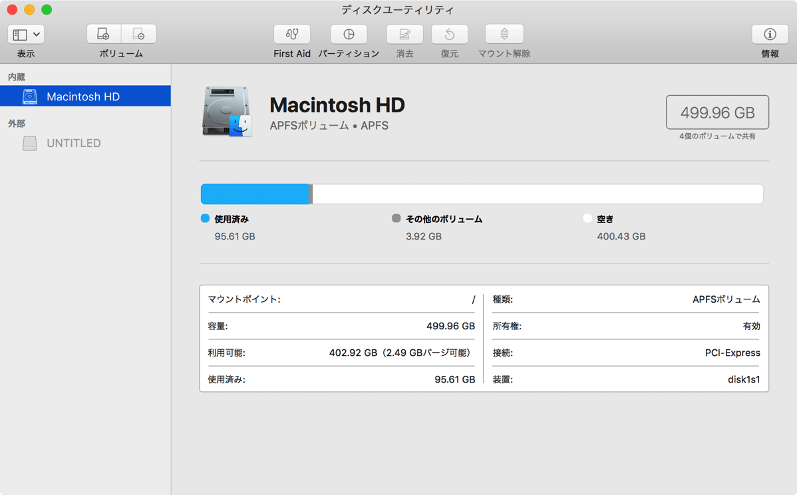
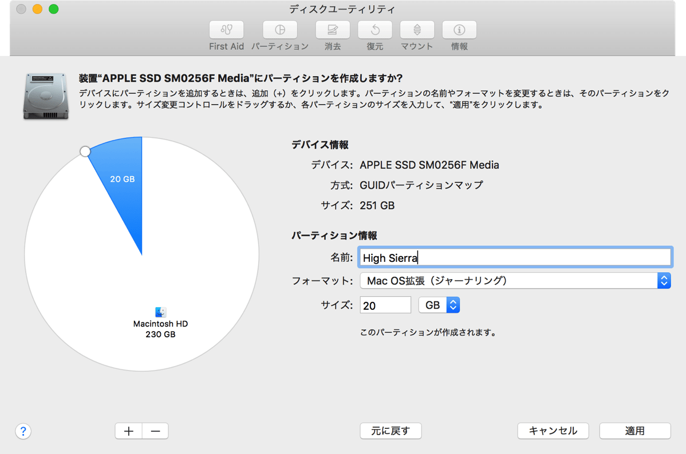
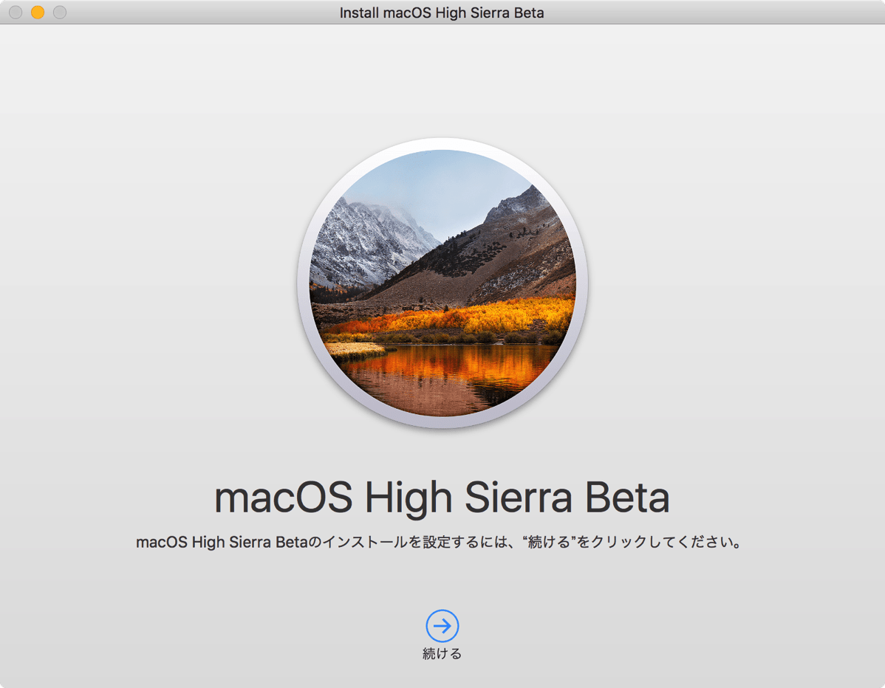
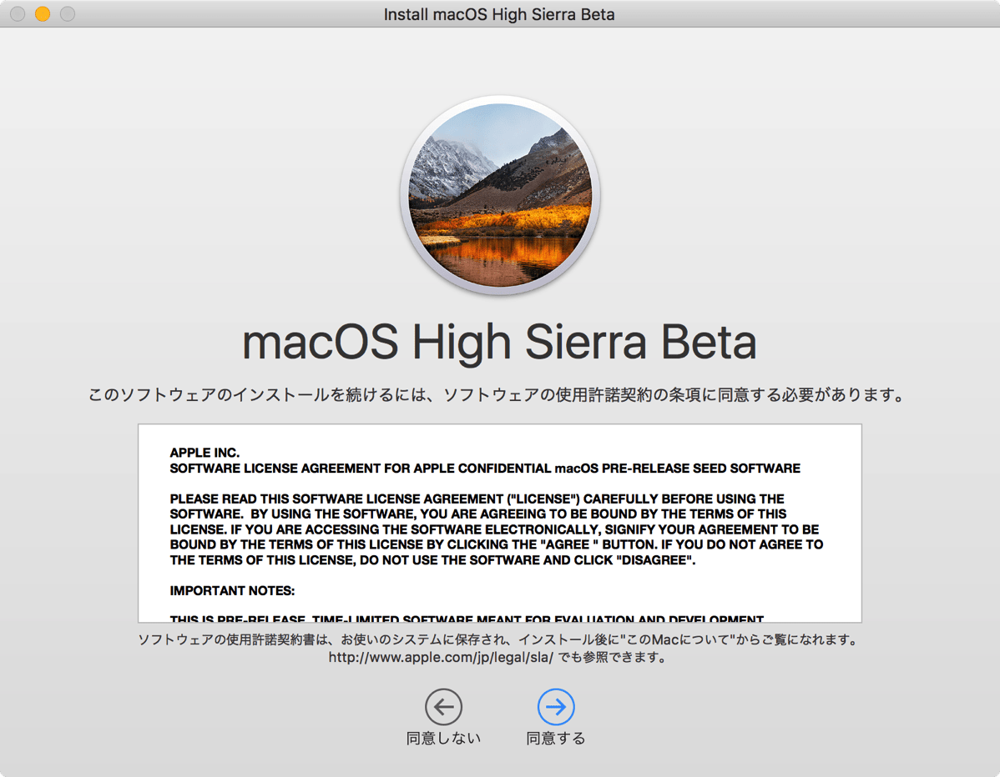
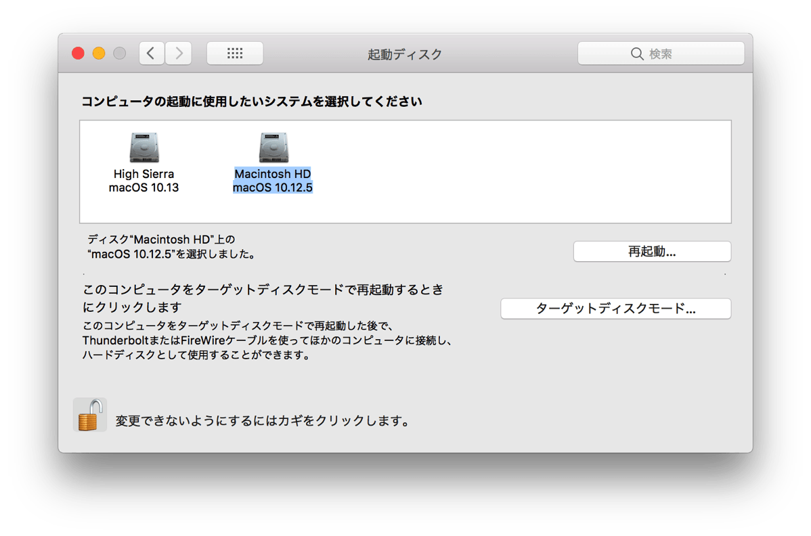

---
author:
- '@ottanxyz'
categories:
- Mac
date: 2017-07-01 00:00:00+00:00
draft: false
tags:
- sierra
- high
- macos
- インストール
- パブリックベータプログラム
title: macOS Sierraの環境を壊さずに、macOS High SierraのPublic Betaをインストールする
type: post
---

次世代のmacOSとなる「macOS High Sierra」のパブリックベータが公開されました。開発者にとっては今すぐ最新の環境を試してみたいと思うかもしれませんが、メインで使用しているMacが1台のみの場合、ベータ版使用による何らかの不具合が発生してしまったことを考えると躊躇してしまいますよね。そこで、今回は現行環境をそのまま活かしながら、β版のHigh Sierraまで存分に楽しんでしまう方法をご紹介します。

なお、macOS High Sierraに対応しているデバイスは以下の通りです（macOS Sierraと同様です）

-   MacBook（Late 2009）以降
-   MacBook Air（Late 2010）以降
-   MacBook Pro（Mid 2010）以降
-   iMac（Late 2009）以降
-   Mac mini（Mid 2010）以降
-   Mac Pro（Mid 2010）以降

## macOS High Sierraパブリックベータをインストールする

パブリックベータプログラムに登録した上で、Mac App Storeからインストーラーを入手し、macOS Sierra（または、それ以前のOS）とは別のパーティションにインストールします。

### macOS High Sierraのダウンロード

「macOS High Sierra」を入手するためには、パブリックベータプログラムに登録する必要があります。

<https://beta.apple.com/sp/ja/betaprogram/>

上記のリンクから、まずはパブリックベータプログラムに登録しておきましょう。

サインインしたら、メニューの「デバイスを登録」をクリックします。

「macOS Public Beta アクセスユーティリティをダウンロード」ボタンをクリックします。インストーラーがダウンロードされるためウィザードの内容に従いインストールします。Mac App Storeが起動し、自動的にインストーラーのダウンロードが始まります。

### ディスクユーティリティでパーティションを分割する

「アプリケーション」→「ユーティリティ」→「ディスクユーティリティ.app」を開きます。ディスク（ボリュームではありません）を選択した状態で、「パーティション」をクリックします。

macOS High Sierraのインストールには20GB以上のディスク容量が必要です。「パーティション」には分かりやすい名称（ここでは「High Sierra」）を、「フォーマット」は「macOS 拡張（ジャーナリング）」を選択してください。最後に、「適用」をクリックします。

「High Sierra」ボリュームができ上がっている事を確認します。

### macOS High Sierraのインストール

Mac App Storeからインストーラーのダウンロードが完了すると、自動的にインストーラーが起動します。インストールしたくない場合は、ここで⌘+Qを押します。「続ける」をクリックします。

「同意する」をクリックします。

**「すべてのディスクを表示」**をクリックします。ここで安易に「インストール」をクリックしないでください。

先ほど作成した「Sierra」ボリュームを選択します。「インストール」をクリックします。しばらくして、最後に「再起動」をクリックすると、インストールが開始されます。

### 起動ディスクを元に戻す

macOS High Sierraのインストールが完了すると、起動ディスクが自動的にHigh Sierraに変更されます（つまり、電源オン時に自動的にSierraが起動します）。元に戻したい場合は、「システム環境設定」から「起動ディスク」を選択し、元のOSがインストールされているボリューム（Macintosh HD）を選択しておきます。

では、快適なHigh Sierraライフを！