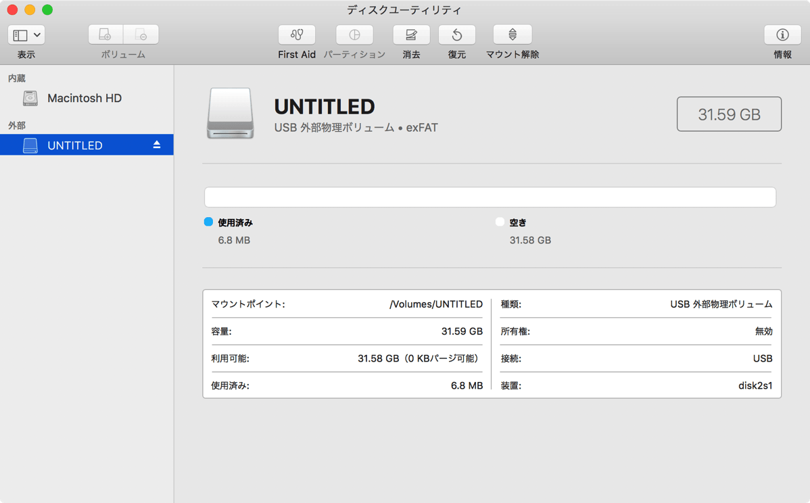
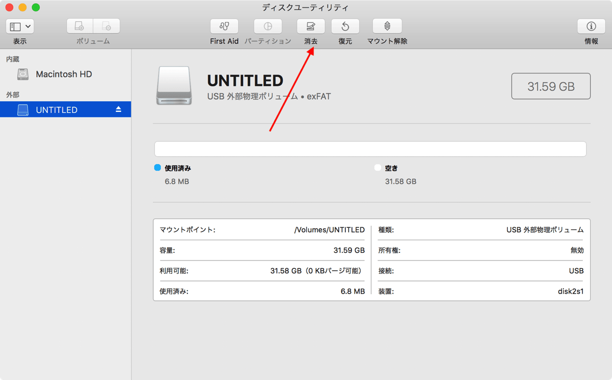

日本時間9月25日未明にmacOSの最新バージョンである、macOS High Sierraが公開されました。今回は主にクリーンインストールする方向けに、恒例のmacOS High Sierraのインストールディスクを作成する方法をご紹介します。macOS Sierraまでと同様の方法でインストールディスクを作成する事が可能です。

## macOS High Sierraの起動可能なインストーラーを作成する

あらかじめ、中身が消去されても問題のない16GB以上のUSBメモリを用意しておいてください。

### macOS High Sierraのインストーラーのダウンロード

Mac App Storeからダウンロード可能です。



「アプリケーション」フォルダーに、「macOS High Sierraインストール.app」がダウンロードされていればOKです。自動的にインストーラーが起動しますが、⌘（command）+Qでインストーラーを終了します。

### ディスクユーティリティでUSBメモリを初期化する

「アプリケーション」→「ユーティリティ」→「ディスクユーティリティ.app」を起動します。Macに接続したUSBメモリを選択して、「消去」をクリックします。

「名前」は「UNTITLED」、「フォーマット」は「macOS 拡張（ジャーナリング）」、「方式」は「GUIDパーティションマップ」を選択します（※画面は、「macOS High Sierra」で実行したものです。そのため、「方式」がありませんが、「macOS Sierra」以前のOSをご使用の場合はこちらを選択してください）。「名前」が重要です。控えておいてください。「消去」をクリックします。これで、USBメモリの中身はすべて消去されます。もし、ディスクの初期化に失敗する場合は、「方式」を「マスター・ブート・レコード」としてください。

続いて、「アプリケーション」→「ユーティリティ」→「ターミナル.app」を開きます。ターミナルで、以下のコマンドを実行します。

    diskutil list

出力内容は以下の通りです。「NAME」が「UNTITLED」（先ほど消去したボリュームの名前）が表示されていることを確認します。

    /dev/disk2 (external, physical):
       #:                       TYPE NAME                    SIZE       IDENTIFIER
       0:     FDisk_partition_scheme                        *31.6 GB    disk2
       1:                  Apple_HFS UNTITLED                31.6 GB    disk2s1

続いて、ターミナルで、以下のコマンドを実行します。

    sudo /Applications/Install\ macOS\ High\ Sierra.app/Contents/Resources/createinstallmedia --volume /Volumes/UNTITLED

#### macOS High Sierraのcreateinstallmediaコマンドについて

macOS Sierra以前のインストーラーから起動ディスクを作成するためには、createinstallmediaコマンドのオプションに「--applicationpath」オプションにインストーラーのパスを指定する必要がありましたが、macOS High Sierraからは同オプションは廃止されました。（指定しても無視されます）

自動的に起動可能なインストーラーの作成が始まります。

    Ready to start.
    To continue we need to erase the volume at /Volumes/UNTITLED.
    If you wish to continue type (Y) then press return: y
    Erasing Disk: 0%... 10%... 20%... 30%...100%...
    Copying installer files to disk...
    Copy complete.
    Making disk bootable...
    Copying boot files...
    Copy complete.
    Done.

このように表示されていれば、問題なく完了しています。

### macOS High Sierraのインストール

⌥（option）を押しながら再起動すると、作成したインストーラーから起動できるようになっています。インストーラーから起動した後は、メニューからインストールを選択して、macOS High Sierraのインストーラーを起動してください。
