**2021年10月10日時点の情報にもとづき、記事を更新しました。**

DNSプロキシを介して、不要な通信をブロックする「AdBlock」をご紹介します。



「AdBlock」は、Safariのコンテンツブロッカーとしても動作しますが、コンテンツブロッカーとしては、「280blocker」が優秀です。たとえば、「AdBlock」のみでは、ブロックした広告のスペース（空白）まで除去することはできません。



## AdBlockの広告ブロックの仕組み

AdBlockは、内蔵の「DNSプロキシ」を使用し広告をブロックします。AdBlockが用意した端末上の「DNSプロキシ」を経由することで、指定したドメインに対する名前解決を行わず、結果として通信を行わないようになっています。いったんすべての通信を「DNSプロキシ」を経由させるために、VPNプロファイルをインストールする必要があります。すべての通信を「DNSプロキシ」が設定されているVPN経由とすることで、不要なドメインに対する通信をブロックする仕組みです。そのため、常時VPN接続が必要です。必要なVPNプロファイルのセットアップは、AdBlockのアプリから行います。

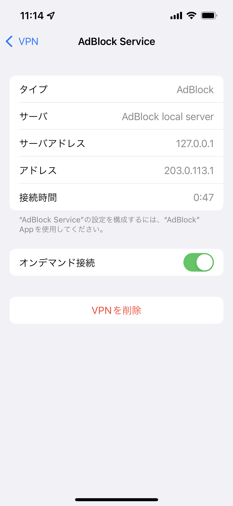

実際に、VPNプロファイルをセットアップした直後の状態は上記のようになっています。VPNの接続先は「127.0.0.1」、つまり自分自身（AdBlock）です。

## AdBlockのセットアップ

### AdBlockのインストール

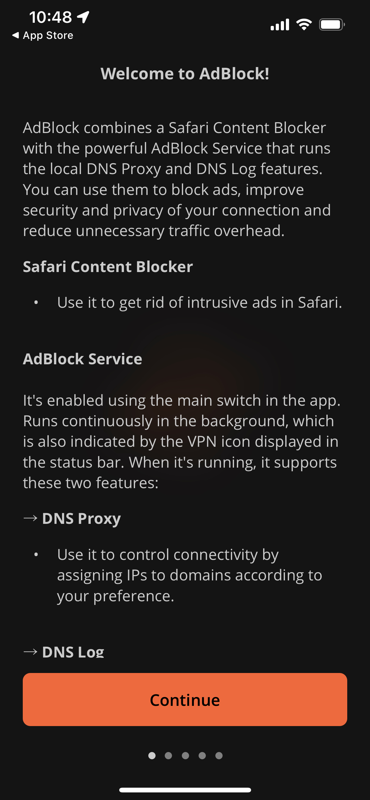

AdBlockをはじめて起動すると上図のような画面が表示されます。この状態ではまだ不必要な通信はブロックされていない状態です。「Continue」をタップして、チュートリアルを進めましょう。

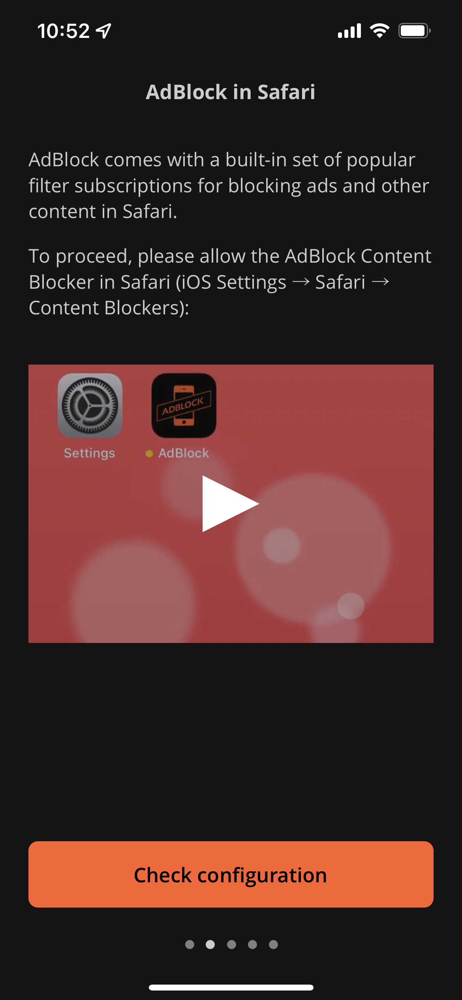

Safariのコンテンツブロッカーを設定するためのチュートリアルが表示されますが、コンテンツブロッカーとしては冒頭の「280blocker」が優秀であるため、ここではそのままスワイプしてスキップします。

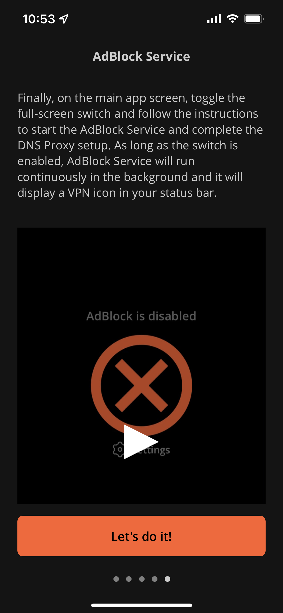

ここでチュートリアルは終了です。「Let's do it!」をタップして、「AdBlock」の設定を始めましょう。

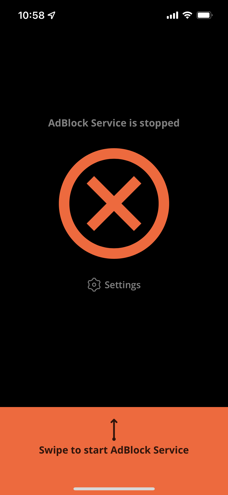

画面の指示に従い、画面を上にスワイプします。以後、AdBlockのオン、オフを切り替えるには、この画面で上下にスワイプします。

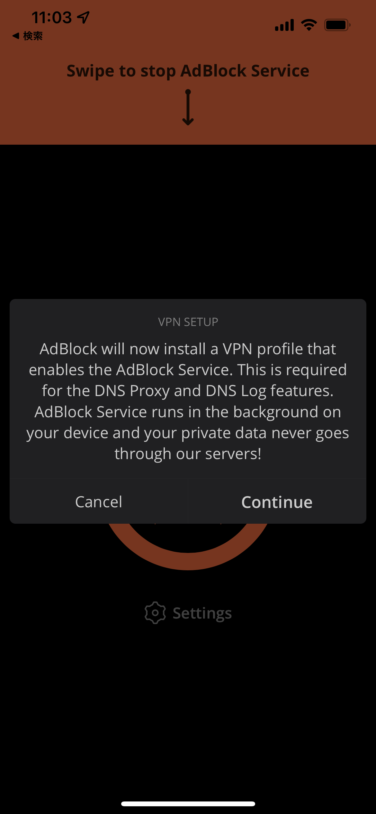

「DNSプロキシ」を使用するためにVPNプロファイルを追加します。

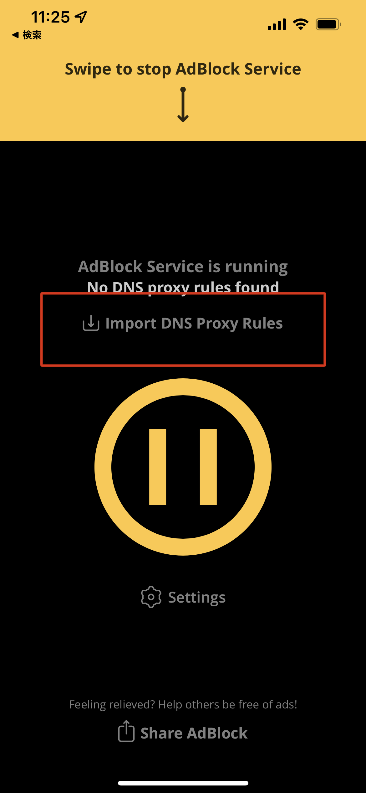

続いて、「DNSプロキシ」を通してブロックするドメインを追加します。冒頭の「280blocker」の公式ページで、AdBlock用のルールが配布されています。「Import DNS Proxy Rules」をタップしましょう。図中の赤枠部分です。

- <https://280blocker.net>

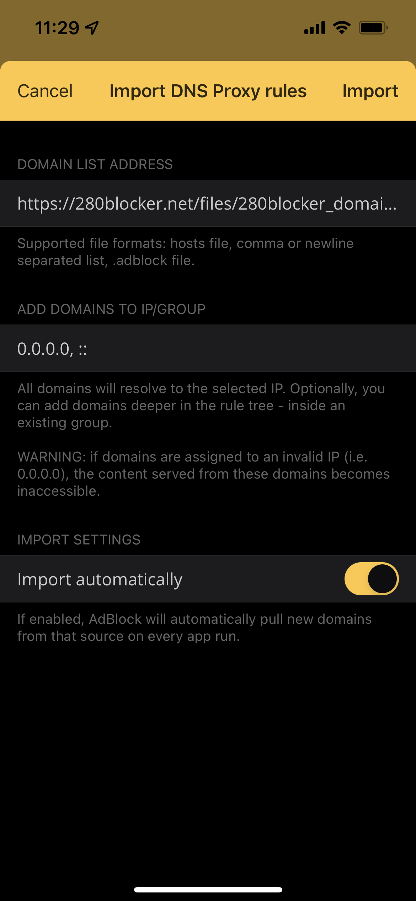

「DOMAIN LIST ADDRESS」に、以下を設定します。`YYYYMM` は現在の年月に置き換えてください。たとえば、2021年10月10日の場合、`202110` です。

- `https://280blocker.net/files/280blocker_domain_YYYYMM.txt`

また、合わせて「Import automatically」を「オン」にしておきます。上記のドメインルールに更新があった場合、自動的にルールを更新してくれます。

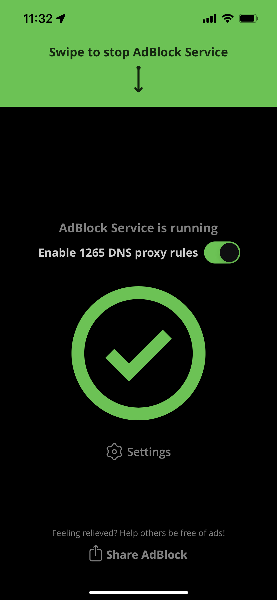

「Enable 1265 DNS Proxy rules」のように表示されれば、セットアップは完了です。なお、数値は追加した時点のルール数にもとづいているため、変動します。

以上で、AdBlockの設定は完了です。以前のバージョンよりも、格段にセットアップが簡単になり、ルールの更新も容易になり使いやすさが増しています。DNSプロキシによるブロックは、各アプリの再起動後です。依然として広告が表示される場合、そのアプリを再起動してみることをオススメします。

なお、AdBlockによる防御をすり抜ける広告を手動でブロックするルールを追加することもできます。そのためには、「DNS Log」を有効にして、該当のドメインを手動でルールに追加する必要があります。ただ、誤って必要な通信をブロックしてしまうと、通常の運用にも影響が出てしまうため、オススメはしません。

### AdBlockのアンインストール

AdBlockをアンインストールする間に、VPNプロファイルを削除します。「Settings」をタップします。

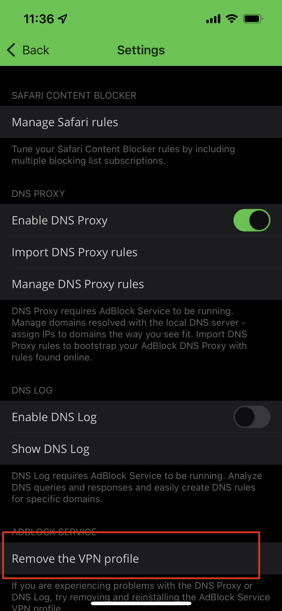

「Remove the VPN profile」をタップします。

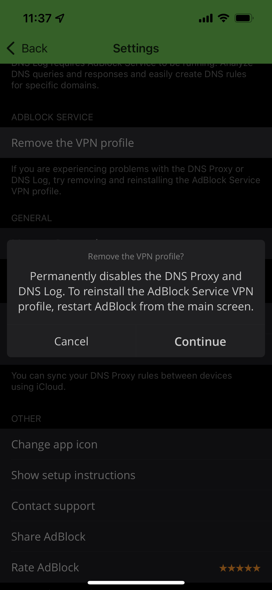

「Continue」をタップして、VPNプロファイルを削除します。あとは、AdBlockをiPhoneから削除すれば完了です。
