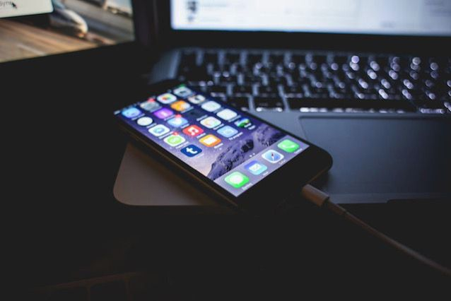
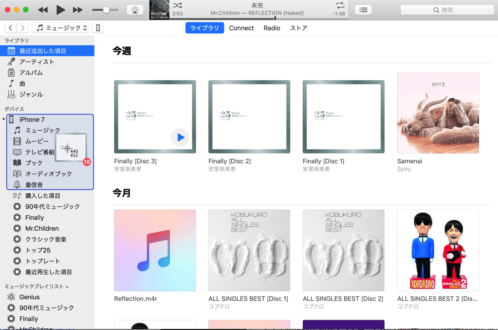
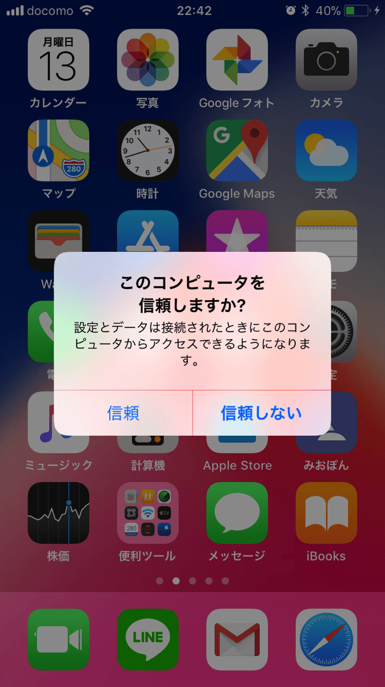
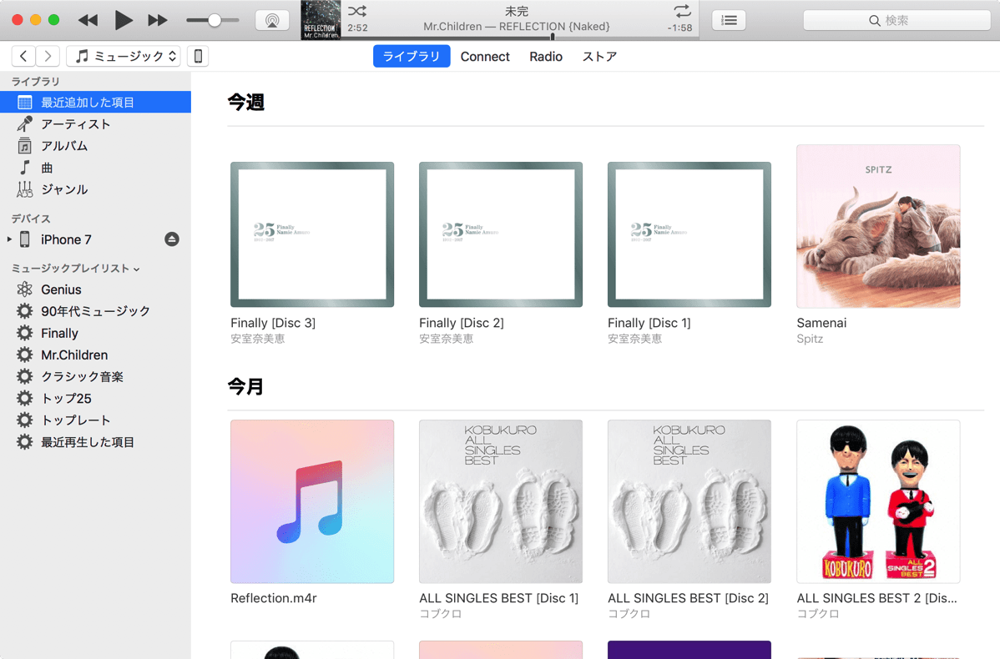
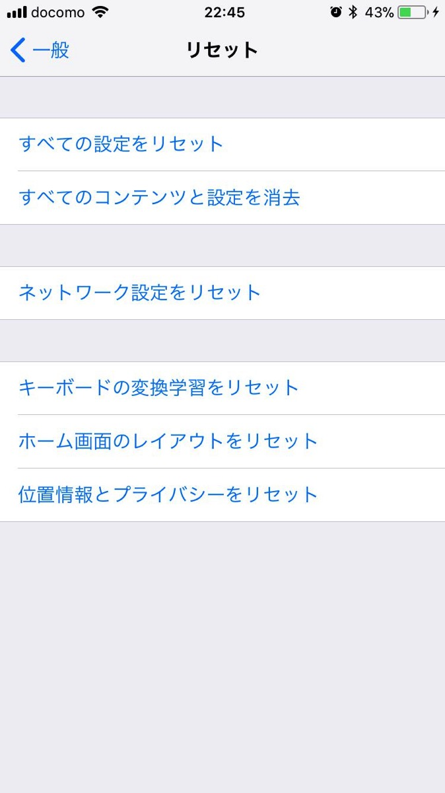

記事執筆時点のiTunesの最新バージョンは12.7ですが、今回は12.6.3での同期にまつわるトラブルシューティングをご紹介します。iTunes 12.7ではアプリケーションの管理ができなくなりましたが、今回ご紹介する手順はiTunes 12.7でも同様です。

iTunesでは、iTunesからiPhoneに対してコピーしたい楽曲やアプリケーションをドラッグ＆ドロップでコピーできます（アプリケーションは、iTunes 12.6まで）。普段からiTunesと同期してiPhoneを使用していれば違和感なく使用できるのですが、PCやMacを新調した場合に、今までできていた操作ができなくなったという方も多いのではないでしょうか。そこで、今回はiPhoneやMacを新調した場合に陥りがちなiTunesとiPhoneの同期に関するトラブルシューティングをご紹介します。

## iTunesからドラッグ＆ドロップで楽曲やアプリをコピーする

iTunesに取り込んだ楽曲やアプリをiPhoneにコピーする方法は簡単です。iPhoneにコピーしたい項目をサイドバーに表示されているデバイスにドラッグ＆ドロップするだけです。

たったこれだけなのですが、ここに行き着くまでにいくつかの壁があります。

### iTunesにiPhoneが表示されない

iTunesを起動してもiPhoneがiTunesに認識されない、表示されない場合に試したいトラブルシューティングです。iTunesを新規ダウンロードした、Macを新調した、iPhoneを機種変した、という場合、まずはUSB⇔Lightning経由でMacとiPhoneを接続してiTunesに認識させる必要があります。お手持ちのLightningケーブルを使用して、MacとiPhoneを接続しましょう。なお、MacBookやMacBook Pro（2016以降）など、USB Type-Cのポートのみ搭載しているMacの場合、別途USB Type-C、Type-A変換アダプターを経由する必要がありますのでご注意ください。

iTunesとiPhoneをはじめて接続する場合は、iTunesからiPhoneに対するアクセス権限の設定が必要です。上記のダイアログが表示された場合は、「続ける」ボタンをクリックします。

iTunesはiPhoneがロックされている状態の場合、読み書きすることができないため、iPhoneのロックを解除する必要があります。上記のダイアログが表示されたら、iPhoneのロックを解除しましょう。

iPhoneのロックを解除したら、上記のダイアログが表示されるため「信頼」をタップします。「信頼しない」をタップすると、そのMacと同期や項目をコピーする等の読み書きはできません。

信頼できるコンピューターの場合は、パスコードを入力します。他人のMacや共有PCのiTunesに接続する場合は、誤って同期してiPhoneの情報が読み書きされてしまうことを防止するためにこのような機能が設けられています。

このようにサイドバーにiPhoneが表示されれば、iTunesからiPhoneが認識されている証拠です。

### 誤って「信頼しない」をタップしてしまった

iTunesと同期したいにもかかわらず、うっかり「信頼しない」をタップしてしまうことがあります。一度、「信頼しない」をタップすると、そのiTunesからiPhoneを認識できなくなります。もう一度、ダイアログを表示させたい場合は、iPhone側で「設定」→「一般」→「位置情報とプライバシーをリセット」をタップします。iPhone側で、プライバシーに関わる設定（位置情報やカメラへのアクセスなど）を各アプリで設定していると思いますが、この情報もすべてリセットされてしまうため注意が必要です。

リセットの際に、iPhone側でパスコードの入力が求められるため入力します。リセットしたら、再度、iTunesとiPhoneを接続し「信頼」をタップしましょう。

### iTunesとiPhoneでWi-Fi経由で同期ができない

iTunesとiPhoneを一度認識させると、それ以降はUSB⇔Lightningケーブルを経由して接続する必要はなく、iTunesを起動しているMacやPCと同一Wi-Fiネットワーク上にiPhoneを接続すれば、Wi-Fi経由で同期できます。iTunesを起動しても、iPhoneが認識されない場合には、一度iPhoneのロックを解除しましょう。

もし、同一Wi-Fiネットワーク上にiPhoneとiTunesが存在するにもかかわらず、iTunes上にiPhoneが表示されない場合は、iTunesとiPhoneをUSB⇔Lightningケーブル経由で接続し、iTunesに表示されるiPhoneのアイコンをタップします。画面下部の「オプション」の「Wi-Fi経由でこのiPhoneと同期」をチェックし、「適用」ボタンをタップします。

### iTunesからドラッグ＆ドロップでiPhoneに楽曲をコピーできない

iTunesは、iPhoneの「母艦」と表記されることがあります。iTunesとiPhoneの同期とは、あくまで「iTunes」の項目に合わせて「iPhone」の内容を一致させる（「同期」と言います）ことであって、「iPhone」にある項目をiTunesにコピーすることはできません。つまり、iTunes→iPhoneは可能でも、iPhone→iTunesはできません。iTunesの項目に合わせて、iPhoneを同期させるのです。

デフォルトでは、すべての項目が自動的に同期しません（新しいiTunesや、他人のiTunesに接続した際に、誤って「同期」をクリックし、iPhoneの情報を上書きし空にしてしまうことを防ぐための措置）。そもそも、iTunes 12.7からアプリケーションに関する同期も削除されてしまったため、iTunesと同期する必要性自体がなくなってきたのかもしれませんが（もちろん、iPhoneを完全に（アカウント情報などパスワード等を含むプライバシーに関わる情報を含めて）バックアップするためには、今でもiTunesを使用する必要があります）。

今でもCDから取り込んだ楽曲をiPhoneに同期させる際に、iTunesで管理している方は多いのではないでしょうか。「iCloudミュージックライブラリ」と呼ばれる機能を使用すれば、iTunesで取り込んだ楽曲、iPhoneでダウンロードした楽曲に対して、場所を意識することなく、いつでもどこでもすべてのデバイス間で楽曲がクラウド上で（Appleのサーバ上で）同期されるため、iTunesの同期を意識する必要はありませ。そのため、iTunesにCDを取り込んだら、iCloudの同期が完了するとともに、すぐにiPhone側で同じ楽曲を聴くことができます。

しかし、「iCloudミュージックライブラリ」を使用するためには、「Apple Music」に加入する必要があります。もし、「Apple Music」に加入しない状態で同様のことをしたい場合には、「iTunes Match」と呼ばれる機能を使用することで実現できますが、年額3,980円の有償サービスに加入する必要があります。

「Apple Music」も「iTunes Match」も非常に便利な機能なのですが（10万曲までクラウド上で管理でき、何も意識することなく使用できるため、非常に優秀な機能です！）、そこまで楽曲が多くない、特定の音楽だけiPhoneで再生できれば良い、iPhoneの内蔵ストレージを節約したい、外出先でApple Music（iCloudミュージックライブラリ）のストリーミングによる4G（LTE）通信量を節約したい（事前にダウンロードしておけば通信しませんが）、という場合には、個別にiTunesからiPhoneに楽曲を取り込む必要があります。

このような場合、iTunesとiPhone間の楽曲の同期に関しては、iTunesの同期機能を使用する必要があるのですが、PCやMacを新調した際など、iTunesに楽曲が何も入っていない状態でiPhoneとうっかり同期してしまうと、前述の通りiTunes側の内容にiPhoneの状態が同期されてしまうため、iPhoneのミュージックライブラリが空になってしまいます（もちろん、事前に削除して良いかどうかのダイアログは表示されますが）。

このような事態を防ぐためには、ミュージック（楽曲）については、iTunesで手動管理しておくようにすれば良いでしょう。また、冒頭のドラッグ＆ドロップによる楽曲のコピーを有効にするためには、iTunes側でこの設定を有効にしておく必要があります（ようやく本題）。

iTunes上でiPhoneを認識させたら、iTunesでiPhoneのアイコンをタップし、「オプション」の項目の「音楽とビデオを手動で管理」をチェックしましょう。チェックしたら「適用」ボタンをクリックします。これで、iTunesからiPhoneに対してドラッグ＆ドロップで好きな楽曲をコピーすることができるようになります。iTunesとの同期を再度有効にするためには、このチェックボックスを外して、再度「適用」ボタンをクリックしてください。

## まとめ

簡単にまとめると以下になります。

-   iTunesにiPhoneを認識させる場合は、一度USBケーブル経由でMac（PC）をiPhoneと接続し「信頼」させる必要がある
-   「信頼しない」をタップした、もしくは誤って「信頼」をタップしたという場合は、iPhone側で「位置情報とプライバシーのリセット」
-   Wi-Fiネットワーク経由でiTunesとiPhoneを同期させるためには、iTunes側で「Wi-Fi経由でこのiPhoneと同期」をチェック後、「適用」
-   iPhoneで再生したい音楽が多い場合は、Apple Music（iCloudミュージックライブラリ）、もしくはiTunes Matchを使用すると、何も意識しなくてもMacでもiPhoneでも同じ音楽が聴ける（同じApple IDでサインインする必要有り）

Apple Music、もしくはiTunes Matchを使用しない場合は、iPhoneのミュージックライブラリを削除する事故を防止するために、iTunesからドラッグ＆ドロップで音楽をコピーするために、iTunes側で「音楽とビデオを手動で管理」をチェック後、「適用」

音楽とビデオの手動で管理は、もはやデフォルトにしてほしい、と思う今日この頃です。
