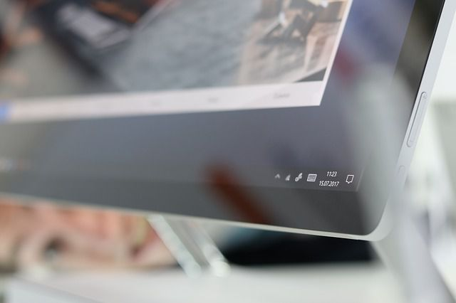
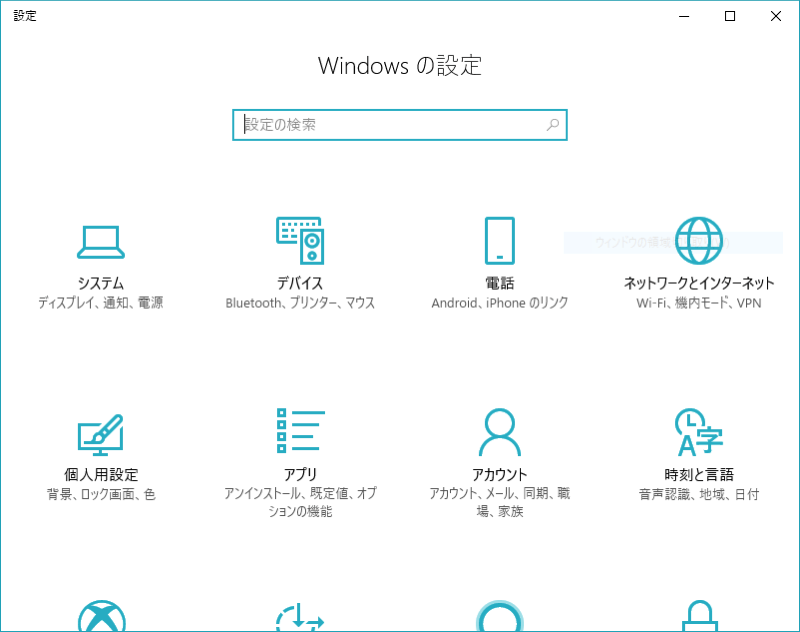
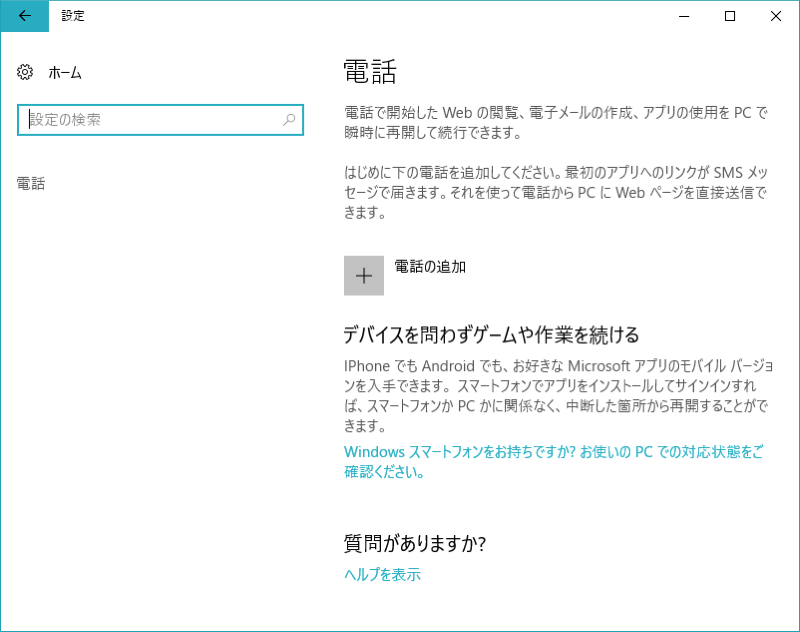
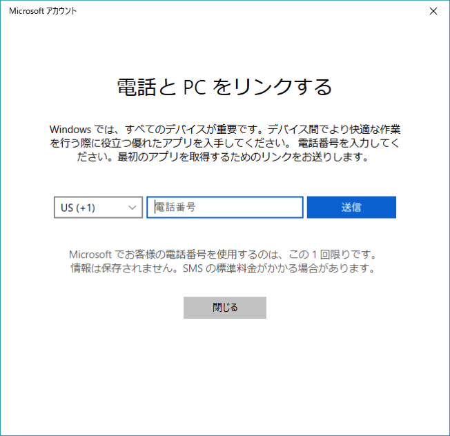
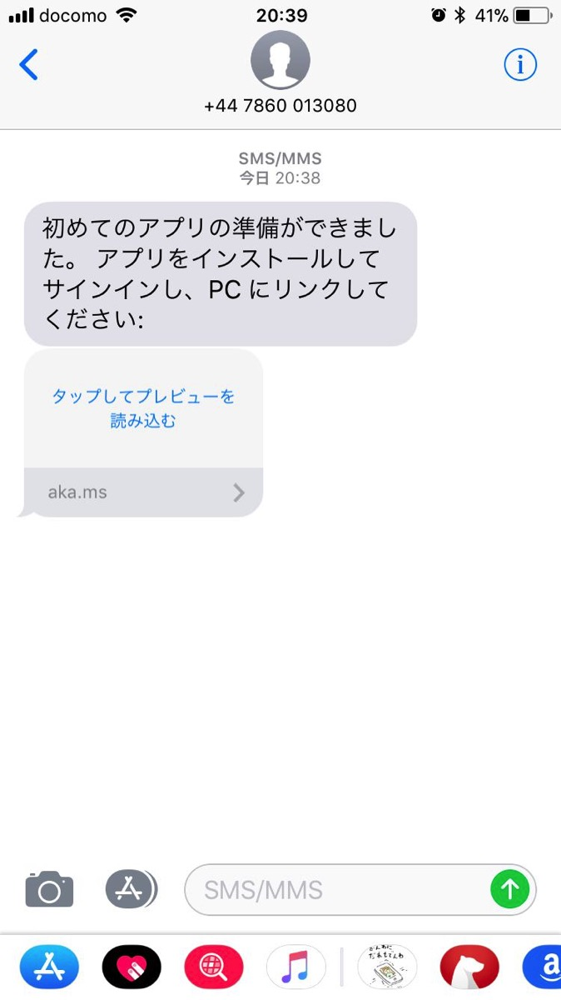
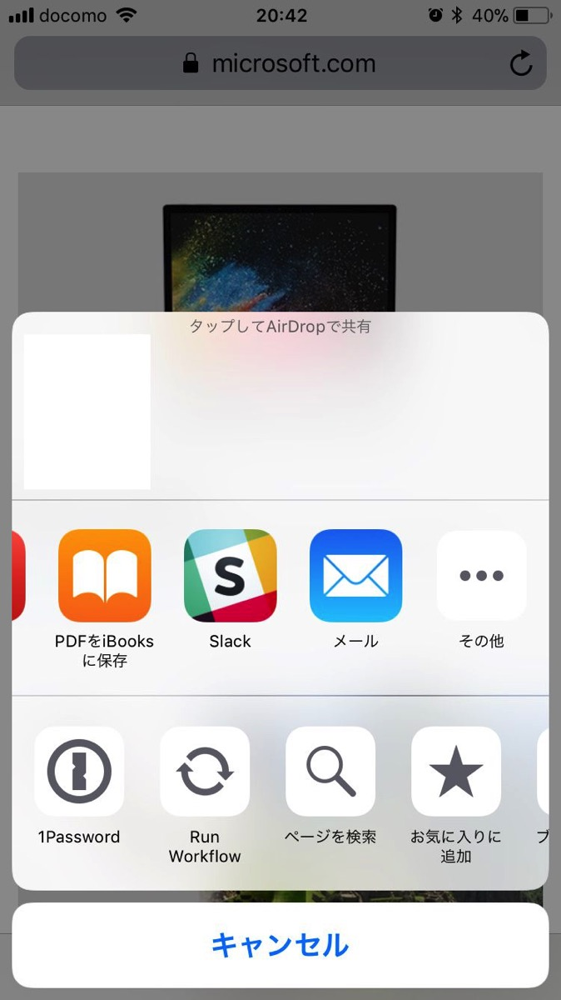
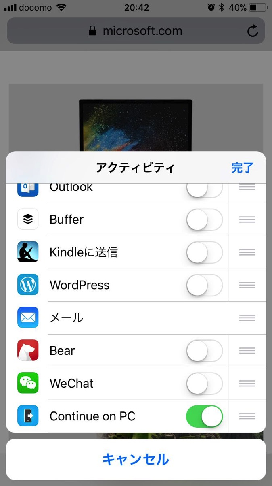
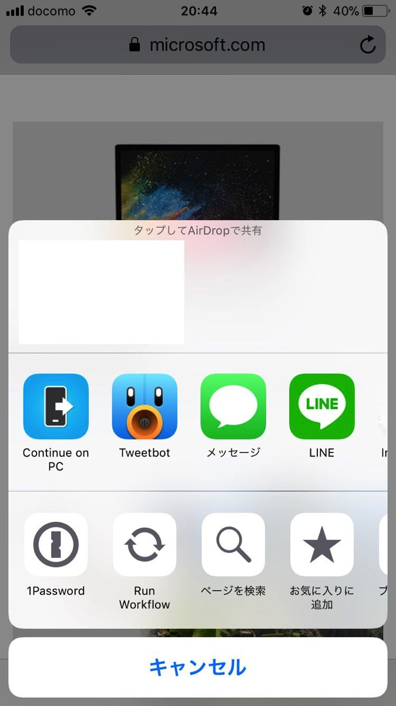
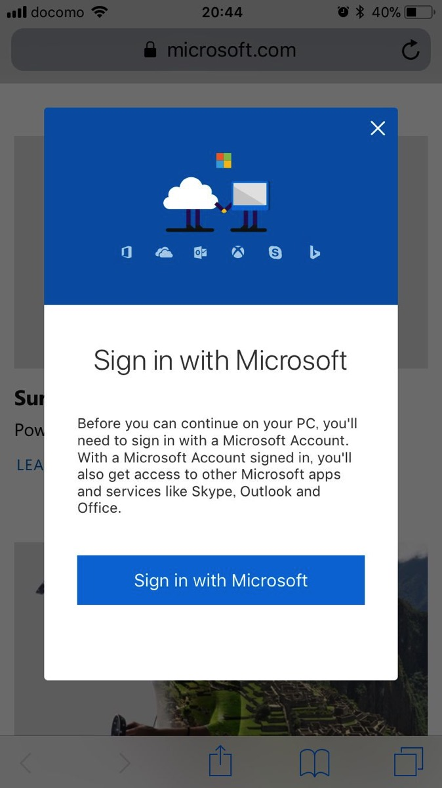
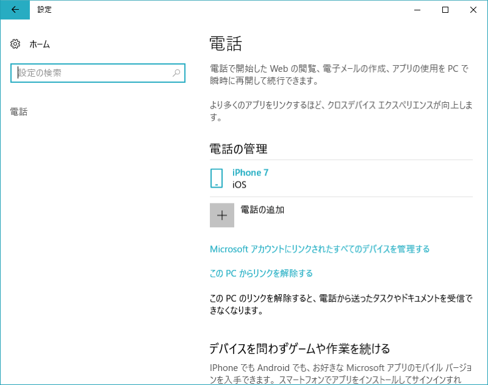

2017年10月17日（米国時間）に、Windows 10の大型アップデート（Windows 10 Fall Creators Update）の配信が開始されました。Microsoftの公式サイトからは、同アップデートを適用したISOファイルをダウンロードすることも可能です。同アップデートでは、従来β版であった「WSL（Windows Subsystem for Linux）」が正式版にアップデートされ、Windows StoreによるLinuxのディストリビューションの配布が始まるなど、数多くの新機能が含まれていますが、iPhone使いのユーザーにとって気になる機能は、「Continue on PC」です。

Microsoftは、手持ちのスマートフォンの作業をそのままPCに引き継ぐことができる機能を、これまで強調してきましたが、iPhoneやAndroidでも実現できるようになりました。ただし、この機能は一方通行であり、現在きiPhoneで共有可能なものはWebページのURLのみです。さらに、iPhoneやAndroidからWindows 10に同期することはできても、Windows 10からiPhoneやAndroidへ同期することはできません。そういう意味では「同期」ではありませんが。

「Continue on PC」の機能を使用することで、iPhoneのSafariで閲覧していたWebページのURL￥をWindows 10 Fall Creators Updateを搭載したPCに通知できるようになりました（「同期」ではなく「通知」といった方がしっくりくるかもしれません）。macOS、iOS間のAirDropやHandsOffの一方通行版と考えればわかりやすいかもしれません。Androidの場合も、ChromeからAndroidに送る機能が用意されていますが、これと同等（向きは逆）のことができます。

## iPhoneで閲覧していたWebページをWindows 10に引き継ぐ

事前にWindows 10にMicrosoftアカウントでサインインしている必要があります。また、冒頭のWindows 10 Fall Creators Updateが適用されていることが条件です。なお、米国（英語版）では、スマートフォンの通知をCortana経由でWindows 10と同期することが可能ですが、日本では本機能は提供されていません。

### Windows 10側の設定

では、順を追ってiPhoneとWindows 10を同期する方法をご紹介しましょう。Windows 10の設定を開きます（Fall Creators Updateにより、コントロールパネルの項目が淘汰され、大体の項目が「設定」に引き継がれています。将来的にコントロールパネルはなくなるのでしょうか）。

「電話」という項目が追加されていますので、こちらをクリックします。

「電話の追加」をクリックします。

iPhoneの電話番号（SMSを受信可能なiPhone）を入力して「送信」ボタンをクリックします。なお、デフォルトでは国名コードが「US」になっているため、日本の電話番号の場合は「JP (+81)」に変更しましょう。言語と地域の設定を引き継いで、デフォルトで「JP」と表示されてくれればわかりやすいのですが（これは将来的なアップデートで改善されるかもしれません）。

なお、ここで入力した電話番号がPCに保存されることはありません。また、SMS送信以外の目的で使用されることはありません（と記述されています）。なんと、たったこれだけの手順でWindows 10側の準備は完了です。Microsoftアカウントでサインインしていることを確認しておいてください。

### iPhone側の設定

Windows 10で「送信」ボタンをクリックすると、iPhoneにSMSが届きます（発信元は「パナマ（国名コード：44）」でした！）。なお、SMSが届かない場合は、お使いのキャリアによって海外からのSMSを受信拒否する設定になっているかもしれません。キャリアのサポートページにしたがって、一時的に海外からのSMS受信を許可してください。

メッセージに届いたリンクをタップすると、App Storeに遷移します。なお、「AdBlock」等の広告ブロックアプリを導入している場合、リンクをタップしても正常にApp Storeに遷移しないことがあります。この場合は、下記のリンクからApp Storeを開いてください。



App Storeが開きますので、「Continue on PC」をダウンロードしてください。「Continue on PC」は単独では使用できません。App Extension（拡張機能）となっていますので、iOS標準の共有機能から「Continue on PC」を有効化する必要があります。

Safariを開いて、「共有」アイコンをタップします。デフォルトではインストールしたアプリは表示されていませんので、画面を左にスワイプして、「その他」をタップします。

「Continue on PC」のチェックボックスをオンにしてください。なお、表示するアイコンの順番は任意に変更できます。右端をホールドすることで、アイコンを上下に移動させることができますので、任意の位置に移動してください。よく使用する場合には、初めの方に移動しておくと便利です（iPhone 7の場合、共有メニューに最初に表示されるアプリの愛イコンは4つです）。

続いて、共有メニューから「Continue on PC」をタップします。

はじめてタップした場合は、Microsoftアカウントによるサインインを求められます。お手持ちのMicrosoftアカウントでサインインしましょう。その際に、Windows 10にサインインしているMicrosoftアカウントを使用してサインインしてください。

アクティブなWindows 10を検知すると、コンピューター名の一覧が表示されます。ここに、同一のMicrosoftアカウントでサインインしているPCの一覧が表示されますので共有したいPCをタップします（なお、「Continue later」をタップすると、すべてのPCのアクションセンター（Macの通知センター）に表示されます）。以上で、iPhone側の設定は完了です。

### Windows 10で動作を確認する

iPhoneの「Continue on PC」から、たとえばSafariで閲覧していたWebページを共有すると、Windows 10で設定されている既定ブラウザ（デフォルトの状態では「Microsoft Edge」）でそのURLが開きます！

なお、リンクされている電話は、「設定」→「電話」から確認できます。

## まとめ

Safari（ブラウザ）だけでは、まだまだ物足りない感は否めませんが、将来的にiPhone、Windows間でも、macOS、iOSのようなAirDropやHandsOffの機能が実現されることに期待です。
