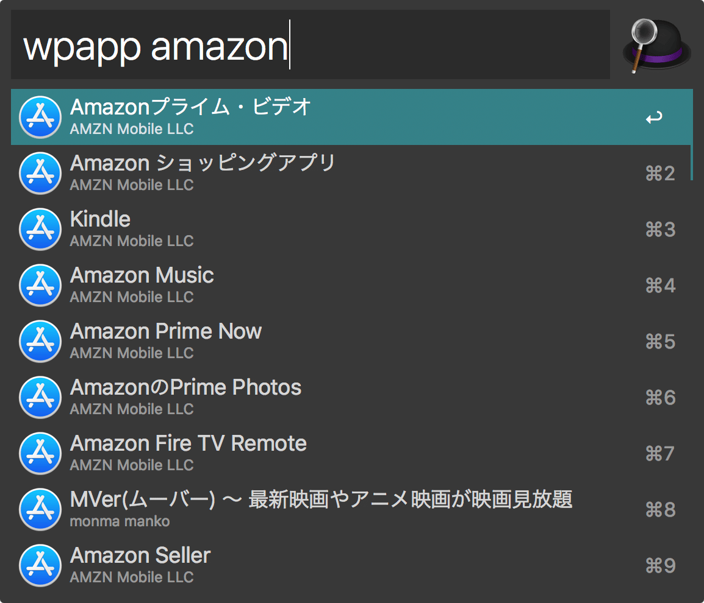
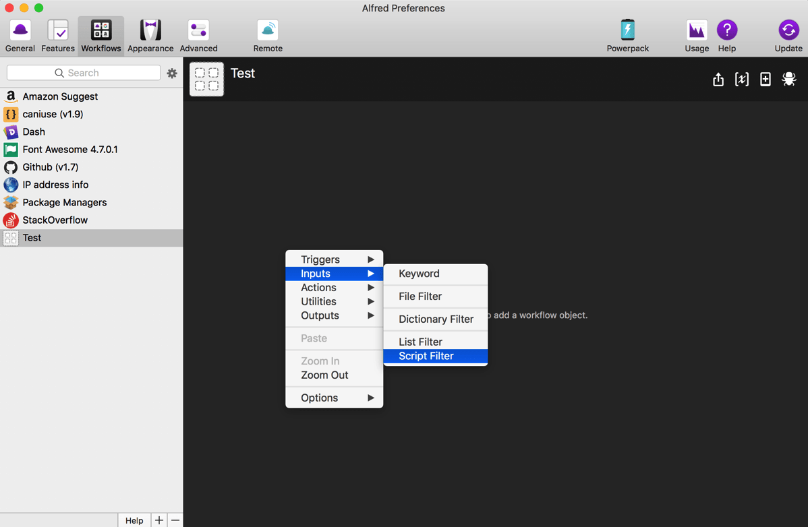
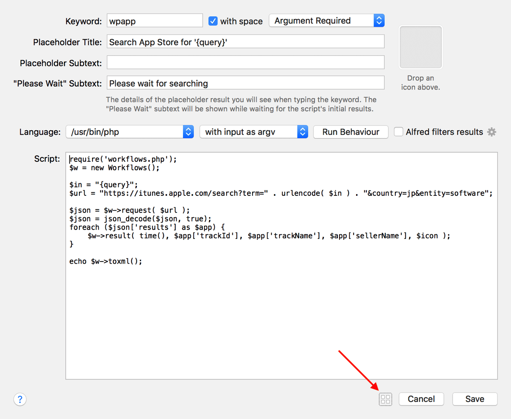
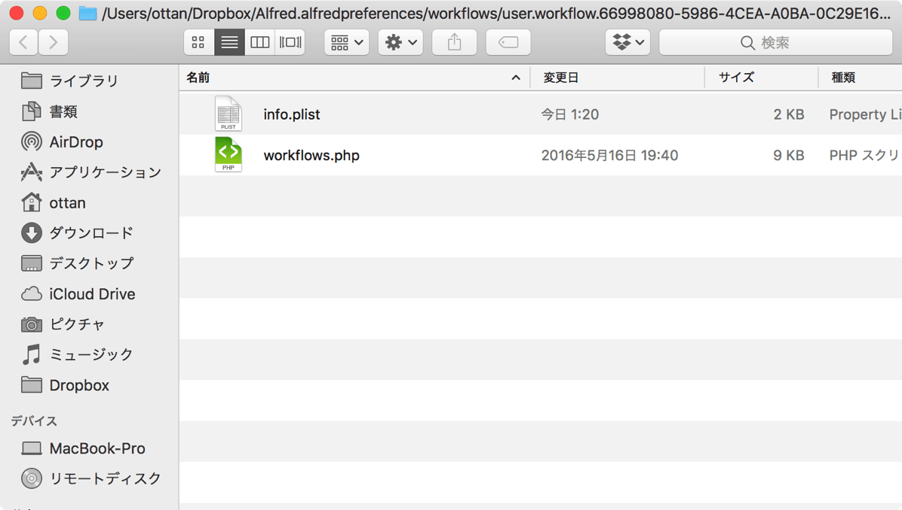
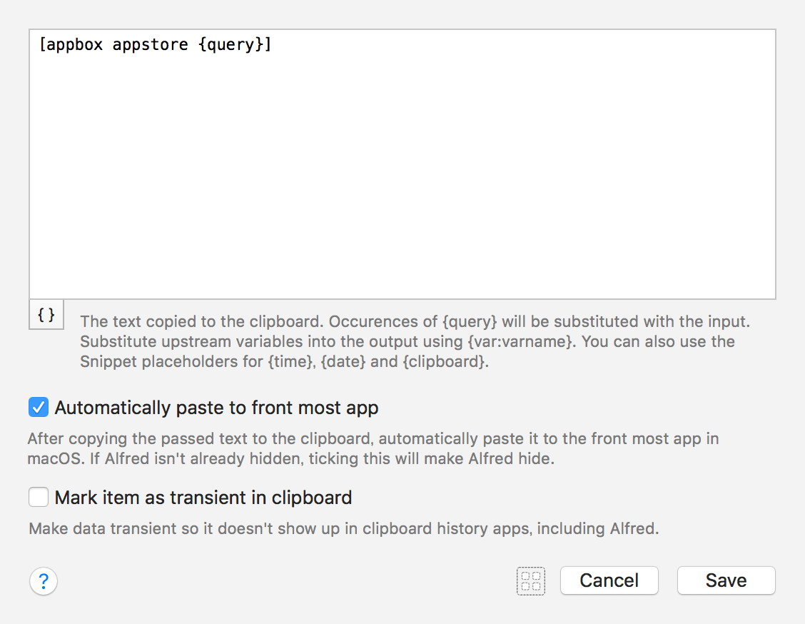
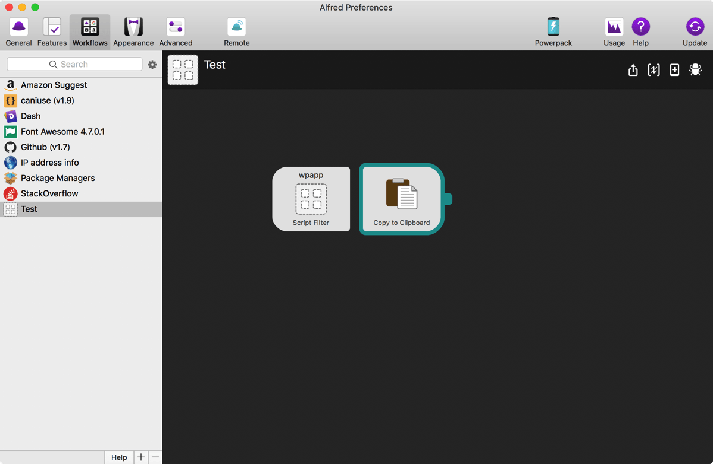
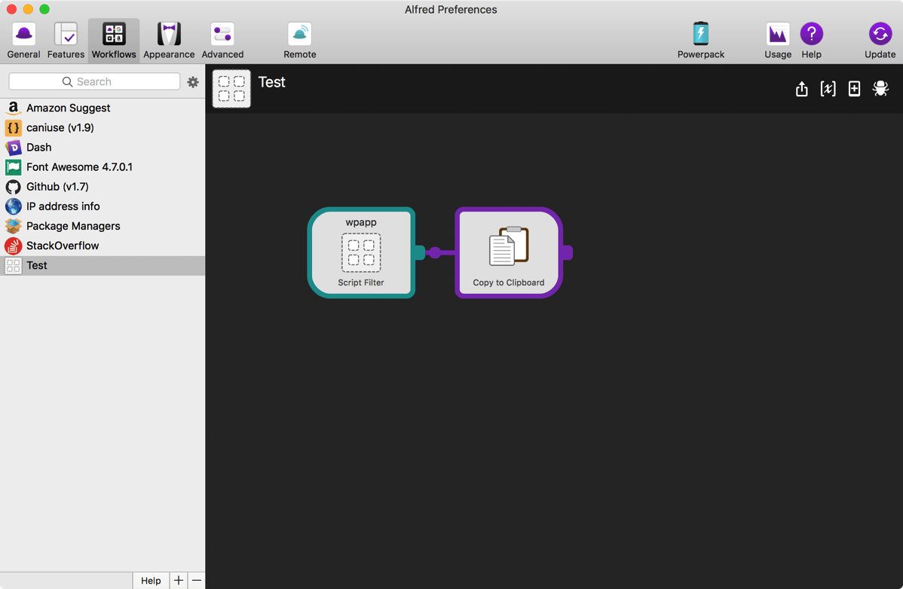
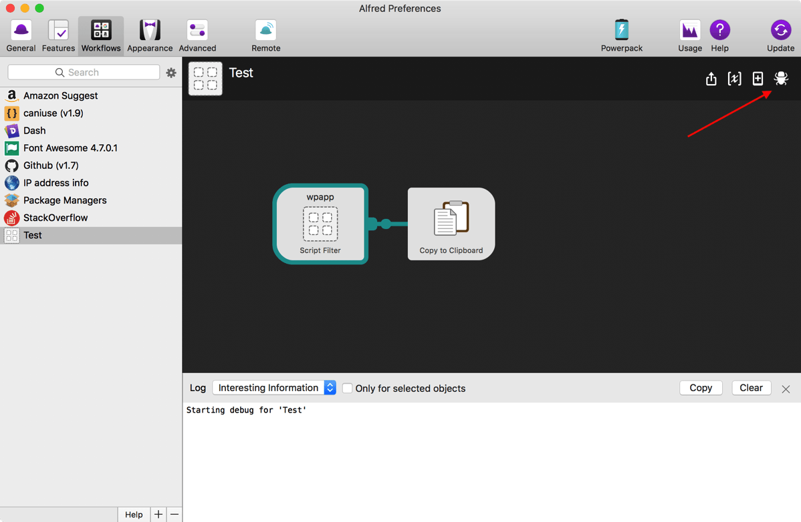

弊サイトは、WordPressで構築されており、ブログの更新はMacの老舗ブログエディターである[MarsEdit](https://www.red-sweater.com/marsedit/)を使用しています。WordPressの管理画面をブラウザから開く必要がなくなり、MarsEdit単独ですべてが解決しているので、ブログ公開時から愛用している手放せないアプリケーションです。

WordPressでは、さまざまなプラグインが公開されており、弊サイトでもいくつかのプラグインを使用していますが、便利なプラグインの1つに[WP-Appbox](https://ja.wordpress.org/plugins/wp-appbox/)があります。これは、ブログの本文にショートコードを埋め込むことで、App Storeで公開されているアプリケーションを紹介できる便利なプラグインです。「WP-Appbox」を使用して埋め込むショートコードは以下のようなものです。

    [[appbox appstore 777564327]]

ここで指定されている「777564327」は、App Storeで公開されているアプリケーションを一意に識別するためのIDです。たとえば、上記は「Amazonプライム・ビデオ」のIDになります。WordPressの管理画面（ダッシュボード）から登録すれば、App Storeを検索した上で自動的にこのIDを埋め込んでくれます。しかし、MarsEditでブログを更新したい場合には、IDを検索した上で、手動で埋め込む必要があります。

たとえば上記の「Amazonプライム・ビデオ」を紹介した場合は、以下の手順になります。

1. Google検索で「site:itunes.apple.com Amazon」のようにサイト内検索を使用してアプリケーション名を指定して検索する
2. ヒットした検索結果からURLの「id」以降の数値をコピーして貼り付ける

ただ、紹介したいアプリケーションの数が増えてくるとだんだん面倒くさくなってきました。


そこで、Macのランチャーアプリである[Alfred](https://www.alfredapp.com/)の「Workflow」を使用して、ショートコードを貼り付ける作業を自動化してみました。後学のために、Alfred 3でWorkflowを自作する手順を残しておきたいと思います。なお、AlfredでWorkflowを使用する場合は、Power Packライセンス（有償）が必要になります。また、Mac App Storeで公開されているAlfredではなく、前述のWebサイトからダウンロードしたアプリケーションを使用してください。



AlfredでApp Storeを指定したキーワードで検索し、検索した結果をWP-Appboxのショートコードに整形してペーストするという単純なものです。なお、完成版は、[ottanxyz/alfred-workflow](https://github.com/ottanxyz/alfred-workflow)にアップロードしておきましたので、興味のある方はご自由にお使いください。改変等自由ですが、Alfredのライセンスの規約の範囲内でお使いください。

### App Storeから検索するWorkflowを自作する

App Storeには、開発者向けのREST APIが用意されています。詳細は、[iTunes Search API JP – Affiliate Resources](https://affiliate.itunes.apple.com/resources/documentation/itunes-store-web-service-search-api/)で説明されています。検索結果はJSON形式で返却されるため、JSONデータを加工してAlfredに出力します。

#### AlfredでWorkflowを新規作成する

Alfredの環境設定を開きます。「Workflows」タブをクリックします。


左下の「+」アイコンをクリックし、「Blank Workflow」をクリックします。


「Name」は、Worflowの名称を入力します。任意の名称を入力してください。その他の欄は空白のままで構いません。



何もないWorkflow（今回は「Test」という名称のWorkflow）が作成されますので、右側のスペースで右クリックし、「Inputs」→「Script Filter」を選択します。



「Script Filter」は、Alfredのランチャーを起動して任意のキーワードを入力した際にスクリプトを実行するためのWorkflowのオブジェクトです。「bash」「Python」等、さまざまな言語に対応していますが、今回は「PHP」を選択します（プログラミングに慣れている方は、任意の言語を選択しても構いません）。項目については下記のように入力します（デフォルトの箇所は省略します）。

| 項目                  | 値                             | 説明                                                                                                                   |
| --------------------- | ------------------------------ | ---------------------------------------------------------------------------------------------------------------------- |
| Keyword               | wpapp                          | AlfredからWorkflowを呼び出すためのキーワード。他のWorkflowと被らないように注意                                         |
| Placeholder Title     | Search App Store for '{query}' | 「Keyword」を入力した際にAlfredに表示させる名称（'{query}'には、ユーザーが入力した任意の検索キーワードが表示されます） |
| "Please Wait" Subtext | Please wait for searching      | スクリプトの実行完了を待つ間にAlfredに表示させる文字列（省略可）                                                       |
| Language              | /usr/bin/php                   | 実行するスクリプトの言語                                                                                               |
| Script                | 下記参照                       | 実際に実行するスクリプト                                                                                               |

「Script」には以下の内容を入力します。詳細については、後述します。

```php
require('workflows.php');
$w = new Workflows();

$in = "{query}";
$url = "https://itunes.apple.com/search?term=" . urlencode( $in ) . "&country=jp&entity=software";

$json = $w->request( $url );
$json = json_decode($json, true);
foreach ($json['results'] as $app) {
	$w->result( time(), $app['trackId'], $app['trackName'], $app['sellerName'], $icon );
}

echo $w->toxml();
```

PHPの1行目で「workflows.php」という別ファイルを参照していますが、Alfred 3ではWorkflow作成時に自動生成されなくなりました。AlfredのWorkflowを利用する上で便利なユーティリティなので使用できるようにしておきます。[GitHub - jdfwarrior/Workflows: Alfred Workflows Utility Class](https://github.com/jdfwarrior/Workflows)から最新版の「workflows.php」をダウンロードしてください。



ダウンロードしたら、「Cancel」ボタンの左のアイコンをクリックし、Workflowが保存されているフォルダーを開き、「workflows.php」を保存してください。最後に「Save」ボタンをクリックし、内容を保存します。


引き続き右側のスペースで、右クリックし、「Outputs」→「Copy to Clipboard」をクリックします。



以下の内容を入力します（WP-Appboxのショートコードの形式にしたがって入力します）。また、その際に「Automatically paste to front most app」をチェックしておきます。チェックしておくことにより、クリップボードに結果をコピーするとともに、現在アクティブなウインドウにその結果を貼り付けることができます。そのため、ブログをテキストエディター等で更新している最中に、Alfredでアプリケーションを検索し、その結果をそのままペーストできるようになります。

    [[appbox appstore {query}]]

「Save」ボタンをクリックします。



続いて、「Script Filter」の結果をクリップボードへコピーするアクションに引き継げるように両者のオブジェクトを線で結びます。「Script Filter」から「Copy to Clipboard」へドラッグ＆ドロップするようにすると線を結ぶことができます。「Script Filter」で実行した結果を、「Copy to Clipboard」の引数（{query}）として渡すことができます。



このように線で結ばれていればOKです。実際にAlfredを起動し、キーワード（今回の場合は「WP-Appbox」）を入力し、任意の検索キーワードを指定した後、アプリ一覧がAlfredに表示されることを確かめます。さらにその結果がクリップボードにコピーされることを確かめてみてください。

#### 「workflows.php」について

簡単に「Script」の内容について触れておきます。まず、「{query}」は、Alfredで「Keyword」の後に入力した任意の検索キーワード、すなわち引数を指す、Alfredの予約された単語です。これで任意の単語を受け取ることができます。

```php
$json = $w->request( $url );
```

`request( $url )`は、パラメーターとして指定したURLに対してその結果を取得するメソッドです。前述の「workflows.php」に実装されているユーティリティの1つです。URLを指定するだけで、結果を取得してくれる非常に便利なメソッドです。

```php
$w->result( time(), $app['trackId'], $app['trackName'], $app['sellerName'], $icon );
```

`result( $uid, $arg, $title, $sub, $icon, $valid='yes', $auto=null, $type=null )`も同様のユーティリティです。このメソッドで入力した内容がAlfred上の検索結果として表示されるようになります。

`$uid`には、必ず一意となる識別子を入力します。一意になれば何でも良いので、ここではUNIXタイムスタンプを返却する関数としてお馴染みの`time()`関数を使用しています。

`$arg`が、実行結果として次のアクション（今回の場合は、「Copy to Clipboard」）に引き渡すための値となります。App Storeで公開されているアプリケーションのIDを指定しています。

`$title`は、Alfred上に検索結果として表示される名称です。今回はわかりやすくアプリケーションの名前を取得して表示するようにしました。

`$sub`は、`$title`の補足情報としてAlfredに表示する情報です。とくに指定する必要はないのですが、今回はデベロッパーの情報を表示するようにしました。

最後に、唐突に登場する`$icon`というパラメーターについてです。`$icon`という引数を指定することで、「Script Filter」に指定したアイコンをそのままAlfredの検索結果に表示させることができます。残り2つの引数についてはデフォルトのままで良いでしょう。引数が多いため表形式でまとめておきます。

| 引数   | 説明                                                                                                                                     |
| ------ | ---------------------------------------------------------------------------------------------------------------------------------------- |
| $uid   | 一意の値を指定する。`time()`関数等を使用すると良い                                                                                       |
| $arg   | 次のアクションに引き渡すための値を指定する。最重要パラメーター                                                                           |
| $title | Alfred上に表示させる名称。任意の名称を指定することが可能                                                                                 |
| $sub   | Alfred上に`$title`の補足情報として表示させる内容を指定する。省略可                                                                       |
| $icon  | Alfred上にビジュアル的なアイコンを表示させたい場合に指定する。「Script Filter」のアイコンをそのまま表示させたい場合は、`$icon`と指定する |

最後に`toxml()`メソッドですが、これは`result()`メソッドで格納した値をAlfredに表示させるための形式的な型変換です。Alfredに表示させるため内部で結果を整形しています。最後に必ず入力します。

```php
$w->toxml();
```

### Workflowでエラーが発生した場合の対処法

プログラムにはバグがつきものです。もし、作成したWorkflowが正常に動作しない場合はデバッグを行いましょう。Alfred 3ではデバッグ機能が強化されています。Workflowの編集画面の右上の「虫（bug）」アイコンをタップするとデバッグモードになり、Alfredで実行した結果が表示されます。



`var_dump()`関数や`print_r`関数等を利用して、途中結果を出力させることも可能です。また、PHPの実行エラーを検出することも可能となっているため、Workflowが正しく動作しない場合には試してみてください。

## まとめ

今回は、Alfredを使用して、WordPress（というより、ブログエディター）の更新をより便利にする一例をご紹介しました。AlfredのWorkflowは有志によってGitHubや公式フォーラムをはじめとして、さまざまな場所で公開されています。ぜひ、AlfredのWorkflowを活用して生産性を上げていきましょう！
