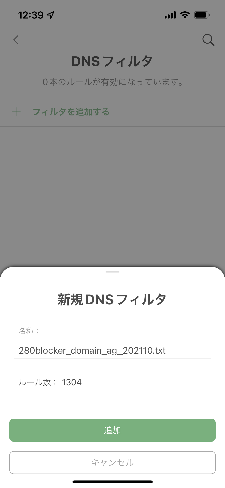

{}
2021年10月10日時点の情報にもとづき、記事を更新しました。
{}

「AdBlock」と肩を並べてApp Storeでも人気を誇る「AdGuard Pro」をご紹介します。なお、App Storeには「AdGuard」という名称のアプリも存在しますが、こちらはSafariのコンテンツブロッカーです。そのため、広告をブロックできるのはSafariに限られますので、ご注意ください。



「AdGuard Pro」は、Safariのコンテンツブロッカーとしても動作しますが、コンテンツブロッカーとしては、「280blocker」が優秀です。たとえば、「AdGuard Pro」のみでは、ブロックした広告のスペース（空白）まで除去することはできません。



## 「AdGuard Pro」の広告ブロックの仕組み

AdGuard Proは、AdGuardが用意したDNSや、その他のパブリックDNSを介して通信することで、広告を含む不要な通信ブロックします。いったんすべての通信を「AdGuard DNS」を経由させるために、VPNプロファイルをインストールする必要があります。すべての通信を「AdGuard DNS」が設定されているVPN経由とすることで、不要なドメインに対する通信をブロックする仕組みです。そのため、常時VPN接続が必要です。必要なVPNプロファイルのセットアップは、AdGuard Proのアプリから行います。

## AdGuard Proのセットアップ

ここでは、AdGuardの用意したDNS（フィルター）は経由せず、280blocker提供のフィルターを使用するための手順をご紹介します。以前のバージョンと比べて非常にわかりづらいです。

### AdGuard Proのインストール

チュートリアルが表示されます。画面の指示に従い、「次へ」をタップしてチュートリアルを最後までスキップします。また、インストール直後の時点では何もブロックされていません。

Safariのコンテンツブロッカーとして使用するための方法が表示されますが、今回はコンテンツブロッカーとしては使用しないため、画面を閉じます。

画面下部のメニューより、歯車アイコンをタップし、「設定」画面を開きます。「一般設定」をタップします。

「高度な設定モード」をオンにします。この時点でわかりづらいです。

画面下部のメニューより、「AdGuard」のアイコンをタップします。「DNS通信を保護」をオンにします。

VPNプロファイルを作成します。「OK」をタップして、VPNプロファイルを追加してください。

「AdGuard Pro」により生成されるVPNプロファイルです。

再びこの画面に戻ります。「赤枠」あたりをタップすると、「DNS通信を保護」の詳細設定画面に遷移します。チェックボックスのオン、オフができるように見せて、実はメニューの一部になっています。どうしてこうなった。

ここの画面に行き着くまでに途方に暮れた方も数多くいらっしゃるのではないか、というくらい直感に反する画面遷移です。引き続き、「DNSフィルターリング」をタップします。

「DNSフィルター」をタップします。

「フィルターを追加する」をタップします。

冒頭の「280blocker」の公式ページで、AdGuard用のルールが配布されています。

- <https://280blocker.net>

「フィルターのURL」へ、以下を設定します。`YYYYMM` は現在の年月に置き換えてください。たとえば、2021年10月10日の場合、`202110` です。「AdBlock」のルールとは形式が異なるため、設定するルールのURLに注意してください。

- `https://280blocker.net/files/280blocker_domain_ag_YYYYMM.txt`

フィルターの更新があった際は、自動的にAdGuard Proが更新してくれます。以上で、AdGuard Proのセットアップは完了です。

### AdGuard Proのアンインストール

「設定」画面で「詳細設定」をタップします。なお、「詳細設定」は、「高度な設定モード」をオンにしないと表示されません。

「VPNプロファイルを削除する」をタップします。VPNプロファイルを削除したら、iPhoneからAdGuard Proを削除しましょう。
