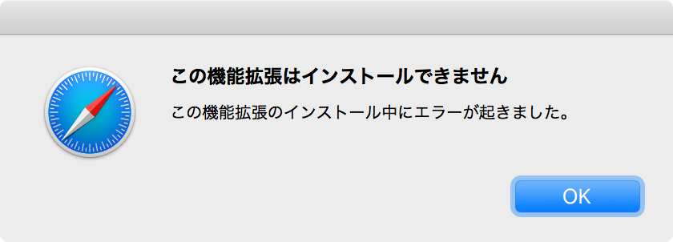
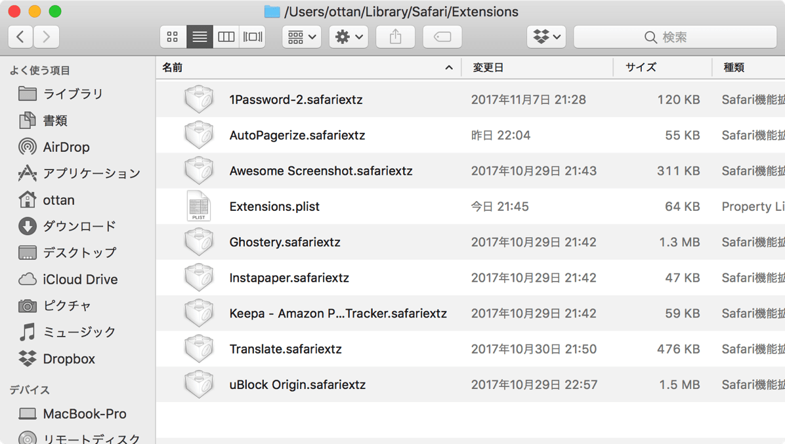
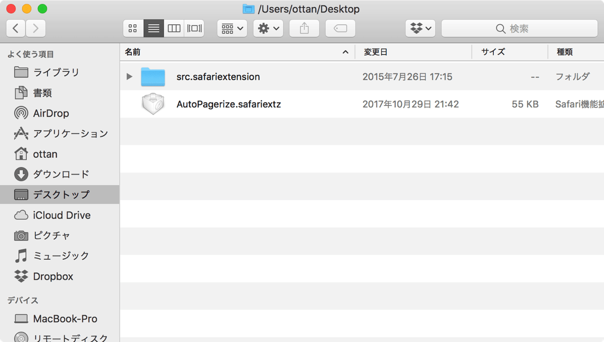
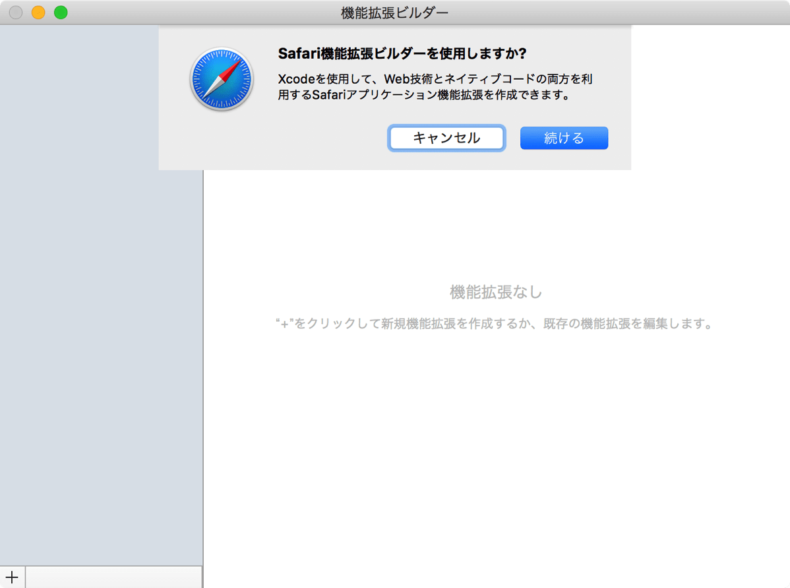
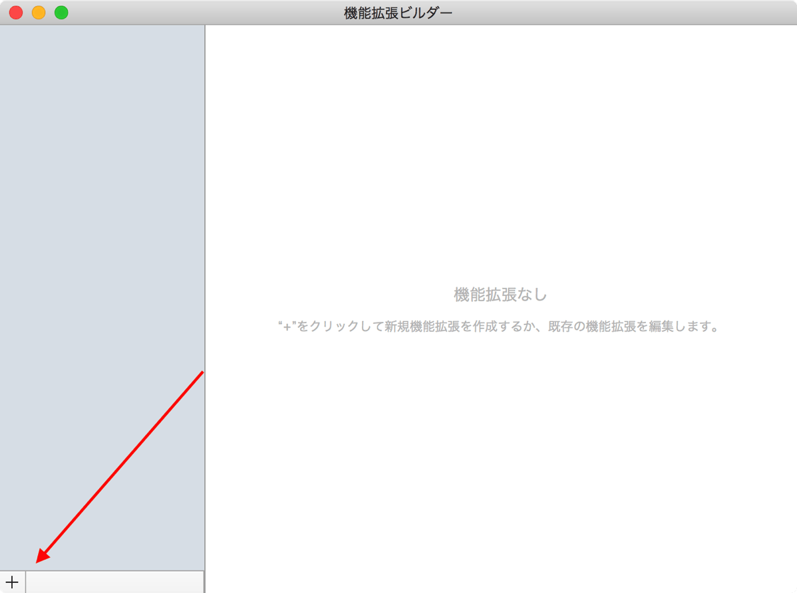
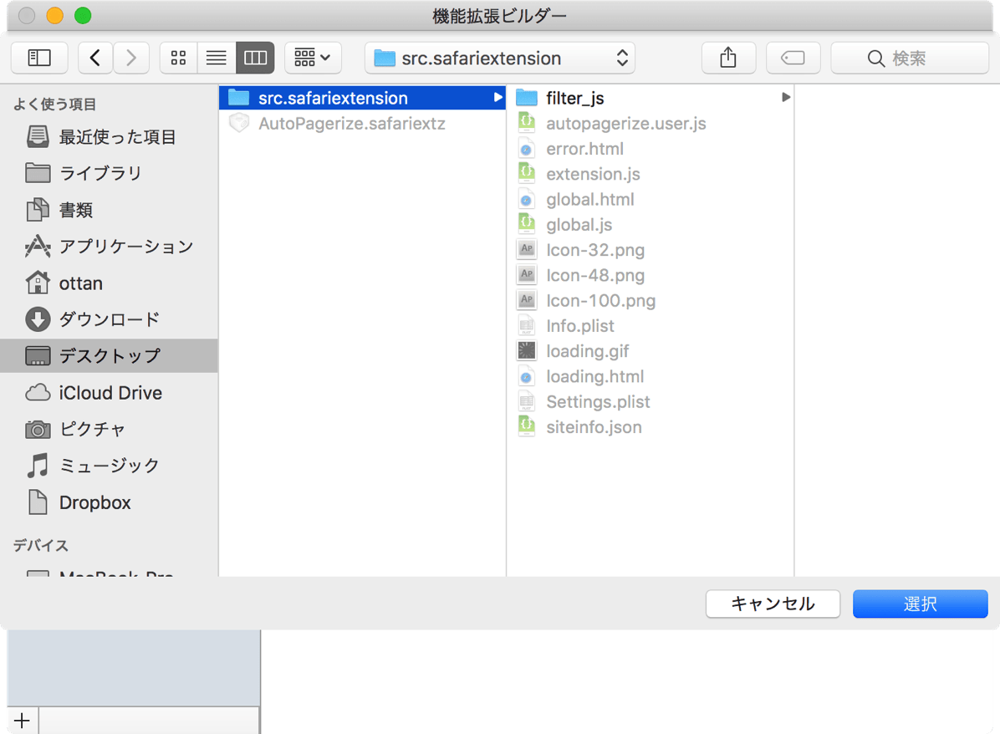
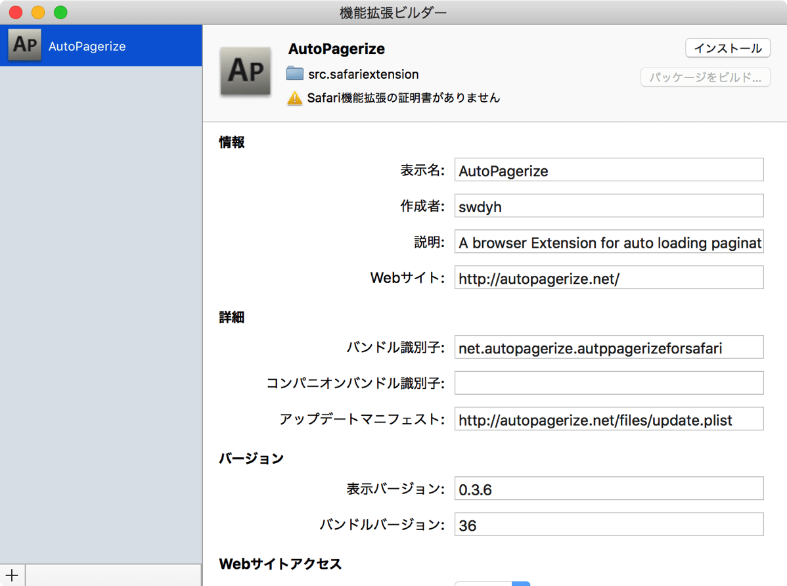
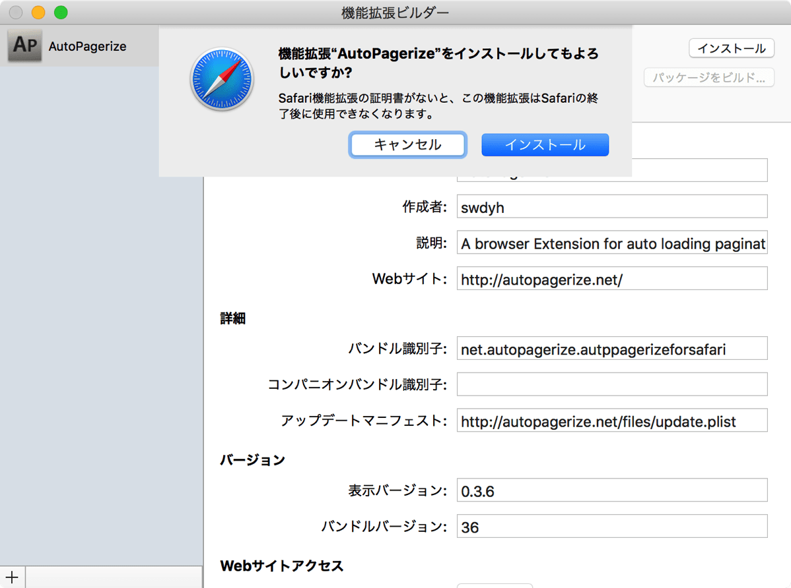
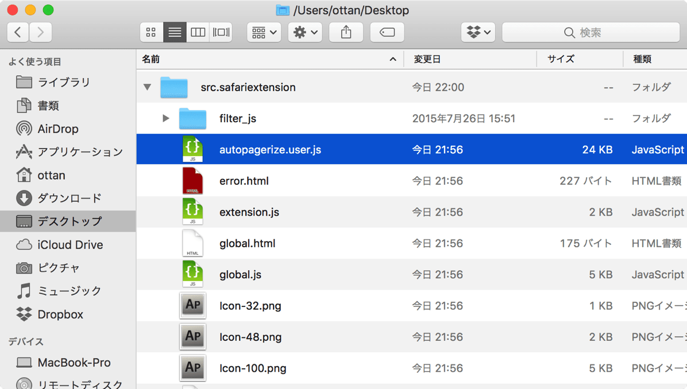

---
author:
- '@ottanxyz'
categories:
- Mac
date: 2017-12-01 00:00:00+00:00
draft: false
tags:
- 機能拡張
- autopagerize
- ビルダー
- safari
- インストール
title: Appleの公式サイトで配布されているSafariの機能拡張をカスタマイズして使用する方法
type: post
---

Safariの機能拡張は、[Apple - Safari - Safari Extensions Gallery](https://safari-extensions.apple.com/)からインストールできます。当該サイトからインストールできる機能は、「Apple Developer Program」に参加している開発者が、Appleの審査を経て登録されたものであり、一般的なWebサイト等で配布されているSafariの機能拡張よりも安全性が高いものになります。iOS向けのSafariのコンテンツブロッカーとして有名な、「Adblock Plus」「AdBlock」「280Blocker」も当該サイトからインストールできます。

Appleの公式サイトからSafariの機能拡張を配布するためには、「Apple Developer Program」（iOS、macOS、watchOS、tvOS、Safariの開発者向けプログラム。有償）に登録する必要があります（App Storeと同様）。なお、macOS、Safariの機能拡張については、前述の開発者向けプログラムに登録する必要はありませんが、macOSやSafariにインストールする際に、「信頼できない旨」の警告ダイアログが表示されます。また、macOS High Sierra以降、許可されていないサードパーティ製のアプリケーションはインストールできなくなりました（許可すれば可能）。

## Safariの機能拡張をカスタマイズして使用する

Safariの機能拡張はFinderから参照できます。各機能拡張はXAR（eXtensible ARchive format）と呼ばれる圧縮方式でアーカイブされており、この方式はmacOSで採用されています。そのため、Safariの機能拡張はXARを解凍すれば、機能拡張を参照できるようになっています。しかし、機能拡張を解凍してカスタマイズした上で再度XAR形式で圧縮しても、Safariにインストールできません。

Safariの機能拡張をカスタマイズしてインストールしようとしても、上記のようにエラーが発生し、インストールすることができません。ただ、必要に応じてSafariの機能拡張をカスタマイズして、ローカルホストにおいてテストを行いたいことがあります。

たとえば、筆者の使用している[AutoPagerize](http://autopagerize.net/)は、Safariでのブラウジング中に自動的にページ送りしてくれる便利な機能拡張なのですが、同機能拡張はインターネット上のデータベース、[アイテム - データベース: AutoPagerize - wedata](http://wedata.net/databases/AutoPagerize/items)（OpenIDを保持するユーザーであれば誰でも編集できるWikiのようなデータベース）の内容を参照しています。そのため、闇雲にこのデータベースに登録してしまうと、同機能拡張を使用している世界中のユーザーに影響を与えてしまうため、ローカルホスト上で動作を確認した上で、Wedataに正式に登録したいのです。そのためには、ローカルホスト上で、カスタマイズしたAutoPagerizeを動作させる必要があります。

### Safariの機能拡張をカスタマイズしてローカルホストのみで使用する

Safariの機能拡張は、ローカルホストで使用する場合に限り、一時的にSafariにインストールしてテストできます。ただし、Safariの再起動を行うと自動的にアンインストールされるため、あくまで開発者向けです。Safariの機能拡張は前述の通り、Finderから参照できます。

    ~/Library/Safari/Extensions

Finderで上記のパスを開きます。ライブラリフォルダーが参照できない場合は、Finderを開いた状態で⇧（shift）+⌘（command）+Gを押して、直接パスをコピー＆ペーストしてください。上記フォルダーに保存されている機能拡張の中からカスタマイズしたい機能拡張を任意のフォルダーにコピーしておきます。

#### Safariの機能拡張を解凍する

続いて、コピーした機能拡張を解凍します。XAR形式で圧縮されているため、通常のアーカイブユーティリティ.appでは解凍できません。ターミナルを開き、以下のコマンドを実行してください。「file path」にはコピーした機能拡張の絶対パス、または相対パスを指定します。解凍すると、ターミナルのカレントディレクトリ（`pwd`コマンドで確認可能）に解凍されフォルダーが作成されます。

    xar -xf <file path>

なお、サードパーティ製のアプリケーションの中にはXAR形式の圧縮ファイルの解凍に対応しているものもあります。「The Unarchiver」もそのアプリケーションの1つで、Mac App Storeから無償で入手することが可能です。



「The Unarchiver」を使用する場合は、機能拡張の拡張子を「.safariextz」から「.xar」に変更した上で、ファイルをダブルクリックすることで、同一のフォルダー上に解凍できます。

ターミナルから`xar`コマンドを実行、またはサードパーティ製のアプリケーションによって解凍した場合も、解凍後に上記のように末尾が「.safariextension」という名称のフォルダーが作成されます。

#### Safariの「機能拡張ビルダー」を使用する

Safariの機能拡張をカスタマイズするためには、Safariの「機能拡張ビルダー」を使用する必要があります。同ツールは、Safariのメニュー上から開くことができますが、初期状態では表示されていません。Safariの環境設定を開き（⌘+,）、「詳細」タブから「メニューバーに”開発"メニューを表示」をチェックしておきます。

続いて、Safariのメニューから「開発」→「機能拡張ビルダーを表示」で機能拡張ビルダーを起動します。

はじめて機能拡張ビルダーを起動すると、このようなダイアログが表示されるため「続ける」をクリックしてください。

続いて、左下の「+」ボタンをクリックして「機能拡張を追加」を選択します。

フォルダー選択ダイアログが表示されるため、先ほど解凍した末尾が「.safariextension」となっているフォルダーを選択します。選択できない場合は、フォルダーの末尾がこの文字列になっていることを確認してください。

上記は、前述の「AutoPagerize」を機能拡張ビルダーで開いた状態です。この状態で、前述のフォルダーに格納されている機能拡張の実行ファイル（機能拡張によってさまざまです）をテスト用にカスタマイズします。「AutoPagerize」の場合は、フォルダー直下の「autopagerize.user.js」ファイルを修正します。任意のファイルを修正後に、右上の「インストール」をクリックします。

警告ダイアログが表示されます。「Apple Developer Program」に登録した開発者の署名がない場合、機能拡張インストール時にこのダイアログが表示されますが、テスト用に一時的にインストールしたい場合には、「インストール」をクリックします。これで、Safariに一時的に機能拡張をインストールして、機能拡張をテストできます。

なお、機能拡張インストール後に、正常に動作せず、再度ファイルを修正した場合には、「再読み込み」ボタンをクリックすることで、リロードできます。また、テストが終了したら、Safariを終了するか、または機能拡張ビルダーから「アンインストール」ボタンをクリックすることで機能拡張をアンインストールできます（Safariの機能拡張メニューからもアンインストール可能です）。

### おまけ

[AutoPagerize](http://autopagerize.net/)は、前述の通り[アイテム - データベース: AutoPagerize - wedata](http://wedata.net/databases/AutoPagerize/items)というデータベースのデータ（JSON形式のファイル）を参照しています。Wedataと呼ばれるデータベースは、OpenIDを保持するユーザーであれば誰でも追加、変更、削除することが可能で、Wikiのようなものです。「AutoPagerize」に対応していないWebページがある場合は、上記のWedataにデータを追加すれば良いのですが、追加すると同機能拡張を使用している全ユーザーに影響を与えるため、登録前にローカルホストのSafariで正常動作するかどうかを確認しましょう。

ソースファイルの中の「autopagerize.user.js」をテキストエディター等で開きます。

    var SITEINFO = [
        /* sample
        {
            url:          'http://(.*).google.+/(search).+',
            nextLink:     'id("navbar")//td[last()]/a',
            pageElement:  '//div[@id="res"]/div',
            exampleUrl:   'http://www.google.com/search?q=nsIObserver',
        },
        */
        /* template
        {
            url:          '',
            nextLink:     '',
            pageElement:  '',
            exampleUrl:   '',
        },
        */
    ]

ソースコード中の、「template」のコメントアウトを解除した上で、必要な項目を編集し、機能拡張ビルダーによりインストールすることで、ローカルホスト上でテストできます。正常動作の確認が取れた場合には、Wedataに登録しましょう。ただし、Wedataは膨大な量となっているため、肥大化を防止するためにも、すでに同一の内容のデータが登録されていないかどうか確認した上で、重複を避けて登録しましょう。