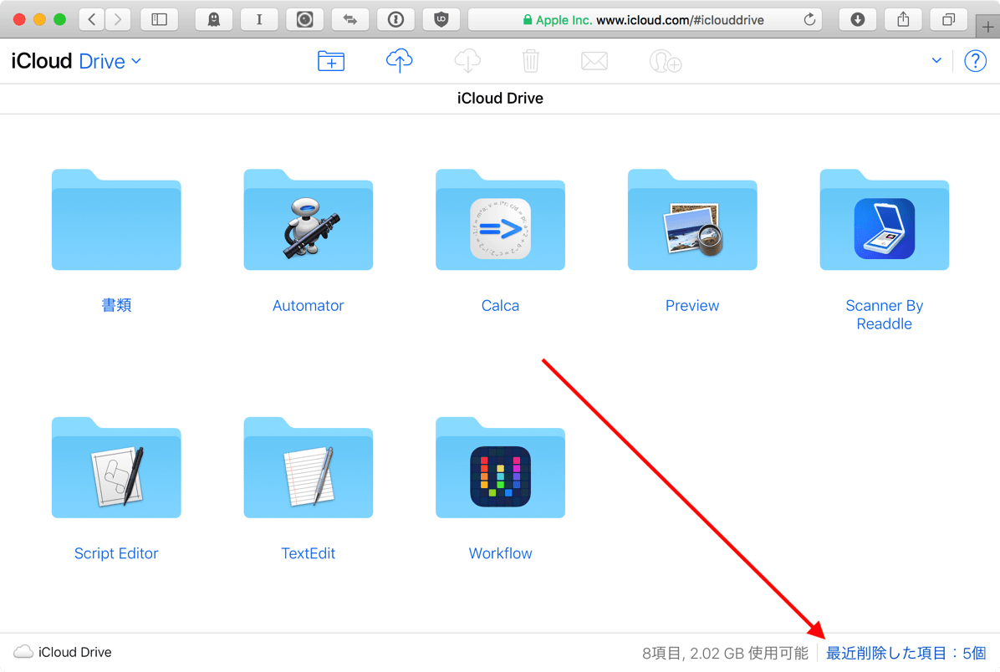
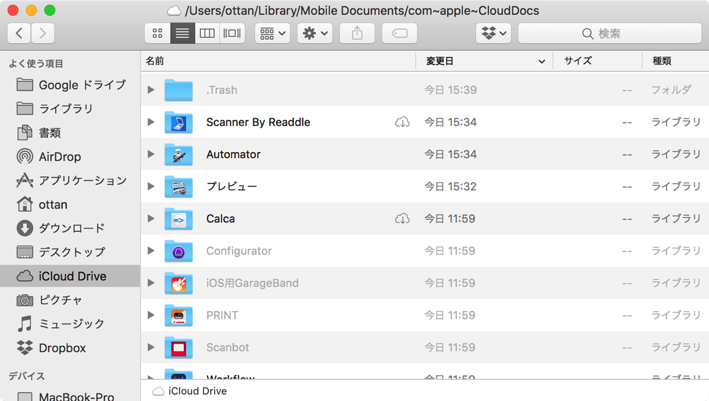

---
author:
- '@ottanxyz'
categories:
- Mac
date: 2017-12-16 00:00:00+00:00
draft: false
tags:
- machine
- time
- icloud
- drive
- ファイル
title: iCloud Driveから消えてしまった重要なファイルをTime Machineを使って復元する方法
type: post
---

iCloud Driveを使用すれば、iOS、macOSデバイス間でデータをクラウド経由で容易にできます。また、iCloud Driveへは、PCまたはMacが必要となりますが、[iCloud.com](https://www.icloud.com/)からもアクセスできます。今回は、iCloud Drive上に保存していた重要なファイルを誤って消してしまった場合の復旧方法についてご紹介します。[iCloud.com](https://www.icloud.com/)では、iCloud Drive上から削除してしまったファイルは、30日以内であれば復元できますが、その期間を超えてしまった場合は復元できません。しかし、MacのTime Machineを使用すれば過去のファイルを簡単に復元できます。

## iCloud Driveのファイルを復元する2つの方法

iCloud Drive上のファイルは、通常は[iCloud.com](https://www.icloud.com/)から復旧する方法が一般的ですが、削除してから30日以上超過してしまったファイルを復元することはできません。今回は、その[iCloud.com](https://www.icloud.com/)を使用した復元方法と、Time Machineのバックアップからコマンドを使用して復元する簡単な方法をご紹介します。

### iCloud.comの「最近削除した項目」から復元する

[iCloud.com](https://www.icloud.com/)では、データを削除してから30日以内であれば、すぐに復元できます。Safariのブックマークや連絡先など、iCloudに同期している情報であれば過去の任意のバックアップした日時に戻すこともできます。[誤って削除した重要なカレンダーのイベントやリマインダーを復旧する方法](/posts/2016/01/icloud-calendar-reminder-6828/)でもご紹介していますので、ぜひご覧いただければと思います。

[iCloud.com](https://www.icloud.com/)にSafariやGoogle Chromeなどのブラウザからアクセスし、iCloud Driveを選択します。過去30日間に削除したファイルを復元した場合は、ブラウザ右下の「最近削除した項目」から簡単にファイル単位で復元できます。

### Time MachineのバックアップからiCloud Driveのファイルを復元する

[iCloud.com](https://www.icloud.com/)を使用すれば、iCloudのデータを簡単に復元できますが、iCloud Driveについては過去30日以内に削除したファイルのみが対象です。そのため、それ以上過去に遡ってファイルを復元することはできません。その場合には、Mac限定となりますが、Time Machineから復元しましょう。ただし、Time Machineの通常の使い方（GUI）から、iCloudのデータを復元することはできません。

まず、Time Machineのボリュームをマウントするために、Time Machineに入ります。メニューバーの「Time Machine」→「Time Machineに入る」をクリックします。もし、メニューバーにTime Machineが表示されていない場合は、「システム環境設定」→「Time Machine」→「Time Machineをメニューバーに表示」をチェックしておきます。

Finderの「表示」メニューから「パスバーを表示」をチェックしておくとわかりますが、iCloud Driveの実態は、以下のパスに保存されています。

    ~/Library/Mobile Documents/com~apple~CloudDocs/

そのため、iCloud Driveのファイルを復元したい場合は、Time Machineのバックアップから該当のファイルを復元すれば良いわけです。

    /Volumes/Time Machineバックアップ/Backups.backupdb/<Computer Name>/YYYY-MM-DD-hhmmss/Macintosh\HD/Users/<User Name>/Library/Mobile Documents/com~apple~CloudDocs/

Time Machineの保存先は上記のようになります。「Time Machineバックアップ」というボリュームが認識されない場合は、前述の通り、メニューバーのTime Machineから、一度「Time Machineに入る」を選択してください。しばらくすると、ボリュームが認識されるようになります。なお、「Computer Name」はお使いのMacのホスト名（「システム環境設定」→「共有」で表示されるコンピューター名）、「YYYY-MM-DD-hhmmss」はバックアップ日時、「User Name」はMacのユーザ名を表していますので適宜変更してください。「いつバックアップしたかなんて覚えてないよ！」という場合には、ターミナルから以下のコマンドを実行することでバックアップファイルを確認できます。

    ls -l /Volumes/Time\ Machineバックアップ/Backups.backupdb/<Computer Name>/

実際に、Time Machineからファイルを復元する場合には、以下のコマンドを実行します（`cp`コマンド等でファイルコピーすることもできますが、専用のコマンドが用意されているため、できればこちらを使う方が望ましいでしょう）。

    tmutil restore /Volumes/Time\ Machineバックアップ/Backups.backupdb/<Computer Name>/YYYY-MM-DD-hhmmss/Macintosh\ HD/Users/<User Name>/Library/Mobile\ Documents/com\~apple\~CloudDocs/<File Name> <Destination Path>

「File Name」には復元したいファイル名、「Destination Path」には復元先のフォルダー（任意のパス）を入力してください。たとえば、「ダウンロード」フォルダーに復元したい場合は、`~/Downloads`となります。

## まとめ

`tmutil`（Time Machineユーティリティ）コマンドを使用すれば、通常、Time MachineのGUIから復元できないファイルを個別に復元できます。また、iCloud上のファイル（厳密には、iCloudに保存されていて、Macにダウンロードされているファイル）も任意に復元することができるため、どうしても復元したいファイルがある場合には、ぜひTime Machineからの復旧を試してみてください。