---
author:
- '@ottanxyz'
categories:
- iPhone
date: 2017-12-02 00:00:00+00:00
draft: false
tags:
- 画面
- スワイプ
- ホーム
- iphone
- ボタン
title: これだけは知っておきたいiPhone Xの基本的な操作方法のまとめ
type: post
---

2017年11月3日に、iPhone誕生から10年を経て登場した「iPhone X」（読み方は「テン」）。発売日当初は需要が供給を上回り、Apple Storeや各キャリアの予約は発売日当日に完売し、なかなかiPhone Xを入手できなかった方も多いのではないでしょうか。現在では、Apple StoreのiPhone Xの在庫が回復し、配送を利用した場合においても、概ね1〜2週間程度で手元に届くようになっているようです。

今回は、はじめてiPhone Xに機種変した人、すでにiPhone Xを使用しているけれど操作に不安がある、iPhone Xの操作意外と知らないかもしれない、基本的な操作を復習しておきたいという、さまざまな方向けに、従来の基本的な操作手順の変更について解説したいと思います。とくに、iPhone Xでは、iPhoneの象徴とも言える「ホームボタン」の廃止により、操作がすべてジェスチャー（スワイプなど）操作に置き換えられていたり、これまでスリープ（電源）ボタンにより行っていた一連の操作の変更について詳しく解説したいと思います。

## iPhone Xの基本的な操作方法のまとめ

まず、iPhone Xのボタン配置について説明します。iPhone Xでは、正面から見て右側に「サイドボタン」（従来のスリープボタンに相当）およびSIMトレイ、左側に上から順番にサイレントモード（マナーモード）への切り替えのためのボタン（従来と同様）、音量を上げるボタン、下げるボタン（従来と同様だが役割が変更）が配置されています。また、画面最上部には、主にFace IDを使用するために配置されているTrueDepthカメラ「切り欠き」（ノッチ）と呼ばれる箇所があります。以上の事を念頭において、この記事をご覧ください。

-   iPhone Xの右側にはサイドボタン、およびSIMトレイが配置されている
-   iPhone Xの左側には上から順番にサイレントモードの切り替えスイッチ、音量を上げるボタン、下げるボタンが配置されている
-   （縦向きに画面を使用している場合）画面上部には、TrueDepthカメラが設置されている「切り欠き」（ノッチ）と呼ばれる部分がある

### ホーム画面に戻る

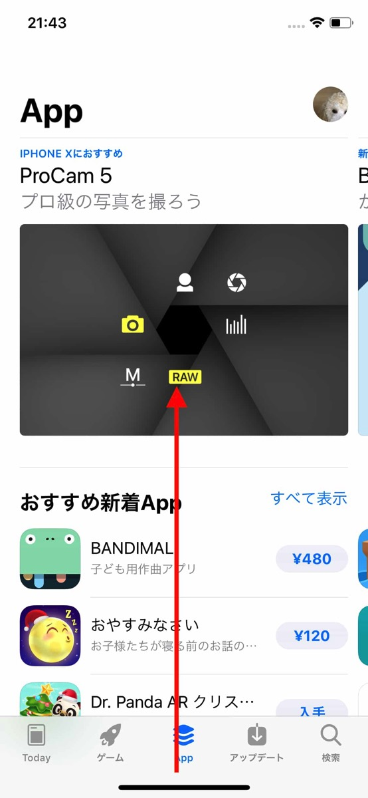

従来、アプリ起動時、ウィジェット表示時、通知画面表示時などから、ホーム画面に戻るためには「ホームボタン」を押していましたが、iPhone Xでは「ホームボタン」は廃止されジェスチャー操作に変更されました。ホーム画面に戻るためには、一律、画面最下部から上に向けて指をスワイプ（スライド）させ指を離します。さっと上にスワイプさせて指を離します。

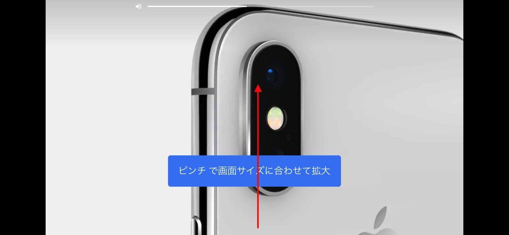

画面を横向きに回転させて動画（YouTubeなど）を視聴していたり、ゲームをしている際にホーム画面に戻りたい場合は、画面表示に合わせて画面最下部から上に向かってスワイプする必要があります。縦向きに使用している場合と、物理的な向きが異なりますので慣れない間は注意が必要です（画面下から上へ向かってという、相対的な向きについての変更はありませんのですぐに慣れます）。

### ホーム画面から通知画面を表示する

iOS 11から、通知センターが廃止され、通知の内容はすべてロック画面に統合されました。通知の内容を表示したい場合は、ホーム画面やアプリ起動時に、「切り欠き」の左側（時刻が表示されている場所）から下に向かってスワイプします。従来は、画面最上部から下に向かってスワイプすることで通知画面を確認できましたが、「ホームボタン」の廃止によるコントロールセンターの挙動の変更に伴い、通知画面の表示方法も変更されています。

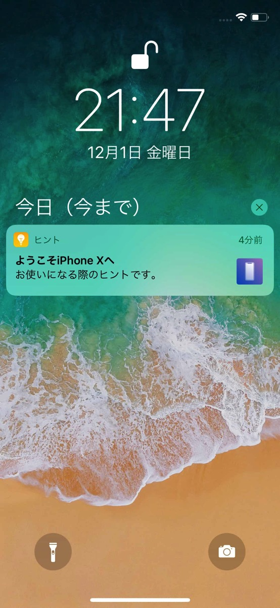

再度、ホーム画面に戻るためには、画面最下部から上に向かってスワイプする動作は前述の通りです。

画面を横向きにしている場合の考え方も、ホーム画面に戻るためのスワイプの考え方と同様です。画面表示に合わせて画面の左上から下にスワイプすることで、通知画面を横向きに表示させることができます。

### コントロールセンターを表示する

コントロールセンターを表示したい場合は、ホーム画面やアプリ起動時に、「切り欠き」の右側（Bluetooth、Wi-Fi、バッテリーアイコンが表示されている場所）から下に向かってスワイプします。従来は、画面最下部から上に向かってスワイプすることでコントロールセンターを表示させることができましたが、「ホームボタン」の廃止およびホーム画面に戻るためのスワイプ操作に切り替えられたことで、コントロールセンターの表示方法も変更されています。

なお、画面を横向きに表示している場合のコントロールセンターの呼び出し方については、通知画面と同様の考え方です。画面表示に合わせて画面の右上から下にスワイプすることで、コントロールセンターを横向きに表示できます。

### Spotlight検索などの検索画面を表示する

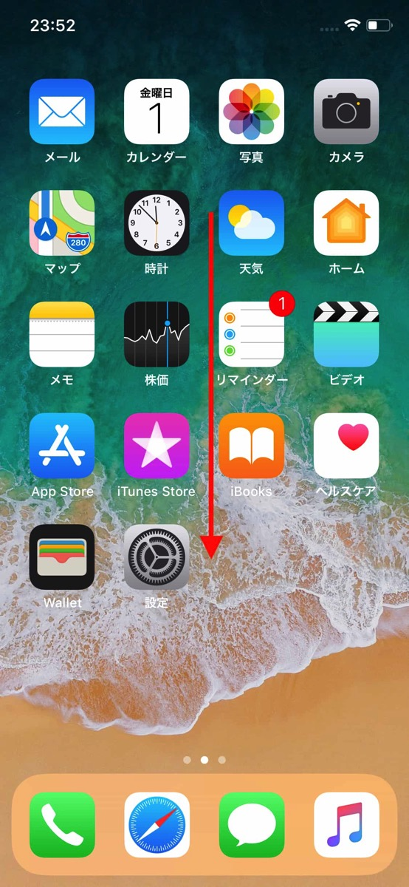

iPhoneにインストールされているアプリを検索して直接起動したり、Siriによる提案（これまでの操作履歴に基づくオススメのアプリの表示）、キーワードによるWebやWikipedia検索を行うための検索画面を表示させるためには、画面の任意の箇所（中央付近）から下に向かってスワイプします。これは従来の方法から変更はありません。

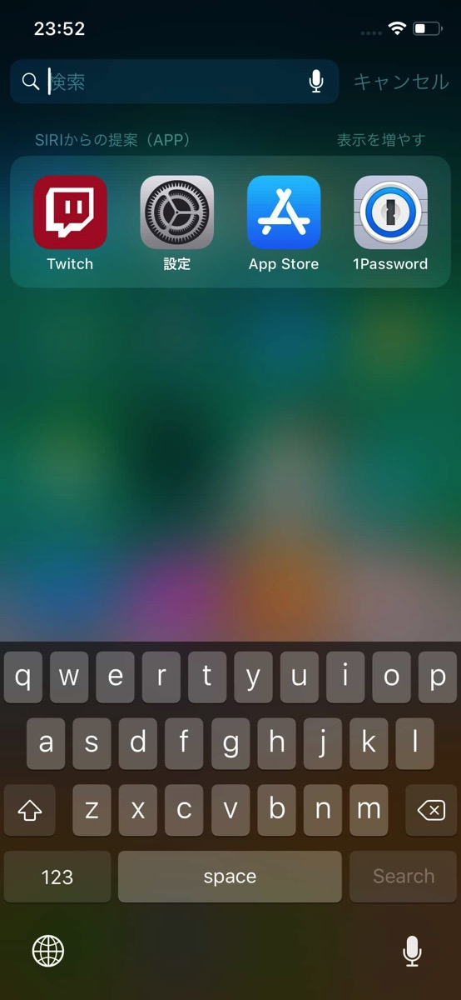

Spotlight検索では、Wikipediaによる簡易検索、Safariを用いたWeb検索などを利用できます。

### 起動しているアプリを切り替える（その1）

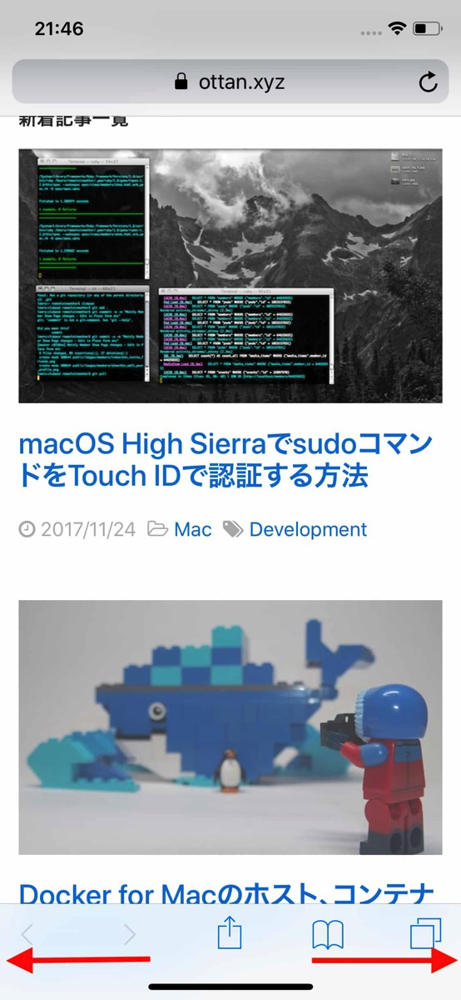

iPhone Xでは、アプリ起動時に画面最下部にホームインジケーターが表示されます。ホームインジケーターが表示されている状態で、ホームインジケーターから右側に向かってスワイプすることで直前に起動していたアプリへ、また左側に向かってスワイプすることで元のアプリへ、直接切り替えることができるようになりました（慣れると便利！）。従来は、ホームボタンをダブルタップしてアプリスイッチャー（アプリの履歴）を表示して、画面を左右にスワイプして任意のアプリに切り替える必要がありましたが、ジェスチャー操作のみでアプリ間を行き来できるようになりました。慣れると非常に便利な機能ですので、ぜひ覚えておきましょう！

なお、画面を横向きにして使用している場合も、考え方は同じです。画面最下部のホームインジケーターから左右にスワイプすることでアプリを横向きのまま切り替えることができます。

### 起動しているアプリを切り替える（その2）

アプリの切り替えについて、従来と同様にアプリスイッチャー（アプリの履歴）を使用して切り替えることも可能です。ホーム画面に戻るためのスワイプ操作と似ているため、最初は戸惑うかもしれませんが、慣れてしまうとこれまでホームボタンをダブルタップする必要のあった操作が煩わしく感じるほど快適になります（あくまで個人の感想です）。

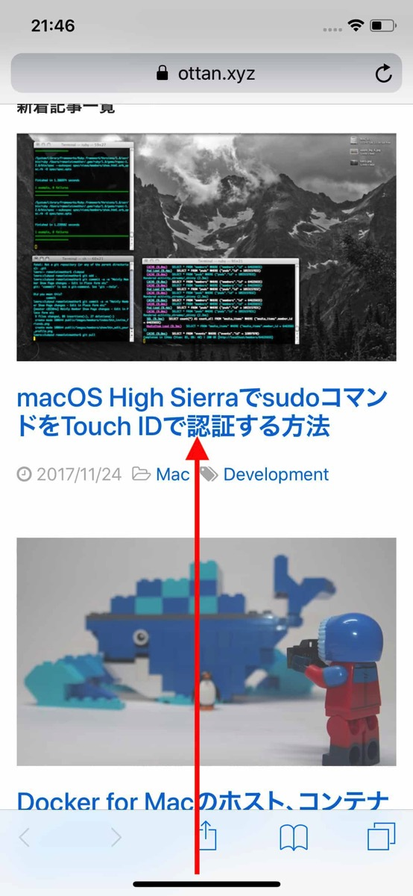

アプリを起動した状態でアプリスイッチャー（アプリの履歴）を表示させるためには、画面最下部から上に向けてスワイプし、その状態でアプリスイッチャーが起動するまで待ちます（すぐにアプリスイッチャーは表示されます）。ホーム画面に戻るためのジェスチャーと同様のように見えますが、ホーム画面に戻る場合は、さっとスワイプして指を離すのに対して、アプリスイッチャーを表示する場合はスワイプした状態で指を止めておきます。操作に慣れていない状態では、ついホーム画面に戻ってしまうという誤動作が多発しますが、慣れてくると、スワイプして待機しておく、という感覚が身につきます。

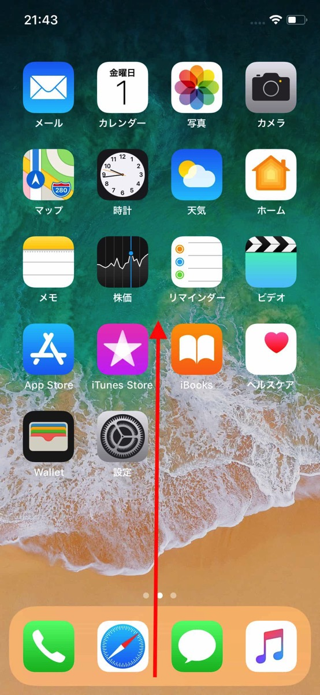

ホーム画面からアプリスイッチャーを起動する場合も同様です。画面最下部から上に向けてスワイプし、その状態でアプリスイッチャーが起動するまで待ちます。なお、画面を横向きにして使用している場合も、これまでの考え方と同様です。画面表示に合わせて画面最下部から上に向けてスワイプし、その状態でアプリスイッチャーが起動するまで待ちます。

アプリスイッチャーが起動した後の操作は、従来のiPhoneと同様です。左右にスワイプして起動したいアプリに切り替えます。

### アプリスイッチャーからアプリを削除する

アプリスイッチャー（アプリの履歴）からアプリを削除できます。アプリの再起動を行いたい場合は、アプリスイッチャーから該当のアプリを削除します。なお、（一部のアプリを除いて）複数のアプリを起動した状態においても、メモリの解放やバッテリー消耗の改善のためにアプリスイッチャーからアプリを削除（停止）する必要はありません。再起動目的で使用することがほとんどと思われます（「一部のアプリを除いて」と記述したのは個人的な意見です。完全に停止した状態の方がバッテリー消耗を抑えることができるのではと思っています。たとえば、iPhoneの機能を最大限に活用した3Dゲームなど）

アプリスイッチャーからアプリを削除するためには、アプリスイッチャーを起動した状態で、アプリの画面をホールド（長押し）します。ホールドすると、アプリの左上に「-」のアイコンが表示されるため、その状態で「-」アイコンをタップするか、またはアプリの画面を上にスワイプすることでアプリを削除できます。従来は、アプリスイッチャーを起動した状態で、上にスワイプするだけでアプリの履歴を削除することができましたが、iPhone Xではアプリの画面を長押しするというワンクッション置いた操作が必要になりました。スワイプでアプリの履歴を削除できるという操作自体に変更はありませんので、アプリの画面を長押しする、という操作を覚えておきましょう。

#### iOSのバージョンアップによりホールド不要に

その後の、iOS 12のアップデートにより、アプリスイッチャーでアプリの画面をホールドする必要はなくなりました。そのまま上にスワイプすることでアプリを終了させることができます。

### ロック画面からカメラを起動する

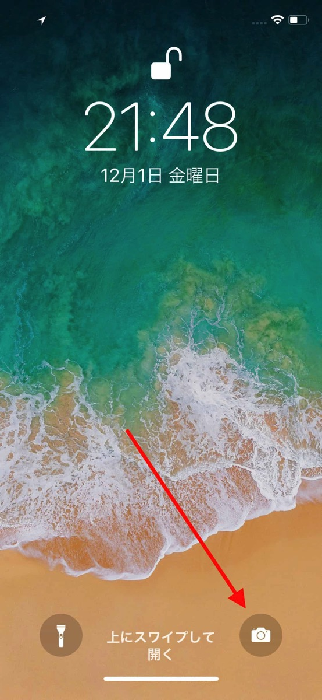

iPhone Xでも、ロック画面からカメラを起動できます。ロック画面の状態で、右下のカメラのアイコンをホールド（長押し）するか、従来通り画面を左にスワイプすることでカメラを起動できます。個人的には従来通りのスワイプ操作に慣れているため、画面を左にスワイプして起動することをオススメします。

なお、従来のiPhoneと同様にカメラロールに対するアクセスの仕様に変更はありませんが、一部注意が必要です。iPhone XにはFace IDと呼ばれる、画面を注視（目を開いた状態で見つめる）するだけでロックを解除できる機能が搭載されています（ロックが解除されているかどうかは、画面上部の鍵のアイコンの状態で判別可能です）。Face IDに登録されているユーザーがiPhone Xを手に持ちロック画面を表示して画面を見ると、ほぼ一瞬でロックが解除されます。この状態でカメラを起動すると、カメラアプリからカメラロールへ簡単にアクセスすることができてしまいます。ロックが解除されていない状態においては、内部のカメラロールへのアクセスはできません。カメラロールへアクセスさせたくない場合に、カメラを起動する場合には注意してください（Face IDに登録されていないユーザーがロック画面を表示してもロックは解除されないため、通常他人がカメラアプリを起動して、勝手にカメラロールにアクセスするということはできません）。

### ロック画面からウィジェットを起動する

iPhone Xでも、ロック画面からウィジェットを起動できます。ロック画面の状態で、従来通り画面を右にスワイプすることでウィジェットを表示できます。Face IDによるロックを解除した状態であれば、ウィジェットをタップすることで、そのままアプリを起動できます。

### ロック画面からApple Payを起動する

ロック画面からApple Payを起動するためには、iPhone Xの右側のサイドボタンを2回押します。従来は、「ホームボタン」を素早く2回押すことによって起動しましたが、「ホームボタン」の廃止に伴いApple Payの操作方法も変更されています。Apple Payの起動と同時に、Face IDによる認証がほぼ完了するため、そのままカードリーダーで支払い等を行うことができます。

### Siriを呼び出す

ロック画面、ホーム画面、アプリ起動状態、いずれの状態においても、Siriを呼び出すためには、iPhone Xの右側のサイドボタンを長押しします。従来は、「ホームボタン」の長押しによりSiriを呼び出すことができましたが、「ホームボタン」の廃止に伴いSiriの呼び出し方も変更になっています。

### 緊急SOS（電話）をかける

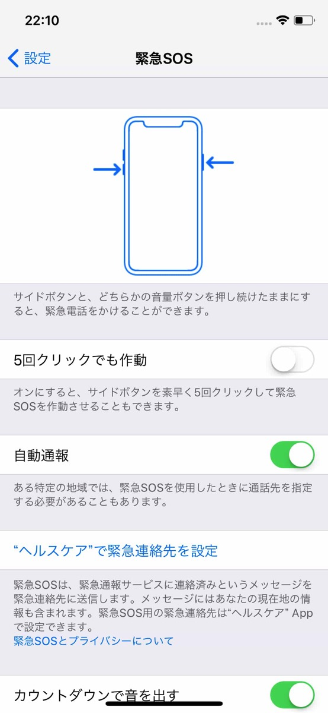

知らないと結構焦ります（呼び出し方を忘れて焦るのではなく、誤って呼び出してしまってカウントダウンの大音量の発信音が流れて焦る、という意味です…）。緊急SOSは、万が一の状態に備えて、iPhoneで特定の操作を行うことで、緊急連絡先に指定した電話番号に自動的に発信する機能ですが、iPhone Xでは、右側のサイドボタンと、左側の音量ボタン（上げる、または下げる）を押し続けることによって緊急SOSの発信が行われます。従来のiPhoneでは、スリープボタン（iPhone Xのサイドボタン）を素早く5回タップするという操作が必要でしたが、iPhone Xでは押し続けるだけで発信されるため注意（？）してください。筆者は後述のスクリーンショットおよび電源オフの操作と誤って、ボタンを押し続けてしまい深夜に大音量のカウントダウン音が再生されてしまいました…。

### スクリーンショットを取得する

iPhone Xでスクリーンショットを撮影するには、iPhone Xの右側のサイドボタンと、左側の音量を下げるボタンを同時に1回押します。（決して押し続けてはいけません。ファンファンファンファンという大音量の緊急SOSが流れ始めます…）。従来は、スリープボタン（iPhone Xのサイドボタン）と「ホームボタン」を押すという操作でしたが、「ホームボタン」の廃止により変更されています。

### iPhone Xの電源をオフ（シャットダウン）

iPhone Xの電源をオフにするためには、iPhone Xの右側のサイドボタンと、左側の音量ボタン（上げる、または下げる）を「少しの間」押し続けます。すると、「スライドで電源オフ」が表示されるため、従来のiPhoneと同様の操作で電源をオフできます（繰り返しますが、「長い間」押し続けたままにしてはいけません。ファンファンファn…）。

### iPhone Xの電源をオン

iPhone Xの右側のサイドボタンを押し続けます。従来のスリープボタンと同様の挙動です。

### iPhone Xを強制的に再起動する

iPhone 8、iPhone Xでは、iPhone 7までの機種と比較して強制的に再起動する方法が変更されています。アプリ起動中にフリーズしてしまった、iPhone Xで操作が不可能になった、何らかの不具合が発生したなど、使用する場面は限られると思いますが、知っていて損はない方法です。iPhone Xで強制的に再起動するためには、

1.  音量を上げるボタンを押してすぐに離す
2.  音量を下げるボタンを押してすぐに離す
3.  Appleのロゴが表示されるまでサイドボタンを押し続ける

といった手順を踏む必要があります。iPhone 7までは、スリープボタンと音量を下げるボタンを同時に押し続ける、という操作でしたが、iPhone Xで同様の操作を行おうとすると、前述の通りファンファンファn（省略）となりますのでご注意ください。

### Safariやアプリ起動中に画面の最上部に戻る

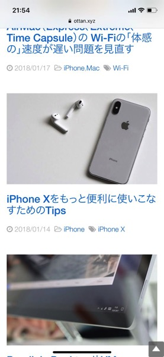

たとえば、SafariでWebページを閲覧している場合、アプリを起動して画面を下にスクロールしている場合等、iPhone 8までは画面最上部（ステータスバー）をタップすることで画面最上部に戻ることができましたが、iPhone Xではノッチの左側、または右側をタップすることで同様の操作が実現可能です。

## まとめ

「ホームボタン」の廃止によりさまざまな操作がジェスチャーに置き換わっています。また、物理的なボタンの廃止により、スクリーンショットなど「ホームボタン」を使用する操作も変更になっています。慣れるまでやや戸惑ったり時間がかかったりするかもしれませんが、通常はジェスチャーだけで操作できるiPhone Xの操作は想像以上に快適です！（筆者が試した感じでは）慣れると「ホームボタンって別に必要ないよね」という感覚に囚われます（Appleに教育されているのかもしれません…）。iPhone Xの基本操作を覚えて快適なiPhone Xライフを！