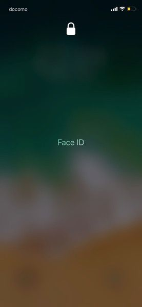
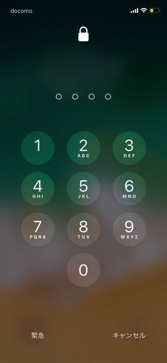

---
author:
- '@ottanxyz'
categories:
- iPhone
date: 2018-01-23 00:00:00+00:00
draft: false
tags:
- face
- id
- パスコード
- マスク
- 画面
title: マスク着用時にFace IDを使用せずにパスコードによる認証を行う方法
type: post
---

iPhone Xから、従来のTouch IDに代わり、顔による認証「Face ID」が追加されました。「Face ID」を使用することにより、iPhoneのスリープ解除に合わせて瞬時にロックが解除されます。その状態から、ロック画面に表示されている通知をタップすることで、即座に目的のアプリケーションを開くことができるため、「Face ID」を利用している場合には、ぜひ使用したい機能です。

しかし、冬場や花粉症の季節になると気になるのが「マスク」。「マスク」着用時、「Face ID」は異なる顔と認識してしまうため、「Face ID」による認証に失敗します（根気強く認証し続けていれば、そのうち「学習」するのでしょうか）。その場合、ロック解除までの流れは、ホーム画面をスワイプ、「Face ID」による認証、「Face ID」による認証失敗、パスコード入力画面が表示、パスコード入力、と段階を踏む必要があり、利便性に欠けます。とくに、「Face ID」による認証失敗まで数秒間のラグがありますが、今回はこのラグを解消する方法をご紹介します。

## Face IDの認証からパスコードの認証に切り替える

「Face ID」はパスコードが設定されている状態でのみ使用可能です。そのため、「Face ID」の認証に失敗すると、必然的にパスコードの入力が求められますが、認証失敗からパスコードの入力画面が表示されるまでに数秒間のラグがあります。従来の「Touch ID」による認証失敗と比較するとスムーズではありません。そこで、このラグを解消する方法をご紹介します（もちろん、「Face ID」が正常に使用できる状態であることに越したことはありませんが）。

iPhone Xでホーム画面を表示するには、ホーム画面を上にスワイプします。ロック画面からホーム画面に遷移する場合も同様です。「Face ID」が正常に働いている状態であれば、ロック画面を上にスワイプした状態で、すでにロックが解除されている（鍵アイコンが外れている）ため、そのままホーム画面が表示されますが、「Face ID」の認証が完了していない状態では、次の画面が表示されます。

ロックが解除されていない状態でロック画面を上にスワイプすると、「Face ID」によるロック解除を試みます。この画面が表示されてから「Face ID」による認証が失敗し、はじめてパスコードを入力する画面となるわけですが、あらかじめ「Face ID」による認証が失敗するとわかっている状態（「マスク」着用時、など）では、この「Face ID」による認証の失敗を待つために数秒間のラグが発生します。

「マスク」着用時など「Face ID」を使用せず、即座にパスコードによる認証を行いたい場合には、上記の画面が表示された状態で、画面中央の「Face ID」と書かれたラベルをタップします。

すると、「Face ID」の認証失敗を待たずにパスコードの入力画面が表示されます。「Face ID」による認証を行わず、パスコードの入力を行うためのフローをまとめると、以下のようになります。

1.  ロック画面で画面を上にスワイプする
2.  画面中央の「Face ID」と書かれたラベルをタップする
3.  パスコードを入力する

マスク着用時など、「Face ID」の認証に失敗する場合に備えて覚えておくと、たった数秒間ですが時間を省略できますので、ぜひお試しください。