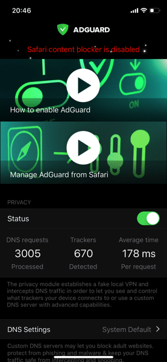
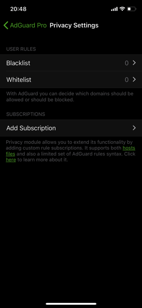
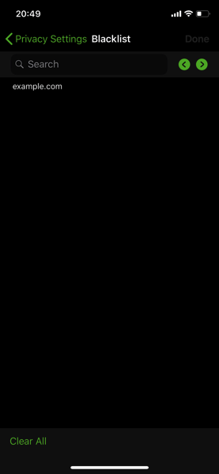
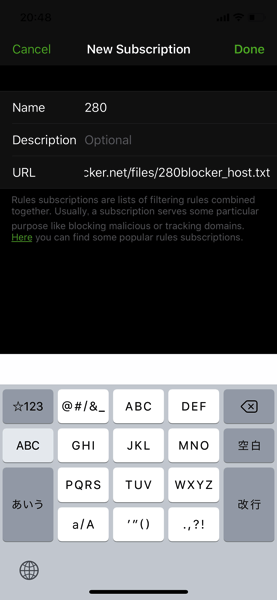
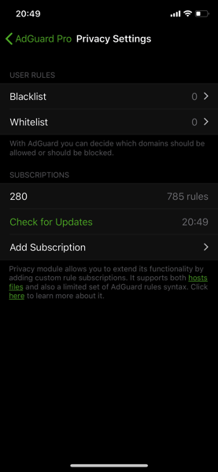

---
author:
- '@ottanxyz'
categories:
- iPhone
date: 2018-03-06 00:00:00+00:00
draft: false
tags:
- ドメイン
- リスト
- pro
- settings
- ブロック
title: AdGuard Proがワンタップでのドメインリストのインポートに対応しWorkflow不要でより便利に！
type: post
---

[iPhone のすべてのアプリからありとあらゆる広告を消し去る魔法のアプリ「AdGuard Pro」の使用方法](/posts/2017/12/adguard-pro-vpn-adblock-6486/)や、[Android 標準の Chrome やその他のアプリからありとあらゆる広告を消し去る魔法のアプリ「Adguard」](/posts/2017/05/android-chrome-all-apps-ads-block-adguard-5815/)で、広告ブロックアプリである「AdGuard Pro」についてご紹介しました。Android 版の「AdGuard」には、フィルターの購読機能があり、URL 指定でドメインリストをインポートできる機能が備わっていましたが、iPhone にも遂に実装されました。

これまでは、ブロックしたいドメインリストを「Workflow」と呼ばれるアプリ等を利用する、もしくは手動でコピー＆ペーストするなど、手動による更新を行う必要がありましたが、最新版ではボタンを 1 つタップすることでリストを簡単に更新することができるようになりました。今回は、この新機能を中心にご紹介します。詳細な使用方法は、冒頭の[iPhone のすべてのアプリからありとあらゆる広告を消し去る魔法のアプリ「AdGuard Pro」の使用方法](/posts/2017/12/adguard-pro-vpn-adblock-6486/)の記事をご参照ください。





## ドメインリストの購読機能が追加された「AdGuard Pro」

「AdGuard Pro」がアップデートにより、インタフェースの刷新とともに、便利な機能であるドメインリストのサブスクリプション（購読）機能が追加されました。

「AdGuard Pro」のドメインブロックを有効にするためには、「Status」をオンにします。なお、その際に VPN 構成プロファイルのインストールの許可が求められるため、許可（Allow）します。

従来のバージョンでは、「DNS Settings」の 1 つ下「System Status」という項目がありましたが、最新バージョンでは削除され、トップの「Status」に変更されています。そのため、「DNS Settings」をタップして、オン、オフを行う手間が省けています。なお、Safari のコンテンツブロッカーとして使用する方法は従来通りですが、日本の一部の広告が除去されないなど、完全ではないため、コンテンツブロッカーを使用する場合（広告の枠も含めて消す）は冒頭の記事でもご紹介している「280blocker」を使用した方が良いでしょう。

### ドメインリストの購読やドメイン登録は「Privacy Settings」から

最新バージョンでは、ドメインリストの購読機能が追加されました。従来は、ブロックしたいドメインをカンマ区切り、もしくは改行区切りで 1 つ 1 つ手入力、もしくは Workflow 等を使用して加工データを使用してコピー＆ペーストする必要がありましたが、アップデートにより、上記のルールに基づいてドメインリストが記述されているテキストファイル等の URL を指定することで、ワンタップアップデートに対応しました。

ドメインリストの購読は、「Privacy Settings」の「Add Subscription」から行います。従来のドメインリストは、「Privacy Settings」の「Blacklist」から行います。

なお、ドメインリストをインポートする場合、事前に「Blacklist」に登録されているドメインリストを削除しておくと、トラブルなくスムーズに対応できると思われます。

冒頭の記事内でもご紹介した 280 氏提供のドメインリストをインポートする方法をご紹介します。「Add Subscription」をタップしたら、以下のように入力します。

| 項目        | 内容                                             |
| ----------- | ------------------------------------------------ |
| Name        | 任意の名称だが必須項目                           |
| Description | 空白のままで OK                                  |
| URL         | https://280blocker.net/files/280blocker_host.txt |

以上の項目を入力して「Done」をタップします。

「SUBSCRIPTIONS」の項目に先ほど登録した名称のリスト、および含まれるドメインリストの件数が表示されれば OK です。なお、以降は「Check for Updates」をタップするだけで、リストを再インポートすることができるようになります。また、名称をタップすることで、登録したドメインリストの購読を削除することもできます（URL の編集はできません）。

なお、VPN アイコンを消したい（iOS11〜）場合は、「Advanced Settings」から「TUNNEL MODE」を「Full-Tunnel」に変更します（従来通り）。

### 設定したのに広告が表示される

以上の内容を設定したにもかかわらず広告が表示される場合は、以下の方法を試しましょう。

- iOS デバイスの再起動（すべてのアプリの再起動）
- 広告が表示されるアプリの再起動（個別のアプリの再起動）
- 「一般」→「モバイルデータ通信」→「Wi-Fi アシスト」をオフ（Wi-Fi アシストがオンの場合、Wi-Fi の電波が悪い際に自動的に 4G に切り替わり、そのタイミングでドメインブロックができないため）

iOS の広告ブロックといえば、「AdBlock」「AdGuard Pro」の二強体制が続いていましたが、今回の「AdGuard Pro」のワンタップインポートにより、現時点での優位性は（価格を除いて）「AdGuard Pro」にあると言えます。