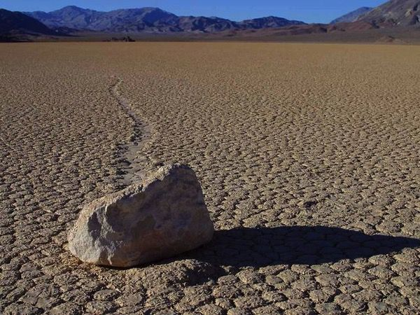

先日のWWDC 2018で、次世代のmacOSであるmacOS Mojave（モハべ）が発表されました。今回は、現在デベロッパーベータ版であるmacOS Mojaveを、現在お使いのMacにインストールする方法をご紹介します。また、Mojaveはまだベータ版であり、現在の環境（High Sierraなど）にそのまま上書きインストールしてしまうのは危険です。そのため、現在の環境を壊さずに、High Sierraとは別のボリューム（またはパーティション）にインストールする方法をご紹介します。

## macOS Mojaveのインストール

macOS Mojaveのダウンロードは、Mac App Storeから行いますが、現在はまだMac App Storeに表示されていません。ベータ版のソフトウェアをダウンロードできるように、デベロッパーツールをインストールします・

### macOS Mojaveのダウンロード

macOS Mojaveは、[Apple Developer](https://developer.apple.com/)からダウンロードできます。ダウンロードするためには、デベロッパーアカウント（無償版で可能）が必要です。現在お使いのApple IDをそのまま使用することもできますので、まずはデベロッパーアカウントを用意しておきましょう。

「Develop」タブをクリックします。

メニューから「Download」をクリックします。

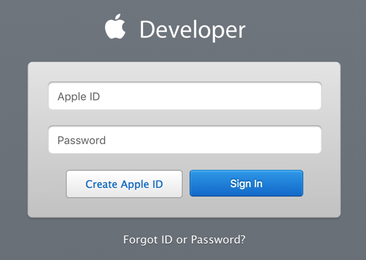

デベロッパー登録されているアカウントでサインインします。

現在ダウンロード可能なベータ版のソフトウェアが表示されますので、「macOS Mojave 10.14 beta」の「Download」ボタンをクリックします。

### 新規ボリューム（パーティション）の作成

続いて、macOS High Sierraとは異なるボリューム（パーティション）を新規に作成します。「ユーティリティ」から「ディスクユーティリティ」を選択します。

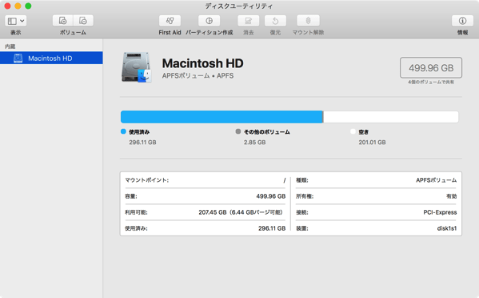

ディスクユーティリティが開いたら、「パーティション作成」ボタンをクリックします。

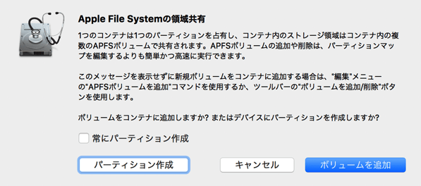

macOS High Sierraから導入されたAPFS（Apple File System）を使用している場合は、従来のパーティションではなくボリュームという単位で管理します（パーティションで管理することもできますが、パーティションではなくボリュームを分割することをディスクユーティリティは推奨しています）。Sierra以前のOSをお使いの場合には、従来通りパーティションを作成してください。今回は「ボリュームを追加」します。

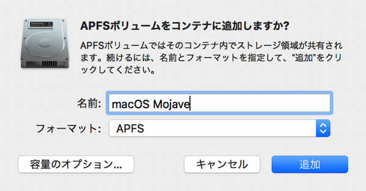

ボリューム名に「macOS Mojave」など、わかりやすい任意の名称をつけておきます。「追加」ボタンをクリックすると、一瞬でボリュームが作成されます。フォーマットは「APFS」のままで構いません。

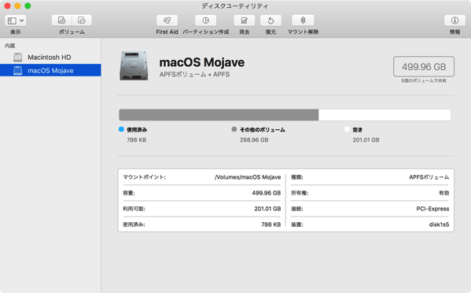

「Macintosh HD」とは別に、先ほど作成したボリュームが表示されていることを確認します。

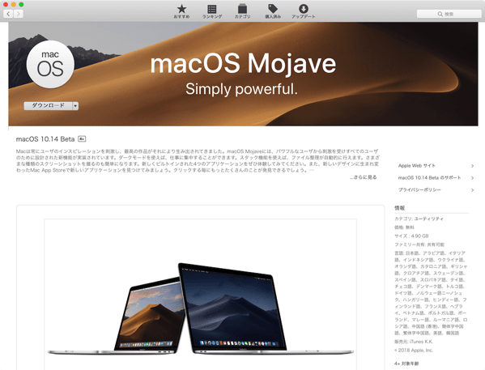

続いて、デベロッパーサイトからダウンロードしたユーティリティをインストール（インストールウィザードの内容にしたがってインストールするだけですので、方法は割愛します）します。すると、Mac App Storeから「macOS Mojave」がダウンロードできるようになります。（自動的に「Mac App Store」が表示されます）

### macOS Mojaveのインストール

Mac App StoreからmacOS Mojaveをダウンロードしたら、自動的にインストーラーが起動します。

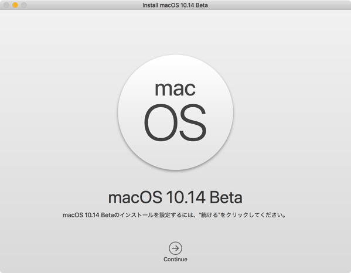

基本的にはインストールウィザードの内容にしたがってインストールするだけですが、注意点が1点のみあります。

デフォルトでは「Macintosh HD」にそのまま上書きインストールしようとします。そうすると現在の環境が上書きされてしまいますので、ここで先ほど作成した新規ボリュームにインストールするようにします。「すべてのディスクを表示」をクリックします。

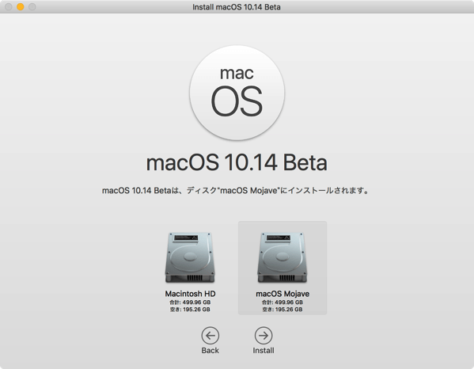

「macOS Mojave」を選択して「Install」をクリックします。あとは、インストーラーウィザードの内容にしたがって進めていくだけです！

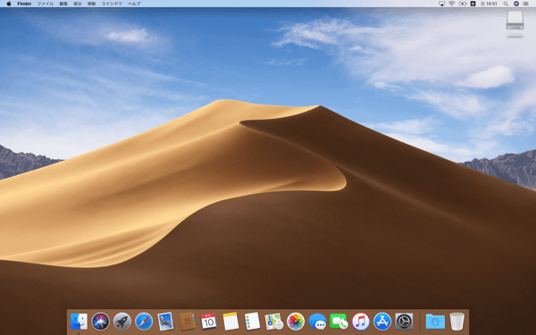

### macOS Mojaveインストール時、インストール後の注意点

macOS MojaveとmacOS High Sierraを同時に使用する場合の注意点です。

  * macOS High SierraとMojaveで使用するApple IDのアカウントはなるべく分けることを推奨（iCloudを共有しないようにするため）
  * 起動ディスクが自動的にMojaveになるため、日常的に使用しない限りは、システム環境設定の起動ディスクから、High Sierraに戻しておく（起動ディスクを選択したい場合は、再起動などOS起動時に⌥（option）キーを押しながら起動する

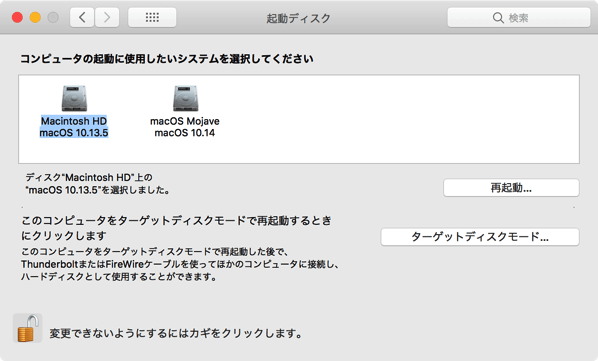

では、快適なデベロッパーライフを！不具合等発生した場合は、フィードバックユーティリティから積極的にAppleにフィードバックしていきましょう！（Apple IDによるサインインが必要です）
