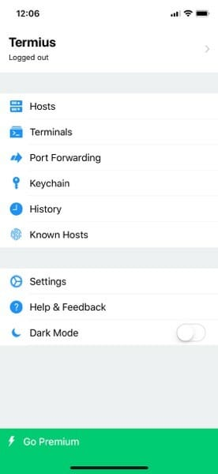
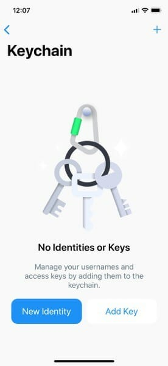
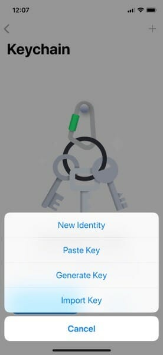
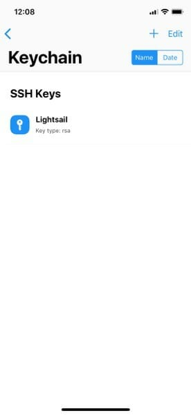
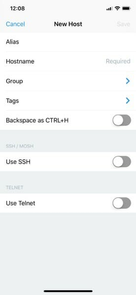
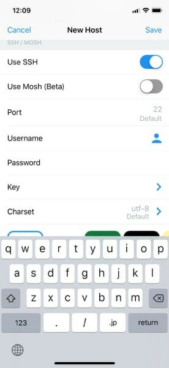
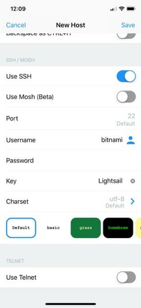
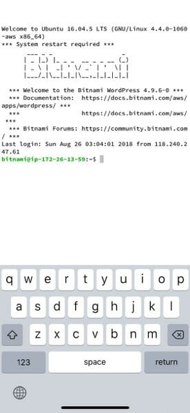

---
author:
- '@ottanxyz'
categories:
- iPhone
- Blog
date: 2018-08-26 00:00:00+00:00
draft: false
tags:
- 秘密鍵
- ec2
- インスタンス
- key
- 公開鍵
title: iPhoneから公開鍵認証（SSH）でAWS Lightsail（EC2）に接続する
type: post
---

iPhoneからAWS Lightsailに公開鍵認証で接続する方法を試してみました。結果的には、Termiusで実現できましたので、今回はその方法を共有してみたいと思います。iPhoneからLightsailに接続できるメリットは、もちろん外出先からちょっとした変更をiPhone経由でお手軽にできることですが、デメリットとしてはiPhone紛失時に秘密鍵が漏れてしまう（iPhoneの認証が通ることが前提）ことがありますので、そのあたり留意しながら試してみていただければと思います。



## AWS Lightsail（EC2）にiPhoneから接続する

まず、一般的にAWS Lightsail（EC2）のLinux系インスタンスに接続する方法は、公開鍵認証のみです。ユーザー、パスワードによる接続はできません。公開鍵認証を使用するメリットとしては、物理的に秘密鍵を保持するデバイス（ユーザー）からのみ接続できるようになるため、ユーザー、パスワード名による認証と比較し、ブルートフォースアタックやパスワード流出によるセキュリティインシデントに強いところにあります。

その反面、秘密鍵が流出してしまうと、対となる公開鍵を配置するすべてのインスタンスに接続できてしまうことになりますので、秘密鍵は他の人に漏れることがないようにしっかりと管理する必要があります。

### iPhoneからLightsailのUbuntuインスタンスにSSH接続する

では、TermiusからLightsailのインスタンス（Linux）に接続してみます。

Termiusを開くと、上図のような画面になります。バージョンによって多少の差異がある可能性があります。まずは、iPhoneに秘密鍵を登録するために「Keychain」をタップします。

「Add Key」をタップします。

Termiusでは、公開鍵・秘密鍵のペアを新規に生成する方法（Generate Key）、秘密鍵をiTunes経由でインポートする方法（Import Key）、秘密鍵をコピー＆ペーストで貼り付ける方法（Paste Key）がありますが、ここではコピー＆ペーストで貼り付けます。「Paste Key」をタップします。

「Name」に秘密鍵を識別できる任意の名前（なんでもいいです）、「Private」に秘密鍵をペーストします。WindowsやMacにダウンロードしたLightsail（またはEC2）のキーペアである秘密鍵をコピーし、iPhoneに貼り付けます。Macであればユニバーサルクリップボード経由で簡単に貼り付けることができます。秘密鍵の共有時に、一時的にオンラインストレージ等に保存して共有することもできますが、鍵自体を公開してしまうと流出の恐れがあるため十分に注意してください。

正しくコピーできていない場合、「鍵のフォーマットが異なる」旨の警告が表示されます。その場合、先頭、末尾に余分な改行や空白が入っていないことを確認してください。正しく、鍵を貼り付けることができた場合は、このように「Keychain」上に鍵が表示されます。

続いて、登録するLightsail（EC2）のホスト情報（IPアドレス、ユーザー名、使用する秘密鍵情報）を登録します。「Hosts」をタップします。

「New Host」をタップしましょう。

「Hostname」にLightsail（EC2）のパブリックIPアドレス（または、名前解決可能なパブリックDNS）を入力します。続いて、「Use SSH」をオンにします。

SSHで接続するための情報を入力します。Portはデフォルトのまま、「Username」はLightsailの場合は「bitnami」、「Password」は使用しないため空白のままです。続いて、先ほど登録した秘密鍵の情報を登録します。「Key」をタップします。

先ほど登録した鍵情報が表示されますので、選択します。

後は、ターミナルの配色テーマをお好みで選択したら、「Save」をタップします。

「Hosts」から登録したホストをタップします。

無事、iPhoneからLightsail（EC2）インスタンスに接続することができました。

### iPhoneからLightsail（EC2）インスタンスに接続できない場合

iPhoneからLightsail（EC2）に接続できない場合は、以下の点を確認してください。なお、Windowsインスタンスに接続したい場合は、別途RDPクライアントを用意してください。

  * Lightsail（EC2）のファイアウォール、セキュリティグループ等で外部IPアドレスからのSSH接続（ポート番号：22）が許可されていること
  * 秘密鍵が正しくインポートされていること。コピー＆ペーストでうまくいかない場合は、iTunes経由でのインポートを試してみましょう。とくにWindowsをお使いの場合は、こちらの方法が安全です（ただし、最新のiTunesでアプリの情報を管理する方法がありませんので、オンラインストレージ等を経由してください）
  * iPhoneから接続可能なパブリックIPアドレス、またはパブリックDNSが登録されていること。（LightsailインスタンスのプライベートIPアドレスが指定されていないこと）