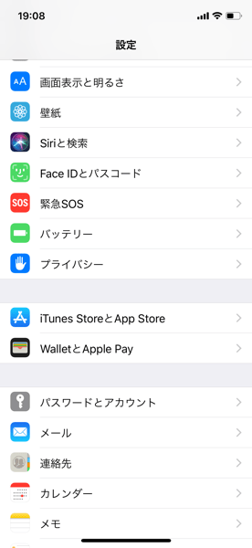
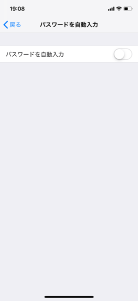
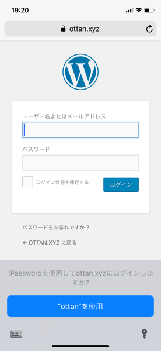
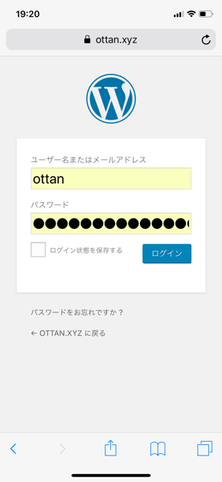
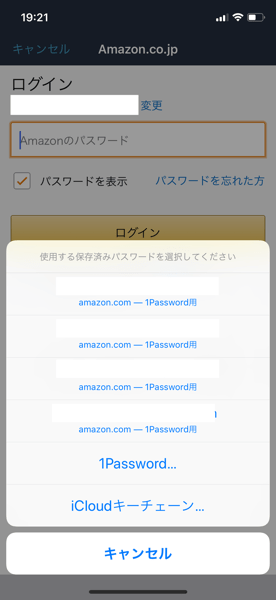
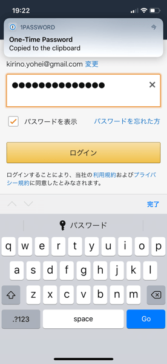
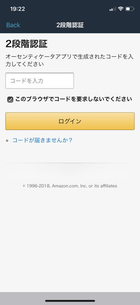

2018年9月18日（火）に、iOS 12の配信が開始されました。Appleは、以前からiOS 12においては、パフォーマンスやセキュリティ面の強化を重視すると宣言しており、iOS 12における新機能の搭載はほぼ見送られるのではないかと思いましたが、蓋を開けてみれば「今すぐ使ってみたくなる」機能が満載の、いつも通りのOSアップデートでした。

その中でも、今回注目したのが、Password APIの強化、およびサードパーティ製アプリへの開放によるパスワード管理アプリの強化。弊ブログでも、以前よりパスワード管理のアプリとしては1Passwordをずっとオススメしていましたが、iOS 12へのアップデートとともに1Passwordの機能が大幅進化しました！

iOS 11までは、たとえばSafariで1Passwordに登録されているパスワードを「自動」入力するためには、アプリのiOS標準の共有メニューを開き、使用するアプリケーションから「1Password」を選択して、Face ID（もしくはTouch IDで認証）して、該当のパスワードを選択して、ようやくパスワードが入力できる、という「半」自動でした。これでも十分に実用的だったのですが、iOS 12ではこの機能がさらに強化され、まさに「ほぼ自動」入力が可能になりました（「ほぼ」といった意味は後述）。実際の画面を見ながら解説します。



## 1Passwordによるパスワードとワンタイムパスワードの自動入力

1Passwordでは、TOTP（時刻同期方式ワンタイムパスワード）の入力にも対応していました。iOS 12へのアップデートにより、ワンタイムパスワードの自動コピーにも対応し、1Passwordにパスワードさえ登録しておけば、何も意識することなくブラウザやアプリを使用することができるようになりました。

### iOS 12の設定

iOS 12にアップデートしたら、まずは「設定」を開きます。「パスワードとアカウント」をタップします。

「パスワードを自動入力」という項目が増えていますので、タップします。

「パスワードを自動入力」を有効化します。一覧に「iCloudキーチェーン」と「1Password」が表示されます（自動入力に対応しているパスワード管理がある場合はそのアプリの名称も）ので、「1Password」をタップします。

### 1Passwordの設定

ほぼ何もすることはありません。先ほど「設定」アプリで「1Password」をタップしたら、自動的に上図の画面に遷移します。遷移しなかった場合は、「1Password」の設定から「Password AutoFill」をタップします。

そのまま「Auto-Copy One-Time Passwords」を有効化します。この項目を有効化しておくことで、パスワード自動入力後に該当サイトのワンタイムパスワードがクリップボードに自動的にコピーされるようになります。完璧ですね。

### Safariで使ってみた

弊サイトのログイン画面を表示した瞬間、画面下部に「1Passwordを使用し〜」という文言とともに、青いボタンが現れますので、そちらをタップします。

1Passwordのセキュリティ設定に応じて「Face ID」（もしくはTouch ID）による認証完了後に、自動的にログインフォームに情報が入力されました。後は「ログイン」ボタンをタップするだけです！便利！冒頭で「ほぼ」と述べたのは、ログイン画面においてはパスワード情報の候補が表示されるにすぎず、最終的には自分で選択する必要があるということです。それでも便利なことに違いはないですね！

### Safariでは使えたけど、その他のアプリでも使えるのか

今回、検証したアプリは「Amazon」です。早速「ログイン」をタップします。Amazonの場合、まず登録しているメールアドレスの入力欄が表示されます。この段階では1Passwordは機能しませんでした。期待が少し薄れてしまったのですが、しぶしぶユーザー辞書に登録されているメールアドレスを入力後、次の画面へ遷移すると・・・。

キーボードに「パスワード」という項目が現れました！先ほどは、「青い」ボタンをタップするだけで良かったのですが、「パスワード」という項目にかわりました。とりあえず、タップしてみると・・・。

候補が複数表示されました！確かに、Amazonに関して言えば「amazon.co.jp」「amazon.com」の他に「Amazon Web Services」用のアカウントも登録してあるため、複数の候補が表示されたようです。Amazonの通常ログインに表示する項目を選択すると・・・。

無事、パスワードがそのまま自動入力されました！また、画面上部に注目していただきたいのですが、パスワード入力とともに、クリップボードにワンタイムパスワードがコピーされた旨が表示されています。

iOS 12ネイティブで実現できるワンタイムパスワードの自動入力とまでは行きませんでしたが、ワンタイムパスワードが自動的にコピーされるため、アプリを切り替える必要がなく、そのままペーストするだけでログインできました、便利！

## まとめ

すべてのアプリで対応しているかどうかは定かではありませんが、ログイン画面に従来の標準のSafari Viewを使用している場合、もともとアプリ内から1Passwordを呼び出すことができたアプリについては、自動連携が使用できそうです。その他、パスワード自動入力に対応しているアプリもありますが、Mac、iPhoneでiCloud同期でき、ワンタイムパスワードの管理、脆弱性のあるパスワード（流出した可能性のあるパスワード）の検出等、機能豊富な1Passwordを今後も手放せそうにありません！
