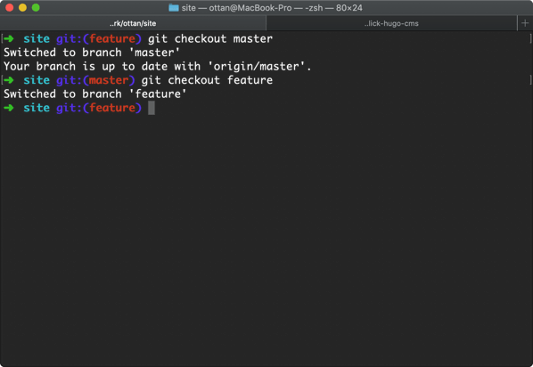
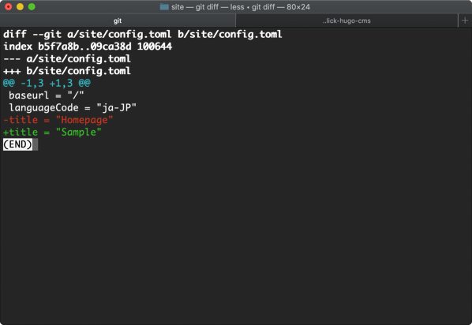
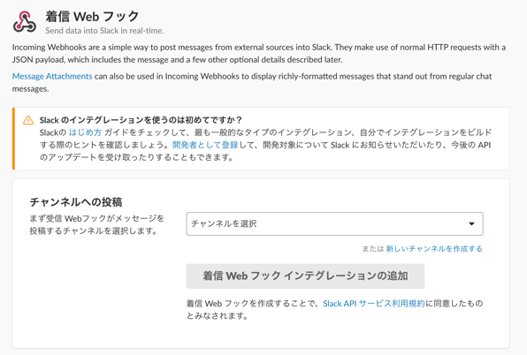
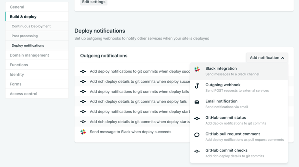
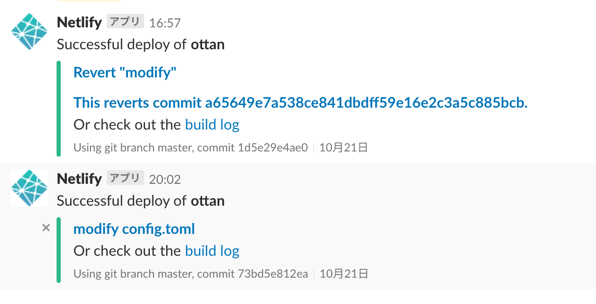

[Netlify CMS（Hugo）で Markdown で記述可能な無料ブログを構築する（構築編）](/posts/2018/10/netlify-cms-hugo-markdown-blog-7017/)で、Netlify 上に静的サイトを構築する方法をご紹介しました。今回は、Hugo（Go 言語の静的サイトジェネレーター）のスターターキットで構築したテーマをカスタマイズして、GitHub 上のソースコードの修正、Netlify による自動デプロイ、デプロイ結果の Slack への通知までを行います。

なお、今回はデプロイすることが目的であるため、IDE（統合開発環境）は使用しませんが、通常は Visual Studio Code などを使用した方が効率的でしょう。

## Netlify CMS のテーマをカスタマイズしてデプロイする

冒頭の記事でも触れましたが、Netlify CMS の基本的な流れは以下の通りです。

1. GitHub からソースコードを取得
2. テーマのソースコードをカスタマイズ
3. カスタマイズ後のテーマを GitHub にプッシュ
4. Netlify による自動デプロイ

デプロイに関しては、Netlify 側で自動実行されるため（デプロイのオプションをカスタマイズすることも可能）、とくに気にする必要はありません。GitHub からソースコードを取得し、最終的に GitHub へプッシュするまでは利用者側の責任となりますので、多少なりとも Git の使い方を習得しておく必要があります。

今回は、基本的な Git の使い方も含めて一連の流れを見ていきたいと思います。いきなり Visual Studio Code などの補助ツールを使用しても良いのですが、まずは基本的な流れを押さえておくと理解がより深まるかと思います。

### GitHub からソースコードの取得

では、まずソースコードを取得するための作業ディレクトリを作成しましょう。今回はホームディレクトリの下に`work`ディレクトリを作成し進めることとします。なお、以下の作業はすべて Mac で実施していますが、流れは Windows でも同様です（別途、Git コマンドの導入は必要です）

    mkdir ~/work

    cd ~/work

ターミナルを開いて上記のコマンドを実行し、作業ディレクトリを作成します。Finder から実行しても構いません。このような作業からターミナルでの作業に慣れておくと、「黒い画面」に対する違和感をなくしていけるでしょう。

続いて、GitHub のリポジトリからソースコードを取得します。

    git clone https://github.com/ottanxyz/one-click-hugo-cms
    cd one-click-hugo-cms

git の「clone」コマンドを使用することで、ローカルのリポジトリにソースコードを取得できます。リポジトリ名のディレクトリが作成されるため、`cd`コマンドで作業ディレクトリを移動します。

### テーマのカスタマイズ

GitHub は、git ベースの分散型バージョン管理システムです。新規バージョンのリリースに向けて作業を実施する人、現行バージョンのバグフィックスを行う人など、複数人で作業を実施するのに向いています。通常、このように複数人で作業を実施する場合は、「ブランチ」と呼ばれる作業ディレクトリの複製を作成して作業を進めます。「ブランチ」を作成しないと、バグフィックスチームによって修正された現行バージョンのバグが、新規バージョン開発チームのソースコードに取り込まれないまま、新規バージョンでまたバグ修正を行うという悪循環に陥ってしまいます。

そのため、たとえば「bugfix」「feature」と呼ばれるブランチを各々のチームがオリジナルのブランチ（master）とは別に作成し、それぞれのブランチで作業した上で、最終的にすべてのブランチのソースコードレビューを得た上で、オリジナルのブランチにマージするということが必要です。この「マージ」によって、バグフィックスチームによる修正箇所と、新規機能開発チームによって作成された箇所を、並行して開発しながら安全に組み込むことができるというわけです。

はじめて git を使用する場合は戸惑うことが多いかもしれませんが、まずは、このような基本的な事項さえ押さえておけば大丈夫です。その他にも「タグ」などの概念もよく利用されますが、今回はひとまずブランチを作成してみましょう。

    git branch feature

    git checkout feature

「feature」というブランチが作成され、`checkout`コマンドによりブランチを切り替えました。これでオリジナルの「master」ブランチに影響を与えることなくソースコードの修正を行うことができるようになります。

今回は、Git による練習を兼ねて、`site`ディレクトリ配下にある、`config.toml`ファイルを編集します。

    vim site/config.toml

config ファイルに記載されているタイトルを、デフォルトの「Homepage」から「Sample」に変更します。ソースコード上から「title」という値を読み取った際に「Sample」に変更されるようになります。

続いて、変更したファイルを現在のリポジトリに反映します。現在編集したファイルはローカルで反映しただけですので、リモートのリポジトリである GitHub には反映されていません。まず、変更する行為を「コミット」と呼びます。変更する前に、変更した箇所の差分を表示するためには以下のコマンドを実行します。

    git diff

以下の図のように変更点のみ表示されます。

さて、修正箇所が確認できたらソースコードをコミットしましょう。コミットするためには、以下のコマンドを入力します。

    git add .
git commit -m "modify config.toml

`add`コマンドは、現在の作業ディレクトリ配下のファイルを Git の管理対象に追加することを意味します。具体的にファイル名を指定したり、今回のようにディレクトリ全体を指定したり、ワイルドカード指定（拡張子指定する場合など）することもできます。余分なものを誤ってコミットしてしまわないように、事前に`add`コマンドで管理対象に追加（ステージング）する必要があります。追加したら、`commit`コマンドでリポジトリに変更を加えます。`-m`オプションでは、そのコミット内容に対する変更点を具体的に明記します。今回は英語で記述していますが、日本語も使用できます。

#### 変更を元に戻したいときは？

ファイルを誤って修正してしまった場合など、元のバージョンに戻したいときがありますが、その場合は下記のコマンドを使用します。

    git checkout .

`.`は、現在のブランチを表しています。そして、`checkout`コマンドは、前述のブランチを変更するためのコマンドでした。これで現在のブランチの状態（変更される前のブランチ）に戻ります。

`commit`コマンドにより、ローカルのリポジトリが最新化されました。なお、同コマンド実行時に下記の図のような内容が表示されたかもしれません。

    Your name and email address were configured automatically based
    on your username and hostname. Please check that they are accurate.
    You can suppress this message by setting them explicitly:

        git config --global user.name "Your Name"
        git config --global user.email you@example.com

    After doing this, you may fix the identity used for this commit with:

        git commit --amend --reset-author

これは、git コマンドによるソースコードをコミットした人の情報が、git のグローバル変数に登録されていないためです。初回のみ、以下のコマンドを実行し、ユーザー情報を登録しておきましょう。

    git config --global user.name <User Name>
    git config --global user.email <Email>

### GitHub へのソースコードのプッシュ

では、今度はリモートのリポジトリ、つまり GitHub に更新内容を反映してみましょう。GitHub には、Pull Request（プルリク）と呼ばれる機能がありますが、今回は使用しません。リモートのリポジトリに登録するためには`push`コマンドを使用します。

    git push origin feature

これで、リモートリポジトリへの登録が完了しました。「feature」ブランチの修正が完了したため、いよいよオリジナルとなる「master」ブランチへ修正内容を反映しましょう（この作業を「マージ」と言います）。

    git checkout master
    git merge feature

一度、ブランチ作成元となる「master」ブランチに切り替えた後（checkout）、「merge」コマンドにより修正したブランチの名前を指定してマージを行います。

    Updating 73bd5e8..16409c0
    Fast-forward
     site/config.toml | 2 +-
     1 file changed, 1 insertion(+), 1 deletion(-)

今回修正した「config.toml」が自動的に「add」されていることがわかります。最後に、「master」ブランチの内容を確定させます。

    git push

以上で、GitHub 上のオリジナルのソースコードの修正が完了しました。流れを簡単にまとめると以下の通りとなります。

1. 「branch」コマンドで新規ブランチを作成する
2. 「checkout」コマンドで作成したブランチにローカルリポジトリを切り替える
3. ソースコードを修正する
4. 「add」コマンドでコミット対象とするファイルを確定する
5. 「commit」コマンドでローカルリポジトリの修正内容を確定する
6. 「push」コマンドでリモートリポジトリ（GitHub）のブランチの修正内容を確定する
7. 「merge」コマンドでオリジナルのブランチと新規作成したブランチの内容をローカルリポジトリ上でマージする
8. マージした内容に問題がなければ「push」コマンドでリモートリポジトリ（GitHub ）のオリジナルの修正内容を確定する

`git`の使い方に慣れていないと、初めのうちは戸惑うかもしれません。しかし、1 つ 1 つの内容を理解すれば、各コマンドで実行している内容はそれほど難しいものではありません。まずは、1 つ 1 つ今実行しているコマンドの内容を理解しながら進めてみてください。もちろん、ブランチを作成する必要がない場合は、「add」「commit」「push」で終わります。

### Netlify による自動デプロイ

ここはとくに説明する必要はありません。通常、デプロイは利用者自身が行う必要がありますが、Netlify はデプロイを自動で行ってくれるため、利用者が意識する必要はありません。あくまでソースコードの修正だけです。

### デプロイ結果の Slack への通知

デプロイ結果は、Netlify の管理ページから確認することもできますが、毎回 Netlify の管理ページを確認するのは手間がかかります。また、デプロイが成功していれば問題ありませんが、万が一デプロイが失敗してしまった場合、修正内容を反映できません。今回は、デプロイが成功したら Slack に通知するよう Slack の Webhook を利用します。

Slack でチャンネルを作成します。デフォルトの「general」チャンネルでも問題ありませんが、通知を分割するために個別のチャンネルを作成することをオススメします。チャンネルを作成したら、[着信 Web フック](https://slack.com/services/new/incoming-webhook)にアクセスします。

作成したチャンネルを選択して「着信Web フックインテグレーションの追加」をクリックします（少しおかしな日本語訳な気もしますが）。

「Webhook URL」が生成されるのでコピーしておきます。URL をコピーしたら、Netlify にサインインしてダッシュボードに移動します。

サイドメニューから「Build & Deploy」を選択し、最下部にスクロールします。「Deploy notifications」という項目がありますので、「Add notification」をクリックします。「Slack integrations」というメニューがあるため、こちらをクリックします。

通知のタイミングは、「デプロイ開始時」（Deploy started）、「デプロイ成功時」（Deploy succeeded）、「デプロイ失敗時」（Deploy failed）等から選択可能です。今回は「デプロイ成功時」を選択します。また、「Slack Incoming Webhook URL」に先ほどコピーした URL をペーストします。

以降は、デプロイが成功したタイミングでコミットメッセージとともに、Slack に通知されるようになります。必要に応じて、他のタイミングのメッセージを追加しておくと、デプロイを追跡できるようになるかと思います。
