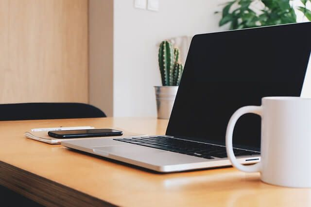
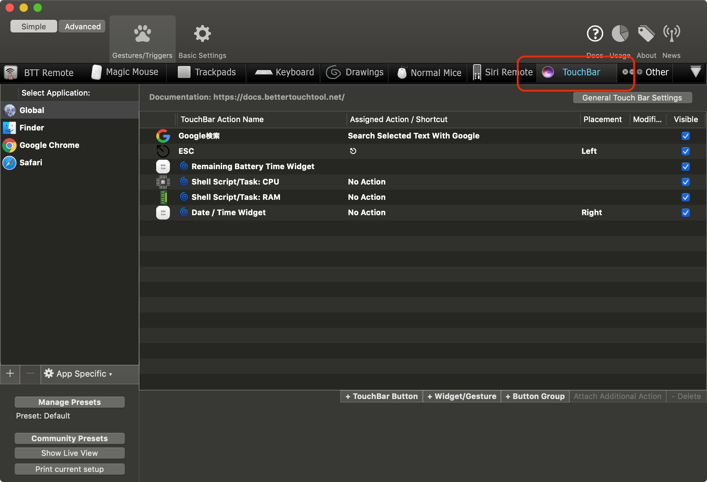
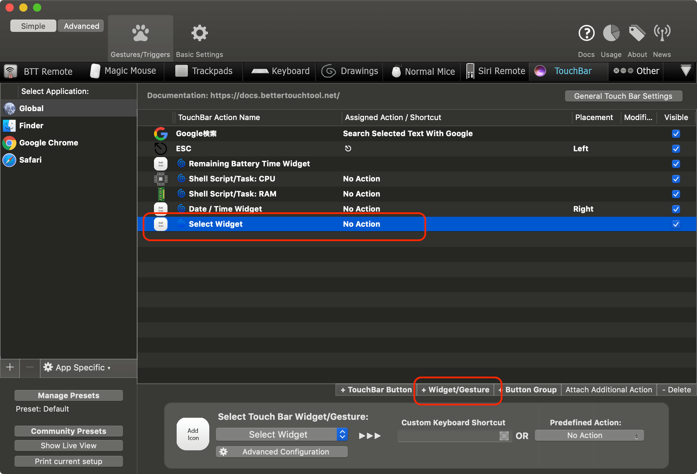
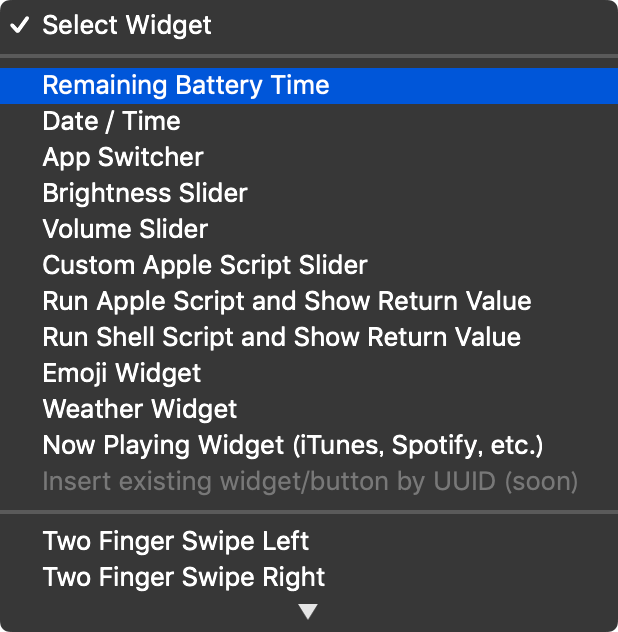
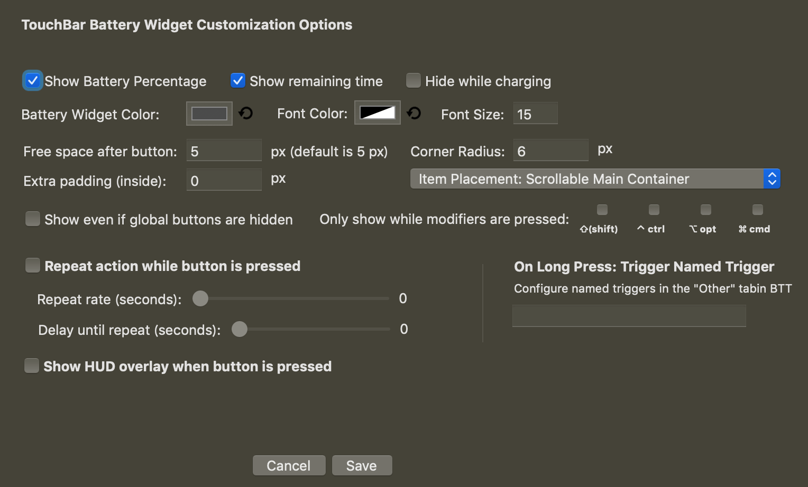
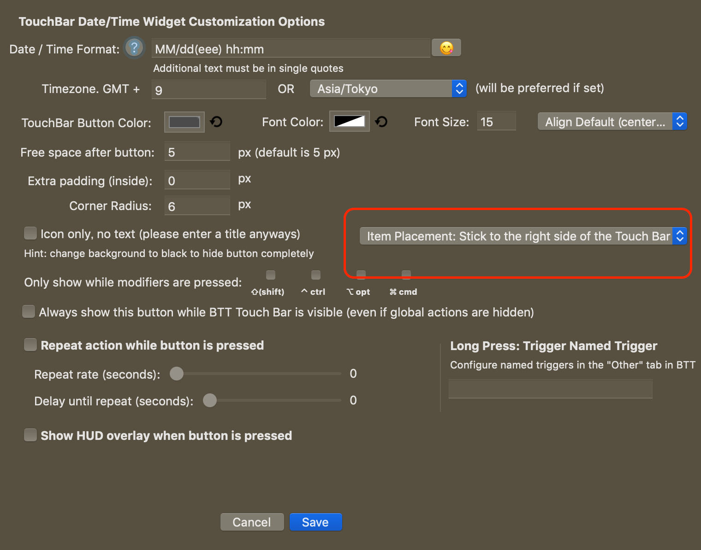

---
author:
- '@ottanxyz'
categories:
- Mac
date: 2018-11-25 00:00:00+00:00
draft: false
tags:
- bar
- touch
- ウィジェット
- escキー
- ps
title: MacBook ProのTouch BarにCPU、メモリ使用率、バッテリー残り時間、日時、ESCキーを表示して、メニューバーをスッキリさせる
type: post
---



MacBook Pro の Touch Bar 使用してますか？先日の Apple のスペシャルイベントで、Touch Bar 無し、Touch ID 有りの MacBook Air が発表されて、手持ちの MacBook Pro の Touch Bar の行方が気になりそわそわしている皆様こんばんは。



せっかくの Touch Bar ですから使わないと損じゃないですか。⇧+⌘+6 で Touch Bar 単独のスクリーンショットを撮影することもできます。今回は、上記のスクリーンショットのように、Touch Bar に常時 ESC キーや日時、バッテリー残表示させてみます。通常であれば、日時やバッテリーについては、メニューバーに表示されているものですが、Touch Bar を使用させることで、メニューバーの見た目もスッキリです！

## BetterTouchTool を使用して Touch Bar をカスタマイズする

恐らく BetterTouchTool が無かったら、Touch Bar はまさに「宝の持ち腐れ」状態だったかもわかりません。でも、もう大丈夫です。BetterTouchTool さえあれば、もう貴方の Touch Bar は思うがままです。

[folivora.ai - Great Tools for your Mac!](https://folivora.ai/)

BetterTouchTool は有償ソフトウェアですが、同社の提供する BetterSnapTool のライセンスがあれば、そのライセンスと併用することも可能です。とはいえ、日々のコーヒーを我慢すれば買えなくはない、むしろ買わなきゃ損なツールですので、Touch Bar 目的でなくても MacBook 使用者の方々は導入して損はないはずです。

### BetterTouchTool を使用して、Touch Bar にバッテリー残量を表示してみよう

早速、BetterTouchTool で Touch Bar を編集してみます。BetterTouchTool の環境設定はメニューバーから開きます。メニューバーの同ソフトウェアのアイコンをクリックして「Preferences」を選択してください。



さまざまな項目が並んでいますが、メニューの中から「TouchBar」を選択してください。



続いて、「+ Widget/Gesture」ボタンをクリックして、ウィジェット追加します。



続いて、画面下部の「Select Touch Bar Widget/Gesture」のメニューから「Remaining Battery Time」をクリックします。



ウィジェットの詳細が表示されますが、そのままで十分に実用的です。そのまま、「Save」ボタンをクリックします。



これでバッテリー表示は完成です。このように BetterTouchTool を使用すれば、ファンクションキーが使えなくなったムダな領域が、意味のある領域として蘇ります。バッテリーを Touch Bar に任せることで、メニューバーの項目をまた 1 つ減らすことができました。

### JSON 形式の情報をコピーして BetterTouchTool に貼り付ける

ここまでで感じたことは「やっぱり面倒臭い」、そんなことを感じた貴方には朗報があります。諦めるのはまだ早いです。BetterTouchTool には、設定のエクスポート、インポート機能があります。しかも、エクスポートされたファイルは JSON 形式ですから、そのコードさえ公開されていれば、誰でも共有できます。



BetterTouchTool の環境設定を開いたら、何もないところで右クリックしてみてください。「Paste from JSON in clipboard」という項目が表示されるはずです。あらかじめ JSON コードをクリップボードにコピーしておき、これで貼り付けて新しいウィジェットを手軽に作成できます。

というわけで、ここからは筆者が使用しているウィジェットの内容を貼り付けておきますので、ぜひ使ってみてください。

#### バッテリー残量表示



#### CPU 使用率



#### メモリ使用率



CPU、メモリ使用率について補足します。CPU、メモリ使用率は macOS 標準の下記コマンドを使用して取得したものを表示しています。つまり、`ps`コマンドで取得可能な、プロセス毎の CPU、メモリ使用率の累計です。

    ps -A -o %mem | awk '{s+=$1} END {print s "%"}'

[TOP と PS の CPU 使用率の違いについて | ハックノート](https://hacknote.jp/archives/10596/)の記載にもありますが、`ps`コマンドによる取得できる CPU、メモリ使用率は、「プロセスの生存期間中に実行に利用した時間のパーセンテージで表される」です。よって、`ps`コマンドで取得した使用率は、その瞬間のものではなく、あくまでプロセスが生存中に使用したリソースの時間です。そのため、すべてのプロセスの合計を計算すると 100 を超えてしまうことがあります。あくまで目安的にお使いください。CPU 使用率の場合は、厳密には`top`コマンドを使用する方が良いでしょう。

#### 日時



日時のウィジェットは、Touch Bar の右寄せにしています。ウィジェットの詳細設定で、「Item Placemment: Stick to the right side of the Touch Bar」を選択することで、ウィジェットを右寄せ固定にできます。



#### Esc キー



ESC キーについては、左上に表示されていた方が、従来のキーボード同様の使い勝手になると思われるため、左寄せ固定にしています。ウィジェットの詳細設定で、「Item Placemment: Stick to the left side of the Touch Bar」を選択することで、ウィジェットを右寄せ固定にできます。



## まとめ

今回は Touch Bar の空きスペースを有効活用して、普段何気なくメニューバーに表示させているものを移動させてみたり、Touch Bar によって消えてしまった物理 ESC キーを復活させてみたりしてみました。BetterTouchTool を使用することで、Touch Bar はさまざまにカスタマイズすることが可能ですので、ぜひお試しください。
