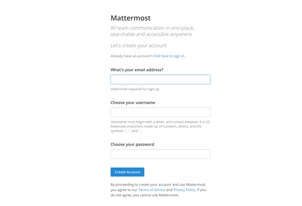
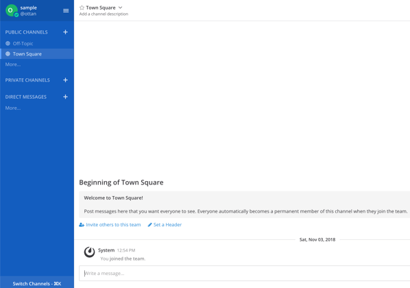

読者の皆さんの職場でのコミュニケーションツールは充実していますか？筆者の勤める職場では残念ながら充実しているとは言えず、コミュニケーションツールと言えば、「電話」「メール」と、誰も使わない mixi まがいの謎の「社内 SNS」だけです。昔の職場ではこれで良かったのかもしれませんが、イマドキの技術者同士の会話ではこのようなことが起こります。

- フロアが離れている営業担当に連絡を取るために電話してみた → 不在だったため折り返し待ちとなったが、連絡が取れないまま翌日持ち越し
- 電話での連絡が取れなかったためメールを送信 → メールを送っておきましたので見てくださいという謎の電話をする
- わざわざ電話したにもかかわらずメールの内容を確認してもらえておらず、次の日の打ち合わせの意識がまったく合わない

信じられないかと思いますが、これが現実です。

## クローズドな環境でも使用できる Mattermost

「Mattermost」は、Slack コピーと呼ばれるほど、Slack とほぼ同等の機能を備えた OSS です。Slack for Business 使えよ、と言われればそれまでなのですが、大人の事情でそういったサービスを十分に満喫することができる環境ばかりとは限らないのが現状なのです。また、OSS なのでライセンスの範囲内で無償で使用できるところも、「Mattermost」の強みでしょうか。

「社内から社外に接続するためにはプロキシが」。あると思います。そこで今回は、社内にプロキシ環境があり、インターネット接続はプロキシ経由が必須という状況を想定してセットアップします。

### VirtualBox、Vagrant のインストール

Mattermost をインストールするためには、Linux 環境が必要です。職場の環境は Windows 7 Professional です。Windows 10？そのような潤沢な環境が整備されているはずがありません。今回は Windows 7 を使用します。Windows 10 Enterprise であれば Docker を使用して簡単に構築できますが、そのような潤沢な（以下、割愛）。そもそも、Docker や Windows 10 や Linux など、環境が整備されていれば、たいていの場合 Slack などのその他のコミュニケーションツールが充実しています。

まずは、Windows 7 上で Linux 環境（今回は、CentOS 7 を使用します）を整えるために VirtualBox と、VirtualBox 上の仮想マシンを簡単にプロビジョニングできる Vagrant を使用します。以前、弊サイトでも Vagrant についてはご紹介したことがあります。え、「VirtualBox」や「Vagrant」すらインストールできる環境がない。管理者に相談してダメなら転職を考えます。現実を訴えて環境を変えてもらいましょう。

VirtualBox、Vagrant は、それぞれ以下のリンクからダウンロード可能です。

- [Downloads – Oracle VM VirtualBox](https://www.virtualbox.org/wiki/Downloads)
- [Vagrant by HashiCorp](https://www.vagrantup.com/)

### 仮想マシン（CentOS）のセットアップ

では、VirtualBox と Vagrant の準備が整ったところで、仮想マシンのセットアップを始めていきましょう。コマンドプロンプトを開いたら、以下のコマンドを実行して仮想マシンのイメージファイルをダウンロードします。

    vagrant box add centos/7

ダウンロード前にプロバイダー（仮想マシン動作環境）を尋ねられます。

    1) hyperv
    2) libvirt
    3) virtualbox
    4) vmware_desktop

今回は「virtualbox」を選択しましょう。あとは自動的に仮想マシンのイメージのダウンロードが始まります。

セットアップが途中で止まりましたか？もしくはセットアップがまったく進む気配がありませんか？忘れてました、コマンドプロンプトではデフォルトではプロキシ経由で通信が行われないため、ダウンロードが始まりません。というわけでコマンドプロンプト上で以下のコマンドを実行しておきましょう。

    set HTTP_PROXY=http://<Proxy Host Name>:<Port>
    set HTTPS_PROXY=http://<Proxy Host Name>:<Port>

もしくは、「ユーザー環境変数」または「システム環境変数」に上記の環境変数を追加しておくと便利です。次回以降、プロキシに惑わされないために環境変数を追加しておきましょう。

    vagrant init centos/7
    vagrant up

仮想マシンのイメージのダウンロードが完了したら、早速起動します。まず、最初のコマンドでカレントディレクトリに「Vagrantfile」と呼ばれる Vagrant の設定ファイルが作成されます。次のコマンドで「Vagrantfile」に基づき仮想マシンを起動します。今回は、ただイメージ名を指定しただけなので、単純に事前にダウンロードした仮想マシンのインストールが始まります。なお、「vagrant」コマンドは「Vagrantfile」がないと使用できませんので、エラーが出たら同ファイルがあるかどうか確認してください。

    ==> default: Machine booted and ready!
    ==> default: Checking for guest additions in VM...

途中でこのような文字列が出力されたら仮想マシンの起動は完了していますが、いったん最後まで慌てずに仏の心で待ちましょう。

    vagrant ssh

Vagrant により作成した仮想マシンにログインするためには、公開鍵認証による認証が必要ですが、「Vagrant」には便利なコマンドが用意されています。上記のコマンドを実行することで、SSH で仮想マシンに接続できます。「え、Windows のコマンドプロンプトを使用したくない」「Windows といえば TeraTerm だろう」。そう思った方々には、便利な Vagrant のプラグインがあります。

    vagrant plugin install vagrant-teraterm
    vagrant teraterm

「vagrant-teraterm」という便利なプラグインがあります。ぜひ追加しておきましょう。「Vagrantfile」のある場所で上記のコマンド（厳密には 1 行目は初回のみ）を実行することで、「vagrant ssh-config」の結果に基づき自動的に TeraTerm が起動し、自動的に仮想マシンに接続してくれます。便利な世の中ですね。

### 仮想マシン（CentOS）の初期セットアップ

以下、すべて TeraTerm 上で作業をしていることを想定しています。TeraTerm がない？辛いですがコマンドプロンプトで頑張りましょう。まず、初めに CentOS 7 のリポジトリとパッケージを最新化します。

    sudo yum update -y &&
    sudo yum upgrade -y

早速、躓きましたか？ご想像通りデフォルトではプロキシ経由で通信が行われるわけがないため、リポジトリもパッケージも最新化できません。さっき設定したプロキシは Windows 7 上でした。CentOS にも必要です。困ったものです。そこで、以下の環境変数をセットアップしておきましょう。プロキシサーバの情報は、コマンドプロンプトで設定した内容と同様です。

    export http_proxy=http://<Proxy Host Name>:<Port>
    export https_proxy=http://<Proxy Host Name>:<Port>
    export ftp_proxy=http://<Proxy Host Name>:<Port>

しかし、この環境変数は現在のセッションのみ有効であるため、ログアウトする度に消滅してしまいます。毎回ログインする都度、プロキシのために時間を費やすのは勿体  ないので、「.bash_profile」の最下部に上記の内容を追記しておきましょう。

    vi ~/.bash_profile

気を取り直して、もう一度冒頭のコマンドを実行します。・・・状況が変わりませんか。ダウンロードが進まないですか。原因は「sudo」にあります。単純に「sudo」しただけでは環境変数の内容が引き継がれないため、「sudo」した瞬間にプロキシの情報の内容が失われてしまいます。「sudo」のオプションに毎回プロキシの情報を付与しても良いのですが、せっかく「.bash_profile」まで準備したのにもったいないですね。そこで、以下のコマンドを実行して、「/etc/sudoers」の内容を編集します。

    sudo visudo

「/etc/sudoers」の内容は多岐に渡りますが、その中に「env_keep」と呼ばれる、「sudo」した際に引き継ぐ環境変数を設定することができる項目があります。「env_keep」という単語を検索して以下の行を見つけてください。そして、その直後に「.bash_profile」に設定した環境変数の内容が引き継がれるように設定します。

    ...
    Defaults    env_keep += "LC_TIME LC_ALL LANGUAGE LINGUAS _XKB_CHARSET XauthorITY"
    Defaults    env_keep += "http_proxy https_proxy ftp_proxy"

「env_keep +=」の「+」を忘れないでください。「env_keep」に追記するという意味です。「+」をつけないと前の行までの設定が失われてしまいます。さて、「/etc/sudoers」の編集が完了したら、もう一度冒頭のコマンドを実行します。今度はうまく実行できましたか？次回以降は不要な作業ですので、とりあえず我慢してセットアップを進めましょう。

### CentOS 7 に Docker CE をインストールする

続いて、CentOS 7 に Docker（コミュニティエディション）をインストールします。Windows 7 Professional では、「Docker？ナニソレ？」状態でしたが、「CentOS」があれば何でもできます。恐れずにいきましょう。基本的には、[Get Docker CE for CentOS | Docker Documentation](https://docs.docker.com/install/linux/docker-ce/centos/)の内容にしたがってセットアップを進めていきます。Docker のバージョンによって、インストール手順に差異がある可能性がありますので、引っかかったら上記の URL を参考にしてみてください。

    sudo yum install -y yum-utils device-mapper-persistent-data lvm2 git
    sudo yum-config-manager --add-repo https://download.docker.com/linux/centos/docker-ce.repo

まずは、Docker の動作に必要な前提パッケージをインストールします。また、CentOS セットアップ初期の段階では「yum」のリポジトリに Docker がありませんので 2 行目のコマンドでリポジトリに Docker を追加します。なお、Docker に「git」は必要ありませんが 、あとで使用しますのでついでにインストールします。「vim」とか「wget」とか追加しておきたいパッケージがあれば適当に好みに合わせてインストールしてくださいね。

    sudo yum install docker-ce

続いて、上記のコマンドで Docker をインストールします。プロキシのセットアップが終わっているのでスムーズに進むでしょう！え、プロキシサーバや回線がボトルネックになってダウンロードが進まない？混雑していない時間帯を狙って実行しましょう。勤務開始時間帯や昼休憩は極端にダウンロード速度が遅くなるというのはよくある光景です。

     Userid     : "Docker Release (CE rpm) <docker@docker.com>"
     Fingerprint: 060a 61c5 1b55 8a7f 742b 77aa c52f eb6b 621e 9f35
     From       : https://download.docker.com/linux/centos/gpg

先ほどの URL にも記載されていますが、インストールしようとしている Docker のフィンガープリントの情報が上記と一致していることを確認してください。というか確認させられるので、確認したらインストールしてください。

    sudo systemctl enable docker.service
    sudo systemctl start docker

CentOS 7 では、「systemd」が使用されています。CentOS 6 以前のバージョンと少々異なりますので、大人の事情で CentOS 7 が使えない場合は、上記のコマンドは読み替えてください。「systemd」に Docker のサービスを登録して、OS 再起動後も自動的に Docker デーモンが起動されるようにしておきます。

これで、Docker のインストールは完了！といきたいところですが、「Docker で起動したコンテナーってプロキシ経由しないからビルドできないんじゃ・・・」「Docker ってプロキシの設定どうするんだっけ」。ご認識の通りです。Docker にもプロキシの設定をしてあげる必要があります。

    sudo mkdir /etc/systemd/system/docker.service.d
    sudo touch /etc/systemd/system/docker.service.d/http-proxy.conf

「systemd」のサービスのディレクトリの下に設定ファイルを追加します。今回は「http-proxy.conf」というそれっぽい名前のコンフィグファイルを作成しました。続いて、「vi」なり「nano」なり「vim」なりで、同ファイルを編集します。

    [Service]
    Environment="HTTP_PROXY=http://<Proxy Host Name>:<Port>" "HTTPS_PROXY=http://<Proxy Host Name>:<Port>" "NO_PROXY=localhost"

上記の内容をコピー＆ペーストで貼り付けてください。プロキシの内容は、これまで散々繰り返してきましたので、もうホスト名もポート名も覚えましたね。サクッと設定ファイルに追記してください。

    systemctl daemon-reload
    systemctl restart docker

Docker にプロキシを認識させます。「systemd」を再起動したら、Docker のサービスを再起動します。

    docker -v

Docker のバージョンが表示されましたか。

    Docker version 18.06.1-ce, build e68fc7a

### Docker Compose のインストール

[Docker Compose で WordPress 環境をもっと楽に管理しよう！](/posts/2017/04/docker-compose-wordpress-5694/)でもご紹介していますが、Mattermost も「Docker Compose」を使用します。[Releases · docker/compose](https://github.com/docker/compose/releases/)に最新のインストール手順がありますので、基本的にはそちらを参照してください。今回は、執筆時点で最新のバージョンである「1.22.0」を使用することを前提にインストールを進めます。

    sudo curl -L "https://github.com/docker/compose/releases/download/1.22.0/docker-compose-$(uname -s)-$(uname -m)" -o /usr/local/bin/docker-compose
    sudo chmod +x /usr/local/bin/docker-compose

なんだか複雑そうなことをしているように見えますが、「docker-compose」コマンドを「curl」コマンドで「/usr/local/bin」にダウンロードして、「chmod」コマンドで実行権限を付与しているだけです。

    sudo docker-compose --version

一般ユーザーで「docker-compose」コマンドは使用できないため、「sudo」してから実行します。まずは、典型的なコマンドのバージョン確認から行います。プロキシもくそったれもないので、ここはすんなりコマンドが通るはず。と思いきや・・・

    sudo: docker-compose: command not found

「env」しても「PATH」に「/usr/local/bin」があるにも  かかわらず、「docker-compose」が見つからないと言われます。はい、今回もご想像通り「sudo」が原因です。「sudo」した際に「/usr/local/bin」が PATH に含まれないためコマンドの実行に失敗していることが原因です。かといって、毎回絶対パスで実行するのは何だか気が引けます。というわけで「/etc/sudoers」を編集します。

    sudo visudo

「secure_path」と呼ばれる項目を探してください。「sudo」した際に通すパスを設定する項目です。デフォルトでは「/usr/local/bin」が含まれていないことがわかります。そこで、末尾に「:/usr/local/bin」を追加します。

    Defaults    secure_path = /sbin:/bin:/usr/sbin:/usr/bin:/usr/local/bin

「:」を忘れないでください。「:」はセパレータです。「:」がないと、意味不明なパス「/usr/bin/usr/local/bin」が追加されてしまいます。編集したら気を取り直して再度同じコマンドを実行します。

    docker-compose version 1.22.0, build f46880fe

### Mattermost のセットアップ

ここまで来るのに随分長いこと時間がかかりました。「sudo」は、職場の環境のせいではありません。怒らないでください。あ、プロキシに関しては職場の環境のせいです。心を鎮めながら作業してください。では、いよいよ大詰めの作業です！Mattermost をようやくセットアップします。といってもコンテナー動かすだけです、めっちゃ簡単です。Docker 愛してる。

    git clone https://github.com/mattermost/mattermost-docker.git
    cd mattermost-docker

Mattermost の公式リポジトリ（GitHub）からダウンロードします。[Production Docker Deployment — Mattermost 5.4 documentation](https://docs.mattermost.com/install/prod-docker.html)の手順を参考にしています。バージョンによってインストール手順に差異がある可能性があります。その場合は、上記 URL を参照してください。

    sudo docker-compose build

まず、コンテナーをビルドします。といっても、「docker-compose」実行するだけです。もうプロキシも「sudo」もすべて設定が終わっているので、今回こそコマンド一発で終わりです。

    mkdir -pv ./volumes/app/mattermost/{data,logs,config}
    sudo chown -R 2000:2000 ./volumes/app/mattermost/

続いて、Docker コンテナー上のホストにマウントするボリュームの設定をします。公式のインストール手順に従います。

    sudo docker-compose up -d

そして、最後にコンテナーを起動します。「-d」はバックグラウンド（デーモン）として起動するということです。「-d」をつけないと、プロンプトが返ってきません。「Ctrl + C」で終わらせるとコンテナーのプロセスが終了しています。ただし、起動しない場合の原因切り分け等の目的であれば「-d」をつける必要ありません。これで、ローカルホスト上の「80」番ポートで待ち受けられている状態になりました。

    ss -ltn

80 番ポートでリッスンされている状態を確認しましょう。「ss」コマンドって便利ですね。この「80」番は「docker-compose.yml」で指定されています。変えることもできますが、基本的にはデフォルトのままで良いと思います。同時に「Apache」や「ngnix」など動かしたくて「80」番が埋まってる、時には変えましょう。

ちなみに、起動しているコンテナーの一覧を表示させるためには、以下のコマンドを実行します。

    sudo docker ps

以下のように表示されます。

    CONTAINER ID        IMAGE                   COMMAND                  CREATED             STATUS                    PORTS                                      NAMES
    6f0ed2f52e96        mattermost-docker_db    "/entrypoint.sh post…"   3 hours ago         Up 11 minutes (healthy)   5432/tcp                                   mattermost-docker_db_1
    2b9c2613e933        mattermost-docker_web   "/entrypoint.sh"         3 hours ago         Up 11 minutes (healthy)   0.0.0.0:80->80/tcp, 0.0.0.0:443->443/tcp   mattermost-docker_web_1
    ed129a8ba687        mattermost-docker_app   "/entrypoint.sh matt…"   3 hours ago         Up 11 minutes (healthy)   8000/tcp                                   mattermost-docker_app_1

コンテナーが内部で標準出力、エラー出力に吐いたログは、「logs」コマンドで確認できます。

    sudo docker logs 6f0ed2f52e96

末尾の数値はコンテナーの ID です。「ps」で表示されたコンテナーの ID を指定してください。なんか色々出てきますが、とりあえず今回はアクセスできれば OK とします。

### Vagrantfile の編集（ポートフォワーディングの設定）

さて、仮想マシン上のコンテナー上で Mattermost が「80」番ポートで待ち受けしていますが、まだ、外部からこの「Mattermost」にアクセスできない状況です。そこで、ホスト OS（ややこしいですが、仮想マシンのホスト OS という意味で、今回は Windows 7 Professional を指します）のポートと、仮想マシンでポートフォワーディングの設定を追加します。ホスト OS の「○○ 番ポートにアクセスしたら、仮想マシンの ○○ 番ポートに転送する」という意味で「ポートフォワーディング」と呼ばれます。

ポートフォワーディングの設定を行うために、ホスト OS 上の「Vagrantfile」を編集しましょう。「VirtualBox」で行うことももちろんできるのですが、「Vagrantfile」で管理しておくことで、環境が変わっても（動作させるマシンが変わっても）そのまま利活用できるのが便利なのです。

    config.vm.network "forwarded_port", guest: 80, host: 8080

上記の行がコメントアウトされている（先頭に「#」が付いている）と思いますので、コメントアウトを解除します。その際に、「guest」は「80 番」（コンテナーのポート番号）を指定してください。「host」側はたいていの場合「80 番」とか使えないことが多いので適当な番号に割り振ってください。「netstat -an」で使われていないポートを使ってください。今回は「8080」番にしました。

    vagrant reload

「Vagrantfile」を編集したら、仮想マシンに設定を反映させるために再起動します。「reload」コマンドが便利です。

### 動作確認！

長いことお疲れ様でした。Docker 使うためにこんなに苦労するとは思いませんでした。では、ホスト OS（Windows 7）のブラウザ（できれば Chrome か Firefox 使いましょう、IE だと Slack のメンションのようなものの通知を受け取ることができないかもしれません）。

    http://localhost:8080/

無事に画面が表示されましたでしょうか！おめでとうございます！これで、Slack がなくても Mattermost があればいきていける最初の土台が作られました。

え、自分の PC 以外からもアクセスさせたい。そのような場合には、「ipconfig」コマンドで自 PC の IP アドレスを確かめましょう。「localhost」指定の代わりに、その IP アドレスでアクセスすれば他の PC からもアクセスできます。「そのアクセスすら禁止されていた？」もう諦めて転職しましょう。

Mattermost の使い方は、ほぼ Slack と同等です。むしろ、Markdown 形式で書けるとか、Slack 以上の拡張を最初から備えてたりします。また、Webhook とかもちろん使えます。では、良き Mattermost ライフを！
