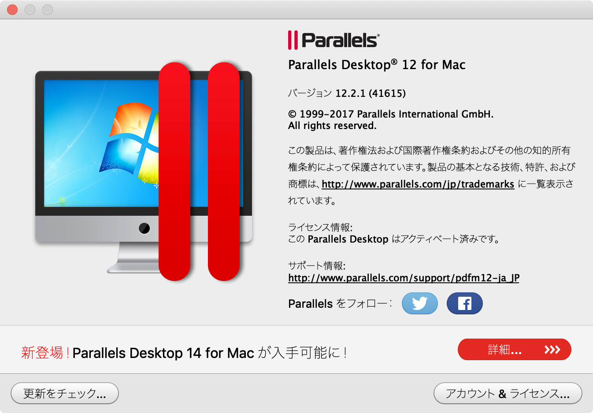

---
author:
- '@ottanxyz'
categories:
- Mac
date: 2019-01-12 00:00:00+00:00
draft: false
tags:
- parallels
- tools
- ubuntu
- 日本語
- mozc
title: Parallels Desktop 12 for MacでUbuntu 18.04 LTSへのParallels Toolsのインストールに失敗する場合の対処法
toc: true
type: post
---


Parallels Desktop 12 for Mac では、Ubuntu 18.04 LTS が正式にサポートされていません。最新バージョンである Parallels Desktop 14 for Mac にアップグレードすることで、正式に Ubuntu 18.04 LTS がサポートされます。ただ、Parallels Desktop 12 for Mac で現状不満を感じることもないため、自己責任で同バージョンに Ubuntu 18.04 LTS をインストールしてみました。



なお、Ubuntu 18.04 LTS の ISO ファイルは以下のリンクからダウンロード可能です。

-   [Download Ubuntu Desktop | Download | Ubuntu](https://www.ubuntu.com/download/desktop)

## Ubuntu 18.04 LTS のインストールには成功するものの、Parallels Tools が動作しない

Parallels Desktop for Mac には標準で Parallels Tools が提供されています。Parallels Tools で提供されている主な機能は以下の通りです。

-   マウス入力のキャプチャ、自動的な解放（Ctrl + Option キーによるマウス入力の手動の解放が不要に）
-   ホスト OS（今回の場合は Mac）との時刻同期
-   ドラッグ＆ドロップによるホスト OS、仮想マシン間のファイル共有
-   ホスト OS と仮想マシン間のクリップボードの共有
-   解像度の最適化

その他にもさまざまな機能がありますが、とくにマウス入力の自動的な解放、クリップボードの共有、解像度の最適化は仮想マシンを使用する上でも欠かせない機能でしょう。

ところが、Ubuntu 16.04 LTS では正常にインストールできた Parallels Tools が、Ubuntu 18.04 LTS ではインストールできません。その原因は、Ubuntu 16.04、18.04 間のカーネルのバージョン差異に起因するようです（Linux Kernel 4.15 で下位互換のない変更が行われています）。

Gist に、有志による解決策が提供されていましたのでご紹介します。

-   [Parallels Tools fix for Ubuntu 18.04 and other Linux distributions with Kernel version >= 4.15](https://gist.github.com/rudolfratusinski/a4d9e3caff11a4d9d81d2e84abc9afbf)

### Parallels Tools のインストール方法

解決策を確認する前に、Ubuntu への Parallels Tools のインストール方法について確認しておきましょう。

Parallels Tools をインストールするには、メニューの「デバイス」→「Parallels Tools のインストール」を選択します。デスクトップに、CD-ROM のアイコンの「Parallels Tools」が表示されればマウント完了です。

ターミナルを開き、以下のディレクトリに移動できることを確認しましょう。

```bash
cd /media/<user name>/Parallels Tools
```

ただ、Parallels Desktop 12 for Mac では、上記でマウントされたように見えても、上記ディレクトリへ移動できない、移動できても内容が空になることがあります。原因は不明ですが、以下の方法で大抵なおります。

1. すべてのマウントされているメディアを取り出す（デスクトップの CD-ROM のアイコンを右クリックして「Eject」）
2. メニューから再度「Parallels Tools のインストール」を選択する（必要に応じて複数行う）

上記のディレクトリにインストールしたら、`sudo ./install`を実行します。これで Parallels Tools のインストールは完了するはずですが、Ubuntu 18.04 LTS では失敗します。

```
An error occurred when installing Parallels Tools. Please go to /var/log/parallels-tools-install.log for more information.
```

メッセージの内容に従い、`/var/log/parallels-tools-install.log`の内容を確認すると以下のエラーが表示されています。

```
...
FATAL: modpost: GPL-incompatible module prl_eth.ko users GPL-only symbol 'sev_enable_key'
...
Makefile.kmods:34 recipe for target 'installme' failed
make: *** [installme] Error 2
...
Error: could not build kernel modules
Error: failed not install kernel modules
...
```

どうも必要モジュールの make に失敗しているようです。これらのメッセージを手掛かりにして事例を探したところ、以下の Gist に行き着きました。

-   [Parallels Tools fix for Ubuntu 18.04 and other Linux distributions with Kernel version >= 4.15](https://gist.github.com/rudolfratusinski/a4d9e3caff11a4d9d81d2e84abc9afbf)

### Parallels Tools を Ubuntu 18.04 LTS ヘインストールする方法

基本的には上記のリンクの手順通りに実施するだけなのですが、快適に操作するために以下だけは実施しておいたほうが良いでしょう。

#### パッケージのアップデート

Terminal（端末）を開き以下のコマンドを入力します。パスワードは、インストール時に設定したパスワードです。

```bash
sudo apt-get update
sudo apt-get upgrade
```

#### システムのデフォルト言語を日本語に

「Settings」を開き、以下の手順でシステムのデフォルト言語を日本語にします。

1. 「Region & Language」を選択
2. 「Manage Installed Language」を選択
3. 「Install / Remove Languages」を選択
4. 「Japanese」をチェックし「Apply」
5. 「Language」タブで「日本語」を一番上にドラッグ＆ドロップし、「Apply System-Wide」をクリック
6. 「Regional Formats」タブで、「日本語」を選択
7. ログアウト＆ログイン

#### 入力ソースに日本語（Mozc）を追加

「Settings」を開き、以下の手順で入力ソースに「日本語（Mozc）」を追加します。入力ソースは好みですが、Google 日本語の OSS 版である Mozc（モズク）が個人的には好みです。

1. 「地域と言語」（旧 Region & Language）を選択
2. 「入力ソース」で「+」をクリックし、「日本語」→「日本語 (Mozc)」を選択

#### キーボードレイアウトを Mac 用に変更

Mozc のデフォルトのキーボードレイアウトが英語キーボードであるため、キーの配置が異なります。日本語キーボードのレイアウトになるように以下のファイルを編集します。

```bash
sudo vi /usr/share/ibus/component/mozc.xml
```

`<layout>` を`default`から`jp`に変更します。

```diff
19c19
>   <layout>default</layout>
---
<   <layout>jp</layout>
```

編集したら再ログインします。これでもキーボードレイアウトがなおらなかったらターミナルでとりあえず以下のコマンドを実行して、強制的に日本語キーボード配列に変更します（ログアウトしたら戻ります）。

```bash
setxkbmap -rules evdev -model jp106 -layout jp
```

#### ~/.vimrc にお好みの設定を追加

`vi`や`nano`などのエディターを使用してテキストファイルを度々編集する必要があります。たとえば、`vi`ではデフォルトで行番号等が表示されないため、お好みで`~/.vimrc`に記述を追加しておきましょう。

```vimrc
'' 行番号の表示
set number
```

#### Parallels Tools のインストール

日本語環境でファイルを編集する手順が整いました。以下のリンクに沿ってファイルを編集しましょう。

-   [Parallels Tools fix for Ubuntu 18.04 and other Linux distributions with Kernel version >= 4.15](https://gist.github.com/rudolfratusinski/a4d9e3caff11a4d9d81d2e84abc9afbf)

大まかな手順は以下の通りです。

1. デスクトップに表示される CD-ROM の「Parallels Tools」のアイコンをダブルクリックして「ファイラー」を起動
2. 手順 1 で開いたフォルダー配下のファイルをすべてデスクトップ（場所は任意）の新規フォルダ（例：`parallels_fixed`）にコピーする
3. パーミッションがリセットされているため、インストーラに実行権限を付与しておく
4. コピーしたファイルを編集
5. `sudo ./install`！

Parallels Tools のインストール失敗時に表示されたメッセージの通り、ライセンスの種類を`Parallels`から`GPL`に変更していますね。また、Linux Kernel の 4.15 以上のバージョンで行われた変更へ対応するために、Kernel のバージョンに応じて動作が変わるようにファイルを編集しています。Ubuntu 18.04 は 4.15 以上に該当します。

以下の画面が表示されればインストール完了です！


## 参考リンク

-   [Download Ubuntu Desktop | Download | Ubuntu](https://www.ubuntu.com/download/desktop)
-   [Parallels Tools fix for Ubuntu 18.04 and other Linux distributions with Kernel version >= 4.15](https://gist.github.com/rudolfratusinski/a4d9e3caff11a4d9d81d2e84abc9afbf)