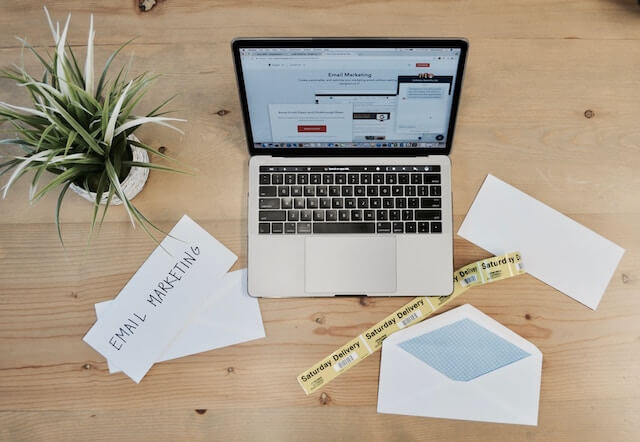
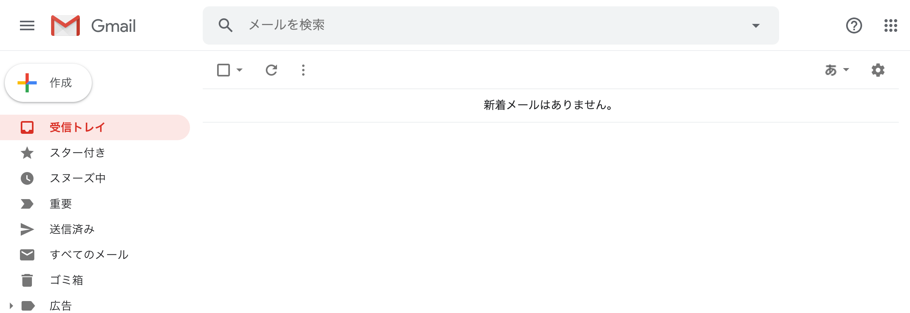
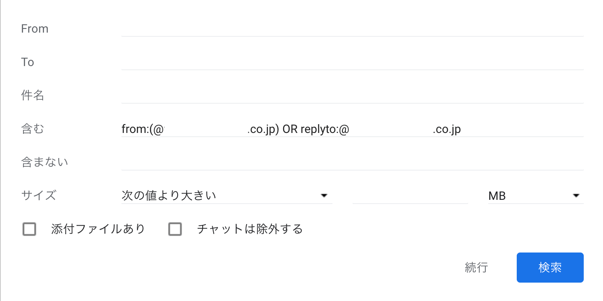
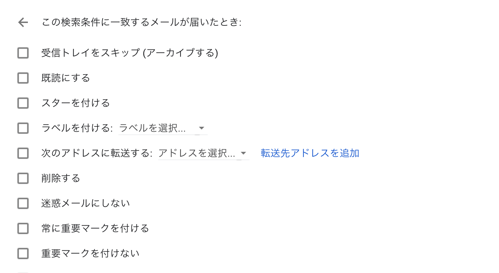
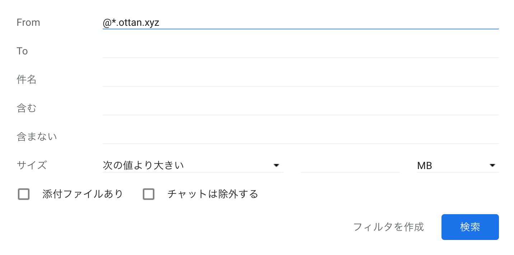
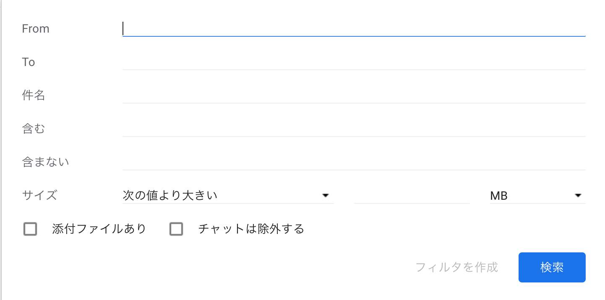

---
author:
- '@ottanxyz'
categories:
- Web
date: 2019-04-24 00:00:00+00:00
draft: false
tags:
- フィルタ
- トレイ
- gmail
- ラベル
- 条件
title: Gmailのフィルタに関する「あるある」とその対処策
toc: true
type: post
---



Gmailにはフィルタと呼ばれる便利な機能があります。フィルタの一例として、重要なメールを見逃さない、もしくはそれ以外のメール（ノイズ）を受信トレイに残さないことで、受信トレイを大きく整理できるでしょう。ただ、フィルタを使用して以下のような経験をされたことはありませんか。

- 「受信トレイをスキップ」をフィルタに設定しているにもかかわらず、受信トレイに必ず表示されてしまうメールがある
- 気が付いたら同じような条件に対するフィルタばかりとなり、フィルタの「保守性」が悪い
- 受信したメールに対して1つの「ラベル」のみを付与したいのに、なぜか複数の「ラベル」が付与されている

今回は、以下のような方を対象とした記事です。

- フィルタ機能は使用しているが、意図せずフィルタに引っかからなかったメールは何となく手作業でアーカイブしている
- フィルタの数が無限に増殖してしまい手がつけられなくなってしまった
- なんとなくフィルタを利用しているが、効率の良いフィルタの使い方を知りたい

私の経験に基づいてお話しします。そのため、誤った使い方をしている場合があるかもしれません。もしくは、もっと効率の良い方法があるかもしれません。その点を踏まえて、ご覧いただけると幸いです。



## Gmailのフィルタ機能を見直して受信トレイをスッキリ整理整頓

まずは、冒頭の疑問にお答えします。

### 「受信トレイをスキップ」が機能しない？

Gmailのフィルタには、「受信トレイをスキップ(アーカイブする)」という便利な機能があります。これは条件に合致するメールを「受信トレイ」に表示せず、直接「アーカイブする」ことができる機能です。メール自体は削除されず、「すべてのメール」やフィルタ時に設定した「ラベル」により、後からメールを読み返すことができます。また、「受信トレイ」に表示されないメールはプッシュ通知の対象外になります。そのため、必要なメールのみ「受信トレイ」に残すことで、いわゆる「重要な」メールを見落とさないようにできます。（たとえば、クレジットカードの引き落とし額の確認や、Googleアカウントに対するセキュリティのお知らせ、など）


ところが、長年Gmailを運用していると、フィルタを設定しているにもかかわらず、この「受信トレイをスキップ」が機能せず受信トレイに意図しないメールが残存してしまうという経験をしたことはありませんか？

#### メールの配信方法が変更されフィルタに合致しなくなった

まず、確認したいことは、果たしてその「意図しないメール」が本当にフィルタに合致しているかどうかということです。当たり前のように思われるかもしれません。しかし、サービスの提供方法の変更により、送信元や送信先のメールアドレスや、その他の条件が変更されている可能性があります。

たとえば、以下の例をご覧ください。


「<ottan@ottan.jp>」は弊サイトのドメインです。某Webサービスからのメールですが、送信元が弊サイトのドメインになっています。実際の送信元は、「From」ヘッダーではなく、「返信先（Reply-To）」ヘッダーに設定されていることがわかります。このようなメールの場合、送信元としてWebサービスのドメインを指定している場合、正常に機能しません。



このような場合、フィルタの条件として「From」ではなく、「含む」に直接条件式を記述する必要があります。Gmailでは、[Gmail で使用できる検索演算子](https://support.google.com/mail/answer/7190?hl=ja)にあるように、さまざまな演算子を駆使して検索を行うことができます。たとえば、先ほどのメールに対してフィルタを設定する場合、フィルタ作成時に「From」ではなく「含む」に以下の演算子を指定します。

    from:@<domain name> OR replyto:@<domain name>

ここで、**OR**はいずれかの条件に合致することを示しています。小文字ではなく、大文字で記述することがポイントです。小文字の場合、正常に機能しません。また、「replyto:」は「Reply-To（返信先）」ヘッダーに含まれる文字列を検索対象とします。この条件式を検索ボックスに入力し、受信トレイに表示されてしまったメールが、検索条件に合致するかどうかを確かめて必要に応じてフィルタを見直します。

#### 「フィルタを上書きする」に設定されている


「重要マーク」が付与された（Gmailによって「自動的に」重要メールと判断された）メールは、デフォルトの設定では、条件にかかわらず、すべて受信トレイに表示されます。そのため、いくらフィルタで「受信トレイをスキップ」していても、重要と判断されたメールは受信トレイに表示されてしまいます。

この設定は変更することも可能です。ただし、本当に重要なメールを見落としてしまわないように注意が必要です。設定を変更するためには、Gmailの「設定」→「受信トレイ」タブから「**フィルタを上書きしない**」をチェックしておきます。

### 「重要」に分類されたメールで溢れ返っている



続いていきましょう。Gmailは、ユーザーの過去の操作履歴等に基づき自動的に重要なメールを判断し、「重要マーク」を「自動的に」付与します。気づけば「重要」に分類されたメールが溢れ返っていた、という経験は誰しもがあるはずです。

この「重要マーク」はフィルタによって外すことができます。また、フィルタ作成時、過去のメールに対して一斉に同様の操作を行うことも可能です。フィルタの「重要マークを付けない」をチェックするだけです。後から「重要」メールを見返したい場合に、役に立つでしょう。

### 気付けば似たようなフィルタばかり作成されている



フィルタの数は多くなればなるほど、メンテナンスがしづらくなります。また、Gmailのフィルタは**上から順番に適用されていきます**。Gmailのフィルタに対する優先順位、つまり上下を入れ替える方法については後述しますが、その前に溢れ返ったフィルタを再度見直しましょう。

#### 同じドメインのメールは「\*」（ワイルドカード）を使用してまとめる

たとえば、以下のようなフィルタが多数作成されていませんか。

    from:@a.example.com
    from:@b.example.com
    from:@example.com

これらはすべて「example.com」というドメインから受信したメール（正確には「From」ヘッダーにそのドメインが指定されたメール）を振り分けるルールです。サブドメインが異なる場合、すべてのサブドメインに対してフィルタを作成すると、フィルタの数だけ増加の一途をたどります。

このような場合は、「\*」（ワイルドカード）と呼ばれるアスタリスクを使用します。たとえば、上記の例の場合、以下の条件にまとめることができます。

    from:@*.example.com

これでは`from:@example.com`に合致しないのではないかと思われるかもしれません。しかし、Gmailにおける「\*」は上記の例に対してすべて合致するようになっています。サブドメインに対するフィルタは、1つにまとめてしまいましょう。

### フィルタ作成時に「検索」ボタンを押した結果、元の画面に戻れない



フィルタ作成時、上記の画面が表示されます（時期によって多少表示の違いがあります）。条件入力後に、「フィルタを作成」をクリックすると、どのようなフィルタを適用するかを決定する画面に遷移します。ここで「検索」をクリックすると、フィルタのウインドウが閉じ、メールのリストが表示されます。そして、1回閉じてしまったウインドウは元に戻せない、そう考えていたことはありませんか。

この「検索」はテスト目的で使用します。フィルタしたいメールが、本当にそのフィルタに合致するのか、フィルタを作成する前に確認する必要があるわけです。合致しないフィルタを作成するほど、無意味な作業はありません。


条件に一致することが確認できたら、検索バーの「▼」アイコンをクリックしましょう。先ほどのフィルタ作成画面が再度表示されます。毎回、「設定」→「フィルタとブロック中のアドレス」→「フィルタを作成」と辿っても良いのですが、上記の方が遥かに簡単です。

### フィルタの優先順位（上下）を入れ替える

Gmailのフィルタは、前述の通り**上から順番に適用されます**。また、**受信したメールに対してすべてのフィルタが適用されます**し、フィルタを停止することもできません。すべてのフィルタが適用されるため、順番を意識することはほぼないのですが、後述のテクニックを使用する際には重要です。（ただ、果たしてこのようなテクニックが本当に正しい使い方かどうかはなんとも言えません）

```xml
 <entry>
  <category term='filter'></category>
  <title>Mail Filter</title>
  <id>tag:mail.google.com,2008:filter:1475236637206</id>
  <updated>2019-04-24T12:18:14Z</updated>
  <content></content>
  <apps:property name='from' value='@example.com'/>
  <apps:property name='label' value='example'/>
  <apps:property name='sizeOperator' value='s_sl'/>
  <apps:property name='sizeUnit' value='s_smb'/>
 </entry>
```

一番簡単な方法は、上下を入れ替えたいフィルタを削除し、作成し直すことです。Gmailのフィルタで、上下を入れ替える方法は存在しません。フィルタの上下を見直したいというニーズは少ないのでしょうか。上下を入れ替えたいフィルタが存在する場合は、それらのフィルタをいったん削除し、逆の順番で作成すれば上下を入れ替えることができます。

ただ、この方法が使用できるのはフィルタが少ない場合、条件式が単純な場合のみでしょう。オススメしたい方法は、フィルタの「エクスポート」と「インポート」です。フィルタは、XMLとして定義されています。そして、そのフィルタは「設定」→「フィルタとブロック中のアドレス」から「エクスポート」（ダウンロード）できます。その際、すべてのフィルタを選択するのを忘れないようにしてください。

自動的にXMLファイルがダウンロードされます。まず、元のフィルタを再現できるように、そのXMLファイルのコピーを作成しておきます。続いて、XMLファイルの内容を編集します。すべてのフィルタは、お各々が`<entry>…</entry>`というタグで囲まれています。そのため、この`<entry>…</entry>`タグに対して切り取り、貼り付けを繰り返すことで、テキストエディタのみでフィルタの順番を入れ替えることができます。（フィルタの条件など、内容をエディタで修正することはオススメしません）

そして、続いてGmailを開いたら、既存のフィルタをいったんすべて削除します。ダウンロードしたXMLファイルをコピーしておいた理由はここにあります。万が一、修正後のXMLファイルが破損していて使用できない場合、フィルタを復元できなくなるためです。フィルタを削除したら、編集したフィルタを「インポート」（アップロード）します。これで、フィルタの上下を入れ替えることができました。

### あるフィルタに合致したら、以降のフィルタをスキップしたい

（部分的には）実現可能ですが、フィルタの条件がややこしくなります。他に良い方法があれば教えていただきたいくらいです。受信トレイはスキップできても、フィルタはスキップ（処理を中止）できないのが、Gmailの原則です。

たとえば、このような場面を想定してください。（実際にあるかどうかは別として）

- あなたは今、あるチームの（Gmailで受信可能な）メーリングリストに所属しています
- チームメンバーは、他のメンバーに作業を依頼する場合、必ずCCにメーリングリストのアドレスを指定します
- CCにメーリングリストが含まれる場合は、（たとえば）「Developer」というラベルを付与し、後から見返せるような状態にしておきたいと考えています
- ただし、Toには作業を依頼したい個人宛のメールアドレスが指定されます

ここで、以下のようなフィルタを2つ作成したとします。

| 条件式                             | フィルタ                                 |
| ---------------------------------- | ---------------------------------------- |
| CCに「メーリングリスト」が含まれる | 「Developer/Team」というラベルを付与する |
| Toに自分のメールアドレスが含まれる | 「Developer/Me」というラベルを付与する   |

あなた宛の作業依頼はわかるように区別したいと考えています。確かに上記のフィルタで、「Developer/Me」というラベルが付与されるため、あなた宛の作業依頼であることはわかるかもしれません。しかし、上記のフィルタでは、「Developer/Team」というラベルも合わせて付与されます。それは、前述の通り、Gmailのフィルタはすべてが適用されてしまうためです。

では、このような条件下で「Developer/Me」というラベルだけ付与することはできないでしょうか。実現することは可能です。可能ですが、なんだかまどろっこしいフィルタになります。現時点ではこの方法しか思いつきません。

| 条件式                                                                                 | フィルタ                                 |
| -------------------------------------------------------------------------------------- | ---------------------------------------- |
| CCに「メーリングリスト」が含まれる、かつToに自分のメールアドレスが含まれる             | 「Developer/Me」というラベルを付与する   |
| CCに「メーリングリスト」が含まれる、かつ「Developer/Me」というラベルが付与されていない | 「Developer/Team」というラベルを付与する |

先ほどと順番（上下）が入れ替わっていることに注意してください。フィルタが上から順番に適用されることを逆手に取り（？）、すでに特定のラベルが付与されている場合には、検索条件からそのラベルで除外するという方法です。


特定の「ラベルを含まない」という検索条件は「label:」演算子を利用して実現可能です。個人的には、「以降のフィルタを適用しない」という機能を待望しているのですが、どうも実現しそうにありません。そのような使われ方は想定していない、ニーズや思想と異なるのかもしれません。

## まとめ

Gmailのフィルタに関するいくつかのテクニックについてご紹介しました。実は、フィルタを作成する際の「検索」ボタンの挙動について気づいたのは、ごくごく最近だったりします。私と同じような経験をされている方のご参考になればと思います。
