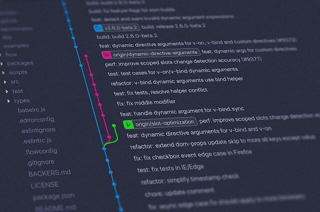
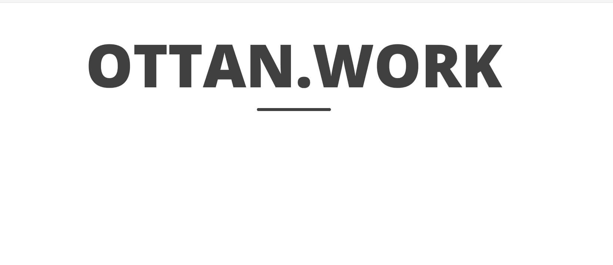
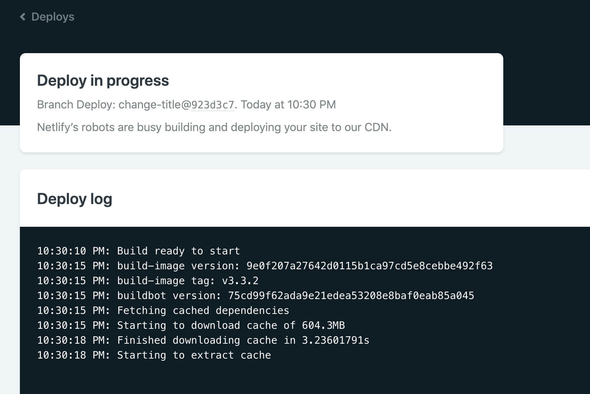
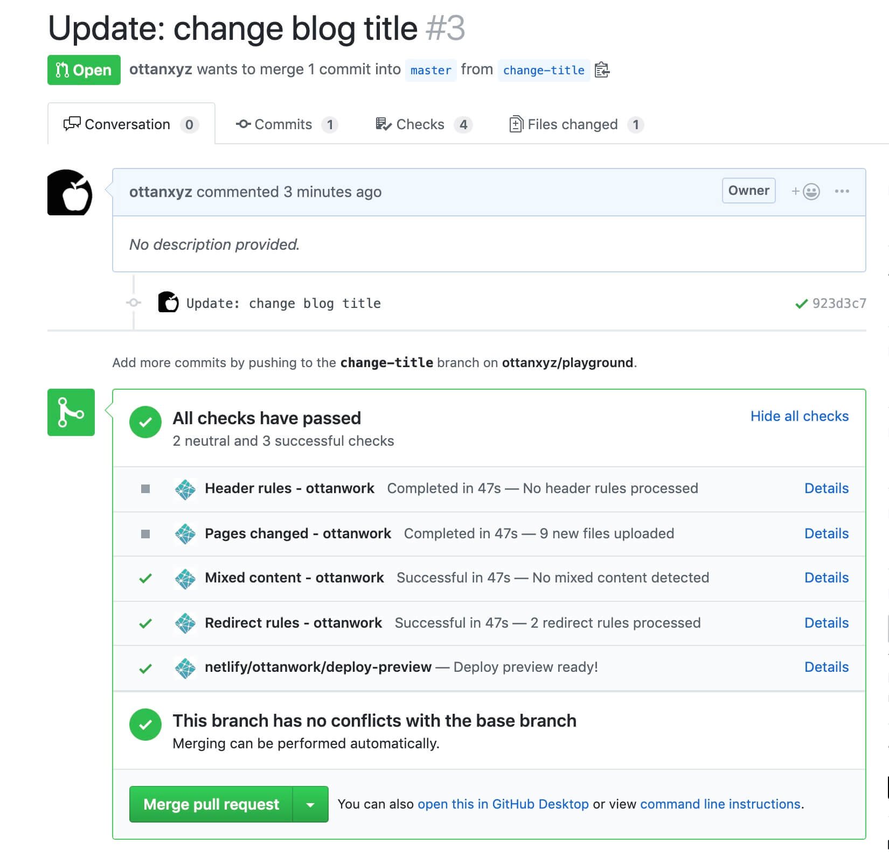

弊ブログは、Netlify + Hugoで運営しています。テーマのソースコードや、記事本文（Markdown）は、GitHubで管理しています。NetlifyとGitHubのリポジトリを連携させることで、`master`ブランチにコミットされると、自動的にNetlifyにデプロイされます。

逆に言えば、`master`ブランチにコミットされない限り、デプロイ後に正常に記事が表示されるかどうかわかりません。また、単純な記事の追加や修正であれば表示上の問題は少ないと思いますが、テーマに対する変更は比較的インパクトの大きなものです。`master`ブランチに手を加えた後に、慌てて元に戻すような作業は出来うる限り避けたいものです。（あくまで運用の一例です）

静的サイトのデプロイ先として、候補によく上がるNetlifyですが、このような問題を救済するための数多くの便利機能が初めから備わっています。

一口に静的サイトジェネレーターといっても、Hugo、Gatsbyなど、性質の異なるさまざまなものがあります。弊サイトはHugoを使用していますが、Netlify + GitHubであれば同様の恩恵を享受できます。

## masterブランチにコミットする前にプレビューで確認しよう

今回は、Netlify + GitHubのパターンで紹介します。そのため、以下で紹介するスクリーンショットはすべてGitHubのものですが、NetlifyがサポートするVCSであれば同様です。

また、すでにNetlify + GitHubが連携されている（GitHubのリポジトリに、Netlifyアプリが連携されている）事を前提に進めます。

### ブランチを作成してデプロイ

開発途上でおそらくもっともお世話になるであろう機能です。Netlifyでは、コミットをトリガーとした自動デプロイが可能な、プロダクションとなるブランチ（初期値は`master`）、プロダクション環境以外のブランチを選択できます。

プロダクション環境以外のブランチでは、すべてのブランチを対象にできる他、特定のブランチ（たとえば`staging`）のみを対象にすることもできます。

指定したブランチにコミットした内容は、自動的にNetlifyによりデプロイされ、商用環境とは異なる専用のURLが発行され、全世界の開発者と一緒に内容を確認できます。

#### 具体例

下図のような、（何もないタイトルだけの）ブログがあるとします。このタイトルを変更するための、リクエストがありました。

タイトルを変更するために、専用のブランチを作成します。今回は、ローカルリポジトリに`change-title`というブランチを用意します。



Netlifyのダッシュボードにログインし、デプロイの確認を行います。「Branch deploys」の条件に、今回作成したブランチが合致するか確認します。デフォルトでは、すべてのブランチが、自動デプロイの対象になっています。任意のブランチのみデプロイの対象とすることもできます。（例：`develop`、`staging`等）


ローカルリポジトリに作成した`chnage-title`ブランチを、GitHubにプッシュしてみます。今回は、すべてのブランチに対するデプロイが有効になっているため、Netlifyによりデプロイが始まります。



そして、無事にデプロイが成功すると、以下のパブリックなURLからアクセスできます。「Branch name」にはブランチの名称、「Site name」にはNetlifyのダッシュボードで設定したサイト名が入ります。

```http
https://<Branch name>--<Site name>.netlify.com/
```

今回のケースでは、以下のURLが発行されます。

```http
https://change-title--ottanwork.netlify.com/
```

### プルリクエストを作成してデプロイ
Netlifyには、プルリクエストをトリガーとしてデプロイする、「Deploy Preview」という機能があります。プロダクションブランチに対するプルリクエストを作成すると、Netlifyで自動的にデプロイが開始されます。

Netlifyのダッシュボードで、すべてのプルリクエストに対してデプロイを実施するか、または実施しないかを選択できます。特定のプルリクエストのみデプロイする、といった使用方法はできません。

#### 具体例

先ほどの具体例で考えてみます。今、GitHubに`change-title`というブランチが作成されています。フォークしたリポジトリでも構いません。いずれにせよ、タイトルを変更するためのプルリクエストを作成します。



すると、そのプルリクエストによって正常にデプロイ可能か、Netlifyでひととおりのチェックが行われ、問題なければ専用のパブリックなURLが発行されるという仕組みです。上図のように、「Deploy preview ready!」と表示されていれば、問題なくデプロイが行われています。

```http
https://deploy-preview-<Pull Request Number>--<Site name>.netlify.com
```

プルリクエストによるデプロイを実施した場合、発行されるURLにはプルリクエストの番号が含まれます。今回の例で言えば、プルリクエストの番号は「#3」であるため以下のようなURLになります。

```http
https://deploy-preview-3--ottanwork.netlify.com
```

このように、開発環境、ステージング環境、プロダクション環境前のデプロイプレビューを利用することで、スムーズにプロダクション環境へとデプロイができるようになっているのです。

### Netlify Dev（CLI）使用してプレビュー

ここ最近になって、Netlifyから素晴らしい機能がローンチされました。

執筆時点でβ版の扱いですが、「Netlify Dev」を使用できます。ローカルホスト上のリポジトリをNetlifyにデプロイした場合のプレビューを表示したり、一時的にローカルホストに対してトンネリングして、パブリックなURLを発行しライブシェアリングできます！

なお、ここで紹介するコマンドを実行するためには、事前にNode.jsがインストールされている必要があります。最新の安定版をインストールしておきましょう。

#### 具体例

「Netlify Dev」を使用するためには、専用のコマンドをインストールします。`npm`、または`yarn`を用いてグローバル環境にコマンドをインストールしましょう。

```bash
npm install -g netlify-cli
```

では、続いてプロジェクトのルートディレクトリ、具体的には`netlify.toml`ファイルのあるディレクトリに移動します。そして、ターミナルから以下のコマンドを実行します。

```bash
netlify dev
```

一部抜粋します。今回は、Hugoを利用しているため、そのビルドの様子がターミナルに出力されます。前半はいつも通りのビルドの様子ですが、最後にNetlifyのクライアントによりURLが発行されていることがわかります。以降はその発行されたURL経由で内容を確認できます。

```
...
Environment: "development"
Serving pages from memory
Running in Fast Render Mode. For full rebuilds on change: hugo server --disableFastRender
Web Server is available at http://localhost:1313/ (bind address 127.0.0.1)
Press Ctrl+C to stop
.
Connected!

   ┌─────────────────────────────────────────────────┐
   │                                                 │
   │   ◈ Server now ready on http://localhost:8888   │
   │                                                 │
   └─────────────────────────────────────────────────┘
```

ここまでの機能はHugo単独で実現できます。続いて、さきほどとビルドの様子は変わりませんが、別のオプションを付けて実行します。

事前準備として、現在のプロジェクトをデプロイするNetlifyのプロジェクトに関連づける
必要があります。プロジェクトのルートディレクトリで、以下のコマンドを実行します。

```bash
netlify link
```

Netlifyにリンクする方法を確認します。今回は事前にNetlifyへプロジェクトを作成し、GitHubのリポジトリと関連付けられていることが前提です。そのため、「Use current git...」を選択します。

```
netlify link will connect a site in app.netlify.com to this folder

? How do you want to link this folder to a site? (Use arrow keys)
❯ Use current git remote url https://github.com/xxx/yyy
  Site Name
  Site ID
```

関連付けに成功すると、プロジェクトのルートディレクトリ直下に以下のファイルが作成されます。誤って関連付けてしまった場合は、以下のディレクトリ、またはファイルを作成することでデフォルトの状態に戻すことが可能です。

`.netlify/state.json`

事前準備が完了したら、ターミナルで以下のコマンドを実行します。

```bash
netlify dev --live
```

Hugoによるビルドの様子は変わりませんが、最後の出力が異なります。発行されたパブリックURLへアクセスすることで、ローカルホストの状態を誰でも確認できます。[ngrok](https://ngrok.com/)と同様の仕組みでね。ローカルホストとNetlifyを繋ぐ中継サーバは、`.netlify/tunnel/bin/live-tunnel-client`が生成しているようです。

```
...
Web Server is available at http://localhost:1313/ (bind address 127.0.0.1)
Press Ctrl+C to stop
.
Connected!
Waiting for localhost:8888.
Connected!
◈ Creating Live Tunnel for xxxxx-xxxx-xxxx-xxxx-xxxxxxx

   ┌─────────────────────────────────────────────────────────────────┐
   │                                                                 │
   │   ◈ Server now ready on https://ottanwork-a8b84b.netlify.live   │
   │                                                                 │
   └─────────────────────────────────────────────────────────────────┘
```

なお、`Ctrl+C`で停止します。

```
88.16.194.35.in-addr.arpa domain name pointer 88.16.194.35.bc.googleusercontent.com.
```

Google Cloudを経由しているっぽいですね。

## 参考リンク

* [Continuous Deployment | Netlify](https://www.netlify.com/docs/continuous-deployment/)
