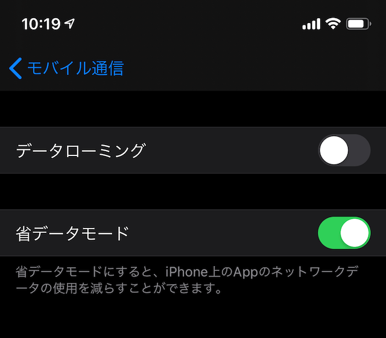
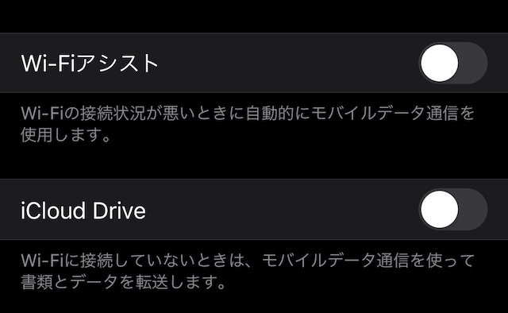
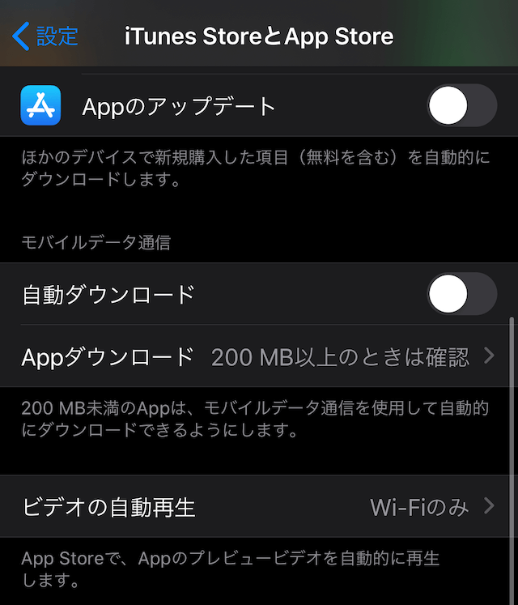
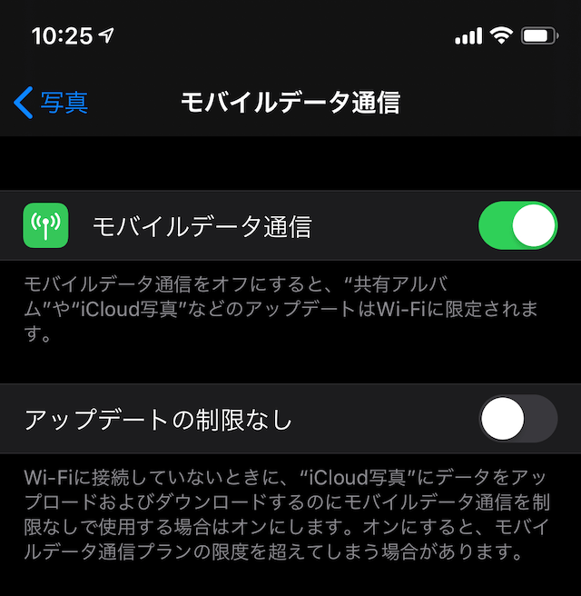
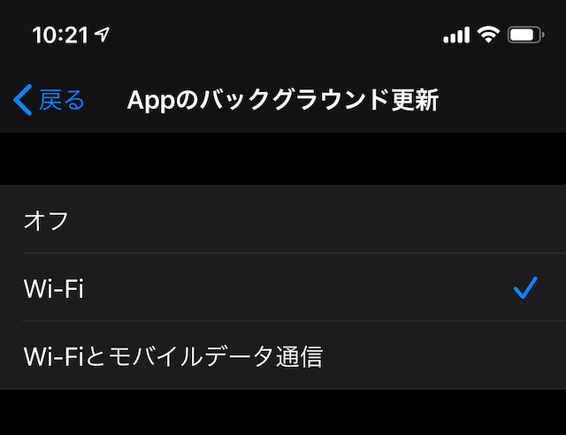
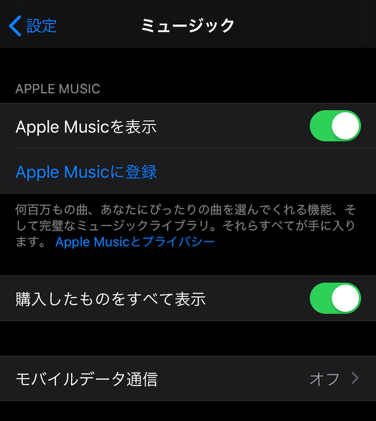

MVNO、いわゆる格安SIM事業者と契約している際に気になるのがモバイルデータの通信量です。今回は、最新アップデートであるiOS13対応版として、モバイルデータの通信量をiPhoneで節約する方法をまとめてご紹介します。

## iPhoneを賢く使用してモバイルデータ通信量を節約しよう

モバイルデータ通信量は、実は意外と簡単に節約できます。ただ、重要なことは自分がどのようにiPhoneやiPadをWi-Fiネットワークが存在しない環境下で使用しているかを、じっくり観察してみることです。

### 省データモード

省データモードは、iOS13から登場した新機能です。ボタンをワンタップして有効化するだけで、

- 写真アプリの自動同期の停止
- FaceTime、Apple Musicなどの低帯域幅への最適化（ビットレートが自動的に低くなります）
- App Storeのビデオ自動再生や自動アップデートの停止

などなど、まさに「通信量」を自動的に削減してくれる便利な機能です。ただし、逆に「通信量」を気にしない状況であれば、ビットレートが低下するなど、品質に差が生まれてしまいます。

とはいえ、モバイル通信量が気になるということは、少しでも通信量を抑えたい状況でしょうから、月々のデータ通信量が気になる場合は、常にオンにしておけば問題ないでしょう。

省データモードは、「設定」→「モバイルデータ通信」→「モバイル通信」から「省データモード」をオンにすることで有効化できます。

### アプリ毎のモバイル通信可否を選択

iOS12以前から使用できる機能です。アプリ毎にモバイルデータ通信を使用するかどうかを決定できます。モバイルデータ通信ではなくWi-Fiネットワーク経由で使用したいYouTube、Apple Music、Amazon Prime Videoなどを「ブラックリスト」に入れて、誤って起動した時の救世主として使うことをオススメします。

これで外出先で誤って起動してしまっても、データ通信量を食い潰すことはありません。

「設定」→「モバイルデータ通信」から。

### Wi-Fiアシストはオフに

Wi-Fiも万全ではありません。外出先はもとより、家庭内のWi-Fiネットワークも、電波が届かない場所などでは、通信が遅くなることが良くあります。そんな時に便利なのが「Wi-Fiアシスト」です。

ただ、モバイルデータ通信量を抑えたい人にとって、この機能は思わぬ悲劇を生むことになります。「Wi-Fiに接続されているから安心」と思いきや、この機能により自動的にモバイルデータ通信に切り替わっていたということが起こり得るのです。

前述のアプリ毎のモバイル通信可否を設定しておくことで、最悪の事態を防ぐことは可能ですが、モバイルデータ通信量を抑えたい場合には、オフにしておきましょう。

「設定」→「モバイルデータ通信」から、各アプリ毎の使用量の下にあります。項目の位置が少し分かりづらいですが、「Wi-Fiアシスト」オフにしておきましょう。モバイルデータ通信に期待する前に、Wi-Fiの電波を見直すのです。

ついでに「iCloud Drive」もオフにしておくと良いでしょう。モバイルデータ通信で同期されなくなります。

### Appの自動アップデート、自動ダウンロード、ビデオの自動再生を無効化

省データモードを有効化することで、モバイルデータ通信時のみこれらの機能を無効化できます。Wi-Fi通信時には引き続き自動アップデートを行いたい場合は、省データモードを使用してください。

省データモードが信用できない、iOS13にアップデートできない、そのような事情の方々は「設定」→「iTunes StoreとApp Store」から「Appのアップデート」「自動ダウンロード」をオフに、「ビデオの自動再生」を「Wi-Fiのみ」にしておきましょう。

### 写真アプリのiCloud同期をオフ

こちらも省データモードを有効化すればOKです。省データモードが使用できない場合は、「設定」→「写真」→「アップデートの制限なし」はオフにしておきます。iCloudで写真共有している場合、外出先で写真アプリを開いたときに思わぬ通信量を使用してしまうことがあります。

### Appのバックグラウンド更新はWi-Fiのみ

これ、バッテリーの持ちにも言えることなので、モバイルデータ通信量を節約したい場合以外にも個人的にはオススメです。「設定」→「一般」→「Appのバックグラウンド更新」を「Wi-Fi」にしておきます。4G接続時より、安定したWi-Fi接続時の方がバッテリー持ちが、体感では良くなります。

この機能をオンにしておくことで、外出先でWi-Fiネットワークが使用できない場合は、Appのバックグラウンド更新が行われなくなります。

なお、iOSの「バックグラウンド更新」とは、起動中のアプリを別のアプリに切り替えた後、自動的にスリープ状態に陥ったアプリがバックグラウンドで更新できるかどうかです。プッシュ通知されない、メールが受信されないというわけではないので要注意を。

たとえば、RSSリーダーなどのAppで、アプリを閉じた後もバックグラウンドでコンテンツを更新してくれていた方が、次回起動時の体感速度が早くなりますよね。

### Apple Musicの再生はWi-Fiネットワークのみで

省データモードは優秀です。今まで個別にオフにしていたこれらの機能をすべて自動的に実施してくれるんですから。むしろ、今までなぜなかったのか。「設定」→「ミュージック」→「モバイルデータ通信」をオフにしておけば、誤ってストリーミングやダウンロードしてしまうことがなくなります。

## DataManなどのモバイルデータ通信量の追跡アプリも有効



効率良くモバイルデータ通信量を節約したい場合は、どのようにモバイルデータ通信を使用しているかを観察してみることです。とはいえ、iOS標準の「設定」→「モバイルデータ通信」から観測できる統計情報では少し心もとないですよね。

そこで、「DataMan」などのサードパーティ製通信を使用しましょう。月々の上限、月の更新日（データ量が回復する日）、閾値によるアラームなど、モバイルデータ通信量を節約したい人には欠かせないアプリとなっています。ウィジェットをホーム画面に設置すれば、「ウィジェットが緑色なら安心」、逆に「ウィジェットが赤色なら危険」と一目でわかるのもオススメです。
