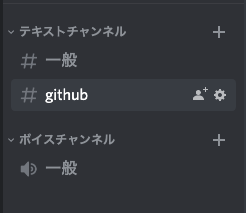
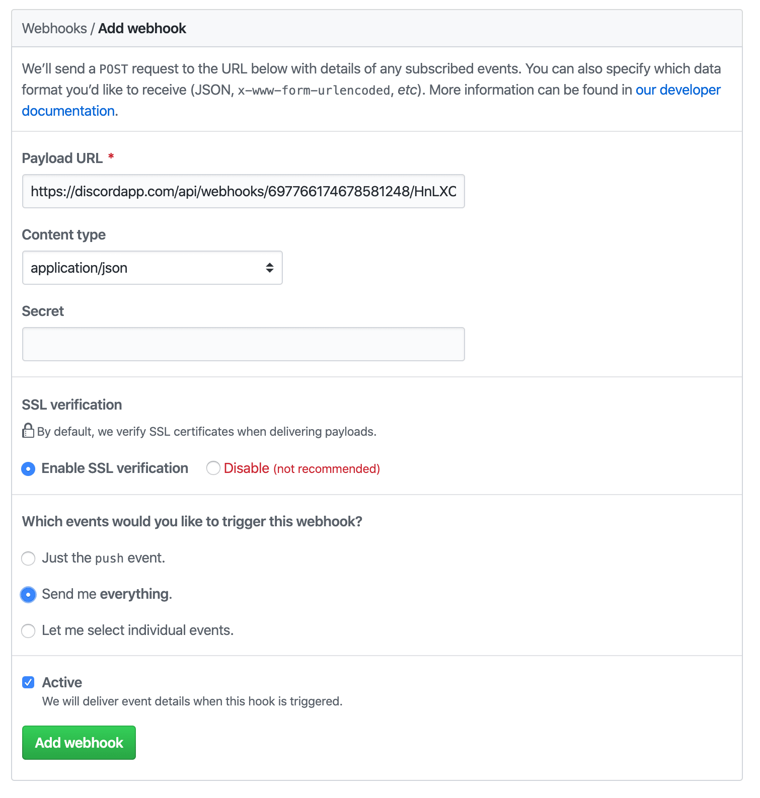
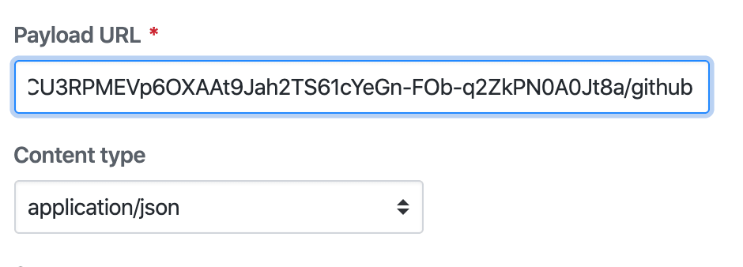

---
author:
- '@ottanxyz'
categories:
- Blog
date: 2020-04-26 00:00:00+00:00
tags:
- ウェブフック
- チャンネル
- github
- イベント
- サイドメニュー
title: GitHubのイベントをDiscordのチャンネルに通知する
---

Slackであれば、AppディレクトリからGitHubアプリをインストールすれば、GitHubと簡単に連携できます。Discordでも同様の連携ができないかどうか試してみたところ、一癖ありましたが連携可能でした。以下で使用している画像は、Mac版のDiscordアプリ（0.0.256）のスクリーンショットです。

## Discordの設定

通常のテキストチャンネルと分割し、できれば専用チャンネルを作成しておきます。

チャンネル横の「歯車」アイコンをクリックします。

サイドメニューから「ウェブフック」を選択します。Discordのイベントをトリガーとした外向きのウェブフックは用意されていないようです。

ウェブフックのアイコンはなくても良いですが、設定しておいた方が雰囲気は出ますし、発信元を識別しやすいと思います（特に、同一チャンネル内にいろいろ混在させる場合）。名前は任意ですが、後々のメンテナンスを考えて、わかりやすい名称にしておきましょう。このダイアログに表示される、「ウェブフックURL」をコピーしておきます。「Copy」ボタンを押しても、クリップボードへコピーできます。

## GitHubの設定

ブラウザ（デスクトップ）で連携したいリポジトリを開きます。「Settings」をクリックします。

サイドメニューから「Webhooks」を開きます。GitHubのウェブフックは、Discordと異なり、外方向のウェブフックを設定可能です。「Add webhook」をクリックします。

以下の項目を入力します。

* Pyaload URL
  * 「先ほどコピーしたURL」 + **「/github」**
  * ここ毎回忘れるポイントなので注意が必要です
* Content type
  * 「application/json」へ変更
* Which events would you like to trigger this webhook?
  * 任意ですが、「Send me everything.」にしておくとテストがしやすいです
  * 大量のイベント（スター、プッシュ、Issue、プルリク、ブランチの作成、削除など）が発生するリポジトリの場合、Discordのチャンネルが見辛くなる可能性があります
  * 「Let me select indivisual events」で通知したいイベントだけ選択するとよいです

「Add webhook」を押したら完了です。

