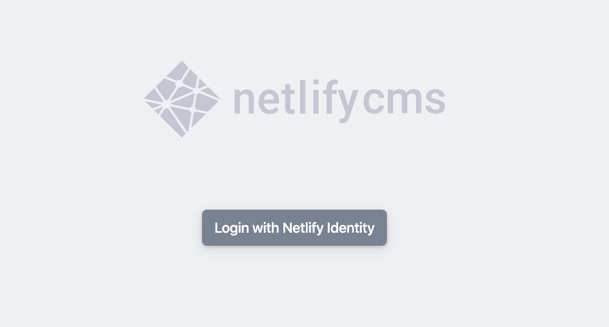

---
author:
- '@ottanxyz'
categories:
- Blog
- Mac
date: 2020-04-26 00:00:00+00:00
tags:
- cms
- ローカルホスト
- management
- netlify
- system
title: ローカルホストでGitHubの環境を汚さずにNetlify CMSをテストする
---

Hugoを使用している場合、`hugo server`を実行している状態で、ブラウザから以下のURLへアクセスします。Hugoのみならず、他のNetlify CMSがサポートする静的サイトジェネレータでも同様です。

```http
http://127.0.0.1:1313/admin/
```

[Hugo | Netlify CMS | Open-Source Content Management System](https://www.netlifycms.org/docs/hugo/)に沿って、Netlify CMSの構築を終えた状態の場合、ログイン画面が以下のように表示されるはずです。「Netlify Identity」の認証を経由してログインすることになります。



それが、以下のようになります。


「Login」ボタンを押しても、「Netlify Identity」では認証されず、そのままダッシュボードへ移動します。そして、**ログイン後の作業を全てローカルホストで完結**できます。

## ローカルホストでNetlify CMSをテストする

Netlify CMSは、[Creating Custom Previews | Netlify CMS | Open-Source Content Management System](https://www.netlifycms.org/docs/customization/)に沿って、コンテンツ投稿画面やプレビューをカスタマイズすることができます。また、コレクション毎に画像ファイルやMarkdownファイルの保存先を変更することもできます。

これらの変更をNetlify CMSヘプッシュする前に確認したい時があります。というのも、Netlify CMS上でコンテンツを投稿したり、画像ファイルをアップロードすると、連携しているGitリポジトリ（例えば、GitHub）上に自動的にコンテンツがプッシュされ、リポジトリを汚してしまうためです。

そのような時は、ローカルホストでNetlify CMSをテストする機能が、最新のバージョンで追加されています。ローカルホストで全て完結するので、画像ファイルやMarkdownファイルの作成、プレビューなどを、Netlify CMSへプッシュする前にテストすることができます。

`/static/admin/config.yml`に、以下を追記します。

```yml
local_backend: true
```

次に、Netlifyが公開しているパッケージをインストールします。ローカルホスト上で、Gitリポジトリのルートディレクトリへ移動して、`netlify-cms-proxy-server`をインストールします。事前に、Node.jsのインストールが必要です。

```zsh
npm install -D netlify-cms-proxy-server
```

そのまま、ルートディレクトリで以下のコマンドを実行します。

```zsh
npx netlify-cms-proxy-server
```

Netlify CMSに対するプロキシサーバが起動し、ローカルホスト上でNetlify CMSをテストする場合のみ、このプロキシサーバ経由で表示されるようになり、コンテンツの作成や画像ファイルのアップロードが、ローカルホストだけで完結できます。

これらの機能は、[Beta Features!](https://www.netlifycms.org/docs/beta-features/)として紹介されています。


## 参考リンク

* [Hugo | Netlify CMS | Open-Source Content Management System](https://www.netlifycms.org/docs/hugo/)
* [Creating Custom Previews | Netlify CMS | Open-Source Content Management System](https://www.netlifycms.org/docs/customization/)
* [Beta Features! | Netlify CMS | Open-Source Content Management System](https://www.netlifycms.org/docs/beta-features/)