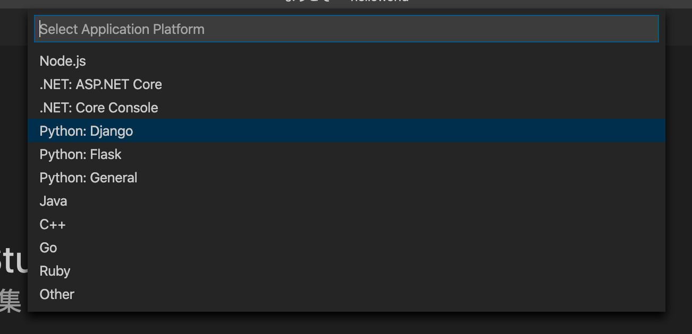
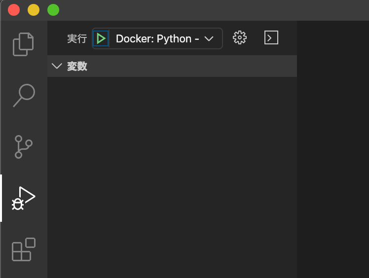
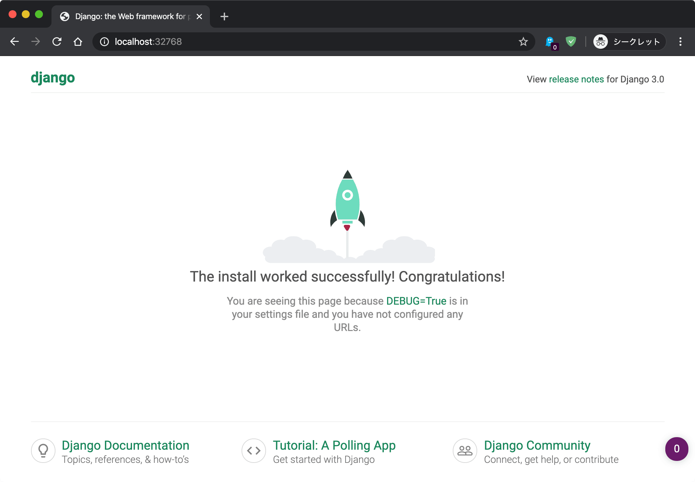

---
author:
- '@ottanxyz'
categories:
- Mac
date: 2020-04-26 00:00:00+00:00
tags:
- django
- python
- vs
- code
- docker
title: DjangoやFlask（Python）アプリの開発を始めるならVS Code + Dockerが最適
---

VS Codeの[チュートリアル](https://code.visualstudio.com/docs/containers/quickstart-python)を試してみました。事前に、Python、Dockerの拡張機能をインストールしておく必要があります。なお、Django、Flaskに関する説明は本記事にはありません。

* [Python - Visual Studio Marketplace](https://marketplace.visualstudio.com/items?itemName=ms-python.python)
* [Docker - Visual Studio Marketplace](https://marketplace.visualstudio.com/items?itemName=ms-azuretools.vscode-docker)

## 環境

試した環境は以下の通りです。

```text
$ sw_vers
ProductName:  Mac OS X
ProductVersion: 10.15.3
BuildVersion: 19D76
```

また、`python`はHomebrewでインストールした、下記のバージョンで確認しています。

```text
$ python3
Python 3.7.7 (default, Mar 10 2020, 15:43:33)
[Clang 11.0.0 (clang-1100.0.33.17)] on darwin
Type "help", "copyright", "credits" or "license" for more information.
```

## 事前準備（プロジェクトの作成）

まず、Pythonの仮想環境を作成しておきます。`venv`は、Python 3.3から標準で搭載されました。

```zsh
python3 -m venv env # 仮想環境の作成
source env/bin/activate # 仮想環境のアクティベート
```

Djangoのテンプレートを作成します。`django-admin`の使い方については、[Writing your first Django app, part 1 | Django documentation | Django](https://docs.djangoproject.com/en/3.0/intro/tutorial01/)を参照してください。

```zsh
pip install django
exec $SHELL -l # シェル環境のリロード
django-admin startproject helloworld
cd helloworld
code .
```

## Dockerfileの作成、コンテナの起動

VS Codeが起動されます。`Dockerfile`の作成、およびビルド、コンテナの起動を行います。全て、VS Codeが自動的に実施してくれます。

コマンドパレット（Shift + Command + P）を開き、`Docker: Add Docker Files to Workspace...`を選択します。


様々なアプリケーションに対応したテンプレートが用意されています。今回は、`Python: Django`を選択します。



`docker-compose.yml`を作成する場合は、`Yes`、作成しない場合は`No`を選択します。VS Codeが利用できない、開発環境を別の場所に移したい、などの理由があれば作成しておくと便利かもしれません。


`manage.py`を作成する場所を選択します。今回はデフォルトのままです。


待ち受けポートを選択します。Djangoのデフォルトは`8000`ですが、変更することもできます。なお、`8000`はコンテナ内で動作するDjangoのアプリが待ち受けるポートです。アプリの実行、デバッグ時にホストOSで使用されるポート番号は、エフェメラルポートからランダムに決定されるようです。


ここまで選択すると、下記の`Dockerfile`がプロジェクトのルート直下に自動的に作成されます。めちゃくちゃ便利！

```docker
# For more information, please refer to https://aka.ms/vscode-docker-python
FROM python:3.8

EXPOSE 8000

# Keeps Python from generating .pyc files in the container
ENV PYTHONDONTWRITEBYTECODE 1

# Turns off buffering for easier container logging
ENV PYTHONUNBUFFERED 1

# Install pip requirements
ADD requirements.txt .
RUN python -m pip install -r requirements.txt

WORKDIR /app
ADD . /app

# During debugging, this entry point will be overridden. For more information, refer to https://aka.ms/vscode-docker-python-debug
CMD ["gunicorn", "--bind", "0.0.0.0:8000", "helloworld.wsgi"]
```

## Python（Django、Flask）アプリを動かす

続いて、アプリを実際に動作させてみましょう。まだ何も作成していませんが、Djangoのデフォルトページが表示されます。VS Codeの「実行」タブを選択して、「実行」（三角）アイコンをクリックします。



自動的にデフォルトブラウザでDjangoのデフォルトページが表示されれば成功です！ホストOSの待ち受けポートはランダムに選ばれるようです。



「切断」アイコンをクリックすれば終了です。


以上、簡単ですね！