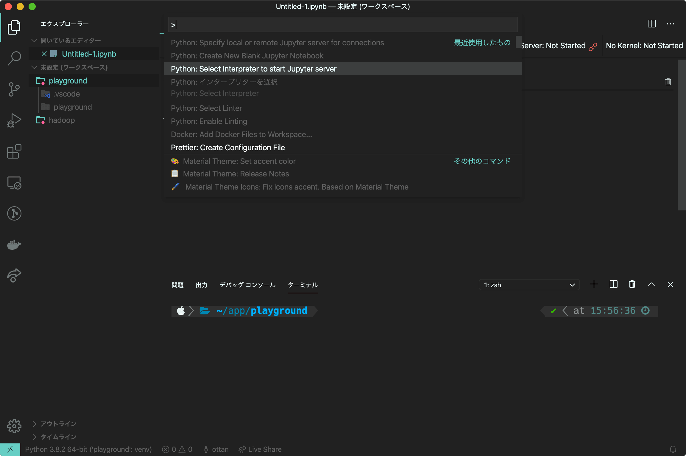
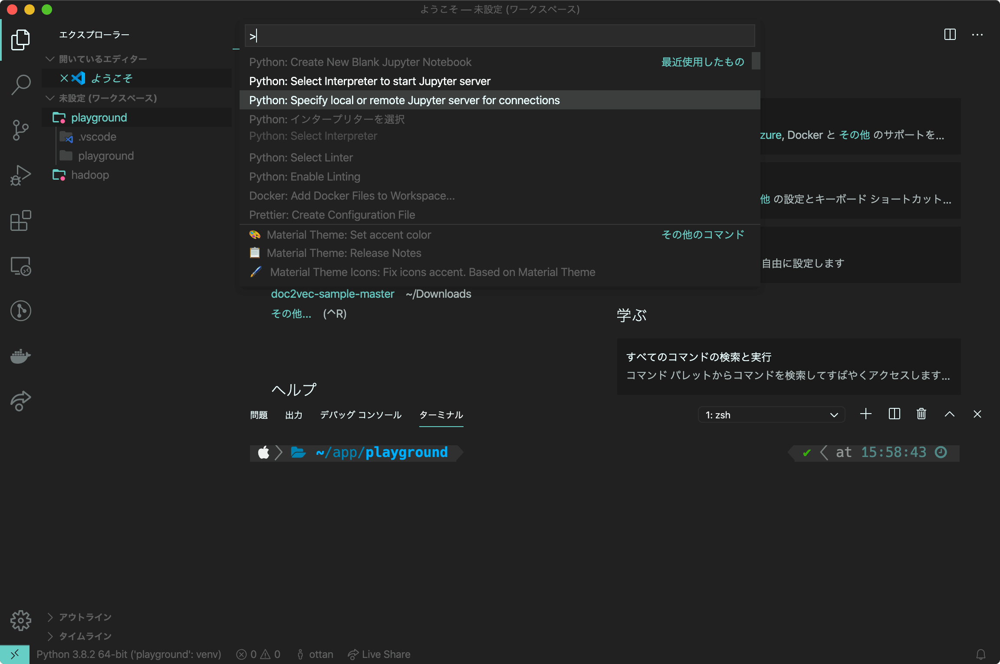
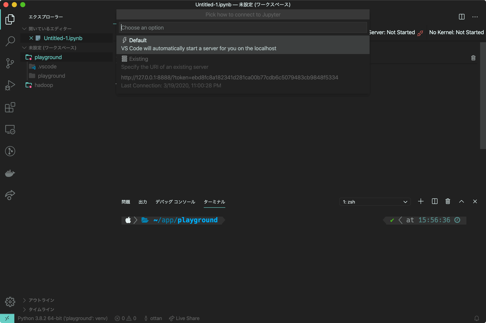
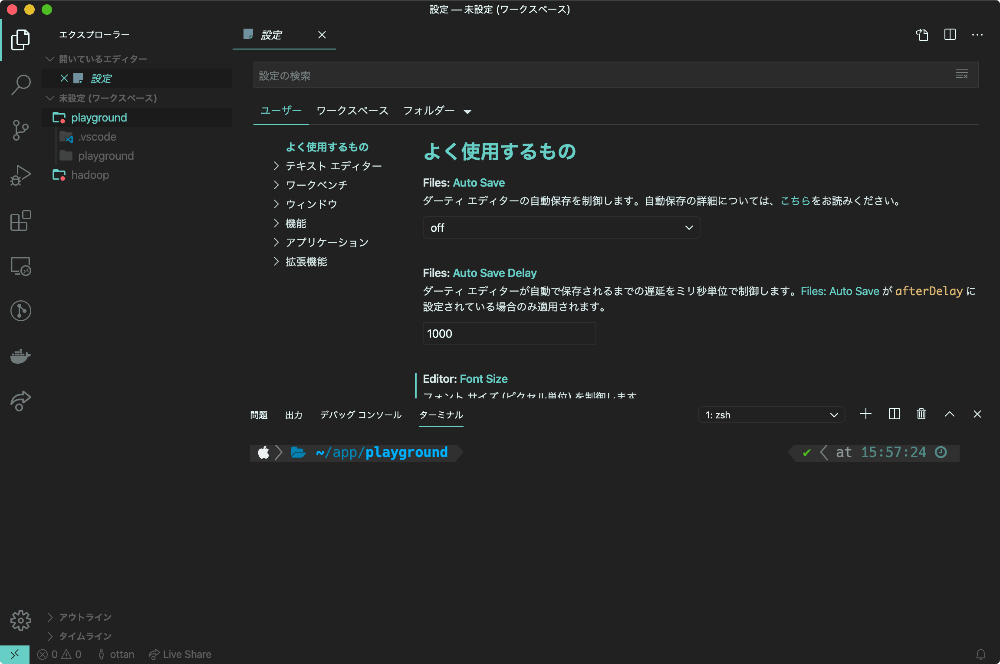
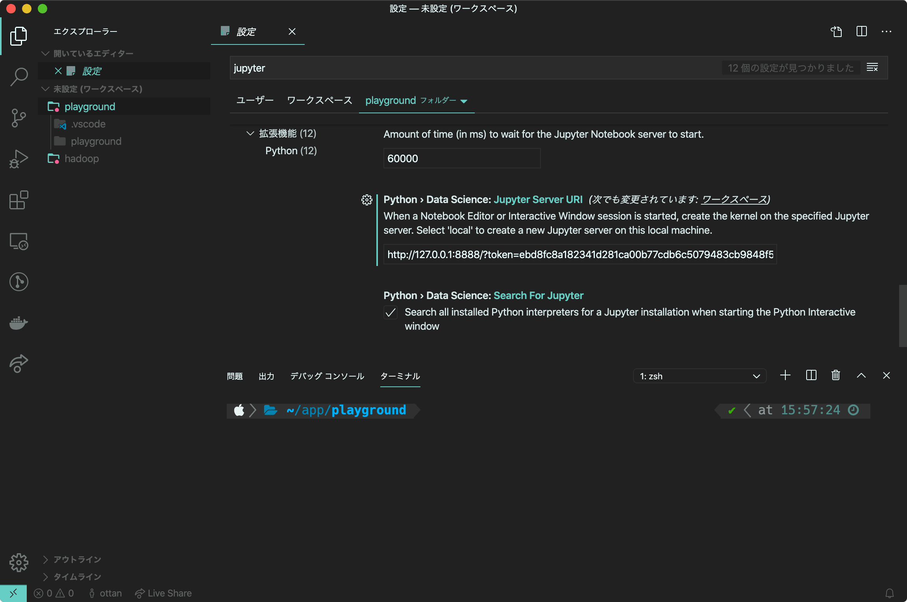
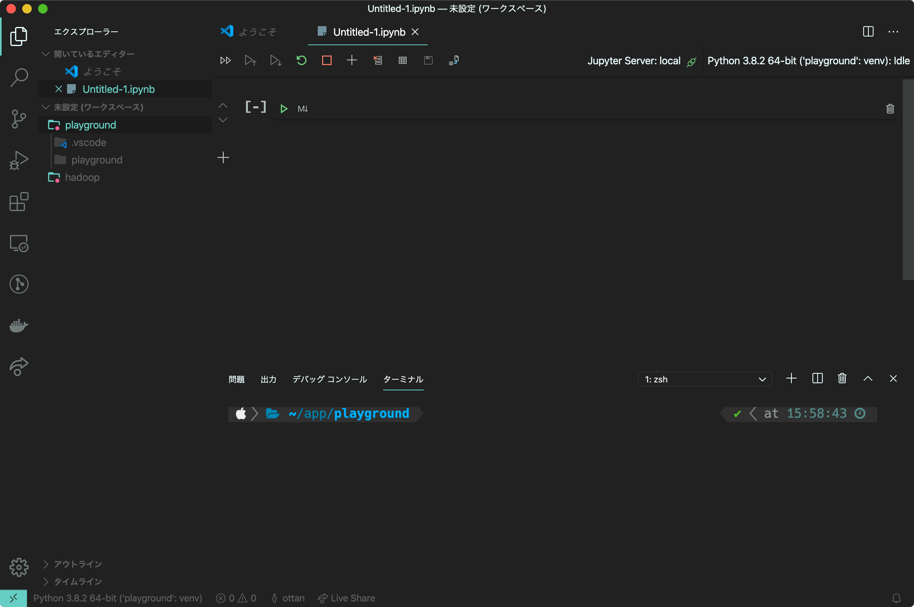

---
author:
- '@ottanxyz'
categories:
- Mac
date: 2020-05-03 00:00:00+00:00
tags:
- jupyter
- notebook
- vs
- code
- server
title: 'VS Codeで「Failed to connect to Jupyter notebook」「Jupyter Server: Not Started」と表示されJupyter
  Notebookが起動できない場合の対処法'
---

VS Codeで[Python - Visual Studio Marketplace](https://marketplace.visualstudio.com/items?itemName=ms-python.python)の拡張機能を使用すると、Pythonで記述されたプログラムのデバッグや、Jupyter Notebook環境をVS Codeで実行できて大変重宝します。たまに、このJupyter Notebookが、以下のエラーにより起動しなくなったことがあったため、その対処法をメモしておきます。

```text
Failed to connect to Jupyter notebook
Jupyter Server: Not Started
```

## 原因はワークスペースに複数のフォルダを追加している場合の環境設定

空のJupyter Notebookを起動すると、自動的にJupyter Notebook環境がローカルホスト上で起動します。また、Jupyter Notebook起動に必要なパッケージが選択されている仮想環境に揃っているかどうか起動時にチェックされ、揃っていない場合は自動的にインストールされます。何も考えず、Jupyter Notebookを利用できるので非常に便利です。

ただし、以下の条件が揃った場合にJupyter Notebook環境が自動的に起動しないことがあります。

* ワークスペースに複数のフォルダが追加されている
* 過去にVS Codeからリモート、もしくはローカルホスト上のVS Code環境外のJupyter Notebookに接続したことがある


このような場合、空のJupyter Notebookを起動しても「Jupyter Server: Not Started」と表示され、Jupyter Serverが起動されないことがあります。



コマンドパレットを開き、「Python: Select Interpreter to start Jupyter Server」を選択、インタプリタ（仮想環境）を選択しても現象は変わりません。



再びコマンドパレットを開き、「Python: Specify local or remote Jupyter server for connections」を選択します。



VS Codeがローカルホストで自動的にJupyter Notebook環境を起動する「Default」（既定値）を設定し、VS Codeをリロードしても状況が変わりません。このJupyter Server選択時に、一度でも「Existing」やリモート（VS Code環境外）のJupyter Notebook環境に接続したことがある場合、この設定が元に戻らないことがあります。

### ワークスペース、もしくはフォルダー単位の設定を見直す

筆者の環境では、フォルダー単位の拡張機能の設定が原因でした。ワークスペースの設定は、「ユーザー」単位、「ワークスペース」単位、「フォルダー」単位とあるのですが、「フォルダー」単位の設定が上書きされてしまい優先されてしまっている可能性があります。



今回、起動しなかった「playground」フォルダの設定を見ます。検索ボックスに「jupyter」と入力し、「Python > Data Science: Jupyter Server URI」の項目を探します。



このように、過去に接続したことのあるJupyter NotebookのURIがそのまま残っており、先ほど「Default」環境を選択したにも関わらずフォルダの設定が上書きされていませんでした。「歯車」アイコンをクリックして「設定をリセット」するか、「local」と入力して、VS Codeをリロードします。



もう一度、空のJupyter Notebookを開くと、今度は「Jupyter Server: local」と表示され、Jupyter Notebookが起動していることを確認できました。

なお、Jupyter Notebookの実行には、拡張機能が必要です。非常に便利な機能ですので、Pythonを利用されている場合は、ぜひ導入しておきましょう。

* [Python - Visual Studio Marketplace](https://marketplace.visualstudio.com/items?itemName=ms-python.python)