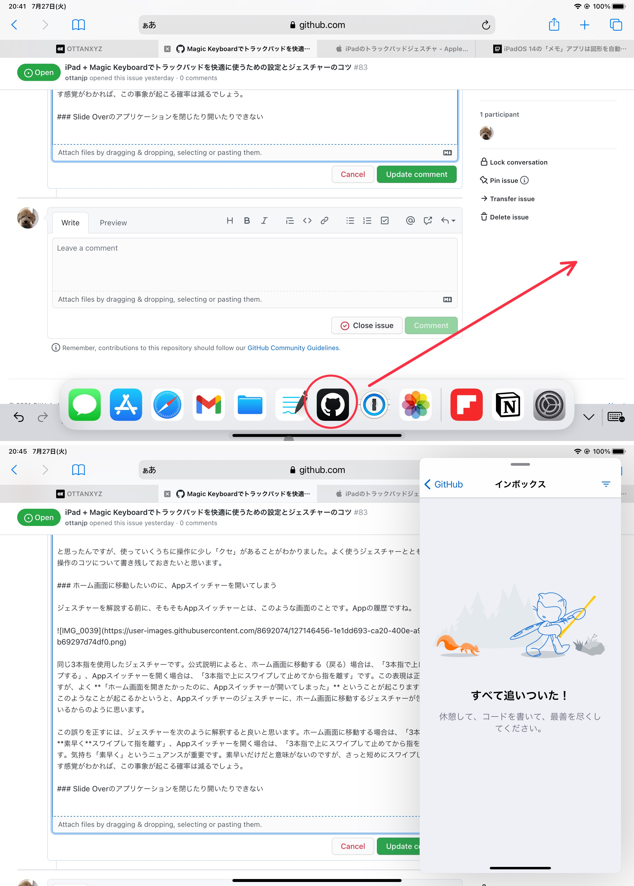

---
categories:
- iPhone
date: 2021-07-28 07:24:41+00:00
draft: false
tags:
- ポインタ
- ジェスチャー
- スワイプ
- 1本
- トラックパッド
title: iPad + Magic Keyboardでトラックパッドを快適に使うための設定とジェスチャーのコツ
type: post
---

iPad Air（第四世代）＋ Apple Pencil 2 + Magic Keyboardを購入しました。今回は特にMagic Keyboardのトラックパッドを使う上で、これは抑えておいたほうが良いだろうという設定と、便利だけれど意外とクセのあるジェスチャーとそのコツについて書きたいと思います。

## トラックパッドを快適に使うための設定

画面操作のタッチにあたる操作は、トラックパッドのクリック（1本指で押し込む）です。MacBookのトラックパッドも同様ですが、この操作は変更することが可能です。 **「設定」→「一般」→「トラックパッド」** で、「タップでクリック」をオンにしましょう。指を押し込むことなく、トラックパッドに1本指で触れるだけで、画面に触れるのと同じような感覚でクリックすることができます。

また、奇跡の速さはトラックパッドの操作によるポインタの動きを表していますが、デフォルトでは比較的遅めに設定されています。トラックパッドの操作は、効率さ、快適さを求めるならばチューニングは必須です。お好みの速さに応じて調節してみてください。

「ナチュラルなスクロール」とは、iPhoneやiPadで画面をスワイプするのと同様の操作を、トラックパッドでも実現する機能で、デフォルトでオンになっています。iPadの画面上で「上にスワイプ」すると画面が「下にスクロールする」のと同じように、トラックパッドも機能します。操作が気に入らない場合はオフにすることもできますが、指による操作と統一されている方が、むしろ違和感は少なかったです。

その他、Tabキーで画面上のエレメント（例えばボタン等）にフォーカスを順に当てていくなど、まるでラップトップで操作しているとの同様の操作感を与える「フルキーボードアクセス」という機能もありますが、その操作をiPadで行うことに違和感があったため、個人的にはデフォルトのオフのままにしています。有効にしたい場合は、 **「アクセシビリティ」→「キーボード」→「フルキーボードアクセス」** で「フルキーボードアクセス」をオンにします。

## 意外とクセのあるトラックパッドのジェスチャーを使いこなす

詳細は、Apple公式ページを参照してください。

<https://support.apple.com/ja-jp/guide/ipad/ipad66ce6358/ipados>

と思ったんですが、使っていくうちに操作に少し「クセ」があることがわかりました。よく使うジェスチャーとともに、その操作のコツについて書き残しておきたいと思います。

### ホーム画面に移動したいのに、Appスイッチャーを開いてしまう

ジェスチャーを解説する前に、そもそもAppスイッチャーとは、このような画面のことです。Appの履歴ですね。

同じ3本指を使用したジェスチャーです。公式説明によると、ホーム画面に移動する（戻る）場合は、「3本指で上にスワイプする」、Appスイッチャーを開く場合は、「3本指で上にスワイプして止めてから指を離す」です。この表現は正しいのですが、よく **「ホーム画面を開きたかったのに、Appスイッチャーが開いてしまった」** ということが起こります。なぜ、このようなことが起こるかというと、Appスイッチャーのジェスチャーに、ホーム画面に移動するジェスチャーが包含されているからのように思います。

この誤りを正すには、ジェスチャーを次のように解釈すると良いと思います。ホーム画面に移動する場合は、「3本指で上に **素早く** スワイプして指を離す」、Appスイッチャーを開く場合は、「3本指で上にスワイプして止めてから指を離す」です。気持ち「素早く」というニュアンスが重要です。素早いだけだと意味がないのですが、さっと短めにスワイプして指を離す感覚がわかれば、この事象が起こる確率は減るでしょう。

#### 小ネタ

なお、Appの切り替えは、Appスイッチャーだけではありません。3本指の左右のスワイプでAppの使用履歴を遡って切り替えることができます。2つのAppを行ったり来たりする場合に便利です。Split Viewに対応しているならそちらを使うのもありですね。

### Slide Overのアプリケーションを隠したり表示したりする

iPadを購入するまで、Split ViewとSlide Overの違いもよく分かってませんでした。Split ViewはSplit（分離）、Slide OverはOver（上に）なので、前者が画面分割、後者が1つのメインの上にアプリケーションを重ねるイメージです。

例えば、iPadからGitHubのIssueを起票する際に、問題となるのがイメージファイルの添付です。GitHubではドラッグ＆ドロップによるファイルの添付をサポートしているのですが、そのためにはGitHub以外に添付元のファイルが格納されているアプリを開いておく必要があります。Split Viewでも良いのですが、Slide Overを利用すれば、メインのGitHub（Safariかネイティブアプリ）の大きさをそのままに、画面上に別のアプリをフロートさせることができるため、使い勝手が良いのです。

ただし、Slide Overは文字通り**画面上に重なる** ため時に邪魔になります。その時使うのがこのジェスチャーです。公式説明によると、Slide Overを一時的に隠したり表示したりするには「1本指で画面の右端までポインタをスワイプします」とあります。実際にやってるみるとわかるのですが、公式説明のイメージ通りに操作してもなかなかうまくいきません。

この誤りを正すには、ジェスチャーを次のように解釈すると良いと思います。「 **（あらかじめ画面右端までポインタを寄せた状態で、さらに）** 1本指で右にポインタをスワイプします」です。あらかじめポインタを右端に寄せておくというのが重要です。これで思う通りにSlide Overを操ることができるでしょう。

#### 小ネタ

例えば、Safari上に「写真」「ファイル」アプリの順にSlide Overで表示させたとします。現在、「ファイル」アプリが表示されている状態です。この状態で、再度「写真」アプリを表示させたい場合、わざわざDockからドラッグ＆ドロップする必要はありません。「ファイル」アプリにポインタを合わせた状態で、Appスイッチャーを起動させるのと同様に「3本指で上にスワイプ」してください。そうすると、Slide Overで表示させたアプリだけのAppスイッチャーが開きます。アプリを閉じる操作などは、Appスイッチャーと同様です。

### Dockを表示したいのに表示されない

Magic Keyboardを接続していると、Dockは通常自動的に隠れているので、表示させたい時にジェスチャーする必要があります。Dockが隠れている間、Dockでは文字入力の予測変換や、Undo・Redo、コピー・ペースト、キーボードの切り替えなどのツールバーが表示されています。

iPadOSで普段隠れているDockを表示させるのは、以下のタイミングかなと思います。

* Dockに常駐させてるよく使うアプリを起動したい（これが一番多い）
* Split View、Slide Overで表示するためのアプリケーションを選びたい

公式説明によると、Dockを表示させるには「1本指で画面の下部までポインタをスワイプします」とあります。このジェスチャーは決して誤りではないのですが、ポインタが画面の下部まで移動しただけで、Dockが表示されないということがよく起こり得ます。

この誤りを正すには、ジェスチャーを次のように解釈すると良いと思いまs。「1本指で画面の下部 **を突き抜けるようにグッと** ポインタをスワイプします」もしくは、「ポインタをあらかじめ画面下部まで移動した状態で、さらに下にスワイプする」としても良いかと思います。ただ、画面の下部までポインタをスクロールしても反応が悪いんですよね。上記を意識するだけでかなり違ってくると思います。

#### 小ネタ

Dockを表示させた状態で、さらに画面下部に向かって「スワイプ」すると、そのままホーム画面を表示することもできます。

### 通知センター・コントロールセンターを表示したいのに開かない

Dockと同じパターンです。公式説明によると、通知センターを開くには「1本指でポインタを動かして左上にあるステータスアイコンを選択してから、クリックします。または、1本指で画面上部の中央付近までポインタを移動します。」、コントロールセンターを開くには、「1本指でポインタを動かして右上にあるステータスアイコンを選択してから、クリックします。または、右上にあるステータスアイコンを選択してから、1本指で上にスワイプします。」とあります。

特にコントロールセンターの記述がネックで、「ステータスアイコン」（Wi-Fiの電波、バッテリー等）が表示されてないと表示できないように感じるのですが、そうではありません。この誤りを正すには、通知センターを開くには **「1本指でポインタを画面上部まで動かして、さらに上にスワイプする」** 、コントロールセンターを開くには **「1本指でポインタを画面右上端まで動かして、さらに上にスワイプする」** こうすると、容易に通知センター、コントロールセンターを操ることができるかと思います。

## まとめ

<https://support.apple.com/ja-jp/guide/ipad/ipad66ce6358/ipados>

その他、通知に反応する（Gmailで新着メールが届いたらアーカイブする、とか）など様々なジェスチャーが用意されていますが、少し使い方に癖のあると感じたジェスチャーは今回ご紹介したものです。また、ご紹介したジェスチャー＋通知に反応するくらいを抑えておけば、大抵の操作には困らないだろうと思います。

トラックパッド自体は非常に快適です。iPadの画面に触れることもなかなか少なくなります。このブログもGitHubのIssueを経由して書いていますが、iPadの画面に一切触れることなく作業できました。快適なトラックパッド生活を！
