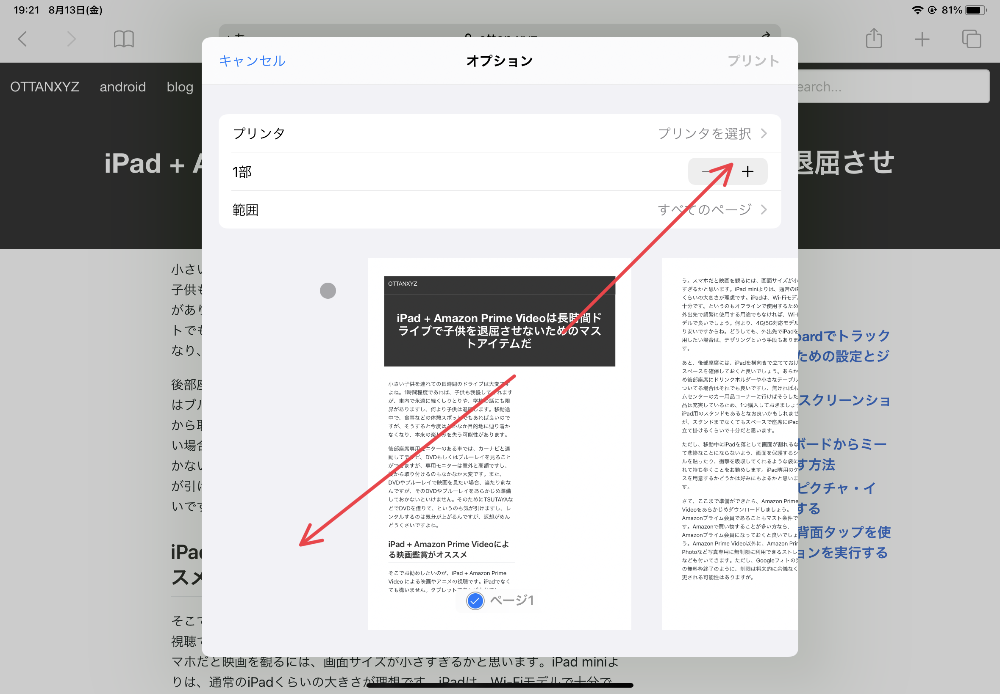
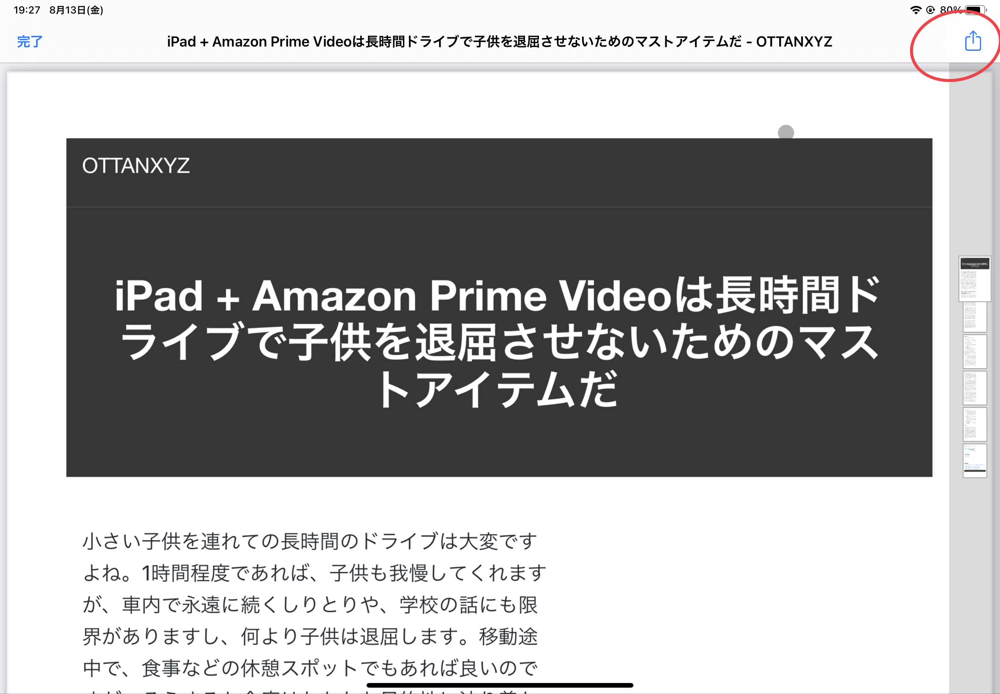

---
categories:
- iPhone
date: 2021-08-13 10:39:54+00:00
draft: false
tags:
- プリンタ
- pdf
- gmail
- カレンダー
- ピンチ
title: iPhone、iPadで、Gmailの情報をPDF化して標準のカレンダーアプリに添付する
type: post
---

飛行機や新幹線の予約情報が送られてきたGmailを、iCloudカレンダーに添付したい場合、どうすれば良いでしょうか。このような予約情報は、日付に紐づいてることが多いので、できればカレンダーにも添付しておきたいのです。Gmailの内容を全コピーしてカレンダーのメモ欄に貼り付けるのも良いですが、長すぎてみづらいですよね。そういう場合は、GmailをPDF化することで添付ファイルとして添付することができます。

ところで、iPhone、iPadから、例えばGmailに添付されてきたファイルやメール本文、Safariで閲覧中のWebページなどを、印刷しようとすると、AirPrint対応のプリンタが必要です。プリンタそのものにアドホックに接続して印刷できる専用アプリを提供しているプリンタ（メーカー）もあります。いずれにせよ、対応しているプリンタがないと「紙に」印刷することはできないのですが、PDF化なら標準機能でできるのはご存知でしょうか。

## 標準の印刷ダイアログでピンチアウトする

iPhone、iPadで印刷するとき、下図のような印刷ダイアログを見たことがあるかもしれません。同一ネットワークに接続されていて、かつAirPrintに対応しているプリンタがある場合、そのままWi-Fi経由で印刷できます。PDF化したいときは、この画面で「ピンチアウト」（2本の指を広げる）するだけです。

すると、以下のようなPDF化された文書を閲覧できる状態になります。あとは、標準の共有メニューから、Gmailに添付するもよし、「ファイル」アプリに保存するもよしです。「ファイル」アプリにPDFファイルとして保存さえできれば、あとはカレンダーを開いて添付するだけです。

iCloud Driveに保存しておけば、誰かと共有するときも便利ですね。