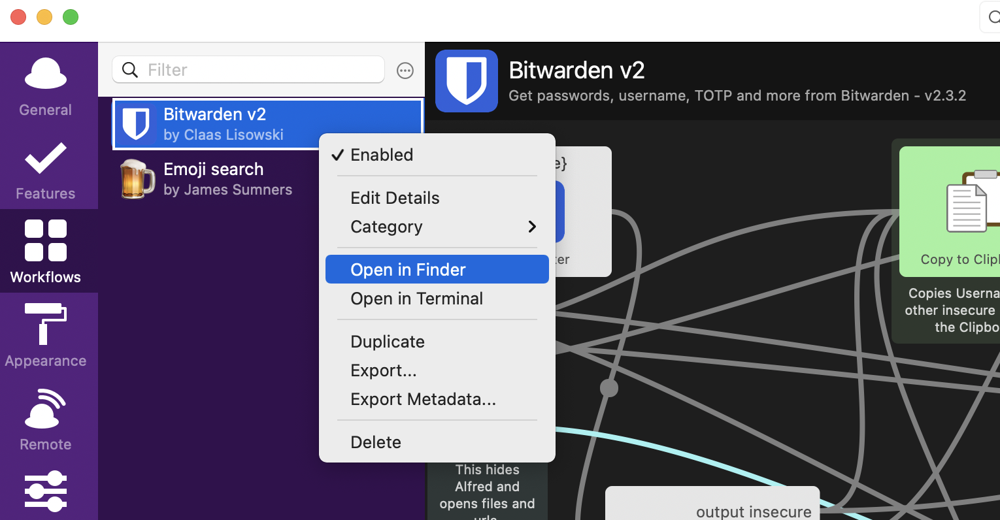
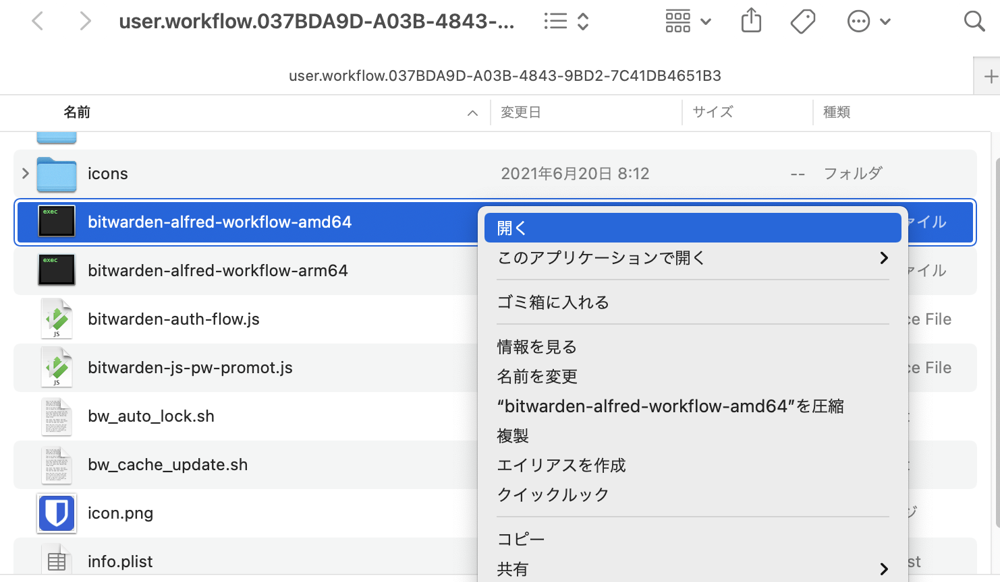
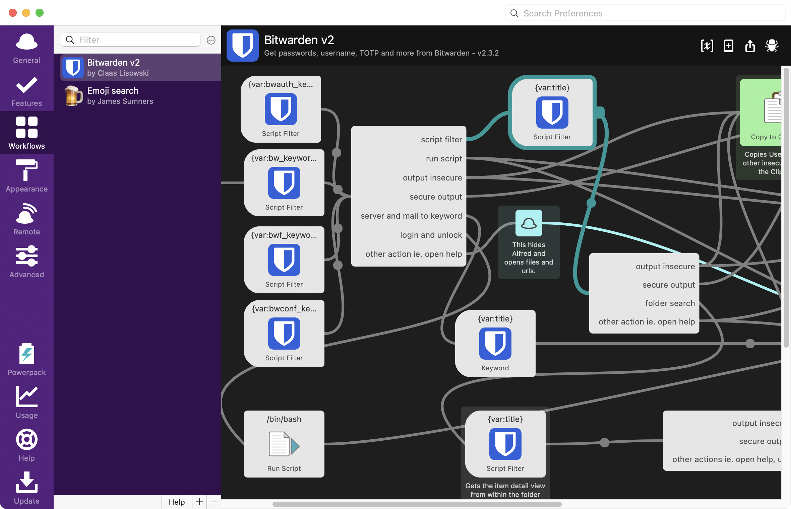
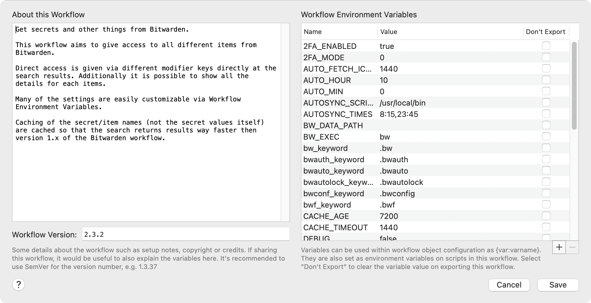
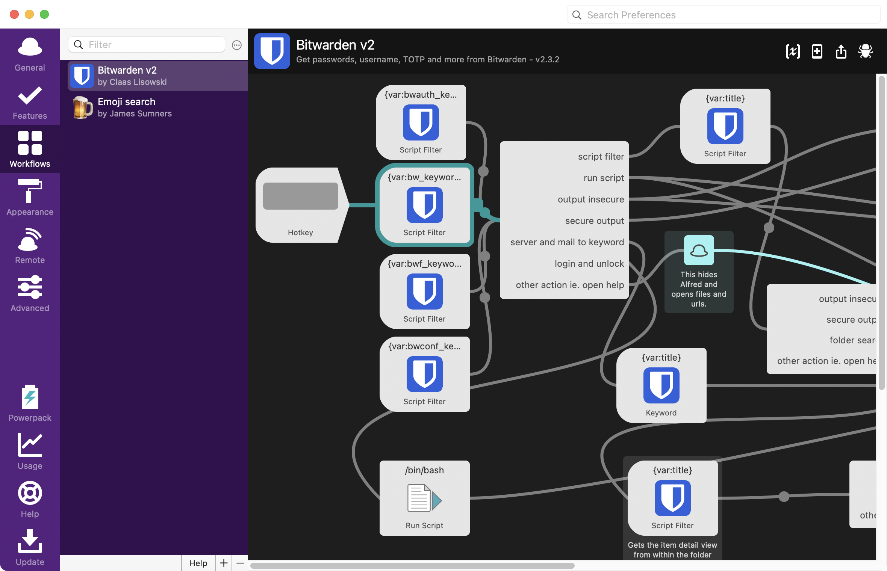
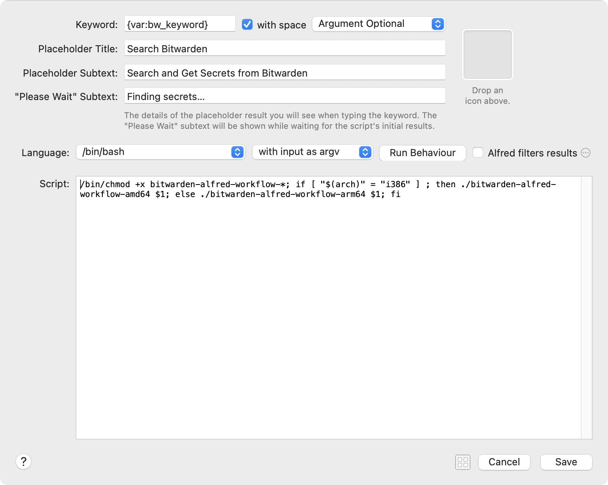
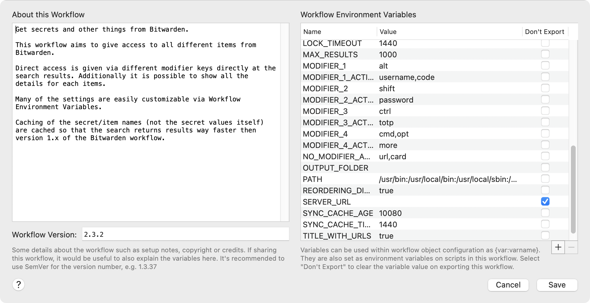

今回は、弊サイトでも度々登場する、Macの主役級といっても過言ではないランチャーアプリであるAlfredと、パスワード管理ソフトウェアであるBitwardenを連携する方法をご紹介します。AlfredのPowerPack（有償版ライセンス）の1Password並みの快適さを求めるなら必須の設定です。

## 1PasswordからBitwarden（プレミアム会員）への移行を踏み切ったわけ

本題に入る前に、少しだけ。

長らく1Password for Mac 6.8.2を使用してきました。1Password 8の登場を目前にして、依然として公式サイトからダウンロード可能ですが、それもどうやら今秋の次期macOS登場までかも知れません。メジャーアップデートを機に、次期1Password 8に移行するという選択肢もあるのですが、

- 買い切り型ライセンスは消滅し、サブスクリプション契約必須
- iCloudやDropboxではなく、1Password.comによるクラウド管理必須
- MacネイティブからElectron製アプリ（SlackなどもElectron）に移行
- 1Password.com専用のブラウザ拡張機能（1Password X）で生体認証（Touch ID）が使用できない

などの理由により、移行を躊躇してました。サブスクリプション制は、開発体制の維持のためにしょうがないとは言え、従来のいわゆる買い切り型ライセンスからサブスクリプションへの移行を強行するなど、ユーザー体験的にどうなのかなぁと疑問に思うところでもあります。

また、どうしても人間なので、心のどこかで「Amazonの会員料金」は払うのに1Passwordのサブスクリプションに納得がいかないのは、後者が「アプリを使わせてやってる」感が強く出ているのだろうなと思うわけです。Amazonは、基本無料で利用できますが、会員になるとよりお得感が得られますよね。そういった意味では、ソーシャルゲームのガチャは、消費者心理をうまくくすぐる商品なのかもしれません。

とは言いつつ、買い切り型とはいえ、これまでなかなかに高額な買い切り型ライセンスを支払ってきた身としては、サブスクリプション制はそこまで気にならなかったのですが、致命的なのがアプリの動向とブラウザ拡張機能でしょうか。

個人的にパスワードを保存する機会が多いのって、何らかのWebサービスを利用する時なんですよね。つまり、ブラウザを利用するとき。ブラウザにパスワードを自動保存したり、次期macOSでは独自のキーチェーンが開発されているという噂もありますが、1Passwordのような特化型アプリの利便性には、恐らくですがかなわないでしょう。OSと一体となり、使い勝手が増す可能性はありますが、今度はmacOSに依存してしまいます。例えば、AndroidやWindowsでは使えない機能です。

ブラウザで利用するときは、もちろん拡張機能からパスワードやワンタイムパスワードを自動入力できるのが、こうしたパスワード管理アプリの最大の売りだと思ってるんですが、1Password Xでは生体認証が使えない、これかなり致命的だと思うのです。マスターパスワードの入力を求めないのは論外ですが、従来のデスクトップアプリで実現できていた機能が実現できなくなる可能性があると思うと、なかなか一歩を踏み切れないのです。旧来の拡張機能がそのまま使える保証もまったくありません。

## AlfredからBitwardenの保管庫に保存されたパスワードを呼び出す

さて、前置きが長くなりましたが、ここからが本題です。Alfredの詳細な説明は割愛しますが、Mac標準のSpotlight検索を抑えて、ランチャー業界首位に君臨する、業界切っての多機能ランチャーアプリです。

そのAlfred（要PowerPackライセンス）には、ホットキーからすぐに呼び出せるランチャーから、直接1Passwordの保管庫に保存されているキーワードから検索し、登録されているURLを開くという、とても便利な機能があります。その手順は以下の通りです。

1. ホットキー（デフォルトは、⌘ + スペース）を押す
2. キーワード（URLや、保存しているサービス名の一部）を入力して、ログインしたい項目を選択
3. エンターキーを押下

あとは、ブラウザ拡張機能により、同URL（例えば、登録されているログイン画面のURL）が開いて、自動的にユーザー名やパスワードが入力されてログイン完了です。

1Passwordは、Alfredに内蔵されているネイティブな機能ですが、これと同等の操作感をBitwardenでも実現します。

### 下準備

事前にBitwardenのMac版アプリ、およびCLIをインストールしておきます。CLIのインストールは、Homebrewがお手軽です。

```bash
brew install bitwarden-cli
```

また、この後のセットアップに関連してくるため、Bitwardenの2段階認証が有効になっているかどうか確認しておきましょう。有効になっていない場合、これを機に有効にしておくと良いでしょう。1Passwordもそうですが、マスターパスワードが突破されてしまうと、すべてのパスワード情報が外部へと漏洩してしまう恐れがあります。万が一に備え、2段階認証を有効化しておくとよいでしょう。その際、ワンタイムパスワードの管理は、Google Authenticatorなど別アプリを必ず使うようにしましょう。

### Alfred Workflowのインストール

※有志で開発が続けられているアプリのため、将来的に挙動が変更になる可能性があります。

<https://github.com/blacs30/bitwarden-alfred-workflow>

続いて、AlfredでBitwardenの保管庫を操作するためのWorkflowを導入します。Workflowの利用は、AlfredのPowerPackライセンスが必要です。上記のURLから最新版のWorkflowをダウンロードし、Finder上でダブルクリックしてインストールしておきます。

### Workflowに含まれるバイナリに実行許可を与える



続いて、Alfredの環境設定からWorkflowsを開き、先ほどインストールしたWorkflowを右クリックして「Open in Finder」を選択します。Finderから、Workflowで呼び出す実行ファイル（バイナリ）に対する実行許可（macOS Catalina以降で必要）を与えておきます。Intelの場合、「AMD64」を含む実行ファイルを、M1の場合、「ARM」を含む実行ファイルを、右クリックして「開く」をクリックします。実行して良いかどうか警告ダイアログが表示されるため、OKを押します。ターミナル等の画面が表示されてすぐ閉じた状態になると思います。この時点で実行が許可された状態になっています。（「システム環境設定」からも、実行を許可するバイナリは変更できます）



### Bitwarden Workflowの使い方

まず、Bitwarden Workflowから、Bitwardenに対して認証します。Alfredを立ち上げた状態で、`.bwauth`と入力します。Bitwardenへのログインを求められるため、アカウント名、マスターパスワード、ワンタイムパスワードでログインします。Bitwardenでワンタイムパスワードを設定していない場合、まずここで躓くことになります。ワンタイムパスワードによる認証を行うかどうかは、Workflowのパラメータとして保持されています。デフォルトでは、ワンタイムパスワード認証をする設定になっているため、Bitwardenでワンタイムパスワードを設定していない場合、必ず入力を促されるワンタイムパスワードの入力ボックスでエラーになります。



Bitwardenで改めて2段階認証を設定するのが吉ですが、何かしらの理由で2段階認証を設定できない場合は、BitwardenのWorkflowを開き、右上に並ぶ4つのアイコンのうち、一番左側（`[x]`のようなアイコン）をクリックします。



Workflowで利用するパラメータの一覧が表示されます。2段階認証を使用しない場合、`2FA_ENABLED`を`false`にしておきましょう。

### Alfredのデフォルト検索ではなく、Workflow独自の検索を使う

ここまでで、BitwardenをAlfredから使う準備は整いました。ランチャーを起動して、`.bw`というキーワードの後に、Bitwardenに登録している項目名を入力します（例：`Amazon`など）。すると、Alfredで該当する項目の絞り込みが行われ、検索結果が表示され、表示された結果に対してEnterキーを押下するとパスワードをコピーする設定となっています（この設定自体も後で見直します）。

しかし、ここで不便なことに気付くかもしれません。検索対象となるのは、Bitwardenに登録されている一覧のうち、アイテム名（登録名）のみです。Alfredは、Bitwarden Workflowの実行結果（JSON）から、デフォルトで特定の項目からのみ結果をフィルタリングしようとするためです。この挙動は変更することができます。また、Bitwarden Workflowの公式ページにも記載があります。



少しわかりづらいのですが、上図のように「Script Filter」のうち、Keywordが`{var:bw_keyword}`となっているものを選択し、クリックして開きます。



画面の真ん中右側にある「Alfred filters results」のチェックボックスをオフにします（デフォルトではオンになっています）。このチェックボックスがオンになっていると、Workflow側でフィルターする仕組みを用意せずとも、自動的にAlfred側でフィルタリングしてくれるようになりますが、前述のように検索範囲が絞り込まれてしまいます。Workflow側の挙動を変更することで対応することもできる可能性もありますが、今回はこのチェックボックスを外しておきます。これで、`.bw`キーワードで検索した際、アイテム名（項目名）のみならず、アカウント名、パスワード、URL等でヒットするようになります。

### デフォルトの挙動を「パスワードのコピー」から「URLを開く」に変更する



いよいよ最後の設定です。Bitwardenの保管庫を`.bw`キーワードにより呼び出した結果に対してEnterキーを押すと、パスワードがコピーされます。1Passwordの場合、Enterキーを押すと、登録されているURLがある場合、そちらをデフォルトブラウザで開く挙動であったため、そのように変更します。

もう一度、Workflowのパラメータの設定画面を開きます。その中から、`NO_MODIFIER_ACTION`を探します。修飾キー無しでEnterキーを押した場合の挙動が書かれており、デフォルトでは`password,card`（パスワード、またはクレジットカード番号のコピー）となっています。これを`url,card`としておきます。これで、Enterキーを押下しただけで、登録されているURLを開くことができるようになります。また、`MODIFIER_2_ACTION`がデフォルトでは`url`となっており重複するため、代わりに`password`へ変更しておきます。MODIFIER_〜に設定されている修飾キーとEnterキーの組み合わせで何を取得するかをここで変更することができます。

以上です！
