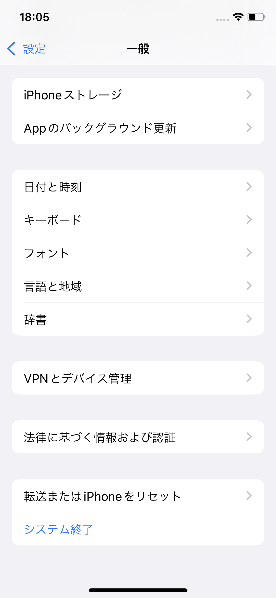
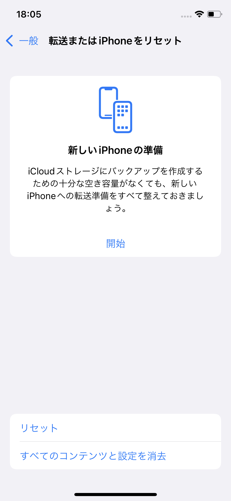
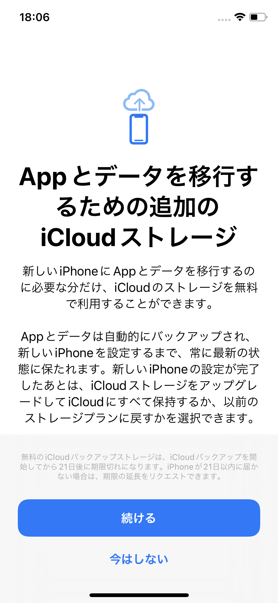
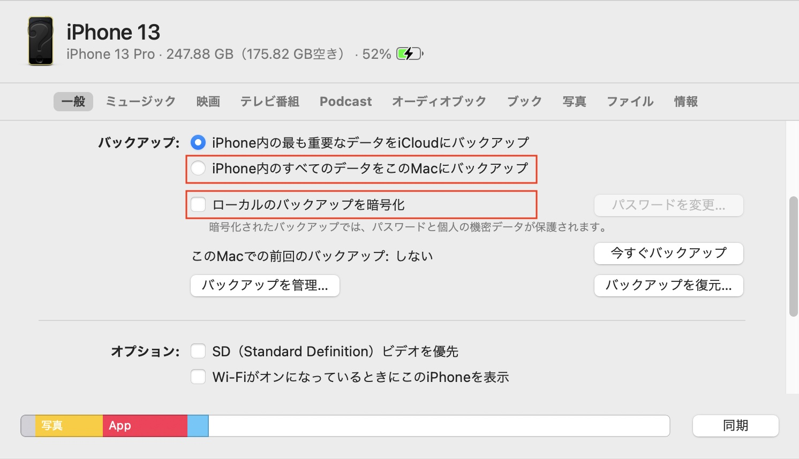

一昔前までのiPhoneの機種変と言えば、母艦と言われるiTunesへの『完全なバックアップ』からの復元が当たり前でしたが、昨今のストレージ容量の肥大化、iOSの進化により、さまざまな選択肢が取れるようになりました。iPhone 13 Proシリーズに至っては、最大ストレージ容量は1TBにもおよびます。

今回は、古いiPhoneから新しいiPhoneへデータを移行する際の方法を、私のオススメ順に紹介します。

なお、すべての復元方法に共通的に言えることですが、**アプリの本体は移行されません**。移行されるのはアプリの『データ』のみであり、アプリは自動的にApp Storeからインストールされます。そのため、App Storeの購入済みからも再インストールできないような、古いアプリを使っている場合、そのアプリは移行できないため、注意が必要です。

## iCloudバックアップからの復元（オススメ）

一番オススメの方法は、iCloudバックアップからの復元です。ネットワーク経由での復元となるため、Wi-Fiネットワークの速度に影響を受けてしまいます。しかし、しっかりと最新のiCloudバックアップさえあれば、古いiPhoneや母艦となるiTunesが不要となるなど、メリットはたくさんあります。

* 復元時に古いiPhoneが不要（そのまま下取りに出してしまってオッケー）
* 母艦となるMacや、iTunesのインストールされたPCが不要
* 復元時間は、Wi-Fiの速度に大きく左右される
* iCloudバックアップに対応していないアプリのデータは移行できない

一方で、iCloudバックアップに対応していないアプリ（アプリ独自のバックアップ方法が提供されている）は、もちろん移行できないので、アプリの移行方法は事前に確認しておきましょう。

### 一時的な無制限のiCloudバックアップ（iOS15以上）

iCloudストレージの容量は、無料プランでは5GBまでです。iCloudバックアップも、この容量以内におさめる必要がありますが、どうしても写真などがはみ出がちです。GoogleフォトやAmazonフォトなどのオンラインストレージを利用してうまく移行できれば良いのですが、手元のiPhoneに残して、いつでも見れる状態にしておきたいという方も多いはずですが、どうでしょうか。また、この容量がネックとなりiCloudによるバックアップを諦め、MacやiTunesへバックアップしているという方もいるのではないでしょうか。

5GB以上の容量をiCloud経由で移行するには、200GB、2TBなどの有償プランを契約するしかありませんでしたが、iOS15から移行のための一時的なバックアップ専用の無制限の領域が提供されるようになりました。移行元、移行先のiOSを15以上にしておく必要があります。

移行のためのiCloudバックアップを作成するには、「設定」→「一般」から、「転送またはiPhoneをリセット」を選択します。

画面の案内に従い、「開始」をタップします。

**初回バックアップから3週間、保管されます**。また、通常のiCloudバックアップ同様に、電源とWi-Fiに接続されている場合、自動的にアップデートされるようです。ただし、3週間経過後、容量が現在のプランで足りない場合は、アップグレード、もしくは削除する必要があるため注意してください。

## 古いiPhoneから新しいiPhoneへデータ転送（オススメ）

手元に古いiPhoneを残しておくと便利なのが、新しいiPhoneセットアップ時に、**近くに古いiPhoneを置いておけば自動的にApple IDやWi-Fi情報が引き継がれる**ことです。iOS12.4以上、かつBluetoothをオンにする必要がありますが、ここ最近のiPhoneであれば条件は満たしているはずです。

このクイックスタートの機能を用いることで、古いiPhoneから新しいiPhoneへスムーズにデータを移行できます。移行元、移行先のiPhoneを近距離（Wi-Fiの通信範囲）においておく必要がありますが、何といっても**転送時点のiPhoneの状態がそのまま引き継がれる**のは魅力的です。もはや、バックアップを取得する必要すらありません。なお、iPhone同士が同一Wi-Fiネットワークに接続されている必要があります。

* 母艦となるMacや、iTunesのインストールされたPCが不要
* 復元時間は、Wi-Fiの速度に大きく左右される
* iCloudバックアップに対応していないアプリのデータは移行できない
* 復元時に古いiPhoneが必要

Wi-Fiが遅い、利用できない、など転送速度に不安がある場合、Lightningケーブル経由でiPhone同士を接続し、データを転送する方法もあります。この場合、[Lightning to USB 3 Camera Adapter - Apple（日本）](https://www.apple.com/jp/shop/product/MK0W2AM/A/lightning-usb-3%E3%82%AB%E3%83%A1%E3%83%A9%E3%82%A2%E3%83%80%E3%83%97%E3%82%BF)などのアダプターが余計に必要になってくる点には注意が必要です。通常は、Wi-Fi経由で問題ないでしょう。また、Lightningケーブルの転送速度の最大理論値はUSB2.0と同等の0.48Gbps程度ですので、そこまで速くありません。

## Mac（もしくはWindows版iTunes）からの復元

ポイントは、「iPhone内のすべてのデータをこのMacにバックアップ」「ローカルのバックアップを暗号化」にチェックすることです。「iPhone内のもっとも重要なデータをiCloudにバックアップ」は、iCloudバックアップです。なお、iCloudへのバックアップ時は、データは自動的に暗号化されます。

気をつける必要があるのは、暗号化の際に入力を求められるパスワードを忘れてしまうと、二度とそのバックアップから復元できなくなるという点です。もはや無意味なバックアップとなってしまい、復旧する手段もありませんので、パスワードを新たに設定した上で、新たにバックアップを取得しましょう。

* 復元時に古いiPhoneが不要（そのまま下取りに出してしまってオッケー）
* iCloudバックアップに対応していないアプリのデータも移行できる
* 復元時間は、母艦となるMac（もしくはWindows）、iPhone間の転送速度（LightningケーブルorWi-Fi）に依存する

iPhone発売当初は、他に手段もなく、このバックアップからの復元方法が主流でしたが、個人的にはオススメしません。当時、バックアップを暗号化し忘れ、パスワード（アカウント）が移行できないなど阿鼻叫喚でした。母艦（もはや死語？）を必要とするバックアップの欠点は次の通りです。

* 母艦となるMac（Windows）のストレージの空き容量を逼迫する
* 常にフルバックアップ相当の時間を要するためデータ容量が増えるとバックアップに時間を要する
* バックアップからの差分は復元できない
* iOS15以上では、もはやiCloudバックアップ以上の利点が見つからない

3点目は、iCloudバックアップも同様です。ただ、iCloudバックアップは、電源に接続されている状態の時に自動的に取得されるのに対して、こちらは手動で取得する必要があります。1、2点目もなかなか大きな問題です。iOS、アプリ本体はバックアップから除かれるため、iPhoneのローカルストレージの使用容量＝バックアップに必要な容量ではありませんが、昨今のストレージ容量の肥大化を考慮すると、結構な容量を使用することになります。

iCloudキーチェーンの登場や、iOS15以上で誰でも無料、無制限で利用できる期限付きのiCloudバックアップの登場を考えると、母艦を必要とするこのバックアップ方法はもはや主流でないのかもしれません。とはいえ、一度バックアップさえ取得してしまえば、ネットワーク環境が不安定な場所でも復元できる、iCloudバックアップに含まれないデータも含めiPhoneの状態をほぼそのまま丸っと移行できるなどのメリットがあります。

## まとめ

iOS15で登場した無制限のiCloudバックアップ機能により、データ容量が肥大化したiPhone間のデータ移行がますます楽になりました。iTunesへ暗号化したバックアップを取得する時代は終わりを迎えるのでしょうか。なお、iCloud経由で転送できないデータ、LINEや一部の銀行のワンタイムパスワード専用アプリなど、デバイス間を跨いで利用できないアプリなどもありますので、復元の際にはくれぐれも注意が必要です。
