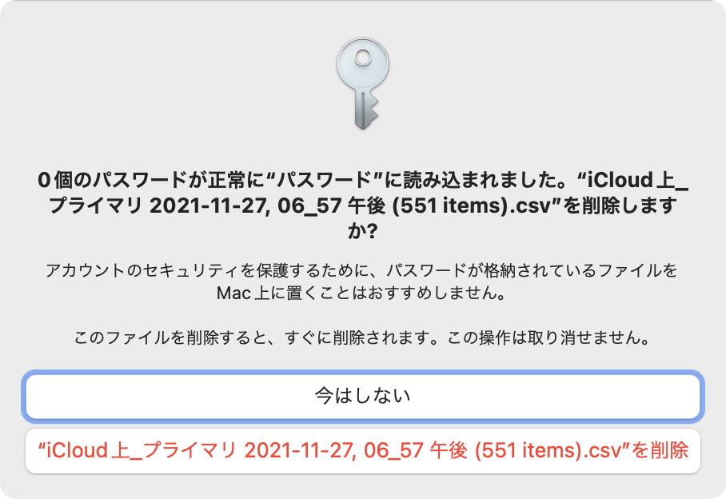

macOS Montereyより、OS標準のキーチェーンで、パスワードやワンタイムパスワード（TOTP方式に対応）の管理ができるようになりました。キーチェーンを利用することで、Safariなどのブラウザからログイン名やパスワード、ワンタイムパスワードを自動入力できるようになります。

Macの1Passwordアプリを利用して、1PasswordからiCloudキーチェーンへ移行する方法を紹介します。なお、**iCloudキーチェーンで管理できるのは、ログイン情報のみです**。クレジットカードや、セキュアメモなどは移行できませんのでご注意ください。どうしても移行する必要がある場合、MacやiPhone標準のメモアプリなどを利用しましょう。

iCloudキーチェーンは、iCloud for Windowsとブラウザ機能拡張の組み合わせでも利用可能ですが、Androidでは利用できません。1Passwordは、大体のプラットフォームをサポートしています。

## 1Password 7からiCloudキーチェーン形式でエクスポートする

Macで1Password 7を開きます。メニューより、「ファイル」→「エクスポート」→「すべてのアイテム」を選択します。エクスポートする際、「ファイル形式」を「iCloudキーチェーン」に変更してから保存してください。

赤字で重要と明記されているように、エクスポートしたファイルは暗号化されていないため、誤って第三者の目に触れるような場所へアップロード等しないよう十分に注意を払う必要があります。

### 1Password 6以前を利用している場合

1Password 6以前のバージョンを利用している場合、CSV形式でのエクスポートは可能であるものの、iCloudキーチェーン形式でエクスポートできません。

1Password 7へアップグレードしてください。Mac App Storeから1Password 7をインストールしてください。1Password 7のインストール、および既存の保管庫からのパスワードの読み込みは無料で使用できます。

## iCloudキーチェーンへインポートする

「システム環境設定」→「パスワード」を開きます。ツールバーより、「パスワードを読み込む」を選択し、エクスポートしたCSVファイルを開きます。

以下のように表示されていればインポート完了です。

## 注意事項

1PasswordからiCloudキーチェーンへ移行する際、注意すべき点があります。

### インポートできないデータ

1Passwordに登録されている、以下のデータは移行できません。

* ログイン情報のうち、ユーザ名、パスワード、Webサイトのいずれかが空白のデータ
* クレジットカードなど、ログイン情報以外のデータ

クレジットカードやセキュアメモを管理したい場合、OS標準のメモアプリを利用しましょう。メモアプリであれば、パスワードや生体認証で保護できます。

### インポートに失敗

「**0個のパスワードが正常に"パスワード"に読み込まれました。**」と表示された場合、パスワードの移行に失敗しています。エクスポートしたパスワードに、ダブルクオテーションが含まれています。

1Passwordは、パスワードにダブルクオテーションが含まれる場合、**\\"** に置換してエクスポートします。iCloudキーチェーンに読み込ませるには、CSVファイルをテキストエディター等で開き、**\\"** を **""** へ置換してください。
