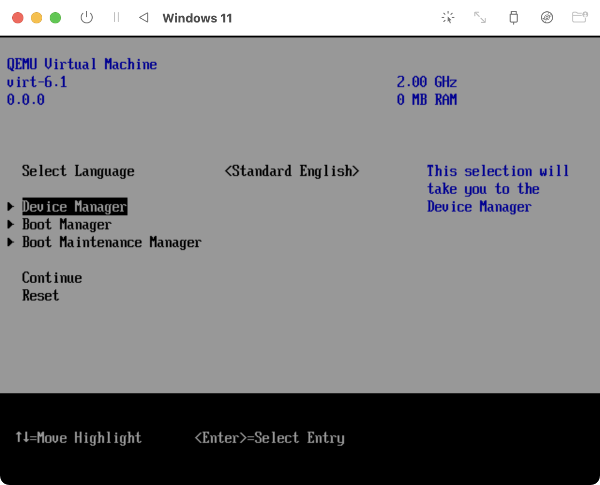
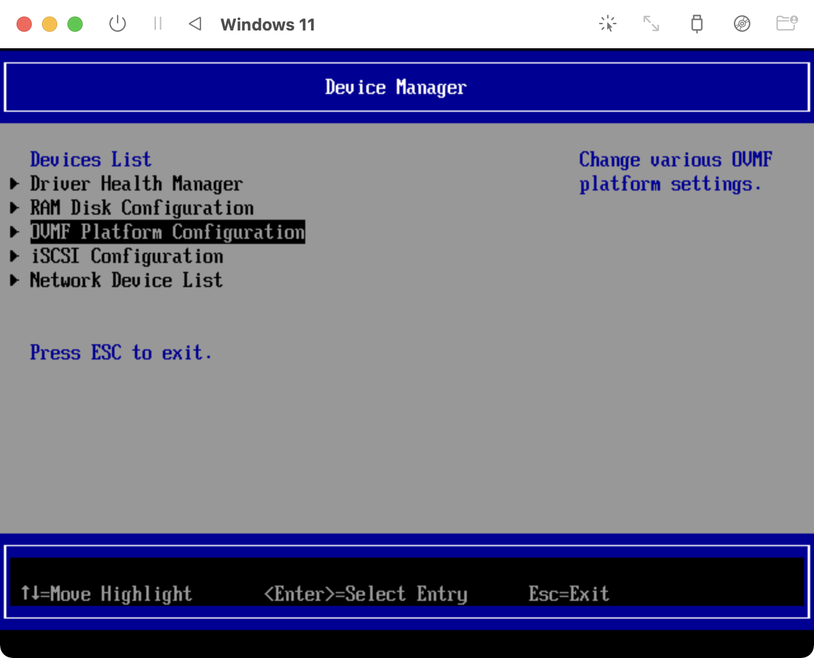

Apple Silicon搭載のM1 Mac（MacBook Air 2020のエントリーモデル）に、Windows 11（Insider Preview版）をインストールしてみました。今回は、UTMを利用します。

## 事前準備

今回、試した環境は以下の通りです。

### 環境

```
Darwin MacBook-Air.local 21.2.0 Darwin Kernel Version 21.2.0: Sun Nov 28 20:29:10 PST 2021; root:xnu-8019.61.5~1/RELEASE_ARM64_T8101 arm64
```

macOS Monterey（12.1）で試しました。

```
ProductName:	macOS
ProductVersion:	12.1
BuildVersion:	21C52
```

UTMは、Homebrewでインストールしました。

```
utm: 2.4.1
https://getutm.app/
```

また、VHDX形式の仮想ディスクイメージファイルをQCOW2形式へ変換するためのツールが必要です。

```
qemu: stable 6.2.0 (bottled), HEAD
Emulator for x86 and PowerPC
https://www.qemu.org/
```

### UTMのインストール

UTMは、Homebrewからインストールできます。

```zsh
brew install --cask utm
```

### ARM64アーキテクチャのWindows 11ディスクイメージのダウンロード

現在、Windows 11（ARM64）版は、Windows Insider Preview版のみ提供されています。Micorosoftアカウントでサインインして、Insider Preview版への参加に同意が必要です。

* <https://www.microsoft.com/en-us/software-download/windowsinsiderpreviewARM64>

### SPICE Guest Toolsのダウンロード

Windows 11 Insider Preview版インストール直後は、ネットワークへ接続ができません。UTM用のドライバーソフトウェアをダウンロードしておきます。

* <https://mac.getutm.app/support/>

### 仮想ディスクイメージの形式変換（VHDX→QCOW2）

Windows 11 Insider Preview版は、仮想マシンのディスクイメージファイル（VHDX形式）で提供されています。そのままの形式で利用することも可能なのですが、QEMUを使用しているUTMで仮想マシンがクラッシュするなど、動作が不安定です。そのため、VHDX→QCOW2に変換しておきましょう。

```zsh
brew install qemu
```

QCOW2形式への変換はUTMでは提供されていないため、Homebrewでインストールします。

```zsh
qemu-img convert -p -O qcow2 Windows11_InsiderPreview_Client_ARM64_en-us_22523.VHDX Windows11_InsiderPreview_Client_ARM64_en-us_22523.qcow2
```

## 仮想マシンの作成

「Create a New Virtual Machine」をクリックします。


### Information

「Name」に仮想マシン名、「Style」は「Operating System」を選択します。


### System

「Architecture」は「ARM64（aarch64）」を選択すると、「System」がApple Siliconに合わせて自動選択（QEMU 6.x ARM Virtual Machine）されます。仮想マシンとM1 Macのアーキテクチャが一致している（ARM64）ため、UTMはエミュレーションしません。「Memory」は、最低「4096MB」以上にします。

任意ですが、「Show Advanced Settings」をチェックし、「CPU」を「Default」へ、「Force Multicore」をチェックします。マルチコアを有効にする場合、選択してください。また、「CPU Cores」にコア数を入力します。


### Drives

「Import Drive」で、ダウンロードしたISOファイルを選択します。Windowsのディスクイメージファイルには「virtio」のドライバーが付属していないため、 **「Interface」を「NVMe」へ変更する**必要があります。また、「New Drive」で、「Removable Drive」を作成します。


ここまでで仮想マシンの作成は完了です。「Save」ボタンをクリックします。

## 仮想マシンの起動

作成した仮想マシンを選択して起動します。SPICE Guest Toolsは、OSセットアップ完了後にインストールするため、この段階ではCD/DVDは空の状態にしておきます。


解像度が低く、Windows 11の初期セットアップ時に支障が出るため、ブートメニューから変更します。「Start boot option」の文字が表示されたら、Escキーを押します。


「Device Manager」を選択します。



「OVMF Platform Configuration」を選択します。



解像度を「1024x768」へ変更します。F10キーを押して内容を保存します。


トップへ戻り、「Reset」を選択し、仮想マシンを再起動します。再起動後に、設定した解像度が適用されます。


以降、Windows 11のインストールウィザードにしたがってインストールを進めます。途中、Wi-Fiへの接続を求められますが、現時点でネットワークへ接続できないため、スキップして進めてください。なお、画面からカーソルが抜け出せなくなったら、Control + Optionキーを押してください。


## SPICE Guest Toolsのインストール

ウインドウのタイトルバー右端にある、CD/DVDのアイコンをクリックし、あらかじめダウンロードしておいた、SPICE Guest ToolsのISOファイルを選択します。


セットアップファイルを起動し、ウィザードの内容にしたがいインストールします。インストール後、仮想マシンを再起動しましょう。これで、仮想マシンがネットワークに接続されます。


## まとめ

UTM（QEMU）を用いて、Apple Silicon搭載のM1 Mac（MacBook Air, 2020）にWindows 11（ARM64）Insider Preview版をインストールしました。現在は、Insider Preview版しかARM64は用意されておらず、Microsoftの公式のサポートが待ち遠しいですね。

## 参考

* <https://mac.getutm.app/gallery/windows-11-arm>