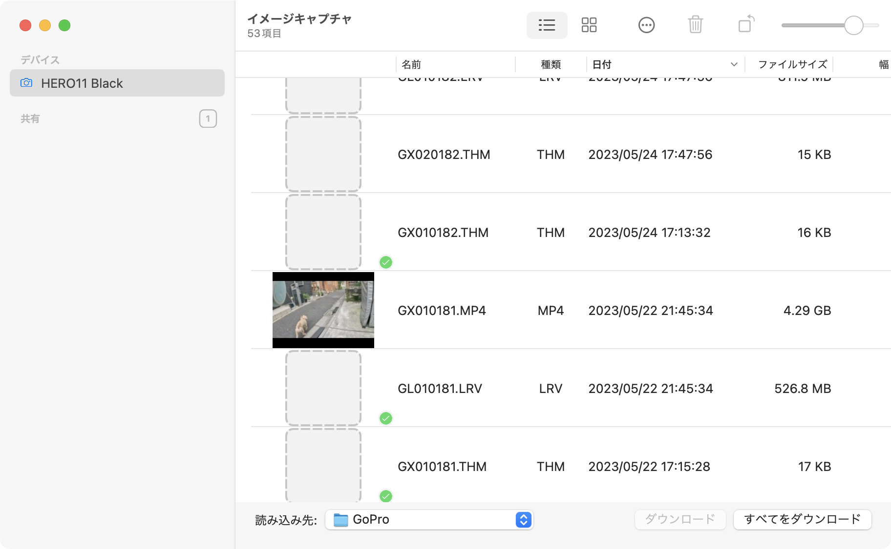
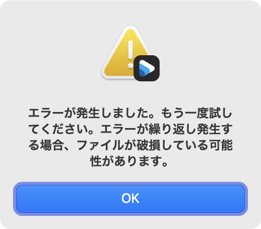
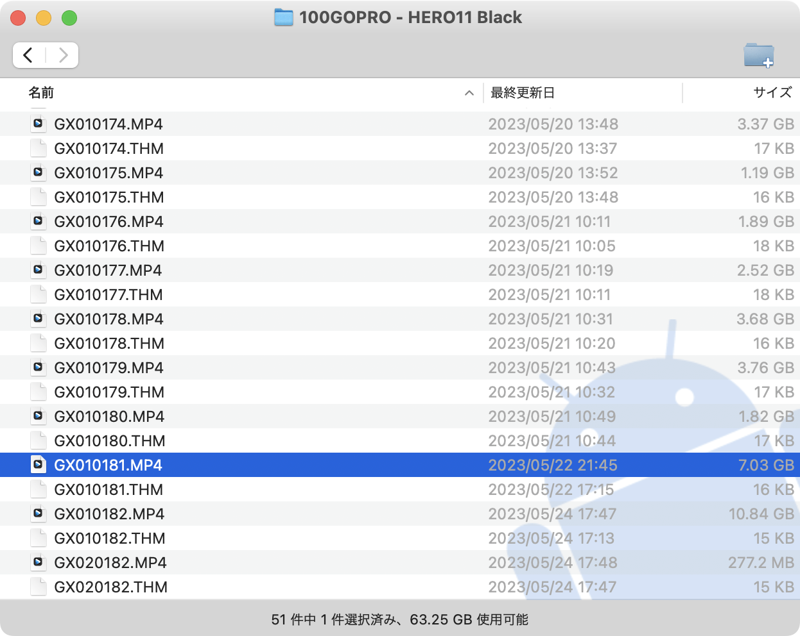
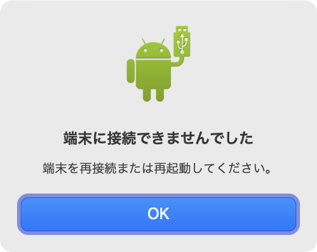
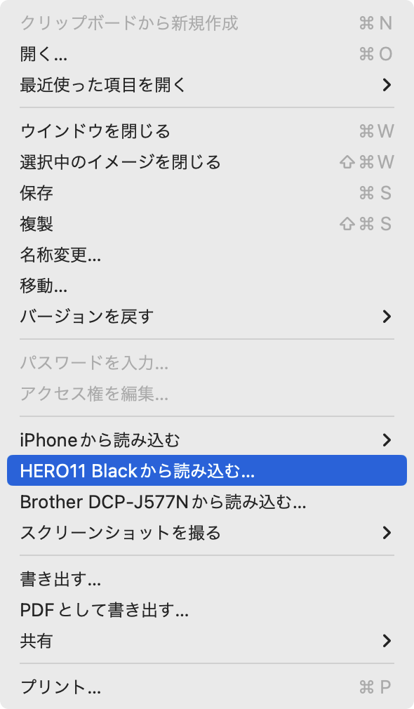

Macの「イメージキャプチャ.app」や「写真.app」では、**4GB**（≒4 * 1024^3）以上のファイルを正常に認識できません。[こちら](https://digitalcamera-support-ja.fujifilm.com/digitalcamerapcdetail?aid=000006566)は富士フィルム社のカメラで撮影されSDカードに保存された写真や動画を読み込む際の注意ページとなっていますが、このページにもMacでは4GB以上のファイルを認識できない旨が記載されています。

```text
ProductName:        macOS
ProductVersion:     13.4
BuildVersion:       22F66
```

今回は macOS Ventura で確認しましたが、これはMacのイメージキャプチャや同等の仕組みを用いるアプリの（今のところ）仕様となっており、回避する術は存在しません。では、Mac自体で4GB以上の動画ファイルを扱うことができない、もしくは認識できないのかというと、そういうわけではなくMac自体で同サイズ以上の動画ファイルは問題なく扱うことができるため、**イメージキャプチャがポンコツ**ということになります。



上記はイメージキャプチャでGoPro HERO11 BlackのSDカード上に保存されている動画ファイルの一覧を読み込んだ状態ですが、「GX010181.MP4」というファイルが正常に認識されていません。**実際のファイルサイズは約7GBですが、イメージキャプチャでは4.29GBとして認識されてしまっています。** このままイメージキャプチャ経由で読み込んだとしても、4GB以上読み込む前に終了してしまうため、いざプレビューや他のプレイヤーで再生しようとしたところで、ファイルが破損している旨のメッセージが表示されてしまうわけです。もしかすると、exFAT形式に対応していないのでしょうか。



冒頭の富士フィルム社のページでは、MacにSDカードリーダを接続し、直接SDカードの内容を読み込むことが回避策として紹介されています。イメージキャプチャを迂回すれば良いだけなのでそれでも実現できるのですが、わざわざSDカードを取り外したり、そのためにSDカードリーダを用意してつけ外しするのも手間です。

## 代替手段としてAndroid File Transfer、もしくはOpenMTPを用いる

代替手段ですが、「Android File Transfer.app」もしくは「OpenMTP.app」を用いることをオススメします。前者は、Google社が提供しているAndroid OSを搭載したスマホなどからMacへUSB（MTPモード）経由でファイルを物理的に転送するために提供されているツールですが、こちらを用いれば正常に認識され転送もできます。

OpenMTPは、Android File Transferがシンプルすぎるが故に、少し使い勝手をよくするために有志によって開発されたファイル転送ソフトです。FTPクライアント、とまではいきませんが、少しリッチな見た目となっています。

- [Android File Transfer](https://www.android.com/filetransfer/)
- [OpenMTP](https://openmtp.ganeshrvel.com/)

下図はAndroid File Transfer上で確認した動画ファイルのサイズですが、確かに7.03GBと認識されていることがお分かりになるかと思います。なお、**Android File TransferとOpenMTPは同時に起動はできませんのでご注意ください。** また、イメージキャプチャを起動した状態で、これらのアプリを利用することもできませんのでご注意ください。



### macOS Venturaには「プレビュー.app」にも罠が存在

macOS Venturaだけの仕様かどうか不明確ですが、「プレビュー.app」もMTPに干渉します。そのため、プレビューを開いた状態で、Android File Transferに接続しようとすると、下記のように「端末に接続できませんでした」とエラーが表示されてしまいます。



プレビューのメニューを見てみると、カメラから読み込むための機能が備わっている（イメージキャプチャ）ことがわかります。



というわけで、Android File TransferやOpenMTPで動画ファイルが読み込めない場合は、イメージキャプチャ、プレビューをはじめ、片っ端から起動しているアプリを終了してみることをオススメします。
